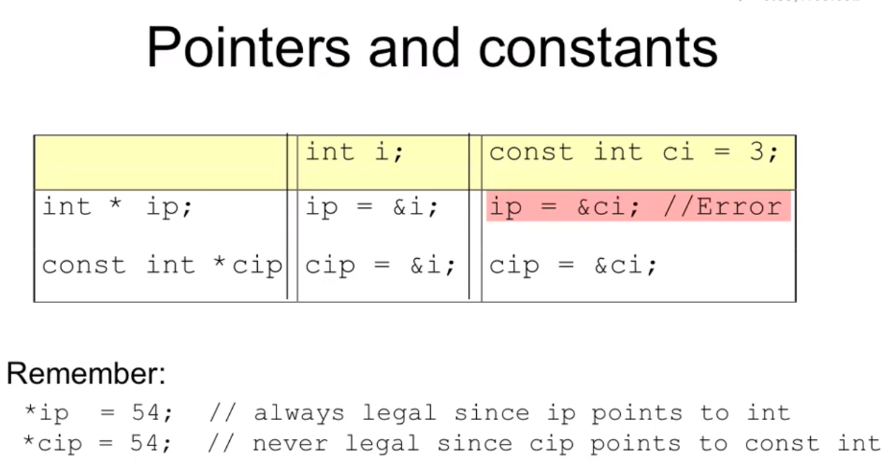

# 基础补充

## 常规知识补充

- **关于include**

  ```c++
  #include "xx.h"	//代表在当前目录寻找头文件，针对不属于标准库的头文件
  #include <xx.h>	//代表在特定目录寻找头文件，针对来自标准库的头文件
  ```

- **关于空间分配**

  以main函数为例，在进入大括号之前就会准备分配空间，以变量为例，在定义变量之前就会为之分配空间。(<font color="blue">后面会有更具体的学习</font>)

- **for循环变量定义范围**：

  for循环中定义的变量只作用在大括号内！

- **C语言的宏定义**

  ```c++
  #define f(a) (a)+(a)	//实现了类似函数的功能
  ```

- **一些泛化的转义序列**

  在C语言中，只有少数转义序列可以表示非ASCII字符，如`\n`表示换行，`\t`表示制表符，这些转义序列在各种编码下的含义是相同的；

  而在C++中，introduced一种泛化的转义序列的概念，可以表示任意的非ASCII字符；

  ```c++
  /* 空格字符举例 */ 
  char c1 = '\ ';     // 字符字面量,包含一个空格字符 
  char c2 = '\x20';   // 同上
  char c3 = '\u0020'; // 同上
  
  std::string s1 = "Hello\ World"; // 字符串包含一个空格
  std::string s2 = "Hello\x20World"; 
  std::string s3 = "Hello\u0020World";
  ```

  列举一些：`\007`-响铃、`\12`-换页符、`\32`-空格、`\0`-空字符、`\115`-字符s、`\x4d`-字符M

  如果反斜线`\`后面跟着的八进制数字超过3个，只有前3个数字与`\`构成转义序列。

  但是`\x`(十六进制)要用到后面跟着的所有数字。

- **声明和定义**

  声明和定义的的区别看起来也许微不足道，但事实上很重要，**如果要在多个文件中使用同一个变量，就必须将声明和定义分离**；

  此时，变量的<font color=red>定义必须出现在且只能出现在一个文件中</font>，而其他<font color=red>用到该变量的文件必须对其进行声明</font>，却绝对<font color=red>不能重复定义</font>；

- **调用全局作用域的变量的方式**

  ```c++
  #include <iostream>
  int reused = 42;
  int main ()
  {
      // ....
      std::cout << ::reused << " " << unique << std::endl;	// 调用了全局变量reused(不用是不是也可以)
      // ...
  }
  ```

- **求值顺序的问题**

  ```c++
  int i = 0;
  cout << i << " " << ++i << endl;	//因为未定义顺序，这一步的执行结果是未知的，在此特别记录！
  ```

  有4种运算符明确规定了运算对象的求值顺序：`&&`、`||`、`?:`-条件运算符、`,`。

  对于一个运算对象而言，运算对象本身可以按任意顺序求值，在赋值运算符左右两端的运算对象都有某一变量的情况下，会出现不可预知的下一步，我们必须要避免这种情况的出现。(==程序的异步性==)

  形如：`a=b!=c`的意义等价于`a=(b!=c)`，先计算关系运算符。

  形如：`(a=b)!=c`的意义等价于先将b的值赋给a，然后判断a与c是否相等，最后总体而言是一个关系表达式的形式。

- **sizeof运算符**

  运算符的运算对象有两种形式：

  - `sizeof (type)`

  - `sizeof expr`

  一个小应用：

  - 因为sizeof运算能得到整个数组的大小，所以可用数组的大小除以单个元素的大小得到数组中元素的个数：

    ```c++
    constexpr size_t sz = sizeof(ia) / sizeof(*ia);
    int arr2[sz];
    ```

- **逗号运算符**

  对于逗号运算符而言，首先对左侧的表达式求值，然后将求值结果丢弃掉；

  逗号运算符真正的结果是右侧表达式的值；

  如果右侧运行对象是左值，那么最终的求值结果也是左值；

  ```c++
  vector<int>::size_type cnt = ivec.size();
  for (vector<int>::size_type ix = 0;
      	ix != ivec.size(); ++ix, --cnt)	// (++ix, --cnt)的最终结果是右侧表达式的cnt的值
      ivec[ix] = cnt;
  ```

- **左值、右值**

  - 左值就是在赋值中可以放在赋值操作符左边的值，一切变量都是左值；

  - 而右值则是只可以放在赋值操作符右边的值，比如一切常数、字符和字符串。

- **自动对象**

  我们把只存在于块执行期间的对象称为**自动对象(automatic object)**。当块的执行结束之后，块中创建的自动对象的值就变成未定义的了，形参就是一种自动对象。

- **局部静态对象**

  某些时候有必要令局部变量的生命周期贯穿函数调用及之后的时间，可以将局部变量定义成static类型从而获得这样的对象。局部静态对象在程序执行路径第一次经过对象定义语句初始化，并且直到程序终止才被销毁，不受对象所在函数执行的影响。

- **函数声明**

  函数声明也称作函数原型(**function prototype**)，函数的三要素(<font color="blue">返回</font>类型、函数名、形参类型)描述函数的接口，说明调用该函数所需的全部信息。

  因为函数声明不包含函数体，因此，形参的名字也**是可以省去的**，但写上可以帮助使用者更好地理解函数的功能。

- **分离式编译**

  将程序的各个部分分别存储在不同文件之中，以实现编写程序时按照逻辑关系将其划分开来，分离式编译允许我们把程序分割到几个文件中去，每个文件独立编译。

  ==具体来说可以结合编译器使用==!

- **const实参和形参**

  当形参有顶层const时，传给它常量或者非常量对象都是可以的，因为当用实参初始化形参时会忽略掉顶层const。

  也正因此而引入一个细节：C++本身是允许我们定义若干具有相同名字的函数，不过前提是不同函数的形参列表应该有明显区别，像涉及到const这种。

  - 因为顶层const被函数忽略掉了，如果定义了两个同名函数，一个有`const`一个没有，这样就会导致混淆，出现错误；

- **字典序**

  针对string类型，有种排序方式称为字典序，按照26个字母的顺序进行排列，a>b>c...由于字符串有多个字符，如果第一个字符相等，则比较第二个字符，依此类推！

- **黑盒测试**

  定义：系统后台准备若干组输入数据，然后让提交的程序去运行这些数据，如果输出的结果与正确答案完全相同（字符串意义上的比较），那么就称通过了这道题的黑盒测试。

  根据黑盒测试的种类又分为单点测试与多点测试：

  - 单点测试是指对每组测试数据单独测试；
  - 多点测试是指一次性测试所有的测试数据；

- **C++访问对象的三种方式**

  - 直接掌握对象；
  - 通过指针访问对象；
  - 通过引用访问对象。 

## <font color="red">命名的强制类型转换</font>

一个命名的强制类型转换具有如下形式：

`cast-name<type>(expression);`

cast-name存在4种：

- `static_cast`：任何具有明确定义的类型转换，只要不包含底层const，都可以使用`static_cast`；
- `const_cast`：只能改变运算对象的底层const属性，而不能转化成其他类型，可以用到这一形式；

```c++
const char *pc;						// 底层const指针
char *p = const_cast<char*>(pc);	// 正确，去掉了const
char *q = static_cast<char*>(pc);	// 错误，static_cast不能仅仅转换掉类型的const性质
static_cast<string>(pc);			// 正确，可以将(const char*)转化为string类型，即类型实现了转换
const_cast<string>(pc);				// 错误，const_cast无法转化为其他类型
```

- `reinterpret_cast`：reinterpret_cast通常为运算对象的位模式提供较低层次上的重新解释。假如存在这么一个转换：

```c++
int *ip;
char *pc = reinterpret_cast<char*>(ip);	// 为运算对象的位模式提供较低层次上的重新解释(啥意思？)
```

我们必须注意pc所指的真是对象是一个int而非字符，如果真的把pc当成普通的字符指针使用就可能在运行时发生错误。

- `dynamic_cast`：*支持运行时类型识别，后续进行介绍......*

***Tips：***<font color=red>尽量避免强制类型转换；</font>

- 它干扰了正常的类型检查。
- 旧式版本的强制类型转换(函数形式、C语言风格)从表现形式上来说不那么清晰明了，容易看漏，追踪起来也更麻烦！

## <font color="red">预处理器概述</font>

预处理器是在编译之前执行的一段程序，可以部分地改变我们所写的程序；

以常用的预处理功能`#include`为例，当预处理器看到该标记时就会用指定的头文件内容代替`#include`；

C++程序还会用到的一项预处理功能是==头文件保护符==。

- `#define`指令把一个名字设定为预处理变量；
- `#ifdef`当且仅当变量已定义时为真，`#ifndef`当且仅当变量未定义时为真。<font color="red">一旦检查结果为真</font>，则执行后续操作直至遇到`#endif`指令为止；

组合使用就能有效防止重复包含的发生：

```C++
#ifndef SALES_DATA_H	// 如果没有定义过，则
#define SALES_DATA_H
struct Sales_data {
    std::string bookNo;
    unsigned units_sold = 0;
    double revenue = 0.0;
};
#endif
```

(有点像Python中的if \_\_name == \_\_main\_\_)

预处理变量的特点：

- 无视C++语言中关于作用域的规则；
- 整个程序中的预处理变量包括头文件保护符必须唯一；

- 通常基于头文件中类的名字来构建保护符的名字，以确保其唯一性。
- 为了避免与程序中的其他实体发生名字冲突，一般把预处理变量的名字全部大写。

## 基于范围的for语句

范围for语句(range for)。这种语句遍历给定序列中的每个元素并对序列中的每个值执行某种操作，语法形式：

```shell
for (declaration : expression)
	statement
```

- *expresssion*部分是一个对象，用于表示一个序列。
- *declaration*部分负责定义一个变量，该变量将被用于访问序列中的基础元素。
- 每次迭代，*declaration*部分的变量会被初始化为*expression*部分的下一个元素值。

一个应该遵循的原则：==范围for语句体内不应改变其所遍历序列的大小==。

代码示例：

```c++
char arc[] = "www.baidu.com";
    // for循环遍历普通数组
for (char ch : arc) 
{
	cout << ch;
}

vector<char>myvector(arc, arc + 23);
    // for循环遍历 vector 容器
for (auto ch : myvector) 
{
	cout << ch;
}
```

## 内联(inline)函数

将函数所执行的功能代码嵌入到程序代码中去，但同时又保持着函数的独立性。在头文件与CPP源文件都需要注明该函数。类当中所定义的函数其实就可以看成是内联函数。一般而言，内联机制用于优化规模较小、流程直接、频繁调用的函数。内联说明只是向编译器发出的一个请求，编译器可以选择忽略这个请求。

## C++的指针

**存储的是某个对象的地址-牢牢把握这一点即可**

```c++
double dval;
double *pd = &dval;	// 获取了地址
double *pd_1 = pd;	// 同样指向了dval
```

指针可以无限嵌套，也就是可以定义指针的指针，指针的指针的指针.....

关于对指针的引用，用一串代码解释会更加直观：

```c++
#include <iostream>
int main ()
{
        int i = 42;
        int *p;
        int *&r = p;	// 定义对指针p的引用(写成int &(*r)不是更好理解吗？)
        r = &i;
        *r = 0;		// 这里会导致*p的值发生改变，因为改变引用即改变了引用的对象
    	// 打印出来的值分别是0  地址	0
        std::cout << *p << "\n" << r << "\t" << *r << std::endl;
        return 0;
}
```

针对上述的疑惑有一个解释，就是要理解r的类型究竟是什么，最简单的办法就是从右向左阅读r的含义，本质上就是就近原则。

**a->b和(*a).b的区别**：

- 两者并无具体区别，前面的写法只是为了简化后面的写法，毕竟还带着括号()，<font color=red>带括号的原因</font>：
  - '.'运算符的优先级高于'*'，所以要加括号；

## auto类型说明符

引入的`auto`类型说明符，能让编译器替我们去分析表达式所属的类型。

默认情况下`auto`会忽略掉顶层`const`，但会保留底层`const`；

如果需要保留顶层`const`的特性，则需要明确指出，即在前面加上`const`关键字。

一条声明语句只能有一个基本数据类型，所以该语句中所有变量的初始基本数据类型必须一样；

```c++
// 以下就是初始基本类型不一致的案例
auto i = 0, *p = &i;		// 都是整型：整数-整型指针
auto sz = 0, pi = 3.14;		// 错误，一个整型，一个double型
// -------------------------------------------------------------------
const int ci = i, &cr = ci;
auto &m = ci, *p = &ci;		// 正确，m是对整型常量(const)的引用，p是指向整型常量(const)的指针
auto &n = i, *p2 = &ci;		// 错误，i是整型(int)，而&ci的类型是const int
```

还有一个细节，auto不能为非常量引用绑定字面值：

```c++
auto &g = ci;	// right
auto &h = 42;	// 错误，无法为非常量引用绑定字面值
const auto &j = 42;		// 正确
```

其实就是因为`auto`本身并不会包含const属性；

## decltype类型指示符

作用是<font color="blue">返回</font>操作数的数据类型(<font color="red">拓展中.....</font>)

```c++
decltype(f()) sum = x;	// sum的类型就是函数f的返回类型
```

假如我们知道函数<font color="blue">返回</font>的指针将指向哪个数组，就可以使用==decltype关键字==声明<font color="blue">返回</font>类型：

```c++
int odd[] = {1, 3, 5, 7, 9};
int even[] = {0, 2, 4, 6, 8};
//返回一个指针，该指针指向含有5个整数的数组
decltype(odd) *arrPtr(int i)	// odd返回的是一个指针类型
```

## sscanf与sprintf

sscanf读取格式化的字符串中的数据，sprintf指的是字符串格式化命令，以指定形式写入格式化的数据，而sscanf()调用的<font color="blue">返回</font>值信息取决于成功读取的字符个数，以代码为例：

```c++
sscanf(str, "%d is greater than %d", &a, &b)
```

上述代码如果执行成功，那么<font color="blue">返回</font>值应该是2，即a，b都成功读入了str中的特定信息。

## 输入输出基础知识

分为两方面介绍：

- **cin输入知识**

  做题目的时候遇到了无限循环输入的情况，不知道如何终止这个过程

  给定了一段话，采用二维字符型数组进行存储；

  ```c++
  while (scanf("%s", sentence[word_num]) != EOF)		// 只要不接收到EOF字符就可以无限输入
  /*
  cin的输入同理：
  */
  while (std::cin >> value)	//只要不会接收到文件结束符，循环就会一直执行
  ```

  在做题的的时候遇到了困惑，退出输入的办法是，Linux下按Ctrl D,windows下按Ctrl Z，就可以终止上述代码的循环，看到这里也发现了一个比较有意思的知识点就是，<font color=red>%s控制符以回车、空格符或者制表符作为结束标记。因此空格及后面的部分不会被读入。</font>

- **cout输出知识**

  C++内容输出主要包括以下几个方面：

  - **对数组的输出**
    - 以字符串字面量初始化的字符数组cout数组名可以输出整个数组；
    - 其他的需要看iostream对象中有没有定义相应数组的成员；


    - 列表初始化的==字符数组==必须加上字符串结束符'\0'才能cout数组名才能正确输出整个数组，因为cout不知道什么时候结束；


    - 其他类型的数组，比如int, cout数组名输出的是这个数组的16进制地址，后面会验证这一点；

  此外在刷题过程中，有时候需要控制输出内容的格式，相比之下`cout`对这方面的控制与`printf`是不同的；

  stream对象中主要用setprecision方法来控制输出格式，该方法定义在头文件iomanip当中；

  - 解决计算浮点数时输出的精度、小数点后几位的问题；

    setprecision(n)可以控制输出(<=n - 1)位小数，配合使用可以控制小数的输出精度：

    ```c++
    #include <iostream>
    #include <iomanip>
    using namespace std;
    
    int main(){
        cout << "下面两行为setprecision的效果，效果为3和9" <<endl;
        double pi=3.1415926;
        cout << setprecision(3);	// 设置数字个数，即保留两位小数
        cout << pi <<endl;
    
        cout <<setprecision(9);
        cout << pi << endl;
        return 0;
    }
    ```

    <font color="red">Tips：</font>上面的格式设定会生效于源文件全局，因此如果不需要了可以取消该设定：

    ```c++
    cout.unsetf(ios::fixed|ios::hex); 	// 取消所有的格式设定
    ```

  - 实现头部字符填充：

    ```c++
    cout << "下面两行作为对比setfill和setw的效果范围:" << endl;
    cout << setfill('*') << setw(8);
    cout << 100 << endl;
    cout << 100 << endl;
    ```

  - 实现进制转换，以十进制向十六进制转化：

    ```c++
    // .....省略
    cout << "使用cout << hex 和 setiosflags(ios::showbase|ios::uppercase)" <<endl;
    cout << hex;   //代表十六进制
    cout << setiosflags(ios::showbase | ios::uppercase);   //需要前缀并且要大写
    cout << 100 <<endl;
    ```

## 浮点数的比较

主要是考虑到浮点型数据在计算机中的存储因素，比如3.14可能会存储为了3.140000000000001,也可能是3.139999999999999,这样子会对比较操作带来比较大的困扰，因此需要引进一个极小数eps来对这类误差进行修正。

```c++
const double eps = 1e-8;
#define Equ(a,b) ((fabs((a)-(b))<(eps))
// 这样子就能将1e-8之内的误差忽略
```

大于运算符(>)

```c++
#define More(a, b) (((a) - (b)) > (eps))
```

小于运算符(<)

```c++
#define Less(a, b) (((a) - (b)) < (-eps))
```

大于等于运算符(>=)

```c++
#define MoreEqu(a, b) (((a) - (b)) > (-eps))    // 画个数轴就很容易理解了
```

小于等于运算符(<=)

```c++
#define LessEqu(a, b) (((a) - (b)) < (eps))
```

## 结构体的运用

一个结构体的基本定义：

```c++
struct Name{
    //一些基本的数据结构或者一些自定义的数据类型
};

//比如，定义一个学生信息结构体
struct StudentInfo{
    int id;
    char gender;    //'F' or 'M'
    char name[20];  //名字长度限制在20以内
    char major[20];
}Alice, Bob, stu[1000];
//StudentInfo代表了结构体类型，Alice, Bob等代表了这个结构体的具体名。
//结构体内部一般不能定义自己本身，但是可以定义自身类型的指针变量。（比如链表.....）
```

访问结构体內的元素，我们定义这么一个结构体：

```c++
struct studentInfo{
    int id;
    char name[20];
    studentInfo *next;
}stu, *p;
//于是，访问stu中变量的写法如下：
stu.id
stu.name
stu.next
//访问p指针变量的写法：
(*p).id
(*p).name
(*p).next
//我们可以看到，结构体指针变量的写法有点怪怪的，于是在C中对写法进行优化：
p->id
p->name
p->next
```

结构体构造函数

```c++
//构造函数 ，是一种特殊的方法。主要用来在创建对象时初始化对象， 即为对象成员变量赋初始值，总与new运算符一起使用在创建对象的语句中。
//普通的初始化步骤，先定义一个结构体，随后指定结构体中的变量进行初始化
//优化的初始化步骤
struct studentInfo{         
    int id;
    char gender;
    studentInfo(){}     //相当于一个空的初始化函数，也就是没有初始化，所以也没有';'
};
//正规的初始化步骤
struct studentInfo{
    int id;
    char gender;
    //下面的参数用以对结构体内部变量进行赋值
    studentInfo(int _id, char _gender){
        id = _id;
        gender = _gender;
    }
};
//简化一下写法(其实上面的写法更容易理解)
struct studentInfo{
    int id;
    char gender;
    studentInfo(int _id, char _gender): id(_id), gender(_gender){}  //写法多少有些晦涩....
};
//经过上述那么一个包含初始化的定义，我们可以直接对之进行赋值
studentInfo stu = studentInfo(10086, 'M')

//C++构造函数：初始化列表
class Test
{
    public:
        Test(int a):x(a),y(2){}
        int x;
        int y；
};
//换种写法
class Test
{
    public:
        int x;
        int y;
        Test(int a){
            x = 2;
            y = a;
        }
};
```

<font color=red>有一个比较重要的点，如果结构体内部已经定义了构造函数，那么就必须进行对应的初始化，否则就不能定义结构体变量。解决的办法就是，可以定义任意多个构造函数，以代码为例。此外，构造函数是不能被主动调用的。</font> 

```c++
struct studentInfo{
    int id;进行更新
    char gender;
    //用以不初始化就定义结构体变量
    studentInfo(){}
    //只初始化gender
    studentInfo(char _gender){
        gender = _gender;
    }
    //同时初始化id和gender
    studentInfo(int _id, char _gender){
        id = _id;
        gender = _gender;
    }
};
```

## 对象初始化方式

首先，先针对初始化和赋值进行区分：

```c++
Currency p =bucks; 		// 这叫初始化
Currency p; p = bucks;	// 这叫赋值
```

而且在C++中初始化变量用"="号和"()"是等价的，基本可以默认这么认为，接下来我们详细介绍初始化的相关内容：

- **拷贝初始化**

  编译器把等号右侧的初始值拷贝到新创建的对象中去，也就是有一个创建临时对象的过程。

- **直接初始化**

  直接初始化**不一定**有创建新对象的过程。

  一般而言当初始值只有一个时，使用直接初始化或拷贝初始化都行；但如果有多个初始值，**一般而言**只能使用直接初始化的方式；

  ```c++
  int num_tries = 0;		// 源自C语言，拷贝初始化形式
  int num_right(0);		// 源自类的构造函数初始化，直接初始化形式
  string s5 = "hiya";		// 拷贝初始化
  string s6("hiya");		// 直接初始化
  ```

  我们接下来做一些总结：

  - 使用拷贝初始化时(即=)，只能提供一个初始值；
  - 如果提供的是一个类内初始值，则只能使用拷贝初始化或花括号形式的初始化；
  - 如果提供的是初始值元素的列表，则只能把初始值都放在花括号里进行列表初始化，而不能放在圆括号里；

  每个类各自决定其初始化对象的方式。而且是否允许不经初始化就定义对象也由类自己决定。绝大多数类都支持无须**显式初始化**而定义对象，<font color=red>这样的类提供了一个合适的默认值</font>。但如果要求对象显式初始化，则需要明确的初始化操作。

  直接初始化的两个优势：

  1. 解决多值初始化问题
  2. 使内置类型与class类型的初始化得到统一(我的理解是可以把这两种数据类型都当作函数的参数来处理)

## 数组知识点补充

- **初始赋值**

  ```c++
  //赋初值为0
  int a[10] = {0};
  int a[10] = {};
  ```

- **灵活引用数组**

  指针可以舍弃引用数组名称的方式访问数组，而是通过地址实现间接访问。

  ```c++
  string nums[] = {"one", "two", "three"};
  string *p = &nums[0];	// 等价于下一行
  string *p2 = nums;		// 很多用到数组名字的地方，编译器都会自动地将其替换为一个指向数组首元素的指针
  ```

  ***Note：***关于指针的一点标记，指针中"*"的位置放在数据类型之后或者变量名之前都是可以的，其中C语言习惯放在变量名之前，C++更习惯于放在数据类型之后。

- **非常规的下标运算符使用**

  vector和string的迭代器支持的运算，数组的指针全都支持。

  可以利用指针去比较元素，但是必须是两个相关的对象，如果分别指向不相关的对象，则不能比较。

  一般而言定义数组相关的指针都默认是数组的首地址，但是我们确实需要考虑，有时候不是首地址的情况！

  ```c++
  int *p = &ia[2];	// p指向索引为2的元素
  int j = p[1];		// p[1]等价于*(p + 1)，即ia[3]表示的那个元素
  int k = p[-2];		// 代表ia[0]的那个元素
  ```

  内置的下标运算符所用的索引值不是无符号类型，因此可以有负值，这一点与vector和string不一样。

- **<font color=red>多维数组的一些补充</font>**

  - 多维数组的初始化细节：

    ```c++
    int ia[3][4] = {{ 0 }, { 4 }, { 8 }};	// 初始化每行的第一个元素，ia为三行四列！
    int ix[3][4] = {0, 3, 6, 9};	// 这样就是初始化第一个数组的所有元素了！其他的执行默认初始化！
    ```

  - 多维数组的下标引用：

    ```c++
    // 用arr为首元素为ia最后一行的最后一个元素赋值
    ia[2][3] = arr[0][0][0];
    int (&row)[4] = ia[1];	// 把row绑定到ia的第二个四元素数组上，即引用
    ```

  - **使用范围for语句处理多维数组**

    ```c++
    size_t cnt = 0;		//size_t是一个与机器相关的unsigned类型
    for (auto &row : ia)
    	for (auto &col : row){
    		col = cnt;
    		++cnt;
    	}
    ```

    我们发现在上面的例子中，我们选用了引用类型作为循环控制变量，*第一反应是认为要写入值的信息，所以自然而言应该要用到引用。*然而，还有一个深层的原因要求我们这么做。

    ```c++
    for (const auto &row : ia)		// 这里还是用到了引用，但为何是const auto？(因为代码的逻辑没有想去改变数组内容)
    	for (auto col : row)
    		cout << col << endl;
    // -------------------------------------------------------------------------------
    for (auto row : ia)		// 没有引用的版本
        	for (auto col : row)
    ```

    下面这个版本将无法通过编译，第一个循环我们的本意是遍历ia的所有元素，这些元素实际上是大小为4的数组。

    但<font color=red>由于row不是引用类型，所有编译器初始化row时会自动将这些数组形式的元素转换成指向该数组内首元素的指针</font>

    这样子row类型就是`int*`，下面这一行的循环就没什么意义了；

- **数组引用形参**

  即将形参变量定义成对数组的引用，这也是允许的；

  ```c++
  void print(int (&arr)[10])	// 维度是类型的一部分，这种写法表示的是对一个大小为10的数组的引用
  {
      for (auto elem : arr)
          cout << elem << endl;
  }
  ```

- **指针和多维数组**

  多维数组实际上是数组的数组，因此由多维数组名转换而来的指针实际上是指向第一个内层数组的指针：

  ```c++
  int ia[3][4];
  int (*p)[4] = ia;	// p指向含有二维数组首地址，因为有4个元素，因此也是一个指向含有4个整数的数组
  p = &ia[2];		// p指向ia的尾元素(即二维数组的最后一个一维数组)
  ```

  **我们会发现，(*p)总是会有一个圆括号，这个圆括号很重要**。

  ```c++
  int *ip[4];		// 整型指针的数组，有些等价于： (int* ip)[4]，一个数组，保存了4个指针变量
  int (*ip)[4]	// 这样才是我们理解的指向含有4个整数的数组，(运算符左结合性)
  ```

  随着c++新标准的提出，通过使用auto或者decltype就能尽可能地避免在数组前面加上一个指针类型：

  ```c++
  for (auto p = ia; p != ia + 3; ++p)		// p是一个指针，指向二维数组的第一个变量
  {
      for (auto q = *p; q != *p + 4; ++q)	// *p代表一个具体的数组，q又是一个指针，指向该地址的首址
          cout << *q << ' ';
      cout << endl;
  }
  //等价于
  for (auto p = begin(ia); p != end(ia); ++p)
  {
      for (auto q = begin(*p); q != end(*p); ++q)		// *p取p地址中的变量值
          cout << *q << ' ';
      cout << endl;
  }
  ```

  上述代码其实更能贴近我们的理解，相比于通过引用的形式来访问二维数组元素。

- **类型别名简化多维数组的指针**

  ```c++
  using int_array = int[4];
  typedef int int_array[4];	//一二行是等价替换
  //这样“4个整数组成的数组”就会被命名为int_array
  ```

  <font color = "red">关于typedef于using两者的区别还有待探明：</font>

  - 其实using就是C++11新标准提出的一个东西而已；

## 类型别名的使用介绍

在看<font color="blue">返回</font>指向函数的指针这一章节而衍生出了一些总结性的记录，会随时进行更新：

类型别名主要有两种：==typedef==与==using==

类型别名有诸多细节值得介绍，首先是针对常规的普通变量类型：

```c++
typedef double wages;	// 给double类型取名为wages
typedef wages base, *p;	// 这里直接把wages当double用了，后面的指针有意思
using p = double*	// using的替代代码
```

列举一下之前理解的思路，直观上想着是把wages类型用别名(\*p)替代，那么这么理解问题就来了，C++中有这么取变量名的吗？因此不能这么理解，显然(\*p)这里意思代表p是一个指针，且p是一个指向wages类型变量的指针，也就是说，这里将所有指向wages类型也就是double类型的指针的变量重新命名为了p。

```C++
p a;	// 因此这一句命令表明，a是指向double类型的指针，即等价于
double *p;
```

针对复合类型或const常量：

```c++
typdef char *pstring;	// pstring为指向字符char的指针
const pstring cstr = 0;	// cstr是指向char的常量指针，即指针是常量，不能变
const pstring *ps;	// ps是一个普通指针，它指向的对象是指向char的常量指针
```

关于`const pstring cstr = 0;`很多人去尝试改写，想得到它本来的样子，会错误的变成`const char *cstr = 0;`这样理解就出错了，因为char是基本数据类型，而pstring只是我们单独设置的别名，char这个基本数据类型与const联系在一起，就变成了`const char`的基本数据类型，那么`const char *cstr = 0;`中的cstr代表的则是一个指向const char变量的指针。

针对函数指针别名：

```c++
typedef bool (*FuncP)(const string&, const string&);	
//用using代替
using FuncP = bool(*)(const string&, const string&);
```

这部分代码的意思是：将一个指向某个函数的指针变量命名为FuncP,这个函数接受两个const string&类型而量作为函数的参数，并且该函数的<font color="blue">返回</font>值为bool类型。

因此：

```C++
FuncP pf;	//等价于
bool (*pf)(const string&, const string&);	
```

using的用法更多的是C++11之后的标准。

## 元数据类型的介绍

在本书的学习内容中，我们已经接触到ssize_t、size_t等陌生的数据类型，这些即**元数据类型**，一般是由typedef声明定义，在已经有了基本数据类型的前提下为何还要使用这些新的呢？

- 随着操作系统以及硬件的不断发展，基本数据类型的表现形式也在不断地发生变化，以前int可能仅仅是16位，现在可能已经到32位了；
- 当在需要声明4字节数据类型之处使用了size_t或ssize_t，则将大大减少代码变动，只需要修改并编译size_t或者ssize_t的typedef声明即可；

---

# const限定符

首先列举出一些关于const限定符的特点：

- 限定符不可随意赋值，因为它的值在定义之初就已经被告知不能改变。

- 默认状态下，const对象仅在文件内有效。因此当多个文件出现了同名的const变量时，其实等同于在不同文件中分别定义了独立的变量。如果有必要在文件之间共享，那就再加一个`extern`;

  ```c++
  // file_1.cpp定义并初始化了一个常量，该常量能被其他文件访问
  extern const int bufSize = fcn();
  // file_1.h头文件
  extern const int bufSize;	//两份文件中定义的bufSize是同一个
  //头文件的声明是指明bufSize并非本文件所独有，它的定义将在别处出现。
  ```

## 指向常量的指针

```c++
const double pi = 3.14;
double *ptr = &pi;		//这种做法是错误的，const类型得用指向常量(const)的指针去指向
const double *cptr = &pi;	//正确
```

**底层const：**指向常量(const)的指针一般认为是名词底层const，以上述代码为例：

- `cptr`是可以被允许改变的；
- `*cptr`是不能允许改变的；受到了`const`的限制；

## 常量(const)指针

主要的形式是将`*`放在`const`关键字之前，用以说明指针是一个常量，这样的书写隐含着一层意味，即不变的是指针本身的值而非指向的那个值。

```c++
int errNumb = 0;
int *const curErr = &errNumb;	// curErr将一直指向errNumb
const double pi = 3.14159;
const double *const pip = &pi;	// pip为一个指向常量对象的常量指针
```

**顶层const：**const指针一般认为是名词顶层const，以上述代码为例：

- `curErr`是不能改变的；
- 但是`*curErr`；

同时，联系到后面的章节，我们需要记住的是，<font color='red'>顶层const不影响传入函数的对象：</font>

***Notes:***对于普通变量作为形参而言，不区分底层还是顶层const，这些针对的是指针；

```c++
//-------上下两部分的const声明都等价-------//
Record lookup(Phone*);
Record lookup(Phone* const);	// 忽略了顶层const
```

**怎么理解顶层const不影响传入函数的对象：**下面那个指向Phone类型变量的指针，已经是一个确定的的地址了，但我们调用的是对象，对象的值修改与否与那个const指针无关；

```c++
Record lookup(Phone&);
Record lookup(const Phone&);		// Phone是一种类似int的类型，一个是常量引用，一个是常规引用。
//-------上下两部分的const声明都不等价-------//
Record lookup(Phone*);
Record lookup(const Phone*);	// 上面是指向Phone类型的指针，下面是指向常量的Phone类型的指针
```

**底层const会影响传入函数的对象：**因为两个变量本质的类型是不容的，一个是const变量类型，一个是常规类型。

通过使用const指针我们可以实现的一个效果是，因为指针永远是指向那个常量，所以当指针的值发生了变化，那么相对应的它指向的那个常量的值也会发生变化。

```c++
*errNumb = 1;
```

这么一个操作就将`errNumb`的值改变了。

一串相关代码展示：

```c++
const int x = 123; // const代表了变量的值不能被修改，但仍然代表了一个变量。
x = 27;	x++;	// 不合法的表达
extern const int bufsize;	// 不代表bufsize真的是const变量，但在这里当作const。
// ------------------------------------------------------------------------
char * const q = "abc";	// q指针为const类型，因此q不能做运算。
char *(const q) = "abc";	// 改成这样更容易理解
*q = 'c';	// 是合法的，因为地址q指向的地址是可以变化的。
q++;	// 不合法，因为q为const变量。

const char *p = "ABCD";	// 这里代表了(char *p)是一个const变量，也就是地址不能改变。
*p = 'c';	 // *p是不能随便变的，因此是该行是不合法的。
p++； 		// 合法的，因为p变量并不是const变量。
    
Person p1("Fred", 200);
const Person* p = &p1;	// Person对象是const（区分标志，看*在const前面还是后面）
Person const* p = &p1;	// Person对象是const
Person *const p = &p1;	// p是const
const *Person const p = &p1;	// 指针p与const对象都是const
// ------------------------------------------------------------------------
int f3() { return 1; }
const int f4() { return 1; }
int main() {
    const int j = f3();	// 没任何问题
    int k = f4(); // 同样没问题
}
----------------------------------------------------------------------
int get_day () const;	// 意味着this是const。
```



如果成员变量中有const变量，那么这个变量不能用作数组下标。（因为要发生变化）

## 函数体周围的const

- `const func()`：表示函数的返回值不能修改；
- `func() const`：const修饰的是this指针，里面的成员不能够修改；

## constexpr和常量表达式

**常量表达式的定义**

常量表达式是指值**不会改变并且在编译过程中就能得到计算结果的表达式**。

- 首先需要是常量；
- 其次需要在编译过程中就得到结果；

C++11新标准规定，允许将变量声明`constexpr`类型以便**由编译器来验证**变量的值是否是一个常量表达式；

声明为`constexpr`的变量一定是一个常量，而且必须用常量表达式初始化。

声明constexpr时用到的类型必须有所限制。因为这些类型一般比较简单，值也显而易见、容易得到，因此也称为"字面值类型"；

算术类型、引用和指针都属于字面值类型；

尽管指针和引用都能定义成`constexpr`，但它们的初始值却受到严格限制：

- 一个`constexpr`指针的初始值必须是`nullptr`或者0，或者某个存储于固定地址中的对象。

同时需要明确的是，在`constexpr`声明中如果定义了一个指针，限定符`constexpr`仅对指针有效，与指针所指的对象无关。

```c++
const int *p = nullptr;		// 一个指向常量的指针。
constexpr int *q = nullptr;	// 一个const指针(constexpr所作用的？)，限定符constexpr仅对指针有效，与指针所指的对象无关。
constexpr int sz = size();	// 要求size是一个constexpr函数，该声明才正确。
```

**[constexpr函数](##constexpr函数)是C++11标准库定义的一个足够简单，在编译时就能得到结果的函数；**

## 字面值

**字面值的定义：**是指在程序中无需变量保存，可直接表示为一个具体数字或字符或字符串的值；同时之前留下个过一个问题：

- <font color = "red">是不是因为字面值本身会带着const类型，因此字面值无法做左值，也无法进行随意转换？</font>

我想答案应该是的吧

注意：不能用字面值初始化一个非常量的引用，举个例子理解：

```c++
int &ref = 42; // 引用的对象必须有一个明确的内存位置，而字面值是没有明确的内存位置的
```


---

# C++的引用

## 引用的介绍

引用在C++当中也算一种新的数据类型，但引用本身并不是一个对象，因此无法定义引用的引用，且引用的初始值必须是一个对象；

引用相当于是将引用与初始值绑定在一起，因此<font color="red">引用必须要求初始化</font>；

以代码展示如下图：

```c++
char c;	//	一个字符类型
char *p = &c;	// 指向字符类型的指针
char &r = c; // 对指针类型的引用，一个东西的两个名字。 
------------------------------------------------------------------------------------------
const int &z = x;	//代表无法通过修改z的值来修改x，因为是const
// 作为函数使用时
void f(int &x);
f(y); //这里比较不同的一点是，y的值可能会被改变，因为其对应的x是引用。x的改变会导致y的改变。
------------------------------------------------------------------------------
void func(int &);
func (i * 3);	//报错，必须有个可以做左值的变量，而(i*3)不可以。
```

引用改变，那么引用的对象也会发生改变。

与指针的区别在于：

- 引用不可为空，指针可以。
- 引用依赖于现存变量，是那个变量的替代品，而指针独立于现存变量，也就是说指针可以随时指向别的变量。
- 引用无法改到一个新的地址；指针本身就是地址，自然可以。
- 通过引用可以改变原对象的所有信息，而通过指针无法对对象做改变，因为指针即使发生变化，他指向的对象不一定会有什么变化。

在C++的函数调用中，有一种情况必须结合const与引用一起调用，当一个类被作为函数的参数引入时，是必须要保护类的完整性的，这时候const的必要性就完全体现了，至于为什么用引用，是因为这样可以尽量减少"*"的出现。

在这部分也会涉及到一些问题，比如说定义了一个const常量，那么也需要确保对这个常量的引用也是const类型。我们来列举出一系列代码：

```c++
const int ci = 1024;
const int &r1 = ci;		//这部分的引用是没有问题的
r1 = 42, int &r2 = ci;	//这一行都是错误的，因为要求r1,r2都是不可改变的
------------------------------------------------------------------------------------------
int i = 42;
const int &r1 = i;	//True
const int &r2 = 42;		//True
const int &r3 = r1 * 2;		//True
int &r4 = r1 * 2;	//引用错误，因为定义的r4是一个非常量引用
```

## 一些注意要点

**可以通过引用来<font color="blue">返回</font>额外信息：**

不像python等高级语言，函数可以一次<font color="blue">返回</font>多个变量，在使用C++时如有对应需求，可以结合引用以及<font color="blue">返回</font>值去实现需求。

- 因为当引用作为形参，引用的对象也是会发生改变的。
- 函数的作用要注意区分形参实参，形参传入函数并不一定会使实参发生变化，这一点需要注意。
- 如果需要使得通过对形参的改变去改变实参，可以使用C++中的引用去解决问题。

---

# C++函数进阶知识

## 函数引用的返回值

### **函数返回注意事项**

最核心的一点：<font color = 'red'>对于函数引用而言，不要<font color="blue">返回</font>局部对象的引用或指针。</font>

函数完成后，它所占用的存储空间也随之被释放掉。因此，函数终止意味着局部变量的引用将指向不再有效的内存区域：

```C++
const string &manip()	//返回的是const string的引用类型
{
    string ret;
    // 以某种方式改变一下ret的代码
    if (!ret.empty())
        return ret;	// 返回了局部对象的引用，错误
    else
        return "Empty";	// 返回了局部临时量"Empty"的引用，错误
}
```

指针与引用同理，不多赘述。

***Notes：***之前以为是对**任意函数**不能返回中间量，现在知道是**针对函数**引用不能返回中间量。

### **引用返回左值**

函数的<font color="blue">返回</font>类型决定函数调用是否是左值。

- 调用一个<font color="blue">返回</font>引用的函数得到左值，左值就意味着可修改；
- 其他<font color="blue">返回</font>类型得到右值；

因此，我们能为<font color="blue">返回</font>类型是非常量引用的函数的结果赋值：

```c++
char &get_val(string &str, string::size_type ix)
{
    return str[ix];	//函数确保索引值有效
}
int main()
{
    string s("a value");
    cout << s << endl;	//正常输出s
    get_val(s, 0) = 'A';
    cout << s << endl;	//输出修改后的s
}
```

***Notes：***如果<font color="blue">返回</font>类型是常量引用，那我们不能给调用的结果赋值。

## 参数传递

### 数组形参

数组的两个特殊性质：

- 不允许拷贝数组，<font color="blue">因为我们无法以值传递的方式使用数组参数。</font>
- 使用数组时通常会将其转化成指针，因此传递的是指向数组首元素的指针。

```c++
// 加const是因为传递的是数组，且我们无意于去改变这一数组，以下三行等价！
void print(const int*);		// 传入数组首址，const表示无意于改变指针指向的对象内容
void print(const int[]);
void print(const int[10]);	// 表示我们所期望的数组的元素
```

也可以使用**标准库规范**管理数组实参，即传递指向数组首元素和尾后元素的指针，这种技术受到了[标准库技术](#C++标准库)的启发。

```c++
void print(const int *beg, const int *end)
{
    while (beg != end)
        cout << *beg++ << endl;
}
```

**指针与数组之间括号处理**

```c++
int *matrix[10];		// 10个指针构成的数组，元素是指向数组每一个元素的指针
int (*matrix)[10];		// 是一个指向含有10个整数的数组的指针，有点像数组名为matrix的数组
int main(int argc, char *argv[]) {...}	// 函数声明：argv是一个数组，元素是指向C风格字符串的指针
```

通过这部分我们所需要总结出的一个信息是，如果我们想定义一个<font color="blue">返回</font>数组指针的函数，则数组的维度必须跟在函数名字之后。然而，函数的形参列表也跟在函数名字后面且形参列表应该先于数组的维度，因此，<font color="blue">返回</font>数组指针的函数形式：

`Type (*function(parameter_list))[dimension]`

最外层的那面括号不能去除，否则函数的<font color="blue">返回</font>类型将是指针的数组。

### 可变形参

有时我们无法提前预知应该向函数传递几个实参。例如，我们想要编写代码输出程序产生的错误信息，此时我们最好用同一个函数实现该功能，然而因为错误的种类不同，所以调用错误输出函数时传递的实参也各不相同。

涉及到**可变参数模板**，联系[可变参数模板](##可变参数模板)章节；

- **initializer_list形参**

  即初始化列表，如果函数的实参数量未知但是全部实参的类型都相同，我们可以使用该类型的形参。与vector一样，initializer_list也是一种模板类型，但不一样的是，**initializer_list对象中的元素永远是const常量值**。

  下面是一个简单使用:
  
  ```c++
  // 这是一个输出错误信息的函数，实参数量未知但是都是string类型
  void error_msg(initializer_list<string> il)
  {
      for (auto beg = il.begin(); beg != il.end(); ++beg)
          cout << *beg << " ";
      cout << endl;
  }
  // 从这部分代码可以看出，定义了一个函数，里面参数数量是可变或者说未知的，但类型相同。
  // 下面这部分是该函数的的运用，两次传递的参数是不同的。
  if (expected != actual)
      error_msg({"functionX", expected, actual});
  else
      error_msg({"functionX", "okay"});
  ```

### 默认参数

注意规则，默认参数要**从最右边过来**；

```c++
int function(int m, int n, int i = 3);	// 也就是默认i为3

int function(int m, int n = 3, int i);	// 写法是错误的
```

一般而言，**默认参数都要写在头文件当中**，而且不能在cpp文件中重复，可以看成是C++的一个规则；

多次声明一个函数在语法上也是合法的，但是后续的声明只能为之前那些没有默认值的形参添加默认实参，而且该形参右侧的所有形参必须都有默认值。

```C++
string screen(sz, sz, char = ' ');		// 首次声明的高度宽度没有默认值
string screen(sz, sz, char = '*');		// 错误，已有默认值，无须重复声明
string screen(sz = 24, sz = 80, char);	// 正确，添加了默认实参
```

默认实参还有一个应用场景就是，比如我们使用string对象表示窗口的内容。一般情况下，我们希望该窗口的高、宽以及背景字符都使用默认值，同时我们也接纳用户的自行设置，那我们可以定义为：

```c++
typedef string::size_type sz;
string screen(sz ht = 24, sz wid = 80, char backgrnd = ' ');
```

与上面联系起来，我们发现的一个细节问题就是，一旦某个形参被赋予了默认值，它后面(右边)所有的形参都必须有默认值；

**因为默认参数要从最右往左走；**

*那我们怎么调用实参呢？*

```c++
string window;
window = screen();	//等价于screen(24, 80, ' ')
window = screen(66);	//等价于screen(66, 80, ' ')
window = screen(66, 256);	// screen(66, 256, ' ')
window = screen(66, 256, '#');		// screen(66, 256, '#')
```

函数调用时实参按其位置解析，默认实参负责填补函数调用缺少的尾部实参==（靠右侧位置）==，这就意味着无法填补左侧位置，因此：

```C++
window = screen(, , '?');	// 这种写法是错误的，缺少了实参，因为缺少的部分在左侧
window = screen('?');		// 语法上没问题，但逻辑上有问题，会把char类型转化为string::size_type类型(short)
```

<font color=blue>因此怎么合理设置形参的顺序也是个需要谨慎考虑的问题。</font>

**局部变量不能作为默认形参**，除此之外，只要表达式的类型可以转换成形参所需的类型，该表达式就能作为默认实参。

用作默认实参的名字在函数声明所在的作用域内解析，而这些名字的求值过程发生在函数调用时：

```C++
sz wd = 80;		char def = ' ';
sz ht();	string screen(sz = ht(), sz = wd, char = def);
string window = screen();	// 等价于调用screen(ht(), 80, ' ')
void f2()
{
    def = '*';		// def还是之前的def，改变了默认实参def的值，变成了'*'
    sz wd  = 100;	// 这是一个新定义的变量wd，不会改变之前传递给screen的wd的默认值
    window = screen();	// 等价于调用screen(ht(), 80, '*')
}
```

- **省略符形参**

  省略符形参是为了便于C++程序访问某些特殊的C代码而设置的，这些代码使用了名为varargs的C标准库功能。通常，省略符形参不应用于其他目的。

  - 大多数类类型的对象在传递给省略符形参时都无法正确拷贝；

  代码示例：

  ```c++
  void foo(parm_list, ...);		// 只能出现在形参列表的最后一个位置
  
  void foo(...);
  ```
  
  <font color=red>结合可变参数模板来理解这个省略符</font>；

### 参数使用注意点

特别细节的一串代码：其实本质上就是涉及到**对常量的引用**，一定要求有==const限定符==。

从下面这两串代码也能看出來，**在参数引用上我们应该尽可能使用常量引用**。

```c++
#include <iostream>
using namespace std;

void f(const int & i)	//不加const会发生报错，因为传入的i*3其实就是一个const变量
{
        cout << i << endl;
}

int main()
{
        int i = 3;
        f(i * 3);	//i * 3它并不是一个变量名，更准确来说，他是数字9，一个常量。 
        return 0;
}
```

让我们再看看一些负面案例：主要是我们需要知道，我们不能把const对象，字面值或者需要转换类型的对象传递给普通的引用形参；

```c++
string::size_type find_char(string &s, char c, string::size_type &occurs);
find_char("Hello World", 'o', ctr);	//这个错误比较容易理解，Hello World是字面值常量！

// 下面这个错误隐藏更深，is_sentence使用的s是const string类型
bool is_sentence(const string &s)
{
    string::size_type ctr= 0;
    return find_char(s, '.', ctr) == s.size() - 1 && ctr == 1;
}	// 因为find_char本身是非常量引用，这么一搞同样导致了编译错误，间接的解决方案就是再在内部定义一个string类型的变量。
```

## 返回数组指针

### <font color="red">声明一个返回数组指针的函数</font>

如果我们想定义一个<font color="blue">返回</font>数组指针的函数，则数组的维度必须跟在函数名字之后。然而，函数的形参列表也跟在函数名字后面且形参列表应该先于数组的维度，因此，<font color="blue">返回</font>数组指针的函数形式：

`Type (*function(parameter_list))[dimension];`

最外层的那面括号不能去除，否则函数的<font color="blue">返回</font>类型将是指针的数组。举一个例子：

`int (*func(int i))[10];`

可以按照以下的顺序来逐层理解该声明的含义：

- `func(int i)`表示调用func函数时需要一个int类型的实参。
- `(*func(int i))`意味着我们可以对函数调用的结果执行解引用操作
- `(*func(int i))[10]`表示解引用func的调用将得到一个大小是10的数组
- `int (*func(int i))[10]`表示数组中的元素是int类型。

### 使用尾置返回类型

出现于C++11新标准，可以简化上述func声明，尾置<font color="blue">返回</font>类型跟在形参列表后面并以一个->符号开头。为了表示函数真正的<font color="blue">返回</font>类型跟在形参列表之后，我们在本应出现<font color="blue">返回</font>类型的地方加一个auto：

`auto func(int i) -> int (*)[10];`

- `(*)`代表这是一个指针类型；
- `int (*)[10]`代表指针指向一个大小为10的int数组；

这样便可以清楚地看到func函数<font color="blue">返回</font>的是一个指针，并且该指针指向了含有10个整数的数组，auto就会接收到具体类型；

### <font color="red">使用decltype</font>

假如我们知道函数<font color="blue">返回</font>的指针将指向哪个数组，就可以使用==decltype关键字==声明<font color="blue">返回</font>类型：

```c++
int odd[] = {1, 3, 5, 7, 9};
int even[] = {0, 2, 4, 6, 8};
// 返回一个指针，该指针指向含有5个整数的数组
decltype(odd) *arrPtr(int i)
{
    return (i % 2) ? &odd : &even;
}
```

## 函数重载

主要产生的背景是不同类中定义的函数变量名相同，但是参数或者<font color="blue">返回</font>类型不同。

不允许两个函数除了<font color="blue">返回</font>类型外其他所有要素都相同，提到这一点，列举一个相对较为复杂的例子，涉及到const_cast和重载：

```c++
const string &shorterString(const string &s1, const string &s2)
{
    return s1.size() <= s2.size() ? s1 : s2;
}

// 参数和返回的类型都是const string的引用，那如果我们需要处理实参不是常量的情况呢？
string &shorterString(string &s1, string &s2)
{
    auto &r = shorterString(const_cast<const string&>(s1),		// 调用了const string类型引用的函数，加上const
                           const_cast<const string&>(s2));
    return const_cast<string&>(r);
}
// 从这里也进一步加深理解了const_cast的功能，可以const->非const，也可以非const->const。
```

### 函数匹配

函数匹配指的是将函数调用与一组重载函数中的某一个关联起来的这么一个过程，编译器首先将调用的实参与重载集合中每一个函数的形参进行比较，根据比较的结果决定到底调用哪个函数。

这样衍生出的一个问题：<font color = 'red'>当两个重载函数参数数量相同且参数类型可以相互转换时编译器会如何处理？</font>(下面第三点已回答)

函数匹配的过程：

- 确定候选函数和可行函数，没找到可行函数，编译器将报告无匹配函数的错误。
- 寻找最佳匹配，在这部分精确匹配比需要类型转换的匹配更好。
- 处理含有多个形参的函数匹配，这部分编译器可能会报告二义性调用的信息，因为可能存在第一个形参调用函数1更好，第二个形参调用函数2更好....

*Notes:*调用重载函数时尽可能避免强制类型转换，如果确实需要强制类型转换，则说明我们设计的形参集合不合理。

### 重载与作用域

重载对作用域的一般性质并没有什么改变：

- 但如果我们在内层作用域中声明名字，它将隐藏外层作用域中的声明的同名实体(<font color=red>想到默认参数那部分章节</font>)。
- <font color=red>默认参数那部分章节跟这里的情况还是不一样的</font>；

在不同的作用域中无法重载函数名：

```c++
string read();
void print(const string&);
void print(double);	// 重载print函数
void fooBar(int ival)
{
    bool read = false;	// 新作用域：隐藏了外层的read
    string s = read();	// 这样处理就是错误的，因为read已经被转化为了bool类型
    // 警告：通常来说，在局部作用域中声明函数不是一个好的选择
    void print(int);	// 新作用域，隐藏了之前的两个print
    print("Value:");	// 错误，const string &这个参数对应的函数被隐藏
    print(ival);		// ival在此为int类型，正确
}
```

## 函数指针

首先明确函数指针，即一个指向函数的指针，但是这个指向函数的指针，与函数名有什么关系呢？

容易理解，函数指针指向的是函数而非对象。和其他指针一样，函数指针指向某种特定类型。函数的类型由它的<font color="blue">返回</font>类型和形参类型共同决定。

声明一个可以指向该函数的指针：

```c++
bool (*pf)(const string &, const string &);	// 未初始化的函数声明，这里的pf代表了指向该函数的指针
```

pf<font color="red">两端小括号有很大作用</font>，如果不用，则：

```c++
bool *pf(const string &, const string &);	// 该声明则表明pf是一个返回值为bool指针的函数，即等价于
bool* pf(const string &, const string &);	// 类似之前看过的数组部分
```

### 使用函数指针

我们先定义一个函数：

```C++
bool lengthCompare(const string &, const string &);	// 观察到这个函数的形参类型与函数指针是一致的
```

当我们把函数作为一个值使用时，该**函数将自动转化为指针**。

```C++
// pf上面已声明
pf = lengthCompare;		// pf指向名为lengthCompare的函数
pf = &lengthCompare;	// 两者等价
```

可以直接使用指向函数的指针调用该函数。

```C++
bool b1 = pf("hello", "goodbye");
bool b2 = (*pf)("hello", "goodbye");			// 等价调用，这里pf是指向函数的指针。
bool b1 = lengthCompare("hello", "goodbye");	// 等价调用。
```

不同<font color="blue">返回</font>类型的函数指针，不同形参类型的函数指针，都无法直接转换；

- 即在指向不同函数类型的指针间不存在转换规则。

但可以为函数指针赋一个nullptr或者值为0的整型常量表达式，表明该指针没有指向任何一个函数。

**重载函数的指针：**编译器通过指针类型决定选用哪个函数，指针类型必须与重载函数中的某一个精确匹配。

### 函数指针形参

类似数组，虽然不能定义函数类型的形参，但是形参可以是指向函数的指针。

```c++
void useBigger(const string &s1, const string &s2,
               bool pf(const string &, const string &));	// 第三个形参被自动地转换成指向函数的指针
void useBigger(const string &s1, const string &s2,
               bool (*pf)(const string &, const string &));	// 同上的等价声明

useBigger(s1, s2, lengthCompare);	// 如果是已经声明过的函数，那么也可以直接使用，因为也会被自动转换成为指针
```

**通过类型别名和decltype简化代码：**

```C++
typedef bool Func(const string&, const string&);	// 将lengthCompare函数名转为Func
typedef int arr[4];									// 针对数组类型的转换，将含有4个整型变量的数组名定义为arr
typedef decltype(lengthCompare) Func2;				// 与Func等价的类型
// --------------------------------------------------------
// 下面两行同理，等价类型，指向函数的指针
typedef bool (*FuncP)(const string&, const string&);
typedef decltype(lengthCompare) *FuncP2;	// 等价的类型
```

*其实上面最后一行代码理解起来还是有点困惑，是约定俗成的写法？*

- decltype<font color="blue">返回</font>的只是函数类型而已；
- 需要我们自行加上指针符号；

### 返回指向函数的指针

声明一个<font color="blue">返回</font>函数指针的函数，最简单的办法是使用类型别名：

```C++
using F = int(int*, int);	// F是函数类型，形参为一个指针、一个普通变量
using PF = int(*)(int*, int);	// PF是指针类型
PF f1(int);	// 返回指向f1函数的指针
F *f1(int);	// 等价类型，显式指定(是没有括号的嗷)
int (*f1(int))(int*, int);	// 直接声明，这里比较特殊，f1首先是个函数，所以注意区分
int (*f1)(int*, int);	// 这里f1只单纯是个变量，指向返回int的函数的指针
```

**将auto和decltype用于函数指针类型**

```c++
auto f1(int) -> int (*)(int *, int);	// 尾置返回类型
string::size_type sumLength(const string&, const string&);
string::size_type largerLength(const string&, const string&);
// 根据其形参的取值，getFcn函数返回指向sumLength或者largerLength的指针
decltype(sumLength) *getFcn(const string &);	//这里getFcb函数返回的就是一个指针，因为没加括号
```

上面最后一行代码的运用与`typedef decltype(lengthCompare) *FuncP2;`类似；

decltype得到的只是<font color="blue">返回</font>函数类型而非指针类型，因此在后面显式加上'*'；

## constexpr函数

### 定义及使用

指的是能用于常量表达式的函数，定义constexpr函数的几项约定：

- 函数的<font color="blue">返回</font>类型及所有形参的类型都得是字面值类型；

- 函数体中必须有且只有一条return语句：

  ```c++
  constexpr int new_sz()	{	return 42;	}
  constexpr int foo = new_sz();	// foo是一个常量表达式
  ```

为了能在编译过程中随时展开，constexpr被隐式地指定为内联函数。

我们同时也允许constexpr函数的<font color="blue">返回</font>值并非一个常量：

`constexpr size_t scale(size_t cnt) { return new_sz() * cnt; }`

- 在上面这串代码中，对于`scale(arg)`而言，如果`arg`是常量表达式，则`scale(arg)`也是常量表达式；
- 如果`arg`并非常量表达式，**那么当把scale函数用在需要常量表达式的上下文中时，编译器会报错**；

constexpr函数有如下几个特点：

- **constexpr函数不一定<font color="blue">返回</font>常量表达式。**
- **内联函数与constexpr函数一般都放在头文件内**
- **一般都是隐式const的**

***Notes：***对于给定的内联函数或者constexpr函数来说，它的多个定义必须完全一致(不可重新定义)；

因此内联函数和constexpr函数通常定义在头文件中；


关于C++函数的相关内容的源码展示，**[见网站](https://github.com/Wind134/CPP_Primier_SourceCodes/tree/main/%E5%87%BD%E6%95%B0%E6%8C%87%E9%92%88%26%26%E6%95%B0%E7%BB%84%E6%8C%87%E9%92%88%26%26%E5%87%BD%E6%95%B0%E5%BC%95%E7%94%A8%E7%AD%89%E7%9A%84%E4%BD%BF%E7%94%A8/src)**；

---

# C++类基础部分

##  什么是类

**定义：** 

用户自定义的数据类型，增强类型抽象化的层次，数据抽象是一种依赖于**接口**(interface)和**实现**(implementation)分离的编程(以及设计)技术。

在抽象数据类型(abstract data type)中，由类的设计者负责考虑类的实现过程，使用该类的程序员只需要抽象地思考类型做了什么。

默认情况下，拷贝类的对象其实拷贝的是对象的数据成员。

class的定义分为两部分：

(1) **头文件(header file)**-用来声明该class的各种操作行为，头文件通常包含那些只能被定义一次的实体，如类、const和constexpr变量。

(2) **代码文件(program file)**-包含了操作行为的具体实现。  

一些形象化的说法，两个不同的杯子，这两个杯子应该分别看成各自的object，但他们同属一个class。

从这里我们也可以看出的是，一个类是包含了两个文件的，一个CPP文件，一个h头文件。

编译器一般不关心头文件名的形式，因此.h作为头文件的后缀只是咱们的一般观念。

其次，当我们读类的程序时，类的作者定义了类对象可以执行的所有动作，比如以Sales_items为例，这个类定义了创建一个Sales_item对象时会发生什么事情，以及对Sales_item对象进行赋值、加法或输入输出运算时会发生什么事情。我们以Sales_data为例，也就是说，Sales_data的接口应该包括以下几个操作：

- 一个isbn成员函数，用于返回对象的ISBN编号
- 一个combine成员函数，用于将一个Sales_data对象加到另一个对象上
- 一个名为add的函数，执行两个Sales_data对象的加法
- 一个read函数，将数据从istream读入到Sales_data对象中
- 一个print函数，将Sales_data对象的值输出到ostream

**类的类型：**

每个类定义了唯一的类型。对于两个类而言，即便他们的成员完全一样，这两个类也是不同的类型。

```c++
Sales_data item1;		// 默认初始化Sales_data类型的对象
class Sales_data item1;	// 同上等价，继承至C语言
```

类也是可以事先声明的，如`class Screen;`

就像把函数的声明和定义分离开来一样，我们也可以仅声明类而暂时不定义它，这种声明我们称作**前向声明(forward declaration)**。

此时的类型我们称之为**不完全类型(incomplete type)**，知道是个类，但是不知道包含哪些成员。

而例外的情况是：

- ==要直到类被定义之后数据成员才能被声明成这种类类型==

因为我们必须首先完成类的定义，然后编译器才能知道存储该数据成员需要多少空间。

也正因为此，一个类的成员类型不能是该类自己，不然就死锁了，但是可以允许包含指向它自身类型的引用或指针。

```c++
class Link_screen {
    Screen window;
    Link_screen *next;
    Link_screen *prev;
}
```

### 定义成员函数

*Tips:定义在类内部的函数是隐式的inline函数。*

尽管所有成员都必须在类的内部声明，但是成员函数体**可以定义在类内也可以定义在类外。**

先定义一个类，包含若干函数的声明，代码如下：

```c++
struct Sales_data {
    std::string isbn() const { return bookNo; }	// 直接定义isbn()成员函数(const表示函数体内的内容不能被修改)
    Sales_data& combine(const Sales_data&);		// combine成员函数
    double avg_price() const;
    std::string bookNo;
    unsigned units_sold = 0;	//已经给类定义了默认值(卖出去的书本)
    double revenue = 0.0;		//同上
};
Sales_data add(const Sales_data&, const Sales_data&);
std::ostream& print(std::ostream&, const Sales_data&);
std::istream& read(std::istream&, Sales_data&);
```

- **理解常量成员函数**

  ```c++
  std::string isbn() const { return bookNo; }				// 获取书本的ISBN编号
  // 等价于
  std::string isbn(this) const { return this->bookNo; }	// 这是一种更详细的底层写法
  Sales_data total;	// total是一个Sales_data对象
  total.isbn();		// 调用成员函数
  ```

  以`total.isbn()`为例(this指的是成员函数的隐式实参，指向对象)：

  - 首先<font color="red">引入this</font>，**成员函数通过一个名为this的额外的隐式参数**来访问调用它的那个对象。
  - 编译器负责把total的地址传递给**isbn的隐式形参this**，等价于`Sales_data::isbn(&total)`，即在调用Sales_data的isbn成员时传入了total的地址。
  - 在成员函数内部，我们可以**直接使用调用该函数的对象的成员**，而无须通过成员访问运算符来做到这一点，**因为this所指的也就是这个对象**。
    - ==如上部分代码所示==；

  接下来解释紧随参数列表之后的`const`关键字，**它的作用是修改隐式this指针的类型**：

  - 默认情况下，this的类型是指向类类型非常量版本的常量指针；(这一点应该好理解，类类型的地址是不变的，但是类本身是会变化的。)
  - 在Sales_data成员函数中，this的类型是`Sales_data *const`，顶层const，代表指针不能变化，但指针指向的对象可以变化；
  - 然而根据初始化规则，因为this是<font color="red">指向非常量对象的常量指针，所以我们在默认情况下无法把this绑定到一个常量对象</font>。
  - 因此就通过将this处理为指向常量对象的常量指针，即`const { return bookNo; }`这么一个形式；
    - ==此时的const表示this是一个指向常量的指针==，<font color=red>这是C++语言的规定</font>。
  - 像这样使用const的成员函数被称作**常量成员函数(const member function)**。
  - **所以const关键字的作用在于，让常量对象也能正常调用isbn成员函数**，更好的匹配代码逻辑；

  通过总结，联系前部分所学，我们知道这么做的依据是：

  - ==指向常量的指针可以指向非常量对象，但普通指针不能指向常量对象==。

- **类作用域和成员函数**

  类本身就是一个作用域，类的成员函数的定义嵌套在类的作用域之内；

  在类当中，即便成员变量定义在函数声明之后，也不会影响使用；

  - 因为**编译器首先编译成员的声明**，然后才轮到成员函数体；

- **在类的外部定义成员函数**

  要注意的点就是要使得<font color="blue">返回</font>类型、参数列表和函数名都得与类内部的声明保持一致。因此以`avg_price()`函数为例，我们可以在外部这么定义函数体：

  ```c++
  double Sale_data::avg_price() const {
      if (units_sold)
          return revenue/units_sold;
      else
          return 0;
  }
  ```

  这里的一个小细节就是，**当编译器看到了avg_price函数，就能知道剩余代码是位于类的作用域内的**。因此函数体内编译器隐式使用了Sales_data的成员。

- **定义一个<font color="blue">返回this对象的函数</font>**

  这部分以函数combine为例，这个函数作用有点类似于复合赋值运算符+=，调用该函数的对象代表的是赋值运算符左侧的运算对象，右侧运算对象则通过显式的实参被传入函数：

  ```c++
  Sales_data& Sales_data::combine(const Sales_data &rhs)
  {
      units_sold += rhs.units_sold;	// 把rhs的成员加到this对象的成员上
      revenue += rhs.revenue;			// 同上
      return *this;					// 返回调用该函数的对象
  }
  ```


### 定义非成员函数

类的作者常常需要需要定义一些辅助函数，尽管这些函数定义的操作从概念上来说属于类的接口的组成部分，但实际上不属于类本身，通常同定义其他函数一样，会把函数的声明和定义分离开来。

如果该类函数在概念是属于类但是不定义在类中，则它一般应与类声明在同一个头文件内，在这种方式下，用户使用接口的任何部分都只需要引入一个文件即可。

- **定义read以及print函数**

  ```c++
  istream &read(istream &is, Sales_data &item)
  {
      double price = 0;
      is >> item.bookNo >> item.units_sold >> price;
      item.revenue = price * item.units_sold;
      return is;	//注意，返回的是引用类型(流嘛)
  }
  ostream &print(ostream &os, const Sales_data &item)
  {
      os << item.isbn() << " " << item.units_sold << " "
          << item.revenue << " " << item.avg_price();
      return os;
  }
  ```

  之所以上面用的是引用类型，是因为**IO类属于不能被拷贝的类型**，因此我们只能通过引用来传递它们；

  因为读取和写入的操作会改变流的内容，所以两个函数接受的都是普通引用；

- **定义add函数**

  add函数接受两个Sales_data对象作为其参数：

  ```c++
  Sales_data add(const Sales_data &lhs, const Sales_data &rhs)
  {
      Sales_data sum = lhs;	// 把lhs的数据成员拷贝给sum
      sum.combine(rhs);		// 调用combine函数，也可以看到，此刻做左值，sum可以被改变
      return sum;
  }
  ```


- **在C++中struct与class的区别**

  在class中如果定义变量没有加private，那么默认缺省是private，而struct在默认没有加上private的前提下，默认就是共有变量。

  按照书中所说，出于统一编程风格的考虑，当我们希望定义的类的所有成员是public时，使用struct；
  
  如果希望成员是private，则使用class。两者唯一的区别就是默认的访问权限。

## 构造函数

构造函数这部分主要是运用在类的初始化过程，类通过一个或几个特殊的成员函数来控制其对象的初始化过程，这一类的函数叫做构造函数，其任务是初始化类对象的数据成员，无论何时只要类的对象被创建，就会执行构造函数，构造函数本身是一个非常复杂的问题。

类本身可以**包含多个构造函数**，但不同的构造函数之间必须在参数数量或参数类型上有所区别。

不同于其他成员函数，构造函数**不能被声明成const类型**。因为当创建类的一个const对象时，直到构造函数完成初始化过程，对象才能真正取得其"常量属性"。

### 默认构造函数

之前定义的Sales_data类并未定义任何构造函数，但程序仍然可以正确地编译和运行。在这种个过程中因为我们并未向对象提供初始值，因为它们执行了默认初始化。

类通过一个特殊的构造函数来控制默认初始化过程，这个函数即**默认构造函数(default constructor)**，无须任何实参。

而由编译器创建的构造函数又被称为**合成的默认构造函数(synthesized default constructor)**。

==某些类的默认构造函数的行为与只接受一个string实参的构造函数功能相同==；

==同时，某些类不能依赖合成的默认构造函数==；

==在为类设置初始值的时候，我们要根据实际情况去设定这些，结合实际去考虑==；

因此对于一个普通的类而言，必须定义它自己的默认构造函数，有三个原因：

- 编译器只有在发现类不包含任何构造函数的情况下才会替我们生成一个默认的构造函数，***一旦我们定义了一些其他的构造函数，除非我们单独定义默认的构造函数，否则将没有默认构造函数。***
- 对于某些类而言，***合成的默认构造函数可能执行错误的操作***，联系之前的知识，如果定义在块中的内置类型或复合类型的对象被默认初始化，它们的值很可能是未定义的。试图拷贝或者以其他形式访问此类值将引发错误。
- 有时候编译器不能为某些类合成默认的构造函数。
  - 例如，某类中包含一个其他类类型的成员且这个成员的而类型没有默认构造函数，那么编译器将无法初始化该成员。


当对象被默认初始化或值初始化时自动执行默认构造函数，此时这边分两类情况：**值初始化和默认初始化**。

- **值初始化：**int一般默认为0，以此类推。

- **默认初始化：**其初始值和变量的类型以及变量定义的位置相关。

针对上述原因的第一个原因，我们列举一段代码：

```c++
class NoDefault {
    public:
    	NoDefault (const std::string&);	// 没有了默认的构造函数，因为自己定义了一个构造函数
    // 假设下面还有其他成员，但没有其他的构造函数了
};
struct A {
    NoDefault my_mem;
};
A a;	// 无法为A合成构造函数，因为my_mem没有默认的构造函数
struct B {
    B() {}				// 执行默认构造，没问题
    NoDefault b_member;	// 这是因为b_member没有初始值，可以理解，因为类NoDefault没有默认的构造函数
};
```

### 代码实例

使用下面的参数定义4个不同的构造函数：

- 一个istream&, 从中读取一条交易信息。
- 一个const string&，表示ISBN编号；一个unsigned,表示售出的图书数量，以及一个double,表示图书价格。
- 一个const string&，表示ISBN编号；编译器将赋予其他成员默认值。
- 一个空参数列表（即默认构造函数）因为定义了其他构造函数，所以必须也要定义一个默认构造函数

```c++
struct Sales_data {
    // 新增的构造函数
    Sales_data() = default;
    Sales_data(const std::string &s) : bookNo(s) {}
    Sales_data(const std::string &s, unsigned n, double p) : bookNo(s), units_sold(n), revenue(p*n) {}
    Sales_data(std::istream &);	// 输入对象参数的构造函数
};
```

- **在类的内部定义构造函数**

  构造函数有四行，第一行：`Sales_data() = default;`

  定义默认构造函数的原因是因为我们既需要其他形式的构造函数，也需要默认的构造函数，在C++11新标准中，如果我们需要默认的行为，那么可以在参数列表后写上=default来要求编译器生成构造函数。这部分既可以在类的内部，也可以在类的外部，内部则是内联函数，外部则不是。

  第二第三行的两个构造函数：

  ```c++
  Sales_data(const std::string &s) : bookNo(s) { }	// 只接受一个string类型的参数
  Sales_data(const std::string &s, unsigned n, double p) : bookNo(s), units_sold(n), revenue(p*n) { }	// 这部分构造比较简单，不多赘述
  ```

  这两个定义出现了新的部分，冒号以及冒号和花括号之间的代码，花括号定义了函数体，新出现的部分叫做**构造函数初始值列表(constructor initialize list)**；

  只有一个string类型参数的构造函数将bookNo显式初始化了，但是对于units_sold以及revenue则没有显式地初始化，此时，它将以合成默认构造的方式隐式初始化；

  - 等价于：`Sales_data(const std::string &s) : bookNo(s), units_sold(0), revenue(0) {}`

  构造函数的函数体是空的，因为这些构造函数的唯一目的就是为数据成员赋初值。

- **在类的外部定义构造函数**

  与上述几个构造函数不同的是，以istream为参数的构造函数需要执行一些实际的操作，因此函数体不能为空。

  ```C++
  Sales_data::Sales_data(std::istream &is)
  {
      read(is, *this)	// 把is的内容读取到相应的对象中
  }	// 该函数没有返回类型(构造函数都没有返回类型)
  ```

  这个构造函数比较特殊，没有<font color="blue">返回</font>类型，没有构造函数初始值列表(或者说构造函数初始值列表是空的)，但是因为执行了构造函数体，所以对象成员依然可以被初始化。

除了定义类的对象如何初始化之外，**类还需要控制拷贝、赋值和销毁对象时发生的行为**，即分别对应拷贝、赋值和析构；

### 构造函数与赋值

就对象的数据结构而言，初始化和赋值也有类似的区别，如果没有显式地初始化成员，那么该成员将在构造函数体之前执行默认初始化。

- 初始化与赋值的区别会有什么深层次的影响完全依赖于数据成员的类型。

但构造函数的初始值有时必不可少，这种情况发生的情形是：

- 当成员是const或者是引用的话，必须进行初始化；
- 当成员属于某种类类型且该类没有定义默认构造函数时，必须进行初始化；

***Notes：***初始化就是给赋一个初始值(简单理解)；

```c++
class ConstRef {
    public:
    	ConstRef(int ii);
    private:
    	int i;
    	const int ci;
    	int &ri;	// 引用必须有个初始值
};
// 上面的例子就是一个类，成员中有const也有引用，且有构造函数，但没有通过初始值初始化
ConstRef::ConstRef(int ii): i(ii), ci(ii), ri(i) {}	//添加的构造函数
```

***Notes：***尽可能使用构造函数初始值；最好令构造函数初始值的顺序与成员声明的顺序保持一致。

### 委托构造函数

C++11新标准拓展了构造函数初始值的功能，使得我们可以定义所谓的**委托构造函数(delegating constructor)**。

- 委托构造函数使用它所属类的其他构造函数执行它自己的初始化过程。

使用委托构造函数重写Sales_data类，重写后的形式如下：

```c++
class Sales_data {
    public:
    	Sales_data(std::string s, unsigned cnt, double price): 
    		bookNo(s), units_sold(cnt), revenue(cnt * price) {}
    	// 其余构造函数全部委托给另一个构造函数，也就是说可以自行定义构造函数，也可以委托其他类进行构造函数的构造
    	Sales_data(): Sales_data("", 0, 0) { }	// 委托构造函数主要是那个符号':'
    	Sales_data(std::string s): Sales_data(s, 0, 0) {}
    	Sales_data(std::istream &is) : Sales_data() { read(is, *this); }	// 这边的举例是自己委托自己的类
};
```

**通过符号":"进行委托构造函数的定义**。

当一个构造函数委托给另一个构造函数时，受委托的构造函数的初始值列表和函数体被依次执行；

如果受委托的构造函数的函数体包含代码：

- 那么将会先执行这些代码，然后控制权才会交还给委托者的函数体；

### 隐式的类类型转换

**如果构造函数只接受一个实参，则它实际上定义了转换为此类类型的隐式转换机制**，这种构造函数称作**转换构造函数(converting constructor)**。

以Sales_data为例，接受string的构造函数和接受istream的构造函数分别定义了从这两种类型向Sales_data隐式转换的规则。

- 即在需要使用Sales_data的地方，我们可以使用string或者istream作为替代：

  ```c++
  string null_book = "9-999-99999-9";
  // 下面这一行代码构造了一个临时的Sales_data对象，该对象的units_sold和revenue等于0，bookNo等于null_book
  item.combine(null_book);
  
  Sales_data Temp(null_book);	// 一个临时对象
  item.combine(Temp);			// 上面两行等价于这两行
  ```

  *这算是一个比较新颖的知识点，相当于类类型可以进行某种隐式转换。*

  基本的原理可以这么理解：

  - null_book是一个string类型的变量；
  - combine函数的形参是Sales_data类类型的引用，当放进去的参数类型是string类型时；
  - 相当于放进去了一个Sales_data对象，且经过只有一个string形参构造函数的处理；
  - 因此，null_book也可以看到一个Sales_data对象；

但存在几点注意事项：

- 只允许一步类类型转换
  - 假设变成item.combine("9-999-99999-9")，编译器就需要多处理一步，先把"9-999-99999-9"转换成string，再转换为Sales_data类型，则错误。
- 类类型转换不是总有效
  - 主要是考虑到实际情况中，我们所定义的string变量不一定是有效的。

**我们可以抑制构造函数定义的隐式转换**

在要求隐式转换的程序上下文中，我们可以通过将构造函数声明为`explicit`加以阻止：

```c++
class Sales_data {
    public:
    	Sales_data() = default;
    	Sales_data(const std::string &s, unsigned n, double p) : bookNo(s), units_sold(n), revenue(p*n) { }
    	explicit Sales_data(const std::string &s) : bookNo(s) { }	// 这样就使得没有任何构造函数能用于隐式地创建Sales_data对象
    	explicit Sales_data(std::istream&);
    	// 其他成员与之前的版本一致
};
```

关键字`explicit`只对一个实参的构造函数有效。

==需要多个实参的构造函数不能用于执行隐式转换，所以无需将这些构造函数指定为explicit的==；

==此外，只能在类内声明构造函数时使用explicit关键字，在类外部定义时不应重复==；

当使用explicit构造函数时，那么**它将只能用于直接初始化，而不能使用于拷贝形式的初始化过程**。

```c++
Sales_data item1(null_book);	// 直接初始化，没问题
Sales_data item2 = null_book;	// 错误，explicit构造函数无法用于拷贝初始化
```

- 拷贝初始化的过程就相当于是，把等号右边的值当作构造函数中的一个参数，随便举例：

  ```c++
  string s = "1234";
  Sales_data x1 = s;
  
  // 实质上是等价于
  Sales_data x1(s);	// 发生了隐式转换(一步之内是可以隐式转换的)
  ```

- 然而因为explicit关键字会**抑制隐式转换**，所以上面的拷贝初始化就无法完成，只能是直接给到构造函数一个参数，然后初始化，即直接初始化。

**显式地强制进行类型转换**

就是说，即便是有explicit关键字在，也可以通过显式的方式强制实现类型转换；

```c++
item.combine(Sales_data(null_book));	// 实参是一个显式构造的Sales_data对象
item.combine(static_cast<Sales_data>(cin));	// static_cast可以使用explicit的构造函数(显式的类型转换，创建了一个临时的Sales_data对象。)
```

## 访问控制与封装

经过以上的几个部分，我们成功为类定义了接口，但没有任何机制强制用户使用这些接口，类还没有封装，用户可以直达Sales_data对象的内部并且控制它的具体实现细节。

我们可以使用**访问说明符(access specifiers)**加强类的封装性，也即public以及private说明符。因为我们更新一下上述类的定义情况：

```c++
class Sales_data {
public:	// 添加了访问说明符，公有变量    
    // 新增的构造函数
    Sales_data() = default;
    Sales_data(const std::string &s) : bookNo(s) {}
    Sales_data(const std::string &s, unsigned n, double p) : bookNo(s), units_sold(n), revenue(p*n) {}
    Sales_data(std::istream &);
    std::string isbn() const { return bookNo; }
    Sales_data &combine(const Sales_data&);
private:	// 私有变量
    double Sale_data::avg_price() const 
    { return units_sold ? revenue/units_sold : 0;}	// 双目运算符
    std::string bookNo;
    unsigned units_sold = 0;
    double revenue = 0.0;
};
```

**封装的两个优点：**

- 确保用户代码不会无意间破坏封装对象的状态。
- 被封装的类的具体实现细节可以随时改变，而无须调整用户级别的代码，因为用户级别的代码只能调动public部分，public一改，就会影响到用户级代码。

### 友元

同样由上引申，由于Sales_data定义的数据成员是private的，所定义的read、print、add函数就无法正常编译了，**因为它们并非类的成员，无法访问private**。

因此，类可以允许其他类或者函数访问它的非公有成员，方法是令其他类或者函数成为它的**友元(friend)**。

- 友元声明只能出现在类定义的内部，但位置不限。
- 友元不是类的成员，也不受它所在区域访问控制级别的约束；
- 我们会建议在类定义开始或者结束前的位置集中声明友元；
- **友元仅仅是指定了访问的权限，而非一个通常意义上的函数声明**。因此**如果希望类的用户能够调用某个友元函数，最好再提供一个独立的函数声明**；

**整理：**通过上述的整个知识体系的构建，我们已经了解到C++语言中关于类的许多语法要点，比如，类的一些特性、类通过访问说明符屏蔽自身的实现细节同时也提供给用户代码接口、类同样需要通过构造函数进行初始化、在定义了其他构造函数之后我们也需要补上一个默认构造函数等等。

将上述总结的那些关于类的特性运用到最终代码上，代码：

```c++
class Sales_data {
friend Sales_data add(const Sales_data&, const Sales_data&);	// 这三个友元让外部代码能访问到private部分
friend std::ostream &print(std::ostream&, const Sales_data&);
friend std::istream &read(std::istream&, Sales_data&);
public:
    Sales_data() = default;
    Sales_data(const std::string &s) : bookNo(s) {}
    Sales_data(const std::string &s, unsigned n, double p) : bookNo(s), units_sold(n), revenue(p*n) {}
    Sales_data(std::istream &);
    std::string isbn() const { return bookNo; }
    Sales_data &combine(const Sales_data&);
private:
    double Sale_data::avg_price() const 
    { return units_sold ? revenue/units_sold : 0;}
    std::string bookNo;
    unsigned units_sold = 0;
    double revenue = 0.0;
};
// 下面三行是类的非成员函数的声明，默认它们，无法访问private部分。
Sales_data add(const Sales_data&, const Sales_data&);
std::ostream &print(std::ostream&, const Sales_data&);
std::istream &read(std::istream&, Sales_data&);

//函数的具体定义，先行略过。
```

上述例子只是将三个普通的非成员函数定义成了友元。类还可以把其他类定义成友元，也可以将其他类的成员函数定义成友元。此外，友元函数能定义在类的内部，这样的函数是隐式内联的。

比如现在有两个有关联的类，其中一个有访问另一个类私有成员的需求，此时就应该将那个需要访问数据的类指定成友元。

如果一个类指定了友元类，则该友元类的成员函数可以访问此类包括非公有成员在内的所有成员。

还是利用下述的两个相互关联的类来举例：

```c++
class Screen {
    // Window_mgr的成员可以访问Screen类的私有部分
    friend class Window_mgr;
    // Screen类的剩余部分
};
class Window_mgr {
    public:
    	using ScreenIndex = std::vector<Screen>::size_type;	// 窗口中每个屏幕的编号，在类中数据类型为size_type
    	void clear(ScreenIndex);
    private:
    	std::vector<Screen> screens{Screen(24, 80, ' ')};	// 初始化列表
};

class Screen {
    friend void Windows_mgr::clear(ScreenIndex);	// 一个替代方案，声明成员函数为友元
    // ....
}
void Window_mgr::clear(ScreenIndex i)	// 将第i个窗口清空，即clear的功能
{
    Screen &s = screens[i];		// 引用可以做左值，改变我们想要改变的对象
    s.contents = string(s.height * s.width, ' ');
}
```

**需要注意：**友元关系不存在传递性；每个类负责控制自己的友元类或友元函数；重载函数需要单独定义友元，重载函数不代表函数一样；

上述将整个类作为友元类的做法还可以进一步拓展，主要发挥作用的是clear函数，因此我们进一步将另一个类所需要访问private部分的函数设置为友元函数，也是很好的方法。

但在这部分，需要注意的点有以下几点(基于Window_mgr类以及Screen类)：

- 首先定义Window_mgr类，然后声明clear函数，但是此时无法定义，因为clear用到了Screen中的内容，因此必须先声明Screen。
- 定义Screen，包括对于clear的友元声明。
- 最后定义clear函数。

## 对类的特性的补充

这部分将介绍Sales_data中没有体现出来的一些特性，为了展示这些特性，我们需要定义一对相互关联的类，即Screen(显示器中的一个窗口)和Windows_mgr(包含一个Screen类型的vector)。

```c++
//定义一个类
class Screen {
public:
	typedef std::string::size_type pos;   	// 将无符号类型别名为pos类型
private:
    pos cursor = 0;	// 光标的位置
    pos height = 0, width = 0;	// 窗口长宽
    std::string contents;		// 窗口内容
};
// 上面代码将pos放在public部分还是很巧妙的，这样子用户只需要用pos，因为这部分包含了屏幕的长宽位置等信息
// 同时内容contents由于在private,外部函数访问不到，保证了安全
```

要使类更加实用，还需要添加一个构造函数令用户能够定义屏幕的尺寸和内容，以及其他两个成员，分别负责移动光标和读取给定位置的字符。

```c++
// 以下代码只写上新添加的部分
class Screen {
public:    
    Screen() = default;	// 添加必要的默认构造函数，因为Screen还有其他的构造函数
    Screen(pos ht, pos wd, char c): height(ht), width(wd), contents(ht * wd, c) {}	// 定义的构造函数，如不存在初始值，则就从private初始化
    char get() const { return contents[cursor]; }	// 隐式内联，类内部的成员函数默认内联
    inline char get(pos ht, pos wd) const;			// 显式内联声明，读取给定位置的字符
    Screen &move(pos r, pos c);						// 声明移动光标的函数，参数代表了行列的位置
private:
    /* 这部分同上 */
};
inline	// 无须在声明和定义处同时说明inline,但这么做是合法的，可以使类更容易理解
Screen &Screen::move(pos r, pos c)
{
    pos row = r * width;	// 计算行的位置
    cursor = row + c;		// 在行内将光标移动到指定的列
    return *this;			// 以左值的形式返回对象，因为对象被改变了
}
char Screen::get(pos r, pos c) const
{
    pos row = r * width;
    return contents[row + c];
}
```

**重载成员函数：**

```c++
Screen myscreen;
char ch = myscreen.get();	// 调用Screen::get()，返回此刻光标处的内容
ch = myscreen.get(0, 0);	// 调用Screen::get(pos, pos)，返回指定位置光标处的内容
// 我们看到的是，这边调用了不同版本的函数
```

### 可变数据成员

**可变数据成员(mutable data member)**可以帮助我们实现这么一个功能：我们希望能修改类的某个数据成员，即便是在一个const成员函数内。具体实现即在变量的声明中加入mutable关键字来做到这一点。

**可变数据成员(mutable data member)**永远不会是const，即使是const对象的成员，一个const成员函数可以改变一个可变成员的值。

我们加入一个名为access_ctr的可变成员，通过它追踪每个Screen的成员函数的调用次数：

```c++
class Screen {
    public:
    	void some_member() const;
    private:
    	mutable size_t access_ctr;	// 即使在一个const对象内也能被修改
};
void Screen::some_member() const
{
    ++access_ctr;	// 保存一个计数值
}
```

<font color=red>可变数据成员的使用意义在哪呢？</font>

### 类数据成员的初始值

接下来定义一个窗口管理类并用它表示显示器上的一组Screen。

也即这个类将包含一个Screen类型的vector，每个元素表示一个特定的Screen，命名为Window_mgr。

默认情况下，我们希望Window_mgr类开始时总是拥有一个默认初始化的Screen。

**在C++11新标准中**，最好的方式就是把这个默认值声明成一个类内初始值：

```c++
class Window_mgr {
    private:
    	// 默认情况下，一个Window_mgr包含一个标准尺寸的空白Screen
    	std::vector<Screen> screens{24, 80, ' '};	// {}内的元素代表了数组的内容，也就是说，这个数组就一个这样的screens对象
};
```

### 返回\*this

继续给这个类添加一些函数，它们负责设置光标所在位置的字符或其他任一给定位置的字符：

```c++
class Screen {
    public:
    	Screen& set(char);			// 设置光标所在位置的字符
    	Screen& set(pos, pos, char);// 设置指定位置的字符
};
inline Screen &Screen::set(char c)
{
    contents[cursor] = c;	// 设置值，cursor是光标的意思
    return *this;			// 将this对象作为左值返回
}
inline Screen &Screen::set(pos r, pos col, char ch)
{
    contents[r * width + col] = ch;	// 设置值
    return *this;					// 将this对象作为左值返回
}
```

**再次总结：**set成员的<font color="blue">返回</font>值是调用set的对象的引用。<font color="blue">返回引用的函数是左值</font>，意味着这些函数<font color="blue">返回的是对象本身</font>而非对象的副本。因此一系列的操作可以连接在一条表达式中：

```c++
myScreen.move(4, 0).set('#');	// 将光标移动到一个指定的位置，并设置该位置的字符值
myScreen.set(4, 0, '#');		// 同样的功能
// 上述表达式可以分为两步进行：
myScreen.move(4, 0);	//move函数同样是调引用，因此也是返回左值，可以理解为，此处得到一个新的myScreen
myScreen.set('#');		//这两步等价于第一行的一步
```

如果不用引用，那么上述`myScreen.move(4, 0).set('#');`就无法达到我们想要的结果，也即改变不了myScreen，而是等价于：

```c++
Screen temp = myScreen.move(4, 0);	//拷贝了返回值，并未改变myScreen
temp.set('#');	//只能改变临时副本
```

- **从const成员函数返回*this**

  继续添加一个名为display的操作，该操作负责打印Screen中的内容。我们希望这个函数能和move以及set出现在同一序列中：

  - (我想这句话的意思是类似`myScreen.move(4, 0).set('#');`这种操作)

  因此也应该<font color="blue">返回</font>执行它的对象的引用(结合上述说明)。

  而显示一个Screen不需要改变它的内容，因此我们令display为const成员，此时，this将是一个指向const的指针而*this是const对象。

  但是我们定义的myScreen是个非常量对象，因此无法写成：`myScreen.display(cout).set('*');`

  ***Notes：***const成员函数如果以引用的形式<font color="blue">返回</font>\*this，那么它的返回类型将是常量引用。

- **基于const的重载**

  主要是为了解决上述返回*this的问题，常量对象无法调用非常量版本的函数，即便在非常量对象上可以调用常量或者非常量版本，但是最好是用非常量版本去匹配非常量对象。

  下面定义个一个名为do_display的私有成员，由它负责打印Screen的实际工作，所有的display操作将调用这个函数，然后<font color="blue">返回</font>执行操作的对象：

  ```c++
  class Screen {
      public:
      	// 根据对象是否是const，重载了display函数
      	Screen& display(std::ostream &os)	{ do_display(os); return *this; }			// 非常量用这个版本
      	const Screen& display(std::ostream &os) const { do_display(os); return *this; }	// 常量用这个版本
      private:
      	// 该函数负责显示Screen的内容
      	void do_display(std::ostream &os) const { os << contents; }
  		// 其他成员与之前版本一致
  };
  ```

  书中对此段话有描述：**当一个成员调用另外一个成员时，this指针在其中隐式地传递**；

  - 之所以说是传递，主要是因为this指向的是指针的对象，那不就只能是传递了；
  
  *建议：对于公共代码尽量使用私有功能函数。*

## 字面值常量类

字面值类型的类可能含有constexpr函数成员，这样的成员必须符合constexpr的所有要求；字面值常量类的特点：

- 数据成员都必须是字面值类型。
- 类必须至少含有一个constexpr构造函数。
- 如果一个数据成员含有类内初始值，则内置类型成员的初始值必须是一条常量表达式；如果成员属于某种类类型，则初始值必须使用成员自己的constexpr构造函数。
- 类必须使用析构函数的默认定义，该成员负责销毁类的对象。

### constexpr构造函数

**众所周知，构造函数是不能const的，但是字面值常量类的构造函数可以是constexpr的**，其实**一个字面值常量类必须至少提供一个constexpr构造函数**。

constexpr构造函数可以声明成default的形式(或者是delete函数的形式)，否则：

==constexpr既要符合构造函数的要求(即不能包含返回语句)，又要符合constexpr函数的要求(它能拥有的唯一可执行语句就是<font color="blue">返回</font>语句)==；

同时满足这两点几无可能，因此constexpr构造函数函数体一般是空的：

```C++
class Debug {
    public:
    	constexpr Debug(bool b = true): hw(b), io(b), other(b) {}
    	constexpr Debug(bool h, bool i, bool o): hw(h), io(i), other(o) {}
    	constexpr bool any() { return hw || io || other; }
    	void set_io(bool b) { io = b; }
    	void set_hw(bool b) { hw = b; }
    	void set_other(bool b) { hw = b; }
    private:
    	bool hw;	// 这三个数据成员必须都要被constexpr构造函数初始化
    	bool io;
    	bool other;
};
constexpr Debug io_sub(false, true, false);				// 调试IO，因为只有IO为true
if (io_sub.any())
    cerr << "print appropriate error messages" << endl;	// 打印恰当的错误信息
constexpr Debug prod(false);	// 不调试IO
if(prod.any())
    cerr << "print an error message" << endl;
```

## 类的静态成员

有时候类需要它的一些成员与类本身直接相关，而不是与类的各个对象保持关联。

举一个现实例子，一个银行账户类可能需要一个数据成员来表示当前的基准利率，从实现效率的角度，没必要每个对象都存储利率信息，一旦利率浮动，我们希望所有对象都能使用新值。

***Notes：***类静态成员需要初始化，否则其默认值是未定义的。

### 静态成员的声明

在成员的声明之前加上关键字static使得其与类关联在一起：

```c++
class Account {
    public:
    	void calculate() { amount += amount * interestRate; }
    	static double rate() { return interestRate; }	// 疑惑点：加上static就是从底层去优化了物理空间的存储？
    	static void rate(double);
    private:
    	std::string owner;
    	double amount;
    	static double interestRate;
    	static double initRate();
};
```

**说明：**类的静态成员存在于任何对象之外，对象中不包含任何与静态数据成员有关的数据。

以上述代码为例，每个Account对象将包含两个数据成员：owner和amount。只存在一个interestRate对象而且它被所有Account对象共享。

且静态成员函数本身也不与任何对象绑定在一起，他们也不包含this指针。

作为结果，静态成员函数也不能声明成const的，因为不再指向一个固定的对象。

(<font color = 'red'>所以确实是一个偏向于底层的存储空间优化</font>)

### 类静态成员的使用

我们使用作用域运算符直接访问静态成员：

```c++
double r;
r = Account::rate();	// Account是这个类名，因此需要用作用域运算符进行访问。
```

虽然底层上静态成员并不属于类的某个对象，**但是宏观上，我们仍然可以使用类的对象、引用或者指针来访问静态成员**：

```c++
Account ac1;
Account *ac2 = &ac1;	// 定义指针
r = ac1.rate();			// 用法与一般成员并无本质区别
r = ac2->rate();
```

同时，成员函数也不用通过作用域运算符就能直接使用静态成员。

### 类静态成员的定义

如上所言：类静态成员需要初始化，否则其默认值是未定义的；

既可以在类的内部，也可以在类的外部定义静态成员函数。

**当在类的外部定义静态成员时，不能重复static关键字**，该关键字只能出现在类内部的声明语句，定义示例：

```c++
void Account::rate(double newRate)
{
    interestRate = newRate;	// 初始化
}
```

**因为静态数据成员不属于类的任何一个对象，所以他们不是在创建类的对象时被定义的，即他们不是由类的构造函数初始化的。**

**一般而言不能在类的内部初始化静态成员而是必须在外部定义和初始化。**

```c++
double Account::interestRate = initRate();	// 定义并且初始化一个静态成员
```

*Notes:*要想确保对象只定义一次，最好的办法是把静态数据成员的定义与其他非内联函数的定义放在同一个文件中。

### 静态成员的类内初始化

通常情况下，类的静态成员不应该在类的内部初始化。**但可以为静态成员提供const整数类型的类内初始值**，但是**要求静态成员必须是字面值常量类型的constexpr**。

初始值必须是常量表达式，因为这些成员本身就是常量表达式。

```c++
class Account {
    public:
    	// 同上，省略
    private:
    	static constexpr int period = 30;	// period是常量表达式
    	double daily_tbl[period];
};
```

如果某个静态成员的应用场景仅限于编译器可以替换它的值的情况，则一个初始化const或者constexpr static不需要分别定义(即可以定义在一处)。

如果我们将它用于值不能替换的场景中，则该成员必须有一条定义语句。

***Notes：***即便一个常量静态数据成员在类内部被初始化了，**通常情况下也应该在类的外部定义一下该成员**。

**静态成员能用于某些场景，而普通成员不能，如：**

- 静态数据成员的类型可以就是它所属的类类型。而非静态成员则受到限制，只能声明成它所属类的指针或引用：

  ```c++
  class Bar {
      public:
      	// ...
      private:
      	static Bar mem1;	//正确且合法
      	Bar *mem2;	//正确且合法，因为可以定义类的指针或者引用
      	Bar mem3;	//错误，对于一般成员而言(非静态)，此时这个类都没有定义完成，此时根本不知道这个类是什么，陷入一种，死锁状态。
  };
  ```


**不完全类型(incomplete type)：**已经声明但是尚未定义的类型。不完全类型不能用于定义变量或者类的成员，但是用不完全类型定义指针或者引用是合法的。

**静态成员和普通成员的另外一个区别就是我们可以使用静态成员作为==默认实参==**

- 非静态数据成员不能作为默认实参，因为它的值本身就属于对象的一部分，这么做的结果是无法真正提供一个对象以便从中获取成员的值，最终将引发错误；
- 静态类型可以作为实参是因为静态类型一般已经被初始化了，可以获取到成员的值；
- 更底层的解释是：
  - <font color=red>静态成员在编译时就已经确定，而默认实参也需要在编译时确定，所以静态类型是可以作为默认实参的值的。</font>
  - <font color=red>动态成员在运行时才能确定，无法在编译时确定其具体的值，所以动态类型不可以作为默认实参。</font>

```c++
class Screen {
    public:
    	Screen& clear(char = bkground);	// 默认实参
    private:
    	static const char bkground;		// 是不是可以在外部定义值！
};
```

## 类的作用域

每个类都会定义它自己的作用域，在类的作用域之外，普通的数据和函数成员只能由对象、引用或者指针使用成员访问运算符来访问。对于类类型成员则使用作用域运算符来访问。

```c++
Screen::pos ht = 24, wd = 80;	// 这里本质上是无符号整数类型
Screen scr(ht, wd, ' ');		// 运用了之前的构造函数
Screen *p = &scr;				// 定义了一个指向scr对象的指针
char c = scr.get();				// 访问scr对象的get成员
c = p->get();					// 本质上同上
```

**名字查找(name lookup)的过程：**在名字所在块中寻找声明语句-->若未找到，查找外层作用域-->若最终未找到匹配的声明，程序报错；在类中首先编译成员的声明，直到类全部可见再编译函数体。

**用于类成员声明的名字查找：**主要是有一点说明，类中的函数体**只会在整个类可见后才被处理**，因此**如果函数体要<font color="blue">返回</font>类内类外都定义过的某个变量，会优先<font color="blue">返回</font>类内变量**。

当成员定义在类的外部时，名字查找不仅要考虑类定义之前的全局作用域中的声明，还需要考虑在成员函数定义之前的全局作用域中的声明。

<font color = 'red'>其实本质上就是，函数在定义之前最好要声明，这样有利于对函数的查找，也是一个比较好的习惯。</font>

**类型名的特殊处理：**内层作用域可以重新定义外层作用域中的名字，即便名字已经在内层作用域中使用过。但在类中：

==如果成员使用了外层作用域中的某个名字，且该名字代表一种类型，则类不能在之后重新定义该名字==；

即便有些编译器仍然可以通过编译。

## 聚合类

**聚合类(aggregate class)**使得用户可以直接访问其成员，并且具有特殊的初始化语法形式。几个特点：

- 所有成员都是public的。
- 没有定义任何构造函数。
- 没有类内初始值。
- 没有基类，也没有virtual函数。

```c++
struct Data {	// 就是struct类型而已？
    int ival;
    string s;
};
```

初始化聚合类成员的方法：

```c++
Data vall = {0, "Anna"};
```

==初始值的顺序必须与声明的顺序一致，且若初始值列表中的元素个数少于类的成员数量，则靠后的成员被值初始化==；

# C++类进阶

## 拷贝控制

之前学到，每个类都定义了一个新类型和在此类型对象上可执行的操作，而这部分，教会我们：

- 类可以定义构造函数，用来控制创建此类型对象时做什么；

- 类如何控制该类型对象拷贝、赋值、移动或销毁时的行为；

  一个类定义五种特殊的成员函数来控制这些操作：

  - **拷贝构造函数(copy constructor)**：用同类型的另一个对象初始化本对象做什么。
  - **拷贝赋值运算符(copy-assignment operator)**：将一个对象赋予同类型的另一个对象做什么。
  - **移动构造函数(move constructor)**：用同类型的另一个对象初始化本对象做什么。
  - **移动赋值运算符(move-assignment)**：将一个对象赋予同类型的另一个对象做什么。
  - **析构函数(destructor)**：当此类型对象销毁时做什么。

  以上操作统称为**拷贝控制操作(copy control)**。

如果一个类没有定义这些拷贝控制成员，编译器会自动为它定义缺失的操作，但是对有些类而言，依赖默认操作会导致灾难性后果。

实现拷贝控制操作最困难的地方是：<font color="red">首先认识到什么时候需要定义这些操作。</font>

### 拷贝、赋值与销毁

#### 拷贝构造函数

**定义：**==如果一个构造函数的第一个参数是自身类类型的引用==，且额外参数都有默认值，则此函数为拷贝构造函数。

```c++
class Foo {
    public:
    	Foo();			// 默认构造函数，类自身的
    	Foo(const Foo&);// 拷贝构造函数，第一个参数是自身类类型的引用
    	// ...
};
```

我们可以定义一个接受非const引用的拷贝构造函数，但此参数几乎总是一个const的引用，可以定义一个非const引用的拷贝构造函数，但一定需要是引用(<font color="red">原因下面解释</font>)。

<font color="red">拷贝构造函数在几种情况下都会被隐式地使用。且拷贝构造函数通常都不是explicit(即可以隐式转换)。</font>

有一种理解方式：

- 拷贝构造之所以要求是引用的方式，是因为这种方式会告诉编译器，它并没有再制造出一个新的对象出来，只是把外面那个引用的对象传进了拷贝构造函数里面而已。

接下来介绍几种拷贝构造函数：

- **合成拷贝构造函数**

  不同于合成默认构造函数，即便我们定义了其他构造函数，编译器也会为我们合成一个拷贝构造函数。

  - 对某些类而言，合成拷贝构造函数用来阻止我们拷贝该类类型的对象；
    - <font color="red">具体是什么类呢？</font>

  - 一般情况下，合成的拷贝构造函数会将其参数的成员逐个**拷贝**到正在创建的对象之中；

  每个成员的类型决定了它如何拷贝：
  
  - 对类类型的成员，会使用其拷贝构造函数来拷贝；
  - 内置类型的成员直接拷贝；
  - 对于数组类型的成员，合成拷贝构造函数会逐元素地拷贝一个数组类型的成员；
    - 如果该数组元素是类类型，那么会使用元素的拷贝构造函数来进行拷贝；
  
  ```c++
  class Sales_data {
      public:
      	// 其他成员和构造函数的定义，如之前所定义
      	Sales_data(const Sales_data&);	// 与合成的拷贝构造函数等价的拷贝构造函数的声明
      private:
      	std::string bookNo;
      	int units_sold = 0;
      	double revenue = 0.0;
  };
  
  // 定义Sales_data的合成的拷贝构造函数
  Sales_data::Sales_data(const Sales_data &orig):
  	bookNo(orig.bookNo),	// 使用string的拷贝构造函数
  	units_sold(orig.units_sold),	// 总之是使用对应类型的拷贝构造函数
  	revenue(orig.revenue)
      { }	// 空函数体
  ```

  **理解拷贝初始化和直接初始化之间的差异：**
  
  ```c++
  string dots(10, '.');	// 直接初始化
  string s(dots);			// 直接初始化
  string s2 = dots;		// 拷贝初始化
  string null_book = "9-999-99999-9";	// 拷贝初始化
  ```
  
  - 直接初始化是要求编译器使用普通的函数匹配来选择与我们提供的参数最匹配的构造函数；
  - 拷贝初始化时我们要求编译器将右侧运算对象拷贝到正在创建的对象中，有时候还会进行类型转换(<font color="red">所以说不是explicit的</font>)；

  <font color="blue">拷贝初始化不仅在用=变量时会发生，在下列情形同样发生</font>：
  
  - 将一个对象作为实参传递给一个非引用类型的形参；
  - 从一个返回类型为非引用类型的函数返回一个对象；
  - 用花括号列表初始化一个数组中的元素或一个聚合类中的成员；
  - 某些类类型还会对它们所分配的对象使用拷贝初始化，如调用其insert或push成员，与之相对，使用emplace成员创建的元素都进行直接初始化。

  **从参数和返回值看出一些东西：**

  - 如果拷贝构造函数的参数不是引用，则调用永远不会成功，因为会陷入无限拷贝构造的循环(<font color="red">解释上面说的为何形参需要引用</font>)。

    具体的理解方式呢，以代码为例：
  
    ```c++
    // 就以上述的Sales_data为例
    Sales_data a("test1");
    Sales_data b("test2");	
    b = a;				// 这里调用拷贝赋值运算符
    Sales_data c = a;	// (不会调用拷贝赋值运算符，不要看到等于号就下意识反应，而是调用了拷贝构造函数)
    // 接下来我们假设非引用传值的方式
    Sales_data c(a);	// 与上行等价，此时调用拷贝构造函数，因为
    Sales_data d(a);	// 要把上面的a传给d，由此陷入无限循环.....(假设d为拷贝构造函数的参数)
    // 如果使用引用的方式
    Sales_data c(a);	// a是引用形式，一步到位 
    ```
  
  **理解拷贝初始化的限制：**
  
  - 在构造函数是explicit的前提下，拷贝初始化会受到影响，因为explicit不接受隐式转换。
  
  **编译器可以绕过拷贝构造函数：**
  
  ​	通过几行代码展现：
  
  ```c++
  string null_book = "9-999-99999-9";	// 拷贝初始化
  string null_book("9-999-99999-9");	// 绕过了拷贝构造函数(通过构造函数)，直接创建对象
  ```

#### 拷贝赋值运算符

与类控制其对象如何初始化一样，类也可以控制其对象如何赋值：

```c++
Sales_data trans, accum;
trans = accum;				// 使用Sales_data的拷贝赋值运算符
// 类似拷贝构造函数，如果类定义自己的拷贝赋值运算符，编译器会为它合成一个
```

***Notes：***一定要意识到初始化与赋值的区别！

关于拷贝赋值运算符的知识介绍，有如下内容：

- **重载赋值运算符预备知识**

  重载赋值运算符**本质上是函数**，其名字由operator关键字后接表示要定义的运算符的符合组成，因此赋值运算符就是**一个名为operator的函数**，类似于其他任何函数，运算符函数也有一个返回类型和一个参数列表。

  - 重载运算符的参数表示运算符的运算对象；
  - 某些运算符必须定义为成员函数；
    - 比如后面的+=运算符重载；

  - 如果运算符是一个成员函数，其左侧对象绑定到隐式的this参数(即指向对象的指针)；
  - 如果是一个二元运算符，比如赋值运算符，其右侧对象作为显式参数传递；

  ==为了与内置类型的赋值保持一致，赋值运算符通常返回一个指向其左侧运算对象的引用==

  - 这样就可以当左值了，可以被赋值；

  ==标准库类型通常要求保存在容器中的类型要具有赋值运算符，且其返回值是左侧对象的引用==。

- **合成拷贝赋值运算符**

  类似于处理拷贝构造函数，如果一个类未定义自己的拷贝赋值运算符，编译器会为它生成一个**合成拷贝赋值运算符(synthesized copy-assignment operator)**。类似拷贝构造函数，对于某些类，合成拷贝赋值运算符用来禁止该类型对象的赋值。

  如果并非用来禁止该类型对象的赋值：

  - 会将右侧运算对象的每个非static成员赋予左侧运算对象的对应成员；
  - 该工作是通过成员类型的拷贝赋值运算符来完成的；

以下代码等价于一个合成(默认的)拷贝赋值运算符：

```c++
Sales_data&
    Sales_data::operator=(const Sales_data &rhs)
{
    bookNo = rhs.bookNo;			// 调用string::operator=
    units_sold = rhs.units_sold;	// 使用内置的int赋值
    revenue = rhs.revenue;			// 使用内置的double对象赋值
    return *this;					// 返回一个此对象的引用
}
```

***Notes：***上面这部分还涉及到空间的销毁问题，只是一个简单展示；

#### 析构函数

析构函数的操作：

- 释放对象使用的资源，并销毁对象的**非static数据成员**；
- 一个类只会有一个析构函数，它不接受重载；
- 析构函数**首先执行自己的函数体**，然后销毁成员，释放对象在生存期分配的所有资源。成员按初始化顺序的逆序销毁；
- 在对象最后一次使用之后，析构函数的函数体可执行类设计者希望执行的任何收尾工作；
- 内置类型并没有自己的析构函数；
- 不同于普通指针，**智能指针是类类型，所以具有析构函数**，智能指针成员会析构阶段会被自动销毁。

何时会调用析构函数：

- 变量在离开其作用域时被销毁；
- 当一个对象被销毁，其成员被销毁；
- 容器被销毁时，其元素被销毁；
- 对于动态分配的对象，当对指向它的指针应用delete运算符时被销毁；
- 对于临时对象，当创建它的完整表达式结束时被销毁；

***Notes：***

- ==当指向一个对象的引用或指针离开作用域时，析构函数不会执行==；
- ==合成的析构函数也不会delete一个指针数据成员==；
- ==<font color=red>是不是因为指针是由编译器来管理的</font>==？

类似拷贝构造函数以及拷贝赋值运算符，当一个类未定义自己的析构函数时，编译器会为它定义一个**合成析构函数(synthesized destructor)**。

需要认识到的是，析构函数体自身并不直接销毁成员，成员是在析构函数体之后隐含的析构阶段中被销毁的。在整个对象销毁过程中，析构函数体是作为成员销毁步骤之外的另一部分而进行的。

#### 三/五法则

三个基本操作用来控制类的拷贝操作：

- 拷贝构造函数
- 拷贝赋值运算符
- 析构函数

在新标准下，还有：

- 移动构造函数
- 移动赋值运算符

C++并不要求我们定义所有这些操作：可以只定义其中一个或两个，而不必定义所有，但是这些操作应该被看作一个整体，通常而言，只需要其中一个操作，而不需要定义所有操作的情况是很少见的，一般而言：

- **需要析构函数的类也需要拷贝和赋值操作**

  一般我们首先会去确认一个类是否需要一个析构函数，对于析构函数的需求是比较明显的，而当我们确认了这个类需要析构函数，几乎也可以肯定它也需要一个拷贝构造函数和一个拷贝赋值运算符。

  提及上述这些点是因为还有一个比较重要的一点就是：**如果一个类需要自定义一个析构函数，则几乎可以肯定它也需要自定义拷贝赋值运算符和拷贝构造函数**。

  ```c++
  class HasPtr {	// 带有指针的类
      public:
      	HasPtr(const std::string &s = std::string()):
      		ps(new std::string(s)), i(0) { }	 // i应该是私有成员
      	～HasPtr() { delete ps; }				// 自定义的析构函数，销毁掉ps指针
      // 而这样的定义是错误的，原因分析如下：
  };
  
  // 上例我们使用合成的拷贝构造函数以及拷贝赋值运算符，只是对指针成员做简单的拷贝
  HasPtr f(HasPtr hp)		// HasPtr是传值参数，所以将被拷贝
  {
      HasPtr ret = hp;	// 拷贝(默认的拷贝构造)
      // ret				// 处理ret
      return ret;			// f返回(离开作用域)后，ret和hp都被销毁，里面那个指向相同字符串的指针被delete两次
  }						// delete两次显然是不合理且有问题的
  
  Hasptr p("some values");	// 定义了一个对象p
  f(p);						// 在离开作用域时，类执行析构函数，p.ps指向的内存被释放
  HasPtr q(p);				// q，p都指向无效内存，因为在f的形参部分的析构函数把p指向的内存给干掉了
  ```

- **需要拷贝操作的类也需要赋值操作，反之亦然**

  很多类需要定义所有(或者不需要定义任何)拷贝控制成员，但某些类只需要拷贝或者赋值操作，不需要析构函数。

#### 使用=default

我们可以通过将拷贝控制成员定义为=default来显式地要求编译器生成合成的版本：

```c++
class Sales_data {
    public:
    	// 拷贝控制成员，使用default
    	Sales_data() = default;	// 默认构造函数
    	Sales_data(const Sales_data&) = default;	// 默认的拷贝构造
    	Sales_data& operator=(const Sales_data &);	// ...
    	~Sales_data() = default;
    	// 其他成员的定义
};

Sales_data& Sales_data::operator=(const Sales_data&) = default;	// 保证不内联
```

有两个细节：

- 在类内使用=default修饰成员的声明时，合成的函数将**隐式地声明为内联的**；
- 如果不希望为内联函数，**应该只对成员的类外定义使用=default**；

#### 阻止拷贝

iostream类就阻止了拷贝，以避免多个对象写入或读取相同的IO缓冲，但是我们通过不定义拷贝控制成员去阻止拷贝的策略通常来说是无效的，因为编译器会生成合成的版本。一般而言，我们会通过以下的方法来实现阻止拷贝：

- **定义删除的函数：虽然声明了该函数，但不能以任何方式来使用它们**

  新标准下，我们通过拷贝构造函数和拷贝赋值运算符定义为**删除的函数(deleted function)**来阻止拷贝(**参数列表后面加上=delete**)。

  ```c++
  struct NoCopy {
      NoCopy() = default;		// 使用合成的默认构造函数
      NoCopy(const NoCopy&) = delete;		// 阻止拷贝
      NoCopy &operator=(const NoCopy&) = delete;	// 阻止赋值
      ~NoCopy() = default;		// 使用合成的析构函数
      // 其他成员
  };
  ```

  与=default的几点不同：

  - =delete**必须出现在函数第一次声明的时候**；
  - 我们可以对任何函数指定=delete

  **此外，我们不能对析构函数使用=delete**，对于删除了析构函数的类型，我们也不能定义这种类型的变量或成员，虽然可以动态分配这种类型的对象，但不能释放。

  - **合成的拷贝控制成员可能是删除的**

    上面这条规则的本质含义是：**如果一个类有数据成员不能默认构造、拷贝、赋值或销毁，则对于的成员函数将被定义为删除的**。

    - 一个成员有删除的或不可访问的析构函数会导致该类合成的默认和拷贝构造函数被定义为删除的；
      - 没有这条规则，我们可能会创建出无法销毁的对象。
      
    - 对于具有引用成员或无法默认构造的const成员的类，编译器不会为其合成默认构造函数；
      - 这个好理解。

    - 对于具有引用成员的类，合成拷贝赋值运算符被定义为删除的；
      - 因为赋值后左侧运算对象仍然指向与赋值前一样的对象，而不会与右侧运算对象指向相同的对象。
    
  - **private拷贝控制(新标准之前)**
  
    在新标准发布之前，类是通过拷贝构造函数和拷贝赋值运算符声明为private的来阻止拷贝(代码就不写了)：
  
    - 拷贝构造函数和拷贝赋值运算符是private的，用户代码将不能拷贝这个类型的对象。
    - 友元和成员函数仍然可以拷贝对象，为了阻止拷贝，将这些控制成员声明为private的，但并不定义它们。
    - *声明但不定义一个成员函数是合法的(你保证不用到)——<font color="red">但存在例外，后面介绍。</font>*
  
    但这么做会有如下的问题：
  
    - 试图拷贝对象的用户代码将在编译阶段被标记为错误；
    - 成员函数或友元函数中的拷贝操作将会导致链接时错误。

***Notes：***拷贝赋值运算符通常执行拷贝构造函数和析构函数中也要做的工作，这种情况下，**公共操作应该放在private的工具函数中完成**。

### 拷贝控制和资源管理

通常，管理类外资源的类必须定义拷贝控制成员。而一般而言，一旦一个类需要析构函数，那么也可以几乎肯定也需要一个拷贝构造函数和一个拷贝赋值运算符。(<font color="red">上面已经解释原因</font>)

为了定义上述成员，我们需要遵循如下步骤：

1. 首先确定此类型对象的拷贝语义，这方面而言，有两种选择：

- 定义拷贝操作，使类的行为看起来像一个值，**像一个值则意味着它也应该有自己的状态，对他的拷贝不影响原对象的值**；
- 定义拷贝操作，使类的行为像一个指针，拷贝这种类的对象时，**改变副本也会改变原对象**；

#### 行为像值的类

为了提供类值的行为，对于类管理的资源，每个对象都应该拥有一份自己的拷贝，这意味着对于ps指向的string，每个HasPtr都要有自己的拷贝：

- 定义一个拷贝构造函数，完成string的拷贝，而并非指针；
- 定义一个析构函数来释放string；
- 定义一个拷贝赋值运算符来释放对象当前的string，并从右侧运算对象拷贝string；

```c++
class HasPtr {
    public:
    	HasPtr(const string &s = string()):
    		ps(new string(s)), i(0) {}	// 构造函数
    	// 对ps指向的string，每个HasPtr对象都有自己的拷贝，即都有一个指向string的指针
    	HasPtr(const HasPtr &p) : ps(new string(*(p.ps))), i(p.i) { }	// 完成了对值的拷贝
    	HasPtr& operator=(const HasPtr &);
    	~HasPtr() { delete ps; }	// 析构函数释放ps指向的那片空间
    private:
    	string *ps;		// 指向string变量的指针
    	int i;
};
```

上述代码就差赋值运算符没有进行定义，赋值运算符通常组合了析构函数和构造函数的操作：

- 类似析构函数，赋值操作会销毁左侧运算对象的资源；
- 类似拷贝构造函数，赋值操作会从右侧运算对象拷贝数据。

因此代码：

```c++
HasPtr& HasPtr::operator=(const HasPtr &rhs)
{
    auto newp = new string(*rhs.ps);	// 拷贝底层string，'.'运算符优先级更高
    delete ps;		// 释放指向的旧内存的内容(对于指针而言，这一步的意义重大)
    ps = newp;		// 从右侧对象拷贝数据到本对象
    i = rhs.i;		// 普通变量不存在这一操作
    return *this;	// 返回本对象
}
```

通过上述代码我们知晓的一个原则：

- 如果将一个对象赋予它自身，赋值运算符必须能正确工作；
- 大多数赋值运算符组合了析构函数和拷贝构造函数的工作；

#### 行为像指针的类

对于行为像指针的类(智能指针)，我们仍然需要以下几点：

- 需要为其定义拷贝构造函数和拷贝赋值运算符，来拷贝指针成员本身而不是它指向的string；
- 需要自己的析构函数来释放接受string参数的构造函数分配的内存；
- 在析构函数释放内存时，需要注意到只有当最后一个指向string的HasPtr销毁时，才可以释放string；
  - 从这一点上最容易联想到的则是shared_ptr了，该类自己记录有多少用户共享它指向的对象；
  - 没有使用对象时，shared_ptr类负责释放资源；
  - 若希望直接管理资源，可以使用**引用计数(reference count)**。

以下代码将重新定义HasPtr，令其行为像指针一样，但我们不使用shared_ptr的引用计数，而是自行设计：

- 构造函数创建引用计数，用来记录有多少对象与正在创建的对象共享状态，初始话为1，因为只有自己用嘛；
- 拷贝构造函数不分配新的计数器，而是拷贝给定对象的数据成员，包括计数器，拷贝构造函数递增共享的计数器；
- 析构函数递减计数器，指出共享状态的用户少了一个，当引用计数变为0，则析构函数释放状态；
- 拷贝赋值运算符递增右侧运算对象的计数器，递减左侧运算对象的计数器，如果左侧运算对象的计数器变为0，意味着它的共享状态没有用户了，则销毁状态；

**<font color="red">难点在于在哪存放引用计数？</font>**

- 参照下面的代码，则是存放于**堆内存**中；

为了不受对象的干扰，办法之一是将计数器保存在动态内存中，**当创建一个对象时，我们也跟着分配一个新的计数器**，当拷贝或者赋值对象时，我们拷贝指向计数器的指针。使用这种办法，副本和原对象都会指向相同的计数器。

先编写一个类指针的版本：

```c++
class HasPtr
{
    public:
    	// 构造函数分配新的string和新的计数器，将计数器置为1
    	HasPtr(const string &s = string()) : ps(new string(s)), i(0), use(new size_t(1)) {}
    	// 拷贝构造函数拷贝所有三个数据成员，并递增计数器
    	// 这里不需要new一个新的string类型的指针，而是直接初始化给ps
    	HasPtr(const HasPtr &p): ps(p.ps), i(p.i), use(p.use) { ++*use; }	// use递增，拷贝就会增1
    	HasPtr& operator=(const HasPtr&);
    	~HasPtr();
    private:
    	string *ps;
    	int i;
    	size_t *use;	// 这是一个指针，真正的对象存储在对应的动态内存中，因为"1"不属于这个类嘛
};
```

当拷贝或赋值一个HasPtr对象时，我们希望副本以及原对象都指向相同的string，即拷贝指针而非指针指向的对象，同时递增该string关联的计数器。

析构函数不能无条件`delete ps`——可能还有其他对象指向这块内存：

```c++
HasPtr::~HasPtr()
{
    if (--*use == 0)	// 先减一次，如变为0
    {
        delete ps;		// 释放string内存
        delete use;		// 释放计数器内存
    }
}
```

而针对拷贝赋值运算符处理，左侧运算对象的引用计数递减，右侧运算对象的引用计数递增：

```c++
HasPtr& HasPtr::operator=(const HasPtr &rhs)
{
    ++*rhs.use;			// 递增右侧运算对象的引用计数
    if (--*use == 0)	// 递减自己的引用计数
    {
        delete ps;		// 如果没有其他用户，删除指向string的ps
        delete use;		// 释放本对象分配的成员
    }
    ps = rhs.ps;		// 将数据拷贝
    i = rhs.i;
    use = rhs.use;
    return *this;		// 返回本对象
}
// 引用计数的原理在于：HasPtr h1与HasPtr h2，h1与h2是两个不一样的对象，明白吗？
```

<font color='red'>后面再看这段代码产生了一些疑惑：</font>

- <font color='red'>如果左边变量的引用计数为1，那岂不是赋值没法完成？</font>解释：
  - 根据这段代码，ps以及use所指向的空间会被释放，因为没有引用了(或者说引用计数为0)；
  - 只是指针指向的空间被释放而已，**又不是指针没了**，指针的管理由编译器自己来的；
  - if完成之后，下面的代码照样执行；
- <font color='red'>还有一个疑惑是啥来着？</font>
  - 占坑；


### 交换操作

#### 产生背景

除了定义拷贝控制成员之外，管理资源的类通常还定义一个名为swap的函数，对于那些重排元素顺序的算法，这类算法在需要交换两个元素时会调用swap。

涉及到交换我们会优先定义指针，这样效率更高：

```c++
class HasPtr {
    friend void swap(HasPtr&, HasPtr&);
};
inline
    void swap(HasPtr &lhs, HasPtr &rhs)
{
    using std::swap;		// 调用std标准库中的swap函数
    swap(lhs.ps, rhs.ps);	// 交换指针而不是string数据
    swap(lhs.i, rhs.i);
}

// 对swap的调用，如果类对象中有swap函数，其匹配程度会优于std中定义的版本
// 假设h为HasPtr类型
void swap(Foo &lhs, Foo &rhs)
{
    using std::swap;	// 如果类自己没有定义swap，则调用标准库的
    swap(lhs.h, rhs.h);	// 使用HasPtr版本的swap
	// ....
}
```

***Notes：***using声明可以用于将命名空间中定义的名称引入当前作用域；

#### 在赋值运算符中使用swap

定义了swap的类通常用swap来定义它们的赋值运算符，这些运算符使用了一种名为**拷贝并交换(copy and swap)**的技术：

```c++
// 下面的rhs是按值传递的，意味着HasPtr的拷贝构造函数将右侧对象中的string拷贝到rhs
HasPtr& HasPtr::operator=(HasPtr rhs)
{
    // 交换左侧运算对象和局部变量rhs的内容
    swap(*this, rhs);
    return *this;	// rhs被销毁，从而delete了rhs中的指针
}
```

这一技术的有趣之处在于它自动处理了自赋值情况且天然就是异常安全的，原因在于：

- 改变左侧运算对象之前拷贝了右侧运算对象rhs保证了自赋值的正确，这一点的理解在于：
  - 右侧对象rhs会执行拷贝构造函数，从而实现了自赋值的正确；
  - 在拷贝构造中如果new使用出现了异常，也会在我们改变运算对象之前发生；
- 在赋值运算符结束之后，rhs被销毁，HasPtr的析构函数被执行，会delete掉rhs现在指向的内存，即释放掉左侧运算对象中原来的内存。

### 拷贝控制示例

通常来说，分配资源的类更需要拷贝控制，但资源管理并不是一个类需要定义自己的拷贝控制成员的唯一原因。一些类也需要拷贝控制成员的帮助来进行相关操作。

我们设计两个用于表示电子邮件的类，类名分别为Message和Folder，分别用来表示电子邮件消息和消息目录。

- 每个Message对象可以出现在多个Folder中；
- 任意给定的内容只有一个副本；
  - <font color="red">这个只有一个副本，指的是只有自己吗？</font>

- 使得在Message中的内容被改变之后，我们从任何Folder来浏览此Message时，都能看到改变后的内容。

**设计思路：**

- 每个Message都会保存一个它所在Folder的指针的集合set：

  - Message类提供save和remove操作来向一个给定Folder添加一条Message或者从中删除一条Message；
  - 创建一个新的Message，我们会指明消息内容，但不会指出Folder；
  - 将一条Message放到一个特定Folder中，我们必须调用save；

  在拷贝一个Message时，我们需要认识到副本和原对象是不同的Message对象，但两个Message都出现在相同的Folder中(<font color="red">为何拷贝？</font>)：

  - 拷贝Message的操作包括消息内容和所在Folder指针set的拷贝；
  - 每个包含此消息的Folder中都添加一个指向新创建的Message的指针；
  - 销毁一条Message时，我们必须从包含此消息的所以Folder中删除指向此Message的指针(<font color="red">像是额外需要的操作？</font>)；

  当我们将一个Message对象赋予另一个Message对象时，左侧内容会被右侧内容取代：

  - 从原来包含左侧Message的Folder中将之删除，并添加到包含右侧Message的Folder中；

- 每个Folder都保存一个它包含的Message的指针的set；

  - Folder类也需要同上述Message中的拷贝控制成员；

#### 定义类

接下来**定义Message类**，<font color="red">Folder类后续自行实践</font>，先假定Folder类包含名为addMsg和remMsg的成员，完成在给定Folder对象的消息集合中添加和删除Message的工作：

```c++
class Message {
  friend class Folder;
    public:
    	explicit Message(const std::string &str = ""):		// 为什么设计为explicit的？
    		contents(str) { }
    	// 拷贝控制成员，用来管理指向本Message的指针
    	Message(const Message&);			// 拷贝构造函数
    	Message& operator=(const Message&);	// 拷贝赋值运算符，涉及到引用返回左值的知识点
    	～Message();	// 析构函数
    	// 在给定Folder中添加/删除本Message
    	void save(Folder&);		// 这里会改变Folder，所以采用引用
    	void remove(Folder&);
    private:
    	std::string contents;		// 实际消息文本，从上述代码可以看出初始为空
    	std::set<Floder*> folders;	// 包含本Message的Folder，隐式初始化为空集
    	// 下面是拷贝构造函数、拷贝赋值运算符和析构函数所使用的工具函数
    	// 将本Message添加到指向参数的Folder中
    	void add_to_Folders(const Message&);
    	// 删除
    	void remove_from_Folders();
};
```

#### 定义(控制)成员函数

针对上述save和remove成员的定义，这部分==只针对Message的保存删除操作==：

```c++
void Message::save(Folder &f)	// 将message保存进f中，且添加进folders集合中
{
    folders.insert(&f);			// 将给定Folder添加到我们的Folder列表中(指针，对f取地址)
    f.addMsg(this);				// 将本Message添加到f的message集合中

/* 这部分其实很好理解 */
    
void Message::remove(Folder &f)
{
    folders.erase(&f);			// 将给定Folder从我们的Folder列表中移除(指针)
    f.remMsg(this);				// 将本Message从f的message集合中删除
}
```

定义Message类中的==拷贝控制成员==，先==定义拷贝构造函数、拷贝赋值运算符和析构函数所使用的工具函数==：

```c++
/* 下面这部分就是给拷贝构造用的，比如我复制了一条消息，那么这条消息理应
也添加进与原对象相关联的folders中。
*/
void Message::add_to_Folders(const Message &m)	// 添加进文件夹的操作而已
{
    for (auto f : m.folders)	// 对每一个包含Message的m的Folder
        f->addMsg(this);		// 向该Folder添加一个指向本Message的指针
}

// 拷贝构造函数拷贝给定对象的数据成员
Message(const Message &m):
	contents(m.contents), folders(m.folders)	// 这里直接初始化是不是与之前定义的explicit有关联？
    {
        add_to_Folders(m);				// 将本消息添加到指向m的Folder中
    }

// Message的析构函数，首先定义相关工具函数
void Message::remove_from_Folders()
{
    for (auto f : folders)		// 对每个包含m的Folder
        f->remMsg(this);		// 从该Folder删除本Message
}
// 紧接着定义析构函数
Message::~Message()
{
    remove_from_Folders();
}	// 确保没有任何Folder保存正在销毁的Message的指针
```

#### 定义赋值运算符

定义拷贝赋值运算符：

```c++
Message& Message::operator=(const Message &rhs)
{
    // 通过先删除指针再插入它们来处理自赋值情况
    remove_from_Folders();	// 更新已有Folder
    contents = rhs.contents;	// 从rhs拷贝消息内容
    folders = rhs.folders;		// 从rhs拷贝Folder指针
    add_to_Folders(rhs);		// 将右边的rhs添加进相应的Folder中
    return *this;				// 返回this指针的值给Message引用
}
```

#### 定义类的swap函数

自我定义==Message的swap函数==，通过定义一个Message特地版本的swap，我们可以避免对contents和folders成员进行不必要的拷贝：

```c++
void swap(Message &lhs, Message &rhs)
{
	using std::swap;	// 在类中使用std标准库的swap函数
    for (auto f: lhs.folders)
        f->remMsg(&lhs);
    for (auto f: rhs.folders)
        f->remMsg(&rhs);
    // 交换contents和Folder指针set，由于上面去除了Message指针，因此交换可以不涉及到这部分
    swap(lhs.folders, rhs.folders);
    swap(lhs.contents, rhs.contents);
    // 将每个指针再添加回去
    for (auto f: lhs.folders)
        f->addMsg(&lhs);
    for (auto f: rhs.folders)
        f->addMsg(&rhs);
}
```

以上相关模块，值得细细品味面向对象的设计思想。

### 动态内存管理类

某些类需要在运行时分配可变大小的内存空间，这种类一般可以使用标准库容器来保存它们的数据；

但是该策略并不适用于每个类：某些类需要自己进行内存分配，通过定义自己的拷贝控制成员来管理所分配的内存；

接下来将实现标准库vector类的一个简化版本，该类不使用模板，且只用于string，命名为StrVec。

#### StrVec类的设计

思考vector类的设计：

- 元素保存在连续内存中；
- 预先分配足够的内存来保存可能需要的更多元素；
- 每个添加元素的成员函数会检查是否有空间容纳更多的元素；
  - 有，在下一个可用位置构造一个对象；
  - 没有可用空间则重新分配空间；
- 没有足够空间则重新分配空间，将已有元素移动到新空间中，释放旧空间，并添加新元素；

基于上述特性，StrVec的策略便有了：

- 使用一个allocator来获得原始内存；
  - allocator分配的内存是==未构造==的，我们将在需要添加新元素时用allocator的construct成员在原始内存中创建对象；
  - 删除一个元素时，使用destroy成员来销毁元素；
- 每个StrVec有三个指针成员指向其元素所使用的内存：
  - elements，指向内存分配中的首元素
  - first_free，指向最后一个实际元素之后的位置
  - cap，指向分配的内存末尾之后的位置
- StrVec还会有一个名为alloc的静态成员，类型为`allocator<string>`。该成员会分配StrVec使用的内存；
- 同时还附带4个工具函数
  - alloc_n_copy分配内存，并拷贝一个给定范围中的元素；
  - free会销毁构造的元素并释放内存；
  - chk_n_alloc保证StrVec至少有容纳一个新元素的空间，如果没有空间添加新元素，chk_n_alloc会调用reallocate来分配更多内存；
  - reallocate在内存用完时为StrVec分配新内存；

#### StrVec类定义

```c++
class StrVec {
public:
	StrVec():	// 默认初始化
    	elements(nullptr), first_free(nullptr), cap(nullptr) { }
    StrVec(const StrVec&);		// 拷贝构造函数
    StrVec &operator=(const StrVec&);	// 拷贝赋值运算符
    ~StrVec();		// 析构函数
    void push_back(const std::string&);	// 拷贝元素
    size_t size() const { return first_free - elements; }
    size_t capacity() const { return cap - elements; }
    std::string *begin() const { return elements; }
    std::string *end() const { return first_free; }
    // ...
private:
    static std::allocator<std::string> alloc;	// 分配一段存储string的内存，为何采用static呢？
    // 被添加元素的函数所使用
    void chk_n_alloc()
    { if (size() == capacity()) reallocate(); }
    // 工具函数，被拷贝构造、赋值运算符和析构函数所使用
    std::pair<std::string*, std::string*> alloc_n_copy
        (const std::string*, const std::string*);
    void free();	// 销毁元素并释放内存
    void reallocate();	// 获得更多内存并拷贝已有元素
    std::string *elements;	// 指向数组首元素的指针
    std::string *first_free;	// ...
    std::string *cap;	// ...
};
```

<font color="red">关于上述采用static关键字的原因解释：</font>

- 使用`static`关键字的原因是，分配器对象通常不需要为每个类实例单独存储。相反，所有实例都可以共享同一个分配器对象，以减少内存占用并提高效率。

#### StrVec成员函数的定义

- **使用[construct](####allocator类)**

  push_back负责调用chk_n_alloc确保有空间容纳新元素；若需要，chk_n_alloc会调用reallocate：

  ```c++
  void StrVec::push_back(const string& s)
  {
      chk_n_alloc();	// 确保空间足够
      // 在first_free指向的元素中构造s的副本
      alloc.construct(first_free++, s);	// 这里会调用s的拷贝构造函数
  }
  ```

- **alloc_n_copy成员**

  我们在拷贝或赋值StrVec时，可能会调用alloc_n_copy成员，同时，StrVec类必须有[类值](####行为像值的类)的行为。

  ```c++
  pair<string*, string*>
      StrVec:alloc_n_copy(const string *b, const string *e)
      {
          // 分配空间保存给定范围中的元素
          auto data = alloc.allocate(e - b);
          // 初始化并返回一个pair，该pair由data和uninitialized_copy的返回值构成
          return {data, uninitialized_copy(b, e, data)};
      }
  ```

  - 我们需要注意到的是，上述代码中的`uninitialized_copy(b, e, data)`(<font color="red">大哥，学过的，没印象了？</font>)是STL标准库中的一个函数，调用construct函数，将输入区间[b,e) 的每个对象生成一个复制品，然后放置于未初始化输出区间[data, data + (e - b))；

- **free成员**

  free成员有两个责任，首先是destroy元素，然后释放StrVec自己分配的内存空间；

  ```c++
  void StrVec::free()
  {
      // 不能传递给deallocate一个空指针，如果elements为0，函数什么也不做
      if (elements) 
      {
          for (auto p = first_free; p != elements;)
          {
              alloc.destory(--p);		// 先减，再destory
          }
          alloc.deallocate(elements, cap - elements);	// 释放从elements开始，长度为cap - elements的内存空间
      }
  }
  ```

#### StrVec的拷贝控制成员

- **拷贝构造函数**

  ```c++
  StrVec::StrVec(const StrVec &s)
  {
      // 调用alloc_n_copy分配空间以容纳与s中一样多的元素
      auto newdata = alloc_n_copy(s.begin(), s.end());
      elements = newdata.first;	// 可是这段空间是未构造的啊？
      first_free = cap = newdata.second;
  }
  ```

  <font color="red">解释上面的疑问：</font>

  - 在alloc_n_copy函数的返回部分，也就是return那部分，已经通过uninitialized_copy函数生成了"复制品"；

- **析构函数**

  ```c++
  StrVec::~StrVec() { free(); }
  ```

- **拷贝赋值运算符**

  ```c++
  StrVec &StrVec::operator=(const StrVec &rhs)
  {
      // 调用alloc_n_copy分配内存，大小与rhs元素所占空间一样多
      auto data = alloc_n_copy(rhs.begin(), rhs.end());
      free();	// 删除本对象分配的空间
      elements = data.first;
      first_free = cap = data.second;
      return *this;
  }
  ```

#### 考虑空间不足的情形

在reallocate之前，我们思考一下函数的功能会有哪些：

- 为一个新的、更大的string数组分配内存；
- 在内存空间的前一部分构造对象，保存现有元素；
- 销毁原内存空间中的元素，并释放这块内存；

考虑string类具有[类值](####行为像值的类)的行为，如果通过拷贝原内存空间元素的方式去开辟新的空间，还需要销毁原string所占内存，因此可以思考，我们是否可以通过移动元素的方式而不是拷贝？

因此引申出==移动构造函数==的用途；

- **移动构造函数和`std::move`**

  string中<font color="red">移动构造函数</font>具体的机制暂且不表，我目前需要了解的：

  - 移动构造函数可以实现我们上述移动元素的需求；
  - 当reallocate函数在新内存中构造string时，必须调用move来表示希望使用string的移动构造函数，<font color="red">原因先埋坑</font>。

#### StrVec的reallocate成员

每次重新分配内存时都将StrVec的容量加倍，如果StrVec的大小为0，那我们分配容纳一个元素的空间，这个好理解，0 * 2 = 0：

```c++
void StrVec::reallocate()
{
    // 分两倍
    auto newcapacity = size()?2 * size() : 1;
    // 分配新内存
    auto newdata = alloc.allocate(newcapacity);
    // 将数据从旧内存移动到新内存
    auto dest = newdata;	// 指向新数组中的空闲位置(指针)
    auto elem = elements;	// 指向旧数组中的首元素(指针)
    for (size_t i = 0; i != size(); ++i)	alloc.construct(dest++, std::move(*elem++));	// 注意优先级，会先执行elem++
    free();		// 移动完成则释放旧内存空间
    // 更新数据结构，执行新元素
    elements = newdata;
    first_free = dest;
    cap = elements + newcapacity;
}
```

### 对象移动

新标准一个最主要的特定就是可以移动而非拷贝对象的能力，移动而非拷贝对象可以大幅度提升性能。

上面的StrVec类使用移动而不是拷贝的另一个原因源于==IO类或者unique_ptr类==，这些类都包含不能被共享的资源，因此不能拷贝但可以移动。

在旧++标准中，没有直接的方法移动对象，这种情况下比较耗资源，且要求容器中保存的类必须是可拷贝的。

在新标准中，我们可以==用容器保存不可拷贝的类型，只要它们能被移动即可==(如istream)。

#### 右值引用

**右值定义：**右值是指表达式结束后将要被销毁的值。这些值可以是临时对象（例如函数返回的对象），也可以是使用std::move()转移所有权的对象。

**右值引用：**右值引用就是必须绑定到右值的引用，通过&&来获得右值引用。

**性质：**只能绑定到一个将要销毁的对象；因此可以自由地将一个右值引用的资源"移动"到另一个对象中。

一般而言，一个左值表达式表示的是一个对象的身份，而一个右值表达式表示的是对象的值。

先介绍**左值引用(lvalue reference)**的特点：

- 不能将其绑定到要求转换的表达式；

- 不能将其绑定到字面常量；

- 不能将其绑定到返回右值的表达式；

  ```c++
  int i = 42;
  int &r = i;		// 正确：r引用i
  int &&rr = i;	// 错误：不能将一个右值引用绑定到左值
  int &r2 = i * 42;	// 错误：i * 42是一个右值
  const int &r3 = i * 42;	// 错误：const的引用可绑定到右值
  int &&rr2 = i * 42;	// 正确：合法绑定到右值
  ```

此外：

- 返回左值引用的函数，都是返回的左值表达式，我们可以将一个左值引用绑定到这类表达式的结果上；
- 返回非引用类型的函数，都生成右值，无法将一个左值引用绑定到这类表达式上，当然可以用const；

右值引用的特点上面已经叙述了；

左值与右值的区别：

- 左值持久，右值短暂；

- 右值引用只能绑定到临时对象；

- 变量是左值，这意味着我们不能将一个右值引用绑定到一个右值引用类型的变量上；

  ```c++
  int &&rr1 = 42;	// 正确且合法
  int &&rr2 = rr1;	// 错误，变量是左值
  ```

**标准库的move函数**

move函数的具体机制在<font color = "red">后面会进行讲解</font>，定义在utility头文件，先讲功能，如上

```c++
int &&rr1 = 42;	// 正确且合法
int &&rr2 = rr1;	// 错误，变量是左值
/* 可以通过标准库中的move函数解决上述的错误问题 */
int &&rr3 = std::move(rr1);	// 这样是正确的，相当于把rr1变成了一个右值临时对象
```

书中这么描述move：

- 有一个左值，但想像右值一样处理它，这时候使用move；
- 调用move就意味着除了对rr1赋值或者销毁之外，我们不能再使用它，即不能对移后源对象的值做任何假设；
  - <font color="red">不能对移后源对象的值做任何假设的理解：</font>因为这个值已经被移走了，这么理解直接了当！

**移后源对象：**移后源对象是指在移动构造函数或移动赋值函数中，被移动的对象；移动后源对象必须可析构。

#### <font color = "red">移动构造函数</font>

为了使得自己的类型支持移动操作，需要为其定义移动构造函数和移动赋值运算符，类似拷贝构造函数：

- 移动构造函数的第一个参数是该类类型的一个**右值引用**；
- 确保移后源对象处于——销毁无害的状态；
- 完成移动之后，源对象不再指向被移动的资源；

为StrVec类定义移动构造函数，实现从一个StrVec到另一个StrVec的元素移动而非拷贝：

```c++
StrVec::StrVec(StrVec &&s) noexcept	// 通知标准库我们的构造函数不抛出任何异常
    // 成员初始化器接管s中的资源
    : elements(s.elements), first_free(s.first_free), cap(s.cap)
    {
        // 令s进入这样的状态——对其运行析构函数是安全的
        s.elements = s.first_free = s.cap = nullptr;	// 接管之后的所有行为
    }
```

上述代码中，我们需要了解到的一些注意事项是：

- 将s中的<font color="red">对象都置为nullptr</font>是必不可少的一步；
- 因为移动构造函数不分配任何新内存；
- 如果忘记置为nullptr，那么当我们销毁==移后源对象==时将会释放掉我们刚刚移动的内存；
- 置为nullptr之后，源对象暂时还存在，但最终会调用自己的析构将自身销毁；

上述移动操作将移后源对象置为析构安全的状态，但此外：

- 移动操作需要保证对象对象是有效的；
  - 所谓有效就是可以安全地为其赋予新值，不依赖当前值；
- 移动操作对移后源对象中留下的值没有任何要求；

**上述两点汇成一句话：**移后源对象必须保持有效的、可析构的状态，但是用户不能对其值做任何假设；

移动操作不分配任何资源，因此一般不会抛出任何异常，但需要告知标准库，否则标准库会认为移动我们的类对象时可能会抛出异常，以下有一些通知标准库的方式：

- **在移动构造函数中指明noexcept**

  noexcept的细节<font color="red">暂且不管</font>，目前只需要知道这是一种承诺一个函数不抛出异常的方法，具体用法：

  ```c++
  class StrVec {
      public:
      	StrVec(StrVec&&) noexcept;
  };
  StrVec::StrVec(StrVec &&s) noexcept :	/* 成员初始化器 */
  { /* 构造函数体 */ }
  ```

  书中474页详细说明了需要指明noexcept的必要性；

#### <font color = "red">移动赋值运算符</font>

移动赋值运算符执行与析构函数和移动构造函数相同的工作，类似移动构造函数，如果不抛出任何异常就将之标记为noexcept；

类似拷贝赋值运算符，移动赋值运算符必须正确处理自赋值：

```c++
StrVec &StrVec::operator=(StrVec &&rhs) noexcept
{
    // 直接检查自赋值
    if (this != &rhs) {		// 这一步就是检查自赋值
        free();	// 释放自身已有元素，这一步的用处在于清除
        elements = rhs.elements;	// 从rhs接管资源
        first_free = rhs.first_free;
        cap = rhs.cap;
        // 将rhs置于可析构状态
        rhs.elements = rhs.first_free = rhs.cap = nullptr;
    }
    return *this;
}
```

**自赋值定义：**定义一个类的=操作符的时候，检查输入的参数是不是它自身。

上面代码中自赋值的检查很关键，因为万一是相同的资源，使用`free()`就是错误的行为；

#### 合成的移动操作

这部分主要会对比拷贝构造相关知识来学习：

- 一个类==定义了自己的拷贝构造函数、拷贝赋值运算符或析构函数==，那么编译器就不会为它合成移动构造函数和移动赋值运算符了；

- 当类没有定义任何自己版本的拷贝控制成员，且类的每个非static数据成员都可以移动时，编译器才会为它合成移动构造函数或移动赋值运算符；

  ```c++
  struct X {
      int i;		// 内置类型可以移动
      std::string s;	// string有自己的移动操作
  };
  struct hasX {
      X mem;	// X有合成的移动操作
  };
  X x, x2 = std::move(x);	// 使用合成的移动构造函数
  hasX hx, hx2 = std::move(hx);	// 合成的移动构造函数
  ```

- 与拷贝操作不同，移动操作永远不会隐式定义为[删除的函数](####阻止拷贝)，但凡事有例外：

  - 当显式要求编译器生成=default的移动操作，且编译器无法移动所有成员，则编译器会将移动操作定义为**删除的函数**；
  - 以及书上476页的一些其他的原则；

  ```c++
  // 假设Y为一个类，定义了自己的拷贝构造函数但是未定义移动构造函数
  struct hasY {
      hasY() = default;
      hasY(hasY&&) = default;
      Y mem;	// hasY将会因为这一步会有一个删除的移动构造函数
  }
  hasY hy, hy2 = std::move(hy);	// 错误：移动构造函数是删除的
  ```

- 如果==类定义了一个移动构造函数/或一个移动赋值运算符==，则该类的合成拷贝构造函数和拷贝赋值运算符将会被定义为删除的。

  - 在此种情况下，需要定义自己的拷贝操作，合成的操作是不会生效的。

**一个左值右值应用的举例：**

直接上代码：

```c++
StrVec v1, v2;
v1 = v2;	// v2是左值；使用拷贝赋值
StrVec getVec(istream &);	
v2 = getVec(cin);	// 函数返回的一个临时变量是右值，使用移动赋值
```

<font color="red">留下一个疑问：上面最后一行调用拷贝赋值运算符是可以的，只是要经历一次const的转换应该怎么理解？</font>

**<font color="red">尝试解答上面的疑问：</font>**

引出问题，一个类有一个拷贝构造函数但是未定义移动构造函数，那么在此种情况下即便是右值也是走拷贝构造，代码举例：

```c++
class Foo {
	public:
    	Foo() = default;	// 默认构造函数
    	Foo(const Foo&);	// 拷贝构造函数
    	// ...其他成员，没有移动构造
};
Foo x;
Foo y(x);	// 左值，拷贝构造
Foo z(std::move(x));	// 即便是右值，仍然是拷贝构造
```

右值拷贝构造的过程：

- move返回一个绑定到x的Foo&&；
- Foo&&转化为一个const Foo&;
- 正好就是一个拷贝构造的形式；

因此<font color='blue'>使用拷贝构造函数代替移动构造函数几乎肯定是安全的</font>；

#### 拷贝并交换赋值运算符

先定义一个拷贝并交换赋值运算符，这可以作为函数匹配和移动操作间相互关系的一个很好的示例：

<font color=green>也很好的理解了拷贝构造的参数为何是引用类型以及拷贝赋值运算符的参数类型(拷贝赋值可以不是引用类型)。</font>

```c++
class HasPtr {
    public:
    	// 添加的移动构造函数
    	HasPtr(HasPtr &&p) noexcept : ps(p.ps), i(p.i) { p.ps = 0; }
    	// 该赋值运算符既是移动赋值运算符也是拷贝赋值运算符
    	HasPtr& operator=(HasPtr rhs)	// 这一步需要进行拷贝初始化
        { swap(*this, rhs); return *this; }
    	// ....其他成员的定义
};

HasPtr hp, hp2;
hp = hp2;	// hp2是一个左值；hp2通过拷贝构造函数来拷贝
// 下面是对上一行的解释：
// hp2即为上面的rhs，即HasPtr rhs = hp2，这里调用拷贝构造
// 而拷贝构造本身的参数还是引用类型且只能是引用类型
// 因此就实现了拷贝赋值运算符的功能

hp = std::move(hp2);	// 实现移动构造的功能，类似上述分析即可
```

**<font color='red'>三五法则更新版：</font>**

- 一个类定义了任何一个拷贝操作，它就应该定义所有五个操作：
  - 五个操作：拷贝赋值、拷贝赋值运算符、移动赋值、移动赋值运算符、析构函数；
- 某些类它必须定义拷贝构造、拷贝赋值运算符、析构函数；
- 定义移动构造以及移动赋值运算符的类可以避免额外开销；

**Message类的移动操作**(<font color=red>这部分先留个坑</font>)

结合[前面](###拷贝控制示例)定义的Message以及Fold以及移动操作进行更深入的学习：

移动操作避免拷贝contents和folders成员的额外开销：

```c++
/* 移动构造函数和移动赋值运算符都需要更新Folder指针，先定义公共操作 */
void Message::move_Folders(Message *m)
{
    folders = std::move(m->folders);	// 使用set的移动赋值运算符
    for (auto f : folders) {	// 对每个Folder
        f->remMsg(m);	// 从Folder中删除旧Message
        f->addMsg(this);	// 添加本Message到Folder中
    }
    m->folders.clear();	// 清空m所指向的文件夹集合
}
```

具体的说明就先不写了，毕竟已留坑。

```c++
/* 定义移动构造函数 */
Message::Message(Message &&m) : contents(std::move(m.contents))
{
    move_Folders(&m);	// 移动并更新Folder指针
}

// 移动赋值运算符的定义
Message& Message::operator=(Message &&rhs)
{
    if (this != &rhs )	// 这一步是很重要的，如果相等的话就把自己清掉了....
    {
        remove_from_Folders();
        contents = std::move(rhs.contents);	// 移动赋值运算符(不已经是右值了吗)
        move_Folders(&rhs);		// 传入rhs的地址
    }
    return *this;
}
```

#### 移动迭代器

对于拷贝，存在这么一个函数uninitialized_copy来构造新分配的内存，但是标准库中并没有类似的函数将对象"移动"到未构造的内存中；

新标准库中的**移动迭代器(move iterator)**：这个实现由标准库的`make_move_iterator`函数处理，将一个普通迭代器转换为一个移动迭代器；

- 一般而言，一个迭代器的解引用运算符返回一个所指向元素的值；
- 移动迭代器的解引用运算符生成一个右值引用；

由于移动一个对象可能销毁掉原对象，因此只有在确信一个算法在为一个元素赋值或将其传递给一个用户定义的函数后不再访问它时，才将一个移动迭代器传递给算法；

**<font color="red">Notes：</font>**不要随意使用移动操作，因为一个*移后源对象*具有不确定的状态，对其调用std::move时很危险的一个操作。

#### 右值引用和成员函数

除了构造函数和赋值运算符之外，如果一个成员函数同时提供拷贝和移动版本，它也能从中受益。

这种允许移动的成员函数通常使用与拷贝/移动构造函数和赋值运算符相同的参数模式：

- 一个版本接受一个指向const的左值引用；
- 一个版本接受一个指向非const的右值引用；

以push_back为例：

```c++
void push_back(const X&);	// 绑定到任意类型的X
void push_back(X&&);	// 只可以绑定到类型X的可修改的右值
```

**非const右值的定义：**指一个可修改的且不被const或的表达式；

- 通常是一个临时的、将要被移动的对象，比如返回右值引用T&&的函数返回值、std::move的返回值；

- 或者是转换为T&&的类型转换函数的返回值；

  代码举例：

  ```c++
  // 举个例子，假设我们有一个类MyClass，它有一个非const成员函数void set(int x)。那么我们可以这样写代码：
  
  MyClass().set(10);
  
  // 在这个例子中，MyClass()是一个右值，因为它是一个临时的、将要被移动的对象。我们在这个右值上调用了set成员函数来修改这个右值。
  ```

**const右值的定义：**指一个不可修改的且不可被volatile修饰的表达式；

- const引用声明后没办法修改内部的值(只能调用非const方法)。
- const引用支持右值来构造。

为StrVec类定义另一个版本的push_back:

```c++
class StrVec {
    public:
    	void push_back(const std::string&);	// 拷贝元素
    	void push_back(std::string&&);		// 移动元素 
};
// 仅定义上两个函数的声明
void StrVec::push_back(const string& s)
{
    chk_n_alloc();
    // 在first_free指向的元素中构造s的一个副本
    alloc.construct(first_free++, s);
}
void StrVec::push_back(string &&s)
{
    chk_n_alloc();
    // 移动构造版本
    alloc.construct(first_free++, std::move(s));
}

// 在调用push_back时，实参类型决定了新元素是拷贝还是移动到容器中
StrVec vec;
string s = "some string or another";
vec.push_back(s);	// 调用push_back(const string&)
vec.push_back("done");	// 调用移动版本，如果没有移动构造呢？也可以执行，会创建一个临时的string对象，调用拷贝赋值
```

- **引用限定符(reference qualifier)**

  <font color=red>之前试着想理解为什么通过这种形式去限定，现在暂时不想那么多，只需要知道这是一种限定左右值的方式即可。</font>

  **引用限定符**的出现主要是为了满足自行定义的类对左值右值限定的需求，代码体现如下：

  ```c++
  class Foo {
  public:
      Foo &operator=(const Foo&) &;	// 只能向可修改的左值赋值
  	// 其他参数
  };
  Foo &Foo::operator=(const Foo &rhs)	&
  {
      // 执行将rhs赋予本对象所需的工作
      return *this;	// this只能只能指向一个左值
  }
  
  Foo &retFoo();	// 返回一个引用，可作左值
  Foo retVal();	// 返回一个值，作为函数是一个临时变量，用完即销毁，即右值
  Foo i, j;	// 左值
  ```

  函数可以同时用const和引用限定，此情况下，==引用限定符必须跟随在const限定符之后==：

  ```c++
  Foo someMem() & const;	// 错误用法
  Foo anotherMem() const &;	// 正确用法
  ```

- **重载和引用函数**

  一个成员函数可以根据是否有const来区分其重载版本，那么对于有引用限定符同样可以区分一个成员函数的重载版本：

  ```c++
  class Foo {
  public:
      Foo sorted() &&;	// 用于可改变的右值
      Foo sorted() const &;	// 可用于任意类型的Foo
      // 其他成员的定义
  private:
      vector<int> data;
  };
  
  Foo FOO::sorted() &&
  {
      sort(data.begin(), data.end());	// 对于右值可直接在源址上排序，因为没有用户使用，可随时销毁
      return *this;
  }
  
  Foo FOO::sorted() const &
  {
      Foo ret(*this);
      sort(ret.data.begin(), ret.data.end());	// 对于左值可能有用户在使用，我们不能轻易改变原对象
      return ret;
  }
  
  // 编译器会根据sorted的对象的左值/右值属性来确定使用哪个sorted版本
  ```

  **注意：**

  - 定义const成员函数时，可以定义两个版本，有const限定符以及没有const限定符的版本；

  - 对于**引用限定**的函数，如果定义两个及以上具有相同名字相同参数的带引用限定符的成员函数，必须对所有函数加上引用限定符；

    ```c++
    Foo sorted() &&;
    Foo sorted() const;	// 错误，无引用限定符
    using Comp = bool(const int&, const int&);
    Foo sorted(Comp*);	// 正确
    Foo sorted(Comp*) const;	// 正确
    ```

## 重载运算与类型转换

**出现场景：**当运算符作用于类类型的运算对象时，可以通过运算符重载重新定义该运算符的含义，灵活使用运算符重载能令我们的程序更易于编写和阅读；

### 基本概念

**重载运算符的概念：**

- 是具有特殊名字的函数；
- 名字由关键字operator和其后要定义的运算符号共同组成；
- 重载的运算符也包含返回类型、参数列表以及函数体；

**重载运算符的特点：**

- 重载运算符函数的参数数量与该运算符左右的运算对象一样多，具体在：
  - 一元运算符一个参数，二元运算符两个参数；
- 对于二元运算符而言，左侧运算对象传递给第一个参数，而右侧运算对象对象传递给第二个参数；
- 除了重载的函数调用运算符operator()之外，其他重载运算符不能含有**默认实参**；
- *当一个重载的运算符是成员函数时，this绑定到左侧运算对象，成员运算符函数的(显式)参数数量比运算对象的数量少一个*
- ==一个运算符函数它或者是类的成员，或者至少含有一个类类型的参数==；
  - 当运算符作用于内置类型的运算对象时，我们无法改变该运算符的含义；
- 仅能重载已有的运算符，而无权发明新的符号；
- 重载不改变优先级和结合律；
- 某些运算符不应被重载；
  - 逻辑运算符、逗号运算符、取地址运算符；

```c++
// 一个非成员运算符的等价调用
data1 + data2;	// 普通表达式
operator+(data1, data2);	// 等价调用

data1.operator+=(data2);	// 调用
```

**使用重载运算符的思路：**

- 首先考虑这个类将要提供哪些操作--->
  - 确定操作之后，思考把每个类操作设成普通函数还是重载的运算符；
  - 如果某些操作在逻辑上与运算符相关，则它们适合定义成重载的运算符；
  - 建议当操作的含义对于用户而言清晰明了时才使用运算符；

书中492、493页有一系列运算符重载的准则，记得随时查阅(<font color="red">有些东西学完才能更好地理解</font>)。

- 比如，什么叫<font color="red">string将+定义成了普通的非成员函数</font>；

### 一些常用运算符的重载

#### 输入和输出运算符

IO标准库分别使用>>和<<执行输入和输出操作，对于这两个运算符而言，IO库定义了用其读写内置类型的版本，而类需要自定义适合其对象的新版本；

- **重载输出运算符<<**

  通常情况下，输出运算符的第一个形参是非常量ostream对象的引用(非常量的原因是流会因内容的写入而改变状态)；

  第二个形参则是一个常量的引用，该常量通常是我们想要打印的类类型；

  为了与其他输出运算符保持一致，operator<<一般要返回它的ostream形参；

  以重写Sales_data的输出运算符为例：

  ```c++
  ostream& operator<<(ostream &os, const Sales_data &item)	// 能理解为何返回引用吗，因为引用返回左值
  {
      os << item.isbn() << " " << item.units_sold << " "
          << item.revenue << " " << item.avg_price();
      return os;	// 返回第一个形参ostream &os的类型，因此<<号左边要是相应类型的对象
  }
  ```


- **重载输入运算符>>**

  输入运算符的第一个形参是运算符将要读取的流的引用，第二个形参是将要读入到的(非常量)对象的引用；

  同样以Sales_data的输入运算符举例：

  ```c++
  istream& operator>>(istream &is, Sales_data &item)	// 理解为何Sales_data不是const引用吗，因为要对item的状态进行处理
  {
      double price;	// 不需要初始化，因为我们将先读入数据到price
      is >> item.bookNo >> item.units_sold >> price;
      if (is)		// 检查是否输入成功
          item.revenue = item.units_sold * price;
      else
         	item = Sales_data();	// 输入失败：对象被赋予默认的状态(空)
      return is;
  }
  ```

  ***Notes：***输入运算符必须处理输入可能失败的情况，而输出运算符不需要，错误点有两个可能：

  - 当流含有错误类型的数据时读取操作可能失败，比如读取完bookNo之后，输入运算符假定接下来读入的是两个数字数据，一旦不是，则错；
  - 读取操作达到文件末尾或者遇到输入流的其他错误时也会失败；

  至于错误标识，建议由==IO标准库==自己标识这些错误；

#### 算术和关系运算符

一般而言，如果类定义了算术运算符，则它一般也会定义一个对应的复合赋值运算符。

开篇先举例一个算术运算符的定义：

```c++
// 假设两个对象指向同一本书
Sales_data operator+(const Sales_data &lhs, const Sales_data &rhs)
{
    Sales_data sum = lhs;	// 拷贝赋值
    sum += rhs;				// 将rhs加到，其中类的+=重载运算符将在后面定义，你看是属于类本身的吧
    return sum;
}
```

- **相等运算符**

  通常情况下，C++中的类会比较对象的每一个数据成员去判断两个对象是否相等，代码如下：

  ```c++
  bool operator==(const Sales_data &lhs, const Sales_data &rhs)
  {
      return lhs.isbn() == rhs.isbn() &&
          lhs.units_sold == rhs.units_sold &&
          lhs.revenue == rhs.revenue;
  }
  /* 定义了==，那最好也定义!= */
  bool operator==(const Sales_data &lhs, const Sales_data &rhs)
  {
      return !(lhs == rhs);
  }
  ```


- **关系运算符**

  根据类的实际需求来看，有时候并不存在一种逻辑可靠的关系定义，这一部分主要是思想的学习；

#### (复合)赋值运算符

- **赋值运算符**

  前面所学已介绍过拷贝赋值以及移动赋值运算符，它们可以把类的一个对象赋值给该类的另一个对象，而考虑到vector类，它还定义了第三种赋值运算符，该运算符接受花括号内的元素列表作为参数：

  ```c++
  vector<string> v;
  v = {"a", "an", "the"};
  
  // 来，添加运算符
  class StrVec {
  public:
      StrVec &operator=(std::initializer_list<std::string>);
  };
  
  // 定义这个赋值运算符
  StrVec &StrVec::operator=(initializer_list<string> il)	// 无须检查运算符，因为this与之绝对不是同一个对象
  {
      // alloc_n_copy分配内存空间并从给定范围内拷贝元素
      auto data = alloc_n_copy(il.begin(), il.end());
      free();	// 销毁对象中的元素并释放内存空间
      elements = data.first;	// 更新数据成员使其指向新空间
      first_free = cap = data.second;
      return *this;
  }
  ```


- **复合赋值运算符**

  如上述定义的信息，为了保证与赋值运算符的一致性，我们一般也会将赋值运算符定义在类的内部：

  ```c++
  Sales_data& Sales_data::operator+=(const Sales_data &rhs)
  {
      units_sold += rhs.units_sold;
      revenue += rhs.revenue;
      return *this;
  }
  ```

#### 下标运算符

==下标运算符必须是成员函数==，这个好理解；

以StrVec为例，有一个细节就是，我们通常会定义两个包含下标运算符的版本，一个是返回普通引用，另一个是对于类的常量成员返回常量引用：

```c++
class StrVec {
public:
    std::string& operator[](std::size_t n)	{ return elements[n]; }
    const std::string& operator[](std::size_t n)	const { return elements[n]; }
 private:
    std::string *elements;	// 指向数组首元素的指针
};
```

#### 递增和递减运算符

- **前置递增/递减运算符**

  一般而言，由于递增递减运算符改变了对象的状态，一般建议将其设定为成员函数，以StrBlobPtr为例：

  ```c++
  class StrBlobPtr {
  public:
      // 递增和递减运算符
      StrBlobPtr& operator++();
      StrBlobPtr& operator--();
      // 其他成员与之前一致
  };
  
  /* 两个运算符的定义 */
  StrBlobPtr& StrBlobPtr::operator++()
  {
      check(curr, "increment past end of StrBlobStr");	// 检查是否已经指向了容器的尾后位置
      ++curr;
      return *this;
  }
  
  // 递减类似
  ```

- **后置递增/递减运算符**

  在C/C++中需要考虑到的是前置和后置的位置所在是有意义的，而后置面临的一个问题是：普通的重载形式无法区分处理前置后置，因为名字相同，运算的对象与数量都相同。

  为了解决这个问题，<font color=red>后置版本接受一个额外的(不被使用)int类型的形参，编译器为后置运算符提供一个值为0的实参</font>，代表了后置的形式

  ```c++
  class StrBlobPtr {
  public:
      // 递增和递减运算符
      StrBlobPtr& operator++(int);
      StrBlobPtr& operator--(int);
      // 其他成员与之前一致
  };
  
  /* 两个运算符的定义 */
  StrBlobPtr& StrBlobPtr::operator++(int)
  {
      // 此处无须检查有效性？
      StrBlobPtr ret = *this;	// 记录当前的值
      ++*this;	// 调用前置运算的++，这部分会对有效性进行检查，妙哉！
      return *ret;	// 返回之前的状态
  }
  
  // 递减类似
  ```

  ==这个定义的思想好棒==！

**显式调用后置运算符**

```c++
StrBlobPtr p(a1);	// p指向a1中的vector
p.operator++(0);	// 调用后置版本的operator++
p.operator++();		// 调用前置版本的operator++
```

### 成员访问运算符

#### 定义方法

在迭代器类以及智能指针类中常常用到解引用运算符(*)和箭头运算符(->)：

```c++
class StrBlobPtr {
public:
    std::string& operator*() const
    {
        auto p = check(curr, "dereference past end";)
            return (*p)[curr];	// (*p)是对象所指的vector
    }
    std::string* operator->() const
    {
        // 将实际工作委托给解引用运算符
        return & this->operator*();		// 这个符号是返回相应的地址，其中this是指向本StrBlobPtr对象的指针，下面是一个等价写法
        return & (*this).operator*();
    }
    // 其他成员与之前版本保持一致
}
```

#### **对箭头运算符返回值的限定**

- 我们可以令operator*完成任何我们指定的操作，可以让其返回一个固定；

- 而operator->运算符则不是这样，它永远不能丢掉成员访问这个最基本的含义，对于形如point->mem的表达式来说：

  - point要么是一个指向类对象的指针；
  - 要么是一个重载了operator->的类的对象；

  从代码上来看，则是：

  ```c++
  (*point).mem;	// 一个内置的指针类型
  point.operator()->mem;	// point是类的一个对象，这个好理解
  point.operator->().mem	// 疑问：准确来说不应该是这么写吗？反正总之都会简化成上面的写法，又是语法糖
  ```

### 函数调用运算符

#### 函数调用形式

如果类重载了函数调用运算符，则我们可以像使用函数一样使用该类的对象，因为这样的类同时也能存储状态，与普通函数相比更灵活：

```c++
struct absInt {
    int operator()(int val) const {	// 一个函数调用运算符的形式
        return val < 0 ? -val : val;
    }
};

int i = -42;
absInt absObj;
int ui = absObj(i);	// 将i传递给absObj.operator()，隐式调用，语法糖形式
absObj.operator()(i);	// 显式调用
```

如果类定义了调用运算符，则该类的对象称作**函数对象(function object)**；

#### 含有状态的函数对象类

函数对象类出了除了operator()之外也可以包含其他成员，这些包含的数据成员被用于定制调用运算符中的操作：

```c++
class PrintString {
public:
    PrintString(ostream &o = cout, char c = ' '): os(o), sep(c) { }	// 默认实参
    void operator() (const string &s) const { os << s << sep; }
private:
    ostream &os;	// 用于写入的目的流
    char sep;	// 用于将不同输出隔开的字符
};

// 使用上述类
PrintString printer;	// 使用默认值，打印到cout
printer(s);				// 在cout中打印s，后面接空格
PrintString erros(cerr, '\n');	// 不用默认值
errors(s);				// 在cerr中打印s，后面跟一个换行符
```

函数对象常常作为泛型算法的实参：

```c++
for_each(vs.begin(), vs.end(), PrintString(cerr, '\n'));	// 好奇是怎么传参的
```

<font color=red>为什么lambda表达式产生的类不含有默认构造函数、赋值运算符以及默认析构函数：</font>

- <font color=red>我对GPT的回答存疑</font>

- 函数对象类的对象通常是为了在特定的上下文中进行函数调用，比如作为算法的参数、作为回调函数等；
- 默认析构函数也不是必需的，因为函数对象通常不持有资源或需要进行显式的清理操作，当函数对象不再需要时，其生命周期由使用它的代码控制。

#### lambda是函数对象

对于：`[](const string &a, const string &b) { return a.size() < b.size(); }`

其行为类似：

```c++
class ShorterString {
public:
    bool operator()(const string &s1, const string &s2) const
    { return s1.size() < s2.size(); }
};
```

所以说lambda是一个函数对象，默认情况下<font color=red>lambda不能改变它捕获的变量</font>，因此在默认情况下，由lambda产生的类当中的函数调用运算符是一个const成员函数。

**lambda产生的类**：在编译器中，lambda表达式会被转化为一个类，该类的名称和定义的lambda变量的名称无关，也无法在源代码中直接访问，这个类通常被称为 lambda产生的类，它包含一个名为`operator()`的成员函数，实现了lambda表达式定义的函数功能。

- **表示lambda及相应捕获行为的类**

  - 对于引用捕获变量，编译器可以直接使用该引用而无须作为数据成员存储在类中；

  - 通过值捕获的变量则被拷贝到lambda中，需要为每个值捕获的变量建立对应的数据成员，创建构造函数：

    ```c++
    auto wc = find_if(words.begin(), words.end(),
                     [sz](const string &a)
                      { return a.size() >= sz;});
    // 产生的类
    class SizeComp {
        SizeComp(size_t n):sz(n) { }	// 形参对应捕获的变量，且表明该类不含有默认构造函数
        // 与lambda一致
        bool operator()(const string &s) const
        { return s.size() >= sz;}
    private:
        size_t sz;
    };
    ```

  lambda表达式产生的类不含默认构造函数、赋值运算符及默认析构函数；(<font color=red>没有默认析构函数，那么对象怎么释放呢？</font>)

#### 标准库定义的函数对象

这些对象都定义在functional头文件中；

**主要有三类：**算数运算符、关系运算符和逻辑运算符(510页查表)；

这些类都被定义成模板的形式，我们可以指定具体的应用类型，即调用运算符的形参类型：`plus<string>`令plus加法运算符作用于string对象，`plus<Sales_data>`对Sales_data对象执行加法运算。

```c++
plus<int> intAdd;	// 可执行int加法的函数对
negate<int> intNegate;	// 可对int值取反的函数对象
int sum = intAdd(10, 20);
sum = intNegate(intAdd(10, 20));
sum = intAdd(10, intNegate(10));	// 为零
```

- **在算法中使用标准库函数对象**

  ```c++
  // 传入一个临时的函数对象用于执行两个string对象的>比较运算
  sort(svec.begin(), svec.end(), greater<string>());	// greater后面的括号用来接形参，由sort传过来的形参
  
  // 标准库规定其函数对象对于指针同样适用，但是直接将两个指针对比将产生未定义的行为
  vector<string *> nameTable;	// 指针的vector
  sort(*, *, [](string *a, string *b) { return a < b; })	// 错误，无法直接对指针进行对比
  sort(nameTable.begin(), nameTable.end(), less<string*>());	// 正确，因为less是定义良好的    
  ```


#### 可调用对象与函数

C++中有几种可调用对象：函数、函数指针、lambda表达式、bind创建的对象以及重载了函数调用运算符的类；

可调用对象也有类型：每个lambda有它自己唯一的(未命名)类类型，函数及函数指针的类型则由其返回值类型和实参类型决定；

可调用对象可以对其参数执行不同的算术运算，但是他们共享同一种调用形式：

`int(int, int)`：两个int的参数，返回int类型

基于上述这些可调用对象共享同一种实现形式，我们可以为这个形式定义一个**函数表**，该表用来存储指向这些可调用对象的指针，当程序需要执行特定操作时从该表调取：

- 通过map实现，使用运算符符号作为string类型的关键字，实现实现运算符的函数作为值：

  ```c++
  map<string, int(*)(int, int)> binops;
  binops.insert({"+", add});	// 插入一个pair，add是已经定义好的一个函数
  // 但是lambda表达式不能以同样的方式插入，因为值的类型不同
  ```

解决上述因为类型不一致产生的影响的方法：

**标准库function类型**

function的操作细看512页；

function是一个模板，和我们使用过的其他模板一样，当创建一个具体的function类型时我们必须提供额外的信息：

```c++
function<int(int, int)>	// 声明了一个function类型，接受两个int，返回一个int的可调用对象

// 定义lambda形式
function<int(int, int)> f3 = [](int i, int j) { return i * j; };	// lambda

// 重新定义map
map<string, function<int(int, int)>> binops;	// 解决上面的问题
```

- **重载的函数与function**

  由于二义性的存在，我们不能直接将重载函数的名字存入function类型的对象中，得处理一下：

  ```c++
  int (*fp)(int, int) = add;	// fp所指的是接受两个int的版本，而不是类的版本，fp是一个函数指针
  binops.insert( {"+", fp} );	// 正确：fp指向一个正确的add版本
  // 或者使用lambda
  binops.insert( {"+", [](int a, int b) {return add(a, b);} } );
  ```

相关内容的**[源码展示](https://github.com/Wind134/CPP_Primier_SourceCodes/tree/main/%E5%8F%AF%E8%B0%83%E7%94%A8%E5%AF%B9%E8%B1%A1-%E5%87%BD%E6%95%B0%E5%AF%B9%E8%B1%A1-lambda-%E8%BF%90%E7%AE%97%E7%AE%97%E7%AC%A6%E9%87%8D%E8%BD%BD-bind%E7%AD%89%E4%BD%BF%E7%94%A8/src)**；

### 重载、类型转换与运算符

一个实参调用的非显式构造函数定义了一种隐式的类型转换，这种构造函数将实参类型的对象转化为类类型；

同样可以定义类类型的转换，通过定义**类型转换运算符**可以做到这一点，转换构造函数和类型转换运算符共同定义了**类类型转换(class-type conversions)**，也称为**用户定义的类型转换(user-defined conversions)**。

#### 类型转换运算符

**类型转换运算符(conversion operator)**类的一种特殊的成员函数，负责将一个类类型转化为其他类型：`operator type() const;`

- type类型要求是<font color=red>能作为函数的返回类型，因此不允许转换成数组或函数类型，但可以转换成指针或者引用类型</font>。
- 类型转换运算符没有显式的返回类型，没有形参，必须定义成类的成员函数；
- 类型转换运算符不得改变待转换对象的内容；

**定义一个含有类型转换运算符的类**

```c++
class SmallInt {
public:
    SmallInt(int i = 0): val(i)
    {
        if (i < 0 || i > 255)
            throw std::out_of_range("Bad SmallInt value");
    }
    operator int() const { return val; }	// 转换运算符
private:
  std::size_t val;  
};

SmallInt si;	// 定义一个类对象
si = 4;			// 将4转化为一个SmallInt对象(隐式转换且经构造函数实现)，再调用隐式的拷贝赋值运算符
si + 3;			// 隐式转换为int
```

上述的处理过程：

- 遇到si=4，调用SmallInt的赋值运算符，由编译器自动提供；
- 该赋值运算符发现右侧是int类型，需要进行类型转换；
- 此时由于SmallInt类定义了从int到SmallInt的隐式转换(通过构造函数)，所以可以进行该类型转换；
- 转换完成后，通过赋值运算符将转换结果赋值给si；

*类型转换运算符可能产生意外结果*

- **显式的类型转换运算符**

  存在的意义是阻止隐式转换，具体的使用方式是在前面加上一个`explicit`关键字；

  ```c++
  class SmallInt {
      public:
      	// 编译器不会自动执行
      	explicit operator int() const { return val; }
      	// 保持一致
  };
  SmaillInt si = 3;	// 这部分按之前的情况执行
  static_cast<int>(si) + 3;	// 正确，显式地请求转换
  ```

  几个仍会隐式执行的例外：

  - if、while及do语句的条件部分；
  - for语句头的条件表达式；
  - 逻辑非或与运算符的运算对象；
  - 条件运算符的条件表达式；

- **转换为bool**

  在C++11新标准下，IO标准库通过定义一个向bool的显式类型转换实现同样的目的：`while (std::cin >> value)`;

  发现没，上面的是放在条件部分的，因此可以直接定义成显式的；

#### 避免有二义性的类型转换

几个可能情况：

- 两个类提供相同的类型转换：A类定义了一个接受B类对象的转换构造函数，而B类定义了一个转换目标是A类的类型转换运算符；

  ```c++
  struct B;
  strcut A {
      A() = default;	// 默认构造函数
      A(const B&);	// B转换成A
  };
  struct B {
      operator A() const; // B转化成A
  };
  A f(const A&);	// 定义一个函数返回A类型的声明
  B b;
  A a = f(b);	// 二义性错误，调哪个呢 
  // f(B::operator A()) or f(A::A(const B&))
  ```

  我们无法使用强制类型转换来解决二义性问题，因为强制类型转换本身也面临二义性；

- 类定义了多个转换规则，而这些转换涉及的类型本身可以通过其他类型转换联系在一起；

  ```c++
  struct A {
      A( int = 0 );
      A(double);
      operator int() const;	// 转换为int对象
      operator double() const;	// 转换为double对象
      // 其他成员
  };
  void f2(long double);
  A a;
  f2(a);	// 二义性错误，该调哪个呢
  // 对于构造函数的二义性调用也是类似情况
  long lg;
  A a2(lg);	// long->double or long->int
  // 而下面的情况
  short s = 42;	// 编译器会优先选int，没必要选double
  A a3(s);	// 正确
  ```

注意**重载函数与转换构造函数的二义性**

```c++
struct C {
    C(int);
    // 其他成员
};
struct D {
    D(int);
    // 其他成员
};
// 上面这种定义使得二义性进一步提升：
void manip(const C&);
void manip(const D&);	// 重载
manip(10); // 我该调哪个呢？
manip(C(10));	// 显式正确调用
```

同时注意**重载函数与用户定义的类型转换**

```c++
struct E {		// 用户定义？
    E(double);
    // 其他成员
};
void manip2(const C&);
void manip2(const E&);
// 同样面临二义性
manip2(10);	C(10) or E(double(10))
```

#### 函数匹配与重载运算符

重载的运算符也是重载的函数，因此通用的函数匹配规则同样适用于判断在给定的表达式中到底应该使用内置还是重载的运算符。

当我们使用重载运算符作用于类类型的运算对象时，候选函数包含：普通非成员版本与内置版本；

若<font color=red>左侧运算对象是类类型</font>，则定义在该类中的运算符的重载版本也包含在候选函数内。因此在表达式中使用重载的运算符，成员函数与非成员函数都要在考虑的范围内！

**ChatGPT**有个例子很好：

```c++
// 定义了一个成员函数operator+(const Foo&)，以及一个非成员函数operator+(const Foo&, const Foo&)
// 对象与对象相加
Foo f1, f2, f3;
f3 = f1 + f2;  // 调用成员函数 operator+(const Foo&)

// 对象与常量相加
Foo f;
f = f + 5;  // 调用成员函数 operator+(const Foo&)，然后调用一次类型转换运算符

// 常量与对象相加
Foo f;
f = 5 + f;  // 调用非成员函数 operator+(const Foo&, const Foo&)，然后调用一次类型转换运算符

// 常量与常量相加
Foo f;
f = 5 + 6;  // 调用非成员函数 operator+(const Foo&, const Foo&)，然后调用两次类型转换运算符

// 如果FOO还定义了转换目标为int的类型转换，且
int f = f + 5;	// 会产生二义性错误
```

## <font color=red>面向对象程序设计</font>

面向对象程序设计基于三个基本概念：[数据抽象](#C++类基础部分)、继承和动态绑定，这部分主要着重介绍继承和动态绑定；

- 数据抽象可以将类的接口与实现分离；
- 继承可以定义相似的类型并对其相似关系建模；
- 动态绑定(多态？)可以在一定程度上忽略相似类型的区别；

**C++的多态性:** 多态性(polymorphism)，即多种形式，我们把具有继承关系的多个类型称为多态类型，我们能使用这些类型的"多种形式"而无须在意它们的差异；

- 引用或指针的**静态类型与动态类型**不同这一事实正是C++语言支持多态性的根本所在；
  - 静态是对非虚函数的调用，这一调用是在编译时就进行绑定；
  - 动态是对虚函数的调用，要到运行时才会决定执行哪个版本；

### 一些重要概述

**对象组合:** 将多个对象进行组合，从而组合成一个新的可用对象。比如存在两个对象："引擎"与"轮胎"，经过一系列组合，就能成为"汽车"，达到了一个新对象的组合效果：

```c++
class Person {....};
class Currency {....};
class SavingsAccount{
    public:
    	SavingsAccount(const char *name, 
                      const char* address, int cents);
    	~SavingsAccount();	//析构函数
    	void print();
    private:
    	Person m_saver;			//使用了一个Person类，上面已定义。
    	Currency m_balance;		//使用了一个Currency类，已定义。
}
SavingsAccount::SavingsAccount(const char* name, const char* address, 
                               int cents) : m_saver(name, address), m_balance(0, cents) {}	//	初始化列表
void SavingsAccount::print(){
    m_saver.print();
    m_balance.print();
}
```

**继承(inheritance):** 通过继承联系在一起的类构成一种层次关系，通常在层次关系的根部有一个**基类(base class)**，其他类则直接或间接地从基类继承而来，这些继承得到的类称为**派生类(derived class)**。

**区分于对象组合：**

- 对象组合是拿出几个对象拼装成新的对象，这个新的对象当中的成员变量可能是其他类的对象，对象是实体。

- 类的继承是将已有的类进行改造，从而得到一个新的类。

当父类子类中有重名的函数时，**子类所定义的那个函数会覆盖掉父类定义的那个相同的函数**，这是C++的特性。

**对概念建模：**

- 定义一个名为Quote的类，作为基类，Quote的对象表示按原价销售的书籍；
- Quote派生出另一个名为Bulk_quote的类，它表示可以打折销售的书籍；
- 上述类都包括：
  - isbn()获取ISBN编号、net_price(size_t)返回书籍的实际销售价格，前提是用户购买该书的数量都达到一定标准；

在C++中，基类**将类型相关的函数**与**派生类不做改变直接继承的函数**区分对待，对于某些函数，**基类希望它的派生类各自定义成适合自身的版本**，此时基类就将这些函数声明为**虚函数(virtual function)**，可以将Quote类编写成：

```c++
class Quote {
public:	
    std::string isbn() const;
    virtual double net_price(std::size_t n) const;	// 该基类希望它的派生类将该函数自定义成适合自身的版本
};
```

派生类必须通过使用**派生类列表(class derivation list)**明确指出它从哪个基类继承而来：

```c++
// 派生类列表的形式：Bulk_quote : public class1, public class2, ....
class Bulk_quote : public Quote {	// Bulk_quote继承了Quote，可以有访问说明符public，表明可以访问public成员
public:
    double net_price(std::size_t) const override;	// 派生类需要对所有重新定义的虚函数进行声明
};
```

关于上述的net_price函数，写法由来<font color=red>书中538页</font>会讲述；

**动态绑定(dynamic binding):** 暂且认为是一个功能，该功能能使我们用同一段代码去处理基类与派生类(Quote、Bulk_quote)的对象；

- 实际传入的对象类型将决定到底执行net_price的哪个版本，因此动态绑定也称**运行时绑定(run-time binding)**；
- 在C++中，当我们使用**基类的引用(指针)调用一个虚函数时将发生动态绑定**；
  - 也就是说如果直接使用基类的对象来调用虚函数，编译器会根据**对象的静态类型**来确定调用的函数。
  - 这意味着如果对象的静态类型与虚函数所在的类不匹配，就无法实现多态性。


### 定义基类与派生类

#### 定义基类

```c++
class Quote {
public:
    Quote() = default;	// 关于default已学
    Quote(const std::string &book, double sales_price):bookNo(book), price(sales_price) { }
    std::string isbn() const { return bookNo; }
    // 返回给定数量书籍的销售总额
    // 派生类负责改写并使用不同折扣的计算算法
    virtual double net_price(std::size_t n) const	// virtual扮演一定的动态绑定的功能角色吗？
    	{ return n * price; }
    virtual ~Quote() = default;	// 对析构函数进行动态绑定
private:
    std::string bookNo;			// 书籍的ISBN编号
protected:
    double price = 0.0;			// 普通状态下不打折的价格
};
```

`virtual`部分代表虚函数，现在需要知道的是**作为继承关系中根节点的类通常都会定义一个虚析构函数**；

基于以上的代码，对以下相关知识进行了解：

- **成员函数与继承**
  - 派生类可以继承其基类的成员，但遇到一些与类型相关的成员函数的操作时，派生类需要以自己的新定义**覆盖**(override)基类的旧定义；
  - **虚函数(virtual)**即是基类希望派生类进行覆盖的成员函数；当使用**指针或引用**调用虚函数时，该调用会被**动态绑定**；
  - 任何构造函数之外的**非静态函数**(Non-static)都可以是虚函数；
  - 关键字virtual只能出现**在类内部的声明语句之前**而不能用于类外部的函数定义，一个被声明为虚函数的函数在派生类中隐式地也是虚函数；
- **访问控制与继承**
  - 派生类可以继承定义在基类中的成员，但是<font color=red>派生类的成员函数不一定有权访问从基类继承而来的成员</font>，比如不能访问私有成员；
  - 但是基类中还有这么一类成员，基类希望它的派生类有权访问该成员，同时禁止其他用户访问，此即**受保护的(protected)**访问运算符；

#### 定义派生类

派生类必须通过使用**类派生列表**(class derivation list)明确指出它是从哪个基类继承而来，每个基类前面可以有：`public`、`protected`、`private`；

派生类必须将其继承而来的成员函数中需要**覆盖**的那些重新声明：

```c++
class Bulk_quote : public Quote {		// Bulk_quote继承自Quote，关于访问说明符public的介绍在书中543页
public:
    Bulk_quote() = default;				// 以下两行为构造函数
    Bulk_quote(const std::string&, double, std::size_t, double);
    // 覆盖基类的函数版本以实现基于大量购买的折扣政策
    double net_price(std::size_t) const override;	// 没有加virtual
private:
    std::size_t min_qty = 0;	// 适用折扣政策的最低购买量
    double discount = 0.0;		// 以小数表示的折扣额
};
```

现在需要知道的关于**访问说明符**的作用是：控制派生类从基类继承而来的成员是否对派生类的用户可见；

- 若一个派生是public的，则基类的公有成员也是派生类接口的组成部分；
- 可以将<font color=red>公有</font>派生类型的对象绑定到基类的引用或者指针上；
  - <font color=red>这个现在可能不是很理解；</font>

大多数类都只继承自一个类，这种形式的继承被称作**单继承**，但事实上是存在含有多于一个基类的情况；

下面几点是针对派生类相关内容的介绍：

- **派生类的虚函数**

  - 派生类经常(但不总是)覆盖它继承的虚函数，如果派生类选择不覆盖，则虚函数的行为类似于其他的普通成员；
  - **派生类可以在它覆盖的函数前使用virtual关键字，但不是非得这么做**，C++11新标准允许**派生类显式地注明它使用某个成员函数覆盖它继承的虚函数**；
    - 在形参列表后面、在const成员函数的const关键字后面、在引用成员函数的引用限定符后面加一个关键字override；
    - 上述这种方式就属于显式注明的行为，这个时候virtual关键字可以不写；

  基于上述原因，可以总结到**override说明符的作用**：

  - 派生类如果定义了一个与**基类中虚函数名字相同但形参列表不同**的函数，编译器认为新定义的函数与基类中原有函数时相互独立的，合法；
  - 基于上原因，编译器会进一步确认到派生类的函数没有覆盖掉基类中的版本，认为我们缺失了这部分，于是会报错；
  - 加上override关键字来说明派生类中的虚函数，使得我们的意图更加清晰，同时让编译器为我们发现错误，比如形参列表有误；

  同时陈述**override说明符的由来**

  - 在C++11标准之前，派生类要在它覆盖的函数前使用virtual关键字**，C++11新标准允许**派生类显式地注明它使用某个成员函数覆盖它继承的虚函数；

  - 在形参列表后面、在const成员函数的const关键字后面、在引用成员函数的引用限定符后面加一个关键字override；
  - 上述这种方式就属于显式注明的行为，这个时候virtual关键字可以不写；

- **派生类对象及派生类向基类的类型转换**

  一个派生类对象包括：

  - 一个含有派生类自己定义的(非静态)成员的子对象；
  - 一个与该派生类继承的基类对应的子对象；(如果有多个基类，那这样的子对象同样也有多个)；

  以Bulk_quote为例将包含四个数据元素：从Quote继承而来的bookNo和price数据成员，以及Bulk_quote自己定义的min_qty和discount成员；

  - 因派生类对象含有与基类对应的组成部分，所以我们可以把派生类的对象当作基类对象来使用；

    - 比如：**一个派生类指针或引用转换为基类指针或引用**，此时会发生**向上转型(造型)**，使用有如下影响：

      - 只能访问基类的中的成员与方法，派生类中新增加的成员和方法无法通过基类指针直接访问；

      - 基类与派生类如果都定义了同名的方法，会调用基类中的实现；

      - 但是不影响动态绑定的功能正常进行，也即对虚函数的调用仍然会调用实际对象的函数方法；

      - 因此说**向上造型**常用于多态性的场景当中；
      
        这种转换通常称为**派生类到基类的**(derived-to-base)类型转换；编译器会隐式地执行派生类到基类的转换；
      
        ```c++
        Quote item;	// 基类对象
        Bulk_quote bulk;	// 派生类对象
        Quote *p = &item;	// p指向Quote对象
        p = &bulk;			// p指向bulk的Quote部分，但p只能调用bulk的基类部分，此时派生类类型的指针转成了基类类型的指针
        Quote &r = bulk;	// r绑定到bulk的Quote部分
        ```
      
    - 如果**一个基类指针或引用转换为派生类指针或引用**，此时发生**向下造型**：
    
      ```c++
      Base* basePtr = new Derived();  // 基类指针指向派生类对象
      
      // 向下造型为派生类指针
      Derived* derivedPtr = dynamic_cast<Derived*>(basePtr);
      if (derivedPtr != nullptr) {
          // 成功进行向下造型，可以访问派生类特有的成员和方法
          derivedPtr->derivedMethod();
      }
      ```
    
      - 但需要注意的是，向下造型只能在基类指针或引用实际上指向的是派生类对象才能进行，因此最好使用dynamic_cast运算符进行类型检查，确保安全转换；

- **派生类构造函数**

  **派生类必须使用基类的构造函数来初始化它的基类部分**；

  派生类对象的基类部分以及派生类自己的数据成员都是在构造函数的初始化阶段执行初始化操作的；

  ```c++
  Bulk_quote(const std::string& book, double p,	// 这两个参数通过Quote类的构造函数执行
            std::size_t qty, double disc) : 
  			Quote(book, p), min_qty(qty), discount(disc) { }	// 所示
  ```

  如果我们不特别指出，派生类对象的基类部分会像数据成员一样执行默认初始化；

- **派生类使用基类的成员**

  派生类可访问基类的公有成员及受保护成员：

  ```c++
  double Bulk_quote::net_price(size_t cnt) const
  {
  	if (cnt >= min_qty)	return cnt * (1 - discount) * price;	// price是受保护的成员
  	else	return cnt * price;
  }
  ```

  我们现在需要了解的是：**派生类的作用域嵌套在基类的作用域之内**；使用基类中成员以及派生类自身的成员在方法上没什么区别；

  **关键习惯：**每个类负责定义各自的接口，即便从语法上我们可以在派生类构造函数体内给它的公有或受保护的基类成员赋值，但是最好不要这么做；而是调用基类的构造函数进行赋值；

- **继承与静态成员**

  - 不论派生出多少个派生类，静态成员只有唯一实例，因为静态成员是属于类而不是对象的成员；
  - 静态成员遵循**通用的访问控制**准则，如果静态成员是private的，派生类同样无权访问；

- **派生类的声明**

  - 声明中包含类名<font color=red>但是不包含它的派生列表</font>；

    ```c
    class Bulk_quote : public Quote;	// 错误，派生列表不能出现在声明中
    class Bulk_quote;	// 正确方式
    ```

  - 声明语句的目的是令程序知晓某个名字的存在以及该名字表示一个什么样的实体；

- **被用作基类的类**

  - 如果我们想要将某个类用作基类，则**该类必须已经定义而非仅仅声明**；
  - 隐含一个类不能派生它本身的规定；
  - 一个类是基类，同时它也可以是一个派生类；

  ```c++
  class Base { /* ... */ };
  class D1: public Base { /* ... */ };	// Base是D1的直接基类(direct base)
  class D2: public D1 { /* ... */ };		// Base是D2的间接基类(indirect base)
  ```

- **防止继承的发生**

  我们定义一个类但是不希望其他类继承它，C++11新标准提供了一种防止继承发生的方法，即在类名后加上一个关键字final：

  ```c++
  class NoDerived final { /* */ };	// NoDerived不能作为基类
  class Base { /* */ };
  class Last final : Base { /* */ };	// 派生类Last不能作为基类
  ```
  
  由此可知，**final说明符的作用**：不允许后续其他类的覆盖；

#### 类型转换与继承

上述内容已经针对类型转换与继承进行了描述，这部分更多的是补充信息；

将基类的指针或引用绑定到派生类对象上有一层极为重要的含义：

- 使用基类的引用时，实际上我们并不清楚该引用所绑定对象的真实类型，该对象可能是基类的对象，也可能是派生类的对象；
- 和内置指针一样，智能指针类也支持派生类向基类的类型转换；

**静态类型与动态类型：**

- 表达式的**静态类型在编译时总是已知的**，它是变量声明时的类型或表达式生成的类型；
- 动态类型**则是变量或表达式表示的内存中的对象**的类型，在运行时得知；

在基类指针指向派生类的过程中：

- 基类的指针或引用的静态类型可能与其动态类型不一致；
- 如果**表达式既不是引用也不是指针，则它的动态类型永远与静态类型一致**；
- <font color=red>那怎么保证不一致的情况下可以顺利执行呢？</font>
  - 回答上面这个问题就是四个字：**动态绑定**；


<font color=red>静态类型动态类型看得有些懵懵懂懂，</font>第二遍看效果好了很多；

在类型转换层面：

- **不存在**基类向派生类的<font color=red>隐式</font>类型转换；
  - 即便一个基类指针或引用绑定在一个派生类对象上也不执行这种转换；
- 编译器只能通过检查指针或引用的静态类型来推断该转换是否合法(<font color=red>535页有详细说明</font>)；
  - <font color=red>疑惑的一点主要是</font>他说在已知某个基类向派生类的转换是安全的前提下，可以通过`static_cast`强制覆盖掉编译器的检查工作；

- 在对象之间不存在类型转换，类型转换只存在于引用或者指针类型，原因可以从以下几个方面来理解：
  - 对象之间的类型转换，很容易理解到这是一种拷贝构造或者拷贝赋值运算符的问题，而：
    - 成员函数接受引用，或者指针，作为参数；
    - 派生类到基类的转换允许我们拷贝/移动传递一个派生类的对象；
    - 而这个过程中，运行的构造函数一定是基类当中的那一个；
  - 上面的三小点<font color=red>我个人理解为：</font>
    - 因此对象之间不必有类型转换；
    - 因此一般都是派生类向基类转换；
- 当我们用一个派生类对象为一个基类对象初始化或赋值时，只有该派生类对象中的基类部分会被拷贝、移动或赋值；派生类部分会被忽略；

### 虚函数

在C++语言中，由于**动态绑定**的执行，我们知道运行时才能知道到底调用了哪个版本的虚函数，因此所有虚函数都必须有定义；

- 普通函数，如果不需要用到他，那么不需要提供定义；
- <font color=red>虚函数无论是否被用到，都需要提供定义(类内类外)</font>，否则编译器本身也不知道到底会使用哪个虚函数；
- 通过指针或引用调用虚函数时，编译器产生的代码直到运行时才能确定应该调用哪个版本的函数；
- **动态绑定**只有**当通过指针或引用调用**虚函数时才会发生；
- 而当通过一个**普通类型的表达式**调用虚函数时，在编译时就会将调用的版本确定下来；

面向对象中的多态性，正是由对虚函数的执行调用来体现的；

对于派生类而言，虚函数有如下特点：

- 一旦某个函数被声明成虚函数，则所有派生类中它都是虚函数；
- <font color=red>派生类的函数若覆盖了某个继承而来的虚函数，它的形参类型必须与被它覆盖的基类函数完全一致</font>；
- <font color=red>返回类型也必须与基类函数匹配</font>，除非一个例外：**虚函数的返回类型是类本身的指针或引用时**(这个例外暂时还没遇到实例)；
  - 但这种情况要求派生类到基类的类型转换是可访问的；

#### 虚函数的默认实参

虚函数如果使用默认实参，那么基类与派生类中所定义的默认实参最好一致；

#### 虚函数的回避机制

在某些情况下，我们希望对虚函数的调用不要进行动态绑定，而是强迫其执行虚函数的某个特定版本，我们可以：

```c++
// 强行调用基类中的函数版本而不管baseP的动态类型
double undiscounted = baseP->Quote::net_price(42);	// 这种情况称为回避机制
```

### 抽象基类

#### 概念相关

**抽象基类的定义:** 抽象基类是指包含至少一个纯虚函数的类；

**纯虚函数的定义:** 纯虚函数是指在函数声明语句的结尾处使用`= 0`来声明的虚函数；

```c++
class Quote {
public:
    Quote() = default;
    Quote(const std::string& book, double sales_price):
        bookNo(book), price(sales_price) {}
    std::string isbn() const { return bookNo; }
    virtual double net_price(std::size_t n) const = 0;	// 纯虚函数
    virtual ~Quote() = default;
private:
    std::string bookNo;
protected:
    double price = 0.0;
};
```

抽象基类的目的是为了定义一些通用的接口，而**不需要具体的实现**(<font color=red>即不需要对纯虚函数的具体定义</font>)，这些接口由子类来实现；

**由于抽象基类包含了纯虚函数，因此它不能被实例化，只能作为基类来派生其他类。**

在实际应用中，抽象基类常常被用来定义通用的接口和规范，以便各个子类可以统一实现这些接口和规范。

### 访问控制与继承

每个类控制自己的成员初始化过程，与之类似，每个类还分别控制着其成员对于派生类来说是否可访问；

**protected关键字：**声明那些**它希望与派生类分享但是不想被其他公共成员访问使用的成员**；

- protected的成员对于类的用户而言是不可访问的；
- 派生类对象中的基类部分的protected成员对于**派生类以及友元的成员**来说是可访问的；(<font color=red>规定</font>)
- 派生类的成员或友元只能通过派生类的对象来访问基类中的protected成员；
  - 这种情况下，访问protected成员的方法必须是public的才行；
  - 因为基类protected部分只对派生类开放；
  - 派生类也继承了基类的protected部分，所以实质上是通过访问派生类的protected部分来访问基类中的protected成员；
  

**公有、私有和受保护继承**

类对继承而来的成员的访问权限受两个因素影响：

- 一是基类中该成员的访问说明符；
- 二是派生类的派生列表中的访问说明符；

```c++
class Base {
public:
    void pub_mem();
protected:
    int prot_mem;
private:
    char priv_mem;
};
struct Pub_Derv : public Base {		// 派生访问说明符为public，不会影响派生列表的访问权限
    int f() { return prot_mem; }	// 正确，访问了protected成员
    char g() { return priv_mem; }	// 错误，没法访问private成员
};
struct Priv_Derv : private Base {	// private继承下，基类的public以及protected部分都成为了private访问的
    // private不影响派生类的访问权限
    int f1() const { return prot_mem; }	// 正确
};
```

**访问控制说明符的用处：**控制**派生类用户**对于基类成员的访问权限；

- **私有继承(private继承):** 基类的公有和保护成员在派生类中都变为私有成员，无法直接通过派生类对象访问它们；
- **受保护继承(protectd继承):** 派生类继承了基类的成员，并将这些成员在派生类中具有受保护的访问权限，这意味着在受保护继承中，基类的公有成员在派生类中变为受保护成员，但私有成员还是私有成员，因为权限只能渐渐收紧，而不能渐渐放松；
- **公共继承(public继承):** 与基类中成员的权限控制方式保持一致，公有成员依然是公有的；

```c++
Priv_Derv d;
d.pub_mem();	// 错误，pub_mem变成了private的

// 权限只能渐渐收紧，而非渐渐放松
// Priv_Derv中继承Base的(所有)成员已成为private的变量，那接下来继承该Priv_Derv类的子类Derived_from_Private，即便访问控制说明符是public，也改不了权限
struct Derived_from_Private : public Priv_Derv {
    int use_base() { return prot_mem; }	// 无法访问到prot_mem
};
```

#### 派生类向基类转换的访问性

<font color=red>这部分理解比较抽象</font>

一些设计的思路：

- 不考虑继承，类有两种用户：普通用户和类的实现者；
  - 普通用户实现类的对象，通过公有接口访问成员；
  - 类的实现者编写类的成员和友元的代码，成员友元公有私有部分都可访问；
- 进一步考虑继承，则出现派生类用户，而：
  - 基类将派生类可使用的部分声明成受保护的，普通用户无法访问受保护成员，派生类及其友元不可访问私有成员；
  - 基类仍然将其接口声明为公有的，同时将属于其实现的部分分为两组：
    - 一组供派生类访问(protected)；
    - 一组由基类及其友元访问(private)；

#### 继承相关

**友元与继承**

**友元关系不能传递，不能继承**，基类的友元在访问派生类成员时不具有特殊性，同时派生类的友元也不能随意访问基类的成员；

<font color=red>但是，基类的友元可以访问派生类中继承于基类的那部分的派生类成员</font>；

友元关系无法继承，因此：<font color=red>友元关系只对做出声明的类有效，对于由该类派生出的类而言不再有效；</font>

**改变个别成员的可访问性:** 通过using实现：

```c++
class Base {
public:
    std::size_t size() const { return n; }
protected:
    std::size_t n;
};
class Derived : private Base {	// 本来都成为自己的private部分，但是通过using
public:
    using Base::size;	// 保持访问级别为public(using可以直接控制访问域)
protected:
    using Base::n;		// 保持访问级别仍然为protected
};
```

**默认的继承保护级别：**

- 使用class关键字定义的派生类是私有继承；使用struct关键字定义的派生类是公有继承的；

- <font color=red>struct关键字和class关键字定义的类之间唯一的差别就是默认成员访问说明符及默认派生访问说明符的差别；</font>

### 继承中的类作用域

#### 执行规则

每个类定义自己的作用域，在这个作用域内我们定义类的成员；

当存在继承关系之时，派生类的作用域嵌套在其基类的作用域内；

当一个名字在派生类的作用域内无法正确解析，则编译器将继续在外层的基类作用域中寻找该名字的定义；

- 怪不得派生类可以像使用自己的成员一样使用基类的成员；

**一个对象、引用或指针的静态类型决定了该对象的哪些成员是可见的：**

- 即便静态类型与动态类型可能不一致(使用基类的指针或引用时)，但是静态类型还是拥有最终的决定权；

  ```c++
  class Disc_quote : public Quote
  {
      public:
      	// 添加了一个discount_policy()成员
  };
  Bulk_quote bulk;			// Bulk_quote是Disc_quote的派生类
  Bulk_quote *bulkP = &bulk;	// 动态静态类型一致
  Quote *itemP = &bulk;		// 动态与静态类型不一致
  bulkP->discount_pocicy();	// 可以通过继承的基类Bulk_quote找到
  itemP->discount_policy();	// 错误，Quote并不含有该成员
  ```

- <font color=red>可以看出，对名字的解析，只能由内作用域向外作用域延申，而不能反着走</font>；

那么问题又来了，**如果内层作用域中存在一个名字，与外层作用域的名字相同应该如何处理呢**？

- 内层作用域(派生类)的名字将隐藏定义在外层作用域(基类)的名字；

- 但**可以通过作用域运算符来使用一个被隐藏的基类成员**；

  ```c++
  struct Derived : Base {
      int get_base_mem() { return Base::mem; }	// 作用域运算符将覆盖掉原有的查找规则
      // ...
  };
  ```

  ***Notes:*** 除了覆盖继承而来的虚函数之外，派生类最好不要重用其他定义在基类中的名字；

<font color=red>书中549页详细介绍了名字查找与继承的有关流程；</font>

- 一如既往，名字查找先于类型检查，因此同上相似：
  - 定义在派生类的函数不会重载其基类中的成员；
  - 同名，派生类则选择隐藏基类成员，如果形参列表不一致，仍会隐藏；

**通过上述的分析，我们应该就能理解为何基类派生类中虚函数的形参列表必须相同了：**

**这部分也可以结合虚函数的特点来理解**；

- 如果形参列表不一致，对于编译器而言，在派生类中就是定义了一个新函数了，那么当进行<font color=red>虚调用</font>时，就没法实现<font color=red>动态绑定了</font>；
  - 注意，提及的是虚调用，而不是普通调用，普通调用遵循的是名字规则；
- 如果在派生类中重新定义一个与基类同名且参数列表也相同的虚函数，那么它将覆盖基类的虚函数，从而实现动态绑定。

#### 派生类覆盖重载的函数

什么叫覆盖重载的函数呢？

- 即如果在基类中存在个多个重载的虚函数，派生类要去覆盖；(<font color=red>这么理解没错吧</font>)

实现方式：

- 要么覆盖所有的版本，要么一个也不覆盖；
- 覆盖所有的版本太过繁琐，一个更好的解决方案就是，为重载的成员提供一条using声明语句；
  - **using声明语句指定一个名字而不指定形参列表**，所以<font color=red>一条基类成员函数的using声明语句就可以把该函数的所有重载实例添加到派生类作用域中；</font>
  - 而后，派生类只需要定义其特有的函数即可，方便很多，而无需为其他函数再重新定义；

### 构造函数与拷贝控制

继承体系中的类也需要控制当其对象执行一系列操作时发生什么样的行为，包括创建、拷贝、移动、赋值和销毁；

#### 虚析构函数

为了执行正确的析构函数版本，我们需要在基类中将析构函数定义成虚函数；

之前介绍过一条经验准则，如果一个类需要析构函数，那么它一般也同样需要拷贝和赋值操作，<font color=red>但对于基类的虚构函数而言并不遵循上述的准则；</font>

**虚析构函数将阻止合成的移动操作；**

#### 合成拷贝控制与继承

因为虚析构函数会阻止合成的移动操作，因此当我们确实需要执行移动操作时应该首先在基类中进行定义；

- 在派生类中，如果没有显式定义拷贝构造函数和拷贝赋值运算符，则会继承基类的对应函数；
- 如果派生类中定义了，可以使用基类的拷贝构造函数和拷贝赋值运算符来复制基类部分的成员，并在派生类的函数中处理派生类自己的成员。

总之就是，有就继承，没有就根据自己的需要自定义；

#### 派生类的拷贝控制成员

**拷贝和移动构造函数默认不会被继承**

自定义拷贝控制成员：

```c++
class Base {
public:
    Base() = default;
    Base(const Base& other) {
        // 拷贝构造函数的实现
        // 复制基类的成员
        // ...
    }
    Base& operator=(const Base& other) {
        // 拷贝赋值运算符的实现
        // 复制基类的成员
        // ...
        return *this;
    }
};

class Derived : public Base {
public:
    Derived() = default;
    Derived(const Derived& other) : Base(other) {	// 基类部分直接用Base的
        // 拷贝构造函数的实现
        // 复制派生类的成员
        // ...
    }
    Derived& operator=(const Derived& other) {
        if (this != &other) {
            Base::operator=(other); // 调用基类的拷贝赋值运算符
            // 复制派生类的成员
            // ...
        }
        return *this;
    }
};
```

同时有一个比较重要的事项：

<font color=red>如果构造函数或析构函数调用了某个虚函数，我们应该执行与构造函数或者析构函数所属类型相对应的虚函数版本；</font>

#### 继承的构造函数

继承的构造函数的特点：

- 当基类构造函数含有默认实参，这些实参不会被继承，相反派生类将获得多个继承的构造函数；
- 如果基类含有几个构造函数，大多时候派生类会继承所有这些构造函数；
  - 一个例外是派生类可以继承一部分构造函数；
  - <font color=red>一个例外是默认、拷贝和移动构造函数不会被继承；(说实话，没看懂)</font>

### 容器与继承

使用容器存在继承体系中的对象时，通常采用间接存储的方式，因为容器中不允许保存不同类型的元素；

**在容器中放置(智能)指针而非对象**

在继承体系中，对于指向派生类的指针而言，因为要实现派生类向基类的转换，所以一般而言指针也只会指向派生类的基类部分，从而实现派生类向基类的转换；

通过这一特性，对于vector而言，可以使得其中所有元素的类型相同；

#### 一个项目实例

这个实例是基于上述的理论进行的实践：

```c++
class Basket {
public:
    // 这里使用合成的默认构造函数和拷贝控制成员
    void add_item(const std::shared_ptr<Quote> &sale)	{ items.insert(sale); }
    double total_receipt(std::ostream&) const;
private:
    static bool compare(const std::shared_ptr<Quote> &lhs, const std::shared_ptr<Quote> &rhs)
    { return lhs->isbn() < rhs->isbn(); }
  	std::multiset<std::shared_ptr<Quote>, decltype(compare)*> items{compare};
};
```

上述代码的最后一行应当是后续模板中的一种高阶用法，对吗？

定义total_receipt函数：

```c++
double Basket::total_recepit(ostream &os) const
{
    double sum = 0.0;	// 保存实时计算出的总价格
    for (auto iter = item.cbegin(); iter != item.cend(); iter = items.upper_bound(*iter)) 
    { sum += print_total(os, **iter, item.count(*iter)); }
    os << "Total Sale: " << sum << endl;
    return sum;
}
```

用户进行上述类的调用时，必须以指针方式调用：

```c++
Basket bsk;
bsk.add_item(make_shared<Quote>("123", 45));
bsk.add_item(make_shared<Bulk_quote>("345", 45, 3, .15));
```

我们尝试改成使之接受一个Quote对象而非shared_ptr，这样新版本的add_item就需要去自行处理内存分配了，因此需要拷贝以及移动赋值，而不像智能指针能自行处理内存；

```c++
void add_item(const Quote& sale);	// 拷贝给定的对象
void add_item(Quote&& sale);		// 移动给定的对象
```

这个时候的add_item没有自行去判断分配类型的能力，比如当我们`new Quote(sale)`之时，sale如果指向的是Bulk_quote对象，此时对象会被切掉一部分；

通过虚函数的性质，我们可以去模拟一个虚拷贝，让add_item有判断分配类型的能力，这里对Quote进行添加：

```c++
class Quote {
public:
    // 返回当前对象的一份动态分配的拷贝，用到了引用限定符
    virtual Quote* clone() const & { return new Quote(*this); }
    virtual Quote* clone() && { return new Quote(std::move(*this)); }
    // 其他一致
};

class Bulk_quote : public Quote {
public:
    Bulk_quote* clone() const & { return new Bulk_quote(*this); }
    Bulk_quote* Quote* clone() && { return new Bulk_quote(std::move(*this)); }
    // 其他一致
};
```

上述clone()针对左值右值都定义了一个函数，就是考虑到add_item拥有拷贝和移动版本，新版本的add_item：

```c++
class Basket {
public:
    void add_item(const Quote& sale)	{ items.insert(std::shared_ptr<Quote>(sale.clone())); }
    void add_item(Quote&& sale)	{ items.insert(std::shared_ptr<Quote>(std::move(sale).clone())); }
    // 其他成员与之前的版本一致
};
```

通过上述的修改，我们可以看到：

- 首先add_item有了区分左值右值的能力，会自动进行合适的函数选择；
- 其次针对基类与派生类这两个类别而言，由于虚函数的功能，clone()会进行自动选择，这样就使得add_item有了分辨Quote与Bulk_quote的能力；

### 文本查询程序再探

#### 源码

源码在此链接；

### 多继承与虚继承

#### 多重继承

**多重继承**(multiple inheritance)是指从多个直接基类中产生派生类的能力；多重继承的派生类继承了所有父类的属性；

**概念建模**

- 定义一个抽象类Animal，该类保存自然界动物共有的信息，且提供公共访问接口；

- 定义一个熊科(种类)的类Bear；

- 定义一个濒临灭绝的动物类EndangeredAnimal；

- 那么以熊猫Panda为例，Panda可以由Bear和EndangeredAnimal共同派生而来；

  ```c++
  class Bear : public Animal {};
  class Panda : public Bear, public EndangeredAnimal { };
  ```

  

派生类能够继承的基类个数C++无特殊规定，但在某个派生类列表中，同一个基类只能出现一次；

#### 多重继承的构造与析构

构造一个派生类对象将同时构造并初始化它的所有基类子对象；

```c++
// EndangeredAnimal类的构造函数是默认构造，因此这里不写
inline
Panda::Panda(std::string name, bool onExhibit)  
      : Bear(name, onExhibit, "Panda") { }	// 构造函数部分交给他继承的基类Bear来处理
```

**构造函数的初始化顺序:** 基类的构造顺序与派生类列表中基类的出现顺序保持一致；下面以Panda对象为例：

- Panda首先继承的是Bear，因此先对Bear执行构造函数，但是在执行Bear的构造函数过程中，Bear又是继承自Animal类；
- 因此Animal类被首先初始化；
- 其次是继续对Bear的初始化；
- 接下来初始化第二个直接基类Endangered；
- 最后初始化Panda类；

C++11新标准允许派生类从一个或几个基类中继承构造函数，但是如果从多个基类中继承了相同的构造函数(形参列表完全相同)，程序将产生错误；

- **派生类在构造的时候不知道执行哪个**构造函数，从而造成了二义性；
- **解决方案**就是派生类重写自己的构造函数，以覆盖，从而解决二义性问题；

**析构函数的**执行顺序与构造函数完全相反；

**拷贝构造函数**的执行顺序也与构造函数基本一致；

但是，多重继承的派生类如果定义了自己的拷贝/赋值构造函数或者赋值运算符，**必须在完整的对象上**执行相应操作(即必须显式执行)；

#### 类型转换与多个基类

在多重继承的场景下，我们同样可以令某个可访问基类的指针或引用直接指向一个派生类对象；

- 但基类中没有的函数，通过基类的指针去调用该函数，会失败，因为该函数不属于该类；
- 解决方案就是使用虚函数，正确处理多态性；

我们要考虑到一种二义性调用的错误情况：

```c++
void print(const Bear&);
void print(const Endangered&);

Panda ying_yang("ying_yang");
print(ying_yang);	// 二义性错误，不知道调Bear的版本还是Endangered的版本
```

**多重继承下的类作用域:** 查找过程自底向上，但是多重继承的情况下，查找过程在**所有直接基类中**同时进行；

- 意味着如果多个基类中都找到了相同的名字，**则产生二义性。**

#### 虚继承

虚继承主要是为了解决这么一个问题：

- 正常而言，派生类可以多次继承同一个类；
- 那是否每次继承这个类都要创造一个新的子对象呢？
- iostream继承自istream与ostream，而这两个类都继承自base_ios；
- 那是否iostream对象在构造的过程中，要两次构造base_ios子对象呢？
- 第一，没有必要，用一个就够了；
- 第二，iostream对象只想操作同一个缓冲区，创建了两个子对象岂不是要操作两个缓冲区？
- 这不符合iostream设计的原则；

虚继承令某个类作出声明，表明愿意共享**它的基类**，共享的那个基类子对象称为**虚基类**；

不论虚基类在继承体系中出现多少次，在派生类中都只包含唯一一个共享的虚基类子对象；

**虚基类只影响从指定了虚基类的派生类中进一步派生出的类；**

- 这个理解起来不难，因为从虚基类派生出的类对象本身就只有一个该基类子对象；

**虚继承就是实现了对虚基类的共享机制；**

- 此外还有一个好处就是，虚基类避免了从多个基类中继承到的**虚基类中的同名成员**而产生的二义性问题；

#### 虚继承的构造

这一点需要注意的是，虚基类的构造函数的构造顺序不同于普通的多重继承；

- 虚派生中，虚基类是由最底层的派生类初始化的；
- 这样就会出现这么一个情况：
  - 虚基类总是先于非虚基类被构造，与他们在继承体系中的次序和位置无关；

那如果虚基类也是继承自某个基类呢，会先执行哪个基类的构造函数？下面的代码给出了答案：

- 还是会先执行虚基类继承的那个基类的构造函数

---

# 模板与泛型编程

面向对象编程与泛型编程都能处理在编写程序时不知道类型的情况，但：

- OOP可以处理类型在程序运行之前都未知的情况；
- 泛型编程中在编译时就能获知类型了；

模板是泛型编程的基础，我们不必了解模板是如何定义的就能使用它们；

## 定义模板

当我们想要定义一个比较大小的函数，随着形参类型的不同，我们需要为每个类型的形参都去定义一种函数，显然效率极低；

### 函数模板

我们定义一个通用的**函数模板(function template)，**而不是为每个类型都定义一个新函数，以compare为例：

```c++
// T其实是一个类型，这个类型他不一定定义了大于小于的运算符，这就是又可以展开来讲的内容了
template <typename T>
int compare(const T & v1, const T &v2)
{
    if (v1 < v2)	return -1;
    if (v2 < v1)	return 1;
    return 0;
}
```

模板以关键字template开始，后跟一个**模板参数列表(template parameter list)，**这是一个逗号分隔的一个或多个**模板参数**的列表，用"< >"包围起来；

- <font color=red>模板参数不可为空；</font>

- 使用模板时，我们(隐式或显式)指定**模板实参(template argument)，**将其绑定到模板参数上；

  - 通过代码展示，显式或隐式的情形：

    ```c++
    // 我定义了这么一个函数模板
    template <typename T>
    void printValue(T value) {
        std::cout << value << std::endl;
    }
    
    
    printValue<int>(x);   // 显式指定模板参数类型为int
    printValue(y);        // 隐式推导模板参数类型，具体类型取决于y的类型
    ```


同时我记录一下我对`typename`的理解：

- 在C++中`typename`指明其后的参数是类型，而不是值；

- 在非类型模板参数中`typename`允许我们使用非类型名表示类型，而不产生与现有非类型模板参数的冲突；

  ```c++
  // 下面是一个类模板，value_type是一个类型的表示
  // 该类中又包含一个类Inner，其中又定义了一个value_type为T*类型
  template <typename T>
  struct MyContainer {
      using value_type = T;
  
      struct Inner {
          using value_type = T*;
      };
  };
  
  // 这是一个函数模板，将Container本身作为一个类型
  template <typename Container>
  void printValueType() {
      // 使用typename标识嵌套的类型别名value_type
      // 如果没有typename关键字，没人知道value_type是关键字还是
      // 成员变量，同时没有该关键字，编译器默认会将其视为一个静态成员
      // 变量，因此在这里typename起到的作用是让非类型名表示类型
      typename Container::value_type value;
  
      std::cout << "Type: " << typeid(value).name() << std::endl;
  }
  ```

- 访问嵌套类或嵌套类型时进行作用域解析；

模板的使用有如下几个阶段：

- **实例化函数模板**

  编译器用函数实参为我们**推断**模板实参，再用推断出来的模板参数为我们**实例化(instantiate)**一个特定版本的函数；

  ```c++
  // 实例化int compare(const int&, const int&)
  cout << compare(1, 0) << endl;	// T为int
  
  // 实例化int compare(const vector<int>&, const vector<int>&)
  cout << compare(vec1, vec2) << endl;	// T为vector<int>
  ```

  这些编译器生成的版本通常被称为模板的**实例(instantiation)。**

- **模板类型参数**

  上述的compare函数有一个模板**类型参数(type parameter)**，即T，我们可以像使用类类型或者内置类型说明符一样使用类型参数T：

  ```c++
  template <typename T> T foo(T* p)
  {
      T tmp = *p;	// tmp的类型将是p指向的类型
      // ...
      return tmp;
  }
  ```

  类型参数前必须使用关键字class或typename：

  ```c++
  template <typename T, U> T calc (const T&, const U&);		// U前缺乏关键字，错误使用
  template <typename T, class U> calc (const T&, const U&);	// typename和class没什么不同，都可以用
  ```

- **非类型模板参数**

  一个非类型参数表示一个值而非一个类型，即我们**通过一个特定的类型名而非关键字class或typename**来指定非类型参数。

  当一个模板被实例化时，非类型参数的值被一个用户提供的或编译器推断出的值所替代(<font color=red>必须是常量表达式</font>)；

  ```c++
  template<unsigned N, unsigned M>
  int compare(const char(&p1)[N], const char(&p2)[M])
  {
      return strcmp(p1, p2);
  }
  // 调用
  compare("hi", "mom");
  // 实例化出
  int compare(const char (&p1)[3], const char (&p2)[4]);
  ```

对于**inline和constexpr的函数模板**而言，其声明的形式：

- inline或者constexpr说明符放在模板参数列表之后，返回类型之前；

  ```c++
  template <typename T> inline T min(const T&, const T&);
  ```

对于模板而言，为了生成一个实例化版本，编译器需要掌握函数模板或类模板成员函数的定义，**模板的头文件通常同时包括声明及定义**。

最后一个总结性的陈述，先看代码：

```c++
template <typename T>
int compare(const T & v1, const T &v2)
{
    if (v1 < v2)	return -1;
    if (v2 < v1)	return 1;
    return 0;
}
```

这串代码假定了T类型中是定义了'<'运算符的，但是如果T换成某个类呢，该类并未定义'<'呢？那么上面的代码就不合法，这样的错误直到实例化时才会被发现；

因此：

- <font color=red>保证传递给模板的实参支持模板所要求的操作，以及这些操作在模板中能正确工作，是调用者的责任</font>；

### 类模板

#### 类模板自身

**类模板(class template)**是用来生成类的蓝图，与**函数模板不同之处在于编译器不能为类模板推断模板参数类型**，必须在模板名后的尖括号中提供额外信息，用来代替模板参数的模板实参列表；

- **定义类模板**

  之前实现过StrBlob，现在我们来实现模板版本，将模板命名为Blob，不仅仅再针对string：

  ```c++
  template <typename T> class Blob {	// Blob模仿的是vector的功能
  public:
      typedef T value_type;	// T是类中元素的具体类型
      typedef typename std::vector<T>::size_type size_type;	// 体现出了typename的作用，告知编译器这是一种类型
      // 构造函数
      Blob();
      Blob(std::initializer_list<T> il);	// 使用初始化列表构造，可以这么理解？
      // Blob中的元素数目
      size_type size() const { return data->size(); }
      bool empty() const { return data->empty(); }
      // 添加/删除元素
      void push_back(const T &t) { data->push_back(t); }
      // 移动版本的push_back
      void push_back(T &&t) { data->push_back(std::move(t)); }
      void pop_back();
      // 元素访问
  	T& back();	// 返回T类型的引用
      T& operator[](size_type i);
  private:
      std::shared_ptr<std::vector<T>> data;	// 存储的竟然是指针
      // 若data[i]无效则抛出msg
      void check(size_type i, const std::string &msg) const;
  };
  ```

- **实例化类模板**

  当使用一个类模板时，<font color=red>必须提供额外信息</font>，这些额外信息称为：**显式模板实参**(explicit template argument)列表，它们被绑定到模板参数：

  ```c++
  Blob<int> ia;	// 指定元素类型，不像函数模板会自己推断类型
  Blob<int> ia2 = {0，1，2，3，4}；	// 有5个元素的Blob<int>
  ```

  通过上面指定的类型，编译器会实例化出一个下面的类：

  ```c++
  template <> class Blob<int> {
      typedef typename std::vector<int>::size_type size_type;
      Blob();
      ....
  };
  ```

  一个类模板的每个实例都形成一个独立的类；

- **模板中成员函数的定义**

  类模板的成员函数本身是一个普通函数，但是，类模板的每个实例都有其自己版本的成员函数；

  因此类模板的成员函数具有和模板相同的模板参数，因而在类模板之外的成员函数也必须以关键字template开始，后接类模板参数列表：

  ```c++
  template <typename T>	// 以template开始，接类模板参数列表
  void Blob<T>::check(size_type i, const std::string &msg) const
  {
      if (i >= data->size())
          throw std::out_of_range(msg);
  }
  /* 下标运算符和back函数用模板参数指出返回类型 */
  template <typename T>
  T& Blob<T>::back()
  {
      check(0, "back on empty Blob");
      return data->back();
  }
  template <typename T>
  T& Blob<T>::operator[](size_type i)
  {
      check(i, "subscript out of range");
      return (*data)[i];	// 返回下标值
  }
  // pop_back函数
  template <typename T> void Blob<T>::pop_back()
  {
      check(0, "pop_back on empty Blob");
      data->pop_back();
  }
  ```

  对于**构造函数**的定义：

  ```c++
  // 该构造函数分配了一个空vector，并将指向该空vector的指针保存在data中
  template <typename T>
  Blob<T>::Blob() : data(std::make_shared<std::vector<T>>()) { }
  
  // 该构造函数分配了一个新的vector，同样将指向该vector的指针保存在data中
  template <typename T>
  Blob<T>::Blob(std::initializer_list<T> il) : data(std::make_shared<std::vector<T>>(il)) { }
  ```

- **类模板成员函数的实例化**

  一个类模板的成员函数**只有当程序用到它时**才进行实例化：

  ```c++
  // 实例化Blob<int>以及接受初始化列表的构造函数
  Blob<int> squares = {0, 1, 2, 3, 4, 5, 6, 7, 8, 9};
  // 实例化Blob<int>::size() const
  for (size_t i = 0; i != squares.size(); ++i)	squares[i] = i * i;	
  ```

观察以上的规则，我们会发现<font color=red>类外所有定义类的成员函数都必须提供模板实参</font>，但是：

- **<font color=red>在类模板自己的作用域中，可以直接使用模板名而无需提供实参；</font>**
- 当我们出于一个类模板的作用域时，编译器处理模板自身引用时就好像我们已经提供了与模板参数匹配的实参一样；

#### 类模板与友元

一个类包含一个友元声明时，类与友元各自是否是模板是相互无关的：

- 类模板包含一个非模板友元，则友元被授权可以访问所以模板实例；
- 若友元是模板，类可以授权给所有友元模板实例，也可以只授权给特定实例；

下面针对两种情况进行说明：

- **一对一友元关系**

  为了引用模板的一个特定实例，我们必须先声明模板自身，上代码：

  ```c++
  template <typename> class BlobPtr;	// 下面需要实例化，要用到
  template <typename> class Blob;		// 下一个运算符需要
  template <typename T>
  	bool operator==(const Blob<T>&, const Blob<T>&);	// 模板友元函数
  
  template <typename T> class Blob {
      // 每个Blob实例将访问权限授予用相同类型实例化的BlobPtr和相等运算符
      friend class BlobPtr<T>;
      friend bool operator==<T>
          (const Blob<T>&, const Blob<T>&);
      // ...其他定义
  };
  ```

  这里的一对一就是，一个模板对一个模板，友元的声明用Blob的模板形参作为它们自己的模板实参，同时友好关系限定在用相同类型实例化的Blob与BlobPtr、相等运算符之间：

  ```c++
  Blob<char> ca;	// 则友元为：BlobPtr<char>和operator==<char>
  Blob<int> ca;	// 则友元为：BlobPtr<int>和operator==<int>
  ```

- **通用与特定模板友元关系**

  一个类也可将另一个模板的每个实例都声明为自己的友元，或者限定特定的实例为友元：

  ```c++
  template <typename T> class Pal;	// 前置声明，因为下面要用到该模板类的特定实例
  class C {
      friend class Pal<C>;	// 用类C实例化的一个友元
      template <typename T> friend class Pal2;	// 无须前置声明，这里就是一种声明
  };
  template <typename T> class C2 {	// C2是一个类模板
      friend class Pal<T>;	// C2的每个实例将相同实例化的Pal声明为友元
      template <typename X> friend class Pal2;	// Pal2的所有实例都是C2每个实例的友元
      friend class Pal3;
  };
  ```

  由上可以看出，Pal2类模板使用了与类模板本身不同的模板参数；

- **新标准下使模板自己的类型参数成为友元**

  上代码：

  ```c++
  template <typename Type> class Bar {
      friend Type;	// 将访问权限用来实例化Bar的类型
  }
  ```

#### 类模板别名

这部分简单，我们可以定义一个typedef来引用实例化的类：`typedef Blob<string> StrBlob;`

但模板并不是一个类型，我们不能定义一个typedef引用一个模板，即`typedef Blob<T> BlobT;`这样是错误的；

但是新标准下可以通过using语句实现定义：

```c++
template<typename T> using twin = pair<T, T>;	// 将twin类型作为pair<T, T>使用，结合模板一起用的
twin<string> authors;	// authors是一个pair<string, string>
twin<int> win_loss;
twin<double> area;
```

**还可以使用using固定一个或多个模板参数：**

```c++
template <typename T> using partNo = pair<T, unsigned>;
partNo<string> books;	// pair<string, unsigned>
partNo<Student> kids;	// pair<Student, unsigned>
```

#### 类模板的static成员

与其他任何类相同，类模板可以声明static成员：

```c++
template <typename T> class Foo {
public:
    static std::size_t count() { return ctr; }
    // others
private:
    static std::size_t ctr;
    // others
};

template <typename T>
size_t Foo<T>::ctr = 0;	// 定义并初始化ctr
```

对于给定的一个类型X，所有`Foo<X>`类型的对象共享相同的ctr对象和count函数；

同时，类模板的每个实例都有一个独有的static对象，不同实例不共享；

### 模板参数

类似函数参数的名字，一个模板参数的名字也没什么内在含义，通常将类型参数命名为T，但实际上我们可以使用任何名字：

```c++
template <typename Foo>	Foo calc(const Foo& a, const Foo& b)
{
    Foo tmp = a; 	// tmp的类型与参数和返回类型一致
    // ...
    return tmp;		// 返回类型和参数类型一样
}
```

模板参数遵循普通的作用域规则，模板参数会隐藏外层作用域中声明的相同名字。

但是，与大多数其他上下文不同，在模板内不能重用模板参数名：

```c++
typedef double A;	// 外层作用域中的A
template <typename A, typename B> void f(A a, B b)
{
    A tmp = a;	// 隐藏了外层double的类型
}

template <typename V, typename V>	//...用法错误，不得重用 
```

#### 模板的声明

模板声明必须包含模板参数；

```c++
// 声明但不定义compare和Blob
template <typename T> int compare(const T&, const T&);
template <typename T> class Blob;
```

<font color=red>在C++中声明中的模板参数的名字不必与定义中相同</font>，这一点是一个细节；

- 但是一般为了方便理解以及代码可读性不建议这么做；

#### 访问类模板的类型成员

对于一个模板类型参数T，当编译器遇到T::mem这样的代码，编译器不知道它是一个类型成员还是一个static数据成员，在默认情况下，<font color=red>C++假定作用域运算符访问的名字不是类型</font>，如果需要访问类型成员，就必须显式告诉编译器该名字是一个类型：

```c++
template <typaname T>
typename T::value_type top(const T& c)
{
    if (!c.empty())
        return c.back();
    else
        return typename T::value_type();	// 没有元素时生成一个值初始化的元素
}
```

***Notes：***<font color=red>希望通知编译器一个名字表示类型时，必须使用关键字typename，而不能用class。</font>

- 一般情况下可以互换使用；

- 当作为非类型模板参数时，我们必须指定一个具体的类型，这时候只能用class；

  ```c++
  template<class N> // N是一个非类型的模板参数
  class Array {
      // ...
  };
  ```

<font color=red>这里留下一个坑，怎么用模板去定义一个类型？</font>

#### 默认模板实参

新标准我们可以为函数和类模板提供默认实参，而之前的标准只能为类模板提供；

重写compare函数，默认使用标准库的less函数对象模板：

```c++
template <typename T, typename F = less<T>>	// less是一个可调用对象
int compare(const T &v1, const T &v2, F f = F())	// 默认调less，即f为less
{
    if (f(v1, v2))	return -1;
    if (f(v2, v1))	return 1;
    return 0;
}

bool i = compare(0, 42);	// 未指定，调用less
Sales_data item1(cin), item2(cin);
bool j = compare(item1, item2, compareIsbn);	// 指定了，调用compareIsbn
```

***Notes：***

- <font color=red>与函数默认实参一样，对于一个模板函数，只有它右侧所有参数都有默认实参时，它才能有默认实参；</font>

- <font color=red>无论合适使用类模板，我们都必须在模板名后接上尖括号；</font>

  - 尖括号指出类必须从一个模板实例化而来；
  - 如果提供的是默认实参，且我们都希望使用这些默认实参，就必须在模板名之后跟一个空尖括号对；

  ```c++
  template <class T = int> class Numbers {
  public:
      Numbers(T v = 0 ): val(v) { }
      // 各种操作
  private:
      T val;
  };
  Numbers<long double> lots_of_precision;	// 不使用默认实参
  Numbers<> average_precision;	// 希望使用默认实参
  ```

### 成员模板

一个类可以包含本身是模板的成员函数，这种成员称为**成员模板(member template)**；

- <font color=red>成员模板不能为虚函数</font>；

#### 普通类的成员模板

通过代码举例：

```c++
class DebugDelete {
public:
    DebugDelete(std::ostream &s = std::cerr): os(s) { }
    template <typename T> void operator()(T *p) const
    { os << "deleting unique_ptr" << std::endl; delete p; }
private:
    std::ostream &os;
};

// 对成员模板的使用
double* p = new double;
DebugDelete d;	// DebugDelete对象d
d(p);	// 调用DebugDelete::operator()(double*)，释放p
int* ip = new int;
DebugDelete()(ip);	// 在一个临时的DebugDelete对象上调用operaotr()(int*)
```

结合前面的unique_ptr，我们将这个函数对象当作参数(<font color=red>unique_ptr不是很熟</font>)：

```c++
// 功能是销毁p指向的对象
unique_ptr<int, DebugDelete> p(new int, DebugDelete());	// 实例化DebugDelete::operator()<int> (int *)
```

上述的代码是声明了p要的删除器的类型是DebugDelete，并且在p的构造函数中提供了该类型的一个未命名对象；

#### 类模板的成员模板

此情况下，类和成员各自有自己独立的模板参数：

```c++
template <typename T> class Blob {
    template <typename It> Blob(It b, It e);
    // ...
};	// 类模板与成员模板的参数各自独立
```

在类和成员函数都是模板的情形下，需要考虑定义问题，当我们在类模板外定义一个成员模板的时候，需要**同时为类模板和成员模板提供模板参数列表**；

```c++
template <typename T>	// 先是类的模板参数
template <typename It>	// 其次是构造函数的模板参数
	Blob<T>::Blob(It b, It e): data(std::make_shared<std::vector<T>>(b, e)) { }	// 假定It为迭代器类型，我们接下来看使用

int ia[] = {0, 1, 2, 3};
vector<long> vi = {0, 1, 2, 3};
list<const char*> w = {"now", "is", "the", "time"};

Blob<int> a1(begin(ia), end(ia));	// 实例化Blob<int>类以及接受两个int*参数的构造函数
Blob<int> a2(vi.begin(), vi.end());	// 实例化Blob<int>类以及接受两个vector<long>::iterator的构造函数
Blob<string> a3(w.begin(), w.end());	// 实例化Blob<string>类以及接受两个list<const char*>::iterator参数的构造函数
```

在上面这个代码示例中，对于Blob类的实例化是已经显式的指出，而对于其中的模板构造函数则是通过推断得来；

### 控制实例化

当模板被使用时会实例化，当两个或以上的独立编译的源文件使用了相同的模板，并提供了相同的模板参数时，每个文件中就会有该模板的一个实例，实例化相同的模板会导致严重的额外开销，因此在新标准中定义了**显式实例化(explicit instantiation)**来避免这种开销，具体形式：

```c++
extern template class Blob<string>;	// 显式实例化(类)声明
extern template int compare(const int&, const int&);	// 显式实例化(函数)声明
```

当编译器遇到extern模板声明时，它不会在本文件中生成实例化代码，因为**extern承诺在程序其他位置有一个非extern声明(定义)，声明可以有多个，定义仅能一个**；

```c++
extern template class Blob<string>;	// Blob<string>实例化将会在其他位置
extern template int compare(const int&, const int&);	// compare<int>函数实例化将会出现在其他位置
```

**一个类模板的实例化会实例化该模板的所有成员，包括内联的成员函数；**

**但对一个类模板的对象进行实例化只会生成该对象所需要的成员的代码；**

```c++
template <typename T> 
class Vector {
public:
    T* data;
    int size;
    void push_back(T value) {...}
};

Vector<int> vec;  //实例化定义,生成Vector<int>的全部代码
vec.push_back(1); //普通实例化,只生成push_back方法的代码
```

## 模板实参推断

**模板实参推断**的过程就是从函数实参来确定模板实参的过程；

而有几个需要注意的事项是：

- 算术转换(char->int...)
- 派生类向基类的转换
- 以及用户定义的转换(class->int...)

都不能应用于函数模板；

### 实参推断实例

首先展示的代码是，仅有一个模板类型参数：

```c++
// 下面两行定义了函数模板
template <typename T> T fobj(T, T);
template <typename T> T fref(const T&, const T&);
// 下面两行定义了两个string，其中s2是cosnt类型的变量
string s1("a value");
const string s2("another value");

fobj(s1, s2);	// 忽略了顶层const，因为类型本身不会自行加上const
fref(s1, s2);	// 调用了两个const string&

int a[10], b[42];
fobj(a, b);	// 数组名当指针地址
fref(a, b)	// T被推断为指针类型，非引用类型，但整体而言是对一个指针的引用
```

以上两个模板形参都是一致的，而在进行推断时类型不一致会无法实例化，因为两个模板参数都是T，即发生错误；

如果想要实现相关需求：**只需要将模板定义为两个类型，以上面的那部分代码为例，即改成：**

```c++
template <typename A, typename B>
int flexibleCompare(const A& v1, const B& v2)
{
    //...
}
```

还有一种情形是：**含有普通类型定义参数的函数模板**：

```c++
template <typename T> ostream &print(ostream &os, const T &obj)	// 给定的就按照给定的类型走
{
    return os << obj;
}

print(cout, 42); // 实例化print(ostream&, const int&)
ofstream f("output");
printf(f, 10);	// 使用print(ostream&, const int&)；ostream&类型不依赖于模板实参，所以ofstream->ostream&
```

### 函数模板显式实参

某些情况编译器无法推断出模板实参的类型，在这种情况下，我们希望允许用户控制模板实例化；

我们会有以下的一些措施：

- **指定显式模板实参**

  举例如下：

  ```c++
  // 编译器无法推断T1，因为未出现在函数参数列表中
  template <typename T1, typename T2, typename T3>
  T1 sum(T2, T3);
  ```

  在这种情形下，每次调用都需要为T1提供一个**显式模板实参**：`auto val3 = sum<long long>(i, lng);`

  由于显式模板实参按从左到右的顺序与对应的模板参数匹配，只有尾部参数的显式模板实参才可以忽略，因此可能会出现一个比较糟糕的设计：

  ```c++
  template <typename T1, typename T2, typename T3>	// "< >"中指定的具体类型才叫模板实参
  T3 sum(T2, T1);
  
  // 如果我们这么定义，由于需要从左往右与对应模板参数进行匹配
  auto val3 = sum<long long>(i, lng);	// long long这个模板实参对应的是T1，但是T1却还要通过lng去推断，这样就有问题了，因此应该
  auto val3 = sum<long long, int, long>(i, lng);	// 显式指定了模板实参，那么i与lng就必须按要求来
  // 所以说是糟糕的设计
  ```

  **对于已经显式指定的模板实参，可以进行正常的类型转换**(<font color=red>Tag</font>)；

### 尾置返回类型推断

使用尾置返回类型主要是为了处理我们不知道返回值的信息的情况，因而需要使用decltype进行推断：

```c++
template <typename It>
unknowntype &fcn(It beg, It end)
{
    // 处理序列，It当迭代器类型看
    return *beg;	// 返回序列中一个元素的引用，但我们不知道该返回值的类型
}
vector<int> vi = {1, 2, 3, 4, 5};
Blob<string> ca = { "hi", "bye" };
auto &i = fcn(vi.begin(), vi.end());	// fcn应该返回int&
auto &s = fcn(ca.begin(), ca.end());	// 应该返回string&
```

处理此种情形，我们这么定义：

```c++
template <typename It>
auto &fcn(It beg, It end) -> decltype(*beg)	// decltype去推断返回类型(话说auto本身不能推断吗？)-auto本身就要根据返回类型去推断
{
    // 处理序列，It当迭代器类型看
    return *beg;	// 返回序列中一个元素的引用，但我们不知道该返回值的类型
}
```

**<font color=red>尾置返回类型返回元素，而不是引用(没太理解)</font>**

标准库本身带有类型转换模板，定义在头文件type_traits中，涉及到<font color=red>模板元程序设计</font>，该头文件中有一个remove_reference模板，模板中有一个模板类型参数和一个名为type的(public)类型成员，其用法：

- 引用类型实例化remove_reference，则type将表示被引用的类型；
- 实例化remove_reference<int&>，则type成员将是int，依此类推；

因此如果需要返回一个元素的话：

```c++
template <typename It>
auto fcn2(It beg, It end) ->
	typename remove_reference<decltype(*beg)>::type	// 需要加typename，表示type是个类型，type定义在类模板中
{
    // ...
    return *beg;	// 返回序列中一个元素的拷贝
}
```

### 函数指针类型推断

当使用一个函数模板初始化一个函数指针或者为一个函数指针赋值，编译器使用指针的类型来推断模板实参；

在这部分，我们很多时候需要使用显式模板实参来指出实例化哪个版本；

```c++
void func(int(*)(const string&, const string&));
void func(int(*)(const int&, const int&));
func(compare);		// 使用compare的哪个？
fun(compare<int>);	// 传递了compare(const int&, const int&)
```

### 实参推断和引用

这部分主要是为了理解如何从函数调用进行类型推断，分两种情况介绍，左值引用以及右值引用；

**从左值引用函数参数推断类型**

这部分主要是要回忆起以前的一个知识点：**传递给一个引用的实参必须是一个左值**；

```c++
template <typename T> void f1(T&);
f1(i);	// i代表int，则T->int
f1(ci);	// i代表const int，则T->const int
f1(4);	// 不能传递右值，因为&一般意味着要修改，而常量无法修改

// 变化一下
template <typename T> void f1(const T&);
f1(i);	// i代表int，则T->int
f1(ci);	// i代表const int，则T->int，因为const已经是函数参数类型的一部分了
f1(4);	// 此时可以绑定右值，因为模板中已经有const类型了，const int&类型是可以绑定常量的，且T->int
```

**从右值引用函数参数推断类型**

```c++
// 这个更简单
template <typename T> void f3(T&&);
f3(42);	// 指定右值了已经
```

正常来说，在这种定义了右值的情况下：`f3(i)`这种操作是不被允许的，<font color=red>但是C++为此开了一扇窗，定义了例外，具体原理书中608页</font>；

- <font color=red>涉及到一个**引用折叠**的概念；</font>

总之就是，在上述情况下，对于变量i，T会推断为int&类型，即(T&&->T&)，这些例外是move这种标准库设施正确工作的基础；

正是因为上述特性，会引发一些新的疑虑，比如：

```c++
template <typename T> void f3(T&& val)
{
    T t = val;	// T代表的是一个引用类型还是一个右值的具体类型呢？
}
```

<font color=red>这部分留坑，后续填补；</font>

通过对实参推断的学习以及对引用折叠的学习，**可以帮助我们更好的理解std::move**，<font color=red>留坑待补</font>；

- 主要是我们需要知道，从一个左值static_cast到一个右值引用是允许的；

### 转发

转发就是将一个或多个实参连同类型不变地转发给其他函数，我们需要保持被转发实参的所有性质：

```c++
template <typename F, typename T1, typename T2>
void flip1(F f, T1 t1, T2 t2)
{
    f(t2, t1);
}
// 正常情况一切顺利照常进行，但如果f的形参接受一个引用的参数：
void f(int v1, int &v2)	// 注意v2是一个引用
{
    cout << v1 << " " << ++v2 << endl;
}

f(42, i);	// i应该时被改变了的
flip1(f, j, 42);	// j为int类型，flip1被实例化为
void flip1(void(*fcn) (int, int&), int t1, int t2);	// j的值拷贝到了t1，这没问题，但是t1绑定到了int&并不会导致j受影响
```

像该代码就面对着这个问题，转发没有完成所有性质的传递；

**因此需要定义一个能保持类型信息的函数参数：**

```c++
template <typename F, typename T1, typename T2>
void flip2(F f, T1 &&t1, T2 &&t2)
{
    f(t2, t1);
}
flip2(f, j, 42);
```

由于**引用折叠**的存在，j作为一个左值传递给参数t1，推断出的T1的类型为int&，因此t1被绑定到j上，而f中引用参数v2被绑定到t1上，即传递了；

但这个版本的flip2**不能**用于接受右值引用的参数的函数：

```c++
void g(int &&i, int& j) 
{
    cout << i << " " << j << endl;
}
flip2(g, i, 42);	// 错误，原因如下分析
// i没问题，i被推断为int&，即int& t1 = i，int& j = t1，刚好可以传递给g的第二个参数
// 而传递给g的第一个参数的是flip2中的t2，t2被推断为int，即int t2 = 42，t2作为一个左值表达式无法实例化为int&&
// 而左值引用不存在这个问题
```

因此又出现了一个`std::forward`来解决这个问题，它能保持原始实参的类型，同样定义在头文件utility中；

forward的调用必须通过显式模板实参来调用，返回该显式实参类型的右值引用，即`forward<T>`的返回类型是T&&；

重写翻转函数：

```c++
template <typename F, typename T1, typename T2>
void flip(F f, T1 &&t1, T2 &&t2)
{
    f(std::forward<T2>(t2), std::forward<T2>(t1));	// 如果T2是一个右值，forward后还是一个右值，如果是一个左值forward后还是一个左值
}

flip(g, i, 42);
```

## 重载与模板

函数模板可以被另一个模板或一个普通非模板函数重载：

- 同平常一样，名字相同的函数必须具有不同数量或类型的参数；

### 编写一个重载模板

设计一个调试函数debug_rep，每个函数都返回一个给定对象的string表示，先编写此函数最通用的版本：

```c++
template <typename T> string debug_rep(const T &t)
{
	ostringstream ret;
    ret << t;	// 使用T的输出运算符打印t的一个表示形式
    return ret.str();	// 返回一个绑定的副本
} 
```

再定义一个指针的版本：

```c++
template <typename T> string debug_rep(T *p)	// 注意不能用于char*
{
	ostringstream ret;
    ret << "pointer: " << p;	// 打印p，如果是字符指针会直接打印数组内容而不是指针信息
    if (p)	ret << " " << debug_rep(*p);	// 是不是调用了上面的那个版本
    else ret << " null pointer";
    return ret.str();	// 返回ostringstream对象绑定的一个副本
} 
```

使用这些函数：

```c++
string s("hi");
cout << debug_rep(s) << endl;	// 只会调用第一个版本，因为s是一个string变量
cout << debug_rep(&s) << endl;	// 两个版本都会调用，其中：
// 第一个版本的T推断为了string*类型
// 第二个版本的T推断为了string，但是要经历普通指针->const指针的转换
```

编译器会优先选择第二个版本；

但是如果针对：

```c++
const string *sp = &s;	
cout << debug_rep(sp) << endl;	// 正常情况下函数匹配规则无法区分这两个函数
```

针对此类情况，函数模板重载设定了一个特殊规则，使得此调用解析为debug_rep(T*)，即更特例化的版本；

- <font color=red>这是一条额外特例设计的规则，就是考虑到对const的指针的调用；</font>

### 非模板和模板重载

定义一个普通的非模板版本的debug_rep来打印双引号包围的string：

```c++
string debug_rep(const string &s)
{
    return '"' + s + '"';
}
// 调用
string s("hi");	// 匹配，T绑定到string
cout << debug_rep(s) << endl;	// 显然更精确的匹配
```

依据上述类似的规则，会优先匹配非模板版本；

### 综合上述两种情况的案例

考虑对一个C风格字符串指针的调用，以字符串字面常量为例，上面都是string类型的示例，下面考虑C风格字符串指针的案例：

```c++
cout << debug_rep("hi world!") << endl;	// 一个字符串字面常量的例子
// 版本一：debug_rep(const T&)，T绑定到char[10]，即一个长度为10的字符数组
// 版本二：debug_rep(T*)， T被绑定到const char，即一个字符指针
// 版本三：debug_rep(const string&)，要求从const char*到string的类型转换
```

对于上述三个版本，编译器会优先调用第二个版本，因为数组到指针的转换对于函数匹配而言是属于精确匹配的一种情况；

如果我们希望将字符指针转化为string处理，则再定义两个非模板重载版本，实现更精确的匹配：

```c++
string debug_rep(char *p)
{
    return debug_rep(string(p));
}

string debug_rep(const char *p)
{
    return debug_rep(string(p));
}
```

在调用的过程中，不要忘了在作用域中声明debug_rep(const string&)，不然可能会调用错误的debug_rep版本；(模板会实例化出与调用匹配的版本)

## 可变参数模板

### 可变参数模板介绍

**可变参数模板(variadic template)**就是一个接受可变数目参数的模板函数或模板类；

- 可变数目的参数被称为**参数包(parameter packet)**；

  - **模板参数包(template parametet packet)**；
  - **函数参数包(function parameter packet)**；

- 我们用一个省略号来指出一个模板或函数参数表示一个包；

  ```c++
  // Args是一个模板参数包；rest是一个函数参数包
  // Args表示零个或多个模板类型参数
  // reset表示零个或多个函数参数
  template <typename T, typename... Args>	// typename后接的模板
  void foo(const T &t, const Args& ... rest);	// 先给定了具体类型Args，而后省略号代表多个函数的参数
  ```

来使用上述的可变参数模板：

```c++
// 下面的例子是一个函数参数包的案例，由于Foo都加了const，需要注意到这个细节
int i = 0; string s = "how do you do"; double d = 3.14;
foo(i, s, 42, d);	// 包中有三个参数，实例化出
void foo(const int&, const string&, const int&, const double&);
foo(s, 42, "hi");	// 包中有两个参数，实例化过程同上
```

以上的每个实参，T都是从第一个实参的类型推断出来的，剩下的实参提供额外实参的数目以及类型；

可以通过`sizeof...`运算符得知包中有多少元素：

```c++
template<typename ... Args> void g(Args ... args) {
    cout << sizeof...(Args) << endl;	// 模板参数数目
    cout << sizeof...(args) << endl;	// 函数参数数目
}
```

**Notes：**`sizeof...`不是一个函数，而是一个运算符，它是C++11引入的编译时运算符；

### 可变参数模板编写

可变参数函数通常是递归的，第一步调用第一个实参，然后用剩余实参调用自身；

接下来定义一个print函数，每次递归调用将第二个参数打印到第一个实参表示的流中，为了终止递归，我们还需要定义一个非可变参数的print函数：

```c++
template<typename T>	// 必须提前声明
ostream &print(ostream &os, const T &t)
{
    return os << t;
}
template <typename T, typename... Args>
ostream &print(ostream &os, const T &t, const Args&... rest)
{
    os << t << ", ";	// 打印第一个实参
    return print(os, rest...)	// 用剩余实参调用自身，参数包中参数调用完了的时候调用上述声明过的print函数
}
```

以`print(cout, i, s, 42);`为例：

|         调用          |  t   |          rest...          |
| :-------------------: | :--: | :-----------------------: |
| print(cout, i, s, 42) |  i   |           s, 42           |
|  print(cout, s, 42)   |  s   |            42             |
|    print(cout, 42)    |      | 调用非可变参数版本的print |

定义了可变参数版本的print时，非可变参数的版本的声明必须在作用域中，否则**可变参数版本会无限递归**，因为没有退出的界限；

- 无限递归原因在于，当调用print(cout)时，由于参数已经消耗完毕，无法匹配任何模板，编译失败。
- 但是，这个调用来自上一层的递归，上一层的递归调用也无法继续执行(因为它的返回值来自这个调用)。
- 依此类推，所有的递归调用层都无法继续，这就形成了无限递归。
- 也就是说，真正导致无限递归的原因是，当参数用尽后，最内层的递归调用print(cout)无法找到匹配的模板，这导致整个递归调用栈全部暂停，无法返回。
- 如果有基本模板，最内层调用可以匹配基本模板，并正常返回，整个递归调用链才可以执行完毕。

上述的写法涉及到：

- **参数包拓展**

  对于一个参数包，除了获取大小之外，还可以进行拓展，拓展时，我们要提供用于每个拓展元素的**模式(pattern)**，拓展一个包就是将它分解为构成的元素；

  说人话，看代码：

  ```c++
  template <typename T, typename... Args>
  ostream &
  print(ostream &os, const T &t, const Args&... rest)	// 拓展了Args，拓展了模板参数包
  {
      os << t << ", ";
      return print(os, rest...);	// 拓展了rest，拓展了函数参数包
  }
  ```

  举例理解：

  ```c++
  print(cout, i, s, 42);	// 包中有两个参数
  // 最后两个参数确定尾置参数的类型，这是第一个拓展
  ostream&
      print(ostream&, const int&, const string&, const int&);
  // 第二个拓展在return print的递归调用环节，调用等价于：
  print(os, s, 42);
  ```

- **参数包拓展的理解(函数调用模式)**

  上面的例子仅仅是将包拓展为print的构成元素，C++还允许更复杂的拓展模式：即编写可变参数函数：

  ```c++
  template <typename... Args>
  ostream &
  errorMsg(ostream &os, const Args&... rest)
  {
      // os << t << ", ";
      return print(os, debug_rep(rest)...);	// 该调用使用了模式debug_reg(rest)，表明对函数参数包rest中的每个元素调用debug_rep函数
  }
  // 比如某调用
  errorMsg(cerr, fcnName, code.num(), otherData, "other", item);
  // 等价于
  print(cerr, debug_rep(fcnName), debug_rep(code.num()),
        debug_rep(otherData), debug_rep("other"),
        debug_rep(item));
  
  // 但是注意，这样写print是错误的
  print(os, debug_rep(rest...));	// 这样是将函数参数包中所有的参数作为一个参数传入debug_rep
  ```

  ***Notes：***<font color=red>上述的错误是很致命也是很细节的！</font>

### 转发参数包

组合使用可变参数模板与forward机制来编写函数，实现将实参不变地传递给其他函数，以StrVec类为例，我们为该类添加一个emplace_back成员：

```c++
class StrVec {
public:
    template <class... Args> void emplace_back(Args&&...);	// 右值引用诸多用处
    // 其他成员的定义
};

template <class... Args>
    inline
    void StrVec::emplace_back(Args&&... args)
{
    chk_n_alloc();
    alloc.construct(first_free++, std::forward<Args>(args)...);
}
```

通过`construct`的功能，将`std::forward<Args>(args)...`扔进first_free指向的元素的类型(也就是string类)的构造函数中；

我们把`std::forward<Args>(args)...`拆开理解：

- `std::forward<T1>(t1)`、`std::forward<T2>(t2)`...

举例：

```c++
svec.emplace_back(10, 'c');	// 对于string而言是将ccccccccc添加为新的元素
svec.emplace_back(s1 + s2);	// 移动构造函数，因为s1+s2是右值，直接移动过去    
```

## 模板特例化

有时候我们不想要通用模板推断出来的版本，需要自行定义一些特定版本，称为**模板特例化**；

前面有过一个例子：

```c++
template <typename T> int compare(const T&, const T&);	// 版本一
template <size_t N, size_t M>
int compare(const char (&)[N], const char (&)[M]);		// 版本二

const char *p1 = "hi", *p2 = "mom";
compare(p1, p2);		// 调用版本一
compare("hi", "mom");	// 调用版本二
```

为了仅仅在版本一就能实现一个特例版本，我们进行：

### 函数模板特例化

特例化一个函数模板时，必须为原模板中的每个模板参数都提供实参，同时为了指出我们在特例化一个模板，需要在template后接一个'<>'：

```c++
template <>	// 特例化的明显特征
int compare(const char* const &p1, const char* const &p2)
{
    return strcmp(p1, p2);
}
```

这个特例主要是为字符常量而设置的，T->char* const，结合在一起，就是一个指向const char的const指针的引用，之所以要const，是因为字符串常量的首地址(指针)是不变的，因此要const&，即引用不变；

一个特例化版本实质上是一个实例，我们代替编译器的职能而创造出的一个实例，并非简单的**重载版本**；

- 因此特例化不影响函数匹配；
- 此外，<font color=red>为了特例化一个模板，原模板的声明必须在作用域中</font>；
- <font color=red>在任何使用模板实例的代码之前，特例化版本的声明也必须在作用域中</font>；

### 类模板特例化

书中的例子是为标准库hash模板定义一个特例化版本，将Sales_data的对象保存在无序容器中，默认情况下无序容器使用`hash<key_type>`来组织元素；

为了让我们自己的Sales_data类也能使用这种默认组织方式，我们需要定义hash模板的一个特例化版本(因为这个类是我们自己定义的)：

- 一个重载的调用运算符，接受一个容器关键字类型的对象，返回size_t；
- 两个类型成员，result_type和argument_type，分别调用运算符的返回类型和参数类型；
- 默认构造函数和拷贝赋值运算符；

```c++
// 以下的操作涉及到对命名空间的操作
namespace std {	// std下的命名空间
template <>	// 我们在特例化一个版本
struct hash<Sales_data>
{
    // 用来散列一个无序容器类型需要定义：
    typedef size_t result_type;
    typedef Sales_data argument_type;
    size_t operator()(const Sales_data& s) const;
    // 我们的类需要使用默认的拷贝控制成员和默认构造函数
};

size_t
hash<Sales_data>::operator()(const Sales_data& s) const
{
    return hash<string>()(s.bookNo) ^
        hash<unsigned>()(s.units_sold) ^
        hash<double>() (s.revenue);
}
}	// 关闭std命名空间，没有分号
```

考虑到类模板的特殊性，类模板的特例化不必为所有模板参数提供实参；

- **类模板部分特例化**

  部分特例化本质上还是一个模板，以之前介绍的remove_reference为例：

  ```c++
  // 原始通用版本
  template <class T> struct remove_reference {
      typedef T type;	// 把T设置为类型
  };
  // 部分特例化版本，用于左值引用和右值引用
  template <class T> struct remove_reference<T&> // 左值引用
  { typedef T type; };
  template <class T> struct remove_reference<T&&> // 右值引用
  { typedef T type; };
  
  int& i;
  // decltype(42)为int，使用原始模板
  remove_reference<decltype(42)>::type a;	// 使用通用版本
  remove_reference<decltype(i)>::type a;	// decltype(i)为int&，使用第一个特例化版本
  remove_reference<decltype(std::move(i))>::type c;	// decltype(std::move(i))为int&&，使用第二个特例化版本
  ```

- **特例化成员而不是类**

  我们可以只特例化特定成员函数而不是特例化整个模板：

  ```c++
  template <typename T> struct Foo {
      Foo(const T &t = T()): mem(t) { }
      void Bar() { /* ... */}
      T mem;
      // 其他成员
  };
  template<>	// 特例化模板中的一个成员函数
  void Foo<int>::Bar()
  {
      // 特例化处理
  }
  Foo<string> fs;	// 实例化Foo<string>::Foo()
  Fs.Bar();		// 实例化Foo<string>::Bar()
  Foo<int> fi;	// 实例化Foo<int>::Foo()
  fi.Bar();		// 使用特例化版本的Foo<int>::Bar()
  ```


---

# C++常用模板介绍

C++语言中既有**类模板(class template)**，也有函数模板，vector是其中一个类模板。

**模板本身并不是类或者函数，相反可以将模板看作编译器生成类或函数编写的一份说明**；

编译器根据模板创建类或函数的过程称为**实例化(instantiation)**，当使用模板时，需要指出编译器应把类或函数实例化化成何种类型。

接下来这部分针对C++的模板进行一个全面的介绍。

## vector容器

向量（Vector）是一个封装了动态大小数组的顺序容器，跟任意其它类型容器一样，它能够存放各种类型的对象。可以简单的认为，向量是一个能够存放任意类型的动态数组。因为vector"容纳着"其他对象，所以它也常被称作**容器(container)**。后续针对容器会有更详细的介绍。

```c++
class Solution {
public:
    vector<int> twoSum(vector<int>& nums, int target) {
        int n = nums.size();
        for (int i = 0; i < n; i++)
        {
            for (int j = i + 1; j < n; j++)
            {
                if (nums[i] + nums[j] == target)
                    return {i, j};	//返回的是个向量类型的数据？
            }
        }
        return { };
    }
};
```

### 初始化的细节

主要想要描述的是，括号类型不同，初始化的意义可能也就相应不同！

```c++
vector<int> v1(10);		//v1有10个元素，每个元素默认为0
vector<int> v2{10};		//v2有一个元素，该元素的值为10
vector<int> v3(10,1)	//v3有10个元素，每个元素为1
vector<int> v4{10,1}	//v4有2个元素，值分别为10和1
```

如果用的是圆括号，可以说提供的值是用来构造(construct) vector对象的；

如果用的是花括号，可以表述成我们想列表初始化该vector对象。也就是说，初始化过程会尽可能地把花括号内的值当成元素初始值的列表来处理。

下面需要考虑一个初始化过程中元素类型的问题：

```c++
vector<string> v5{"hi"};	//正常的列表初始化，因为花括号内的"hi"就是string类型
vector<string> v6("hi");	//报错，构造函数中不能有字符串字面值
vector<string> v7{10};		//10是int类型，因此v7的含义是有10个默认初始化的元素
vector<string> v8{10， "hi"};	//v8有10个值为"hi"的元素
```

书中提到的一个比较细节的点就是：随着对vector的更多使用，我们还会逐渐了解到其他的一些隐含的要求，其中一条是如果在循环体内部包含有向vector对象添加元素的语句，则==不能使用范围for循环==。

*在这里提到size_type*

要使用size_type，需首先指定它是由哪种类型定义的。vector对象的类型总是包含着元素的类型，像

`vector::size_type`就是错误的方式，因为不知道vector的类型。

在使用vector数组时，一定要注意与C语言的区分，C语言一般是定义了一定的空间，而vector在未初始化之时，其实是一个空vector，不包含任何元素，所以万万不能用下表去访问。

也正是因此有一个小tip，确保下标合法的一种有效手段就是尽可能使用范围for语句；其次在for循环最好少用"<="，而更多的用"!=".

### 迭代器操作

**vector对象迭代器**

主要是新增两个概念，iterator与const_iterator，前者可读可写，后者只可读。

**解引用和成员访问操作**

在**解引用**之时要考虑运算符的优先级，举例：`(*it).empty()`与`*it.empty()`的意义是完全不同的！

为了减缓这种复杂性，C++语言定义了箭头运算符`->`，箭头运算符把解引用和成员访问两个操作结合在一起；

***Notes：***但凡使用了迭代器的循环体，都不要向迭代器所属的容器添加元素；

- 以代码举例：

  ```c++
  vector<int> vec = {1, 2, 3, 4, 5};
  for(auto it = vec.begin(); it != vec.end(); it++)
  {
      vec.push_back();		// 我们加了这个之后，vec.end()的内容就变化了，即迭代器发生了变化
      cout << *it << endl;	// 本意就是想输出其中的每个元素
  }
  ```

### vector的内存管理

**vector对象的增长策略**

预先分配足够大的内存空间，从而避免频繁的空间移动以及添加新元素后，旧存储空间的释放操作。在实际应用中性能表现足够好。

**管理容量的成员函数**

这些函数针对的是vector以及string类型，允许我们与它的实现中内存分配部分互动。

```c++
c.shrink_to_fit();	// 将capacity减少到与size相同大小(vector、string、deque特有)，不一定保证退回内存空间。
c.capacity();		// 不重新分配内存空间的情况下c可以保存的元素数量
c.reserve(n);		// 分配至少能容纳n个元素的内存空间(不改变容器中元素的数量)	
```

reserve常与resize进行比较：reserve不会减少容器占用的内存空间；resize也只改变容器中元素的数目。

capacity常与size进行比较：向vector中添加元素时，size与添加的元素数目相等，而capacity至少与size一样大，具体分配多少取决于标准库具体实现。

### 衔接C语言

考虑到一些C++程序在标准库出现之前就被写好了，因此肯定没用到string或者vector类型。

同时有一些C++程序事实上是与C语言或者其他语言的接口程序，当然也无法使用C++标准库。

因此现代的C++程序不得不与那些充满了数组和C风格字符串的代码衔接，为了使这一工作简单易行，C++专门提供了一组功能，后续要介绍的两组功能是衔接C风格数组以及衔接C风格字符串的内容；

**使用数组初始化vector对象**

允许使用数组来初始化vector对象，只要指明要拷贝区域的首元素地址和尾后地址即可；

```c++
int int_arr[] = {0, 1, 2, 3, 4, 5};
vector<int> ivec(begin(int_arr), end(int_arr));
```

==现代的C++程序应当尽量使用vector和迭代器，避免使用内置数组和指针；应该尽量使用string，避免使用C风格的基于数组的字符串；==

## string字符串

关于string的加法运算看到一些细节，特此记录：

```c++
string s1 = "hello", s2 = "world";
```

上述是很正常的string定义，但下列涉及到string的加法会有一些细节需要我们注意：当把string对象和字符字面值及字符串字面值混在一条语句中使用时，必须确保每个加法运算符(+)的两侧的运算对象至少有一个是string：

```c++
string s4 = s1 + ", ";
string s5 = "hello" + ", ";		//非法：两个运算对象都不是string
string s6 = s1 + ", " + "world";
string s7 = "hello" + ", " + s2;	//非法，主要问题出在("hello" + ", ")
```

==上述信息在初读确实遇到了一些困惑==，因为"hello"显然是一个字符串形式啊，但经过书中说明，得知这种字面值"hello"并不是标准库类型string的对象。主要是因为一些历史原因以及为了保证与C语言的兼容性而导致的。接下来会在**C风格字符串**做进一步描述。

也在做题时遇到了一个问题，要求将一个字符串倒序输出，比如```ni hao ma```要输出为```ma hao ni```，第一次做题卡在对字符串的理解不够深刻，无法将之与二维数组联系起来；后续尝试利用C++来实现，想到利用```vector```来实现，<font color='red'>但是思维卡在如何将一个单词处理成为字符串数组中的一个元素</font>，这一步思路记录如下，当作基础拓展：

```c++
string word;	//某一个单词
vector <string> sentence;	//二维数组，一条句子。
while(cin >> word)	sentence.push_back(word);	//类似我们在输入一个数组时候的处理，cin这个函数会自动识别空格...
```

这样就实现了我们的目的。

### 额外的string操作

这些额外的操作中的大部分要么是提供string类和C风格字符数组之间的相互转换，要么是增加了允许用下表代替迭代器的版本。

**string特有的构造函数**

- `string s(cp, n);`：s是cp指向的数组中前n个字符的拷贝。

- `string s(s2, pos2);`：s是string s2从下标pos2开始的字符的拷贝。(<font color = "red">pos2类型是int吗？是的话怎么区分？</font>)

- `string s(s2, pos2, len2);`：s是string s2从下标pos2开始的字符的拷贝。

  ```c++
  //这段代码尝试解答上述红色字体的疑问
  const char *cp = "Hello World!!!";	// 以空字符结束的数组
  char noNull[] = {'H', 'i'};			// 不存在空字符的数组(只有这种形式不存在空字符是吗)
  string s1(noNull, 2);				// 对应上述的string s(cp, n)
  string s2(nuNull);					// 此行为是未定义的，因为noNull并非以空字符结束
  //通过上述代码，s构造函数的第二个参数n或pos2，使用(cp, n)的前提是a[]形式的数组？或者说不存在空字符的数组？
  //使用(s2, pos2)的前提是string形式的数组，需要存在空字符？
  ```

  针对上述代码框中疑问的解答：<font color = "green">要看第一个参数是什么，如果第一个参数是指针形式，则对应(cp, n)的操作；如果第一个参数代表的是string类型，则对应(s2, pos2).</font>

*注意事项*：

- ==通常当我们从一个const char*创建string时，指针指向的数组必须以空字符结尾，拷贝操作遇到空字符时停止==。此外我们一般也会通过构造函数的第二个参数去传递一个基数值，进行对应的操作。

- 对于上述构造函数而言，==如果我们未传递计数值且数组也未以空字符结尾，或者给定计数值大于数组大小==，则构造函数的行为是未定义的。

  ```c++
  //因此衍生出了一个疑问
  string s("hello world");	//"hello world"是带了空字符还是没带空字符呢？
  ```

  对于上述的代码，个人猜想：<font color = "red">代码在执行过程中，发生了构造函数的隐式转换</font>，"hello world"被转换成了string类型，从而满足了string构造函数的要求。

**string中的substr操作**

substr操作<font color="blue">返回</font>一个string，它是原始string中的一部分或全部的拷贝。可以传递给substr一个可选的开始位置和计数值：

```c++
string s("hello world");
string s2 = s.substr(0, 5);	//截取了[0,5)的范围
string s3 = s.substr(6);	//从6开始，默认截取到末尾
//若是超范围则抛出out_of_range异常
```

**改变string的其他方法**

string提供了接受下标的版本：

```c++
s.insert(s.size(), 5, '!');	// 在s末尾插入5个感叹号
s.erase(s.size() - 5, 5);	// 从s最后删除5个字符
```

string还提供了接受C风格字符数组的insert和assign版本。

```c++
const char *cp = "Stately, plump Buck";
s.assign(cp, 7);				// 分配了前7个字符，s == "Stately"
s.insert(s.size(), cp + 7);		// 从s的末尾开始插入数值，插入的信息从(cp + 7)的位置开始
```

**append和replace函数**

append操作在末尾进行插入操作；replace操作是同时调用erase和insert的一种简写形式，针对replace进行举例：

```c++
s = "C++ Primer Fifth Ed";
s.replace(11, 3, "Fifth");	//在11的位置，删除3个字符，但会在其位置插入5个新字符。
```

**修改string的操作汇总**

- `s.insert(pos, args);`：在*pos*<font color="red">之前</font>插入*agrs*指定的字符。*pos*可以是一个下标或一个迭代器；接受下标的版本<font color="blue">返回</font>一个指向s的引用，接受迭代器的版本<font color="blue">返回</font>指向第一个插入字符的迭代器。
- `s.erase(pos, len);`：删除从*pos*<font color="red">开始</font>的len个字符；<font color="blue">返回</font>一个指向s的引用。
- `s.assign(args);`：将s中的字符替换为args指定的字符；<font color="blue">返回</font>一个指向s的引用。
- `s.append(args);`：将args追加到s；<font color="blue">返回</font>一个指向s的引用。
- `s.replace(range, args);`：删除s中范围*range*内的字符，替换为*agrs*指定的字符。*range*可以是一个下标或一个长度，或者是一对指向s的迭代器；<font color="blue">返回</font>一个指向s的引用。

*args的形式：*字符串str；str中从pos开始最多len个字-(str, pos, len)；cp开始的前len字符-(cp, len)；cp；n个字符c-(n, c)；迭代器范围-(b, e)；初始化列表。

### string搜索操作

string类提供了6个不同的搜索函数，每个函数都有4个重载版本；搜索操作<font color="blue">返回</font>一个string::size_type值，表示匹配发生位置的下标；搜索失败，则<font color="blue">返回</font>一个名为string::npos的static成员，npos的类型为`const string::size_type`，初始化为-1(无符号类型，所以表示的应该是无限大)。

**find函数**

```c++
string name("AnnaBelle");
auto pos1 = name.find("Anna");	//返回第一个匹配位置的下标
//一个更复杂的问题是查找与给定字符串中任何一个字符匹配的位置
//利用find_first_of()函数
string numbers("0123456789"), name("r2d2");
auto pos = name.find_first_of(numbers);
//同理要搜索不在参数中的字符，应该调用find_first_not_of()函数
//指定位置搜索的妙用
string::size_type = 0;
while ((pos = name.find_first_of(numbers, pos)) != string::npos) {
    cout << "found number at index: " << pos << " element is " << name[pos] << endl;
    ++pos;	//移动到下一个字符
}
//同时也衍生了出了逆向搜索的例子，返回值就变成了最后一个匹配了。
```

*find函数<font color="blue">返回</font>第一个匹配位置的下标位置。*

**find_if函数**

该函数接受一个迭代器范围，第三个参数是一个**谓词**，find_if对输入序列中的每个元素调用这个给定的谓词；

**<font color="blue">返回</font>第一个使谓词<font color="blue">返回</font>非0值的元素的迭代器**，如果不存在这样的元素，则<font color="blue">返回</font>尾迭代器。

### string的数值转换

新标准引入了多个函数，可以实现数值数据与标准库string之间的转换：

```c++
int i = 42;
string s = to_string(i);
double d = stod(s);	// 将字符串s转换为浮点数
//要转换为数值的string中第一个非空白符必须是数值中可能出现的字符：
string s2 = "pi = 3.14";	//显然无法通过函数直接转换
d = stod(s2.find_first_of("+-.123456789"));	//这样就成功实现了浮点数的提取
```

*注意事项：string参数中第一个非空白符必须是符号(+或-)或数字。它可以以0x或0X开头来表示十六进制数。对那些将字符串转换为浮点值的函数，string参数也可以以小数点(.)开头，并可以包含e或E来表示指数部分。总之，根据基数不同，string参数可以包含字母字符，对应大于数字9的数。*

### C风格字符串

与C++中定义的string类型不同的是，C++同时也继承了C语言标准库，具体导入方式：`#include <cstring>`

```c++
strlen(p);			// 返回p的长度，空字符不计算在内
strcmp(p1, p2);		// 比较p1和p2的相等性。如果p1==p2,返回0；如果p1>p2，返回一个正值，p1<p2，返回一个负值
strcat(p1, p2);		// 将p2附加到p1之后，返回p1
strcpy(p1, p2);		// 将p2拷贝给p1，返回p1
```

传入此类函数的指针必须指向以空字符作为结束的数组：

```c++
char ca[] = {'C', '+', '+'};	// 没有空字符'\n'
cout << strlen(ca) << endl;		// 严重错误，strlen可能会沿着ca在内存中位置不断向前寻找空字符
```

**混用string对象和C风格字符串**

使用字符串字面值来初始化string对象：`string s("Hello World");`

如果程序的某处需要一个C风格字符串，无法直接用string对象来代替它；

**不能直接用string对象直接初始化指向字符的指针**；

为了完成该功能，string专门提供了一个名为c_str的成员函数：

```c++
const char* str = "Hello, World!";  // C风格字符串

// 下面两行举例与第一行无关
char *str = s;	// 错误，s是string类型
const char *str = s.c_str();	// 正确，c_str函数的返回值是一个C风格的字符串。即函数的返回结果是一个指针，且返回的指针类型是:const char*
```

可以理解为，**在C++中，C风格字符串可以很容易转为string，但是string不能直接转为C风格字符串，需要通过内置函数c_str()操作**；

**比较字符串**

这一点与标准库string对象的时候不同，string直接比较字符串本身，而C风格字符串实际比较的是指针而非字符串本身：

```C++
const char ca1[] = "A string example";
const char ca2[] = "A different string";
if (ca1 < ca2)	//这里会有错误，因为这里试图比较两个无关地址，所以会得到未定义的结果
```

如果需要比较两个C风格字符串需要调用strcmp函数。

```c++
if (strcmp(ca1, ca2) < 0)	// 和两个string对象的比较效果一样
```

***Notes：***建议使用标准库string，更安全、更高效；

---

# C++标准库

## IO库

C++语言不直接处理输入输出，而是通过一族定义在标准库中的类型来处理IO.这些类型支持从设备读取数据、向设备写入数据的IO操作，设备可以是文件、控制台窗口等。还有一些类型允许内存IO，即，从string读取数据，向string写入数据。

IO库定义了读写内置类型值的操作。此外，一些类，如string,通常也会定义类似的IO操作，来读写自己的对象。

我们曾经用过的很多IO库设施，列举一下大部分用过的IO库设施：

- istream(输入流)、ostream(输出流)类型，提供输入输出操作。
- cin、cout，分别对应istream和ostream对象，从标准输入读取数据，向标准输出写入数据。
- cerr，一个ostream对象，通常用于输出程序错误消息，写入到标准错误。
- "\>>"运算符，用来从一个istream对象读取输入数据；\"<<"运算符，用来向一个ostream对象写入输出数据。
- getline函数，从一个给定的istream读取一行数据，存入一个给定的string对象中。

### IO类

到目前为止，我们已经使用过的IO类型和对象都是操纵char数据的。默认情况下，这些对象都是关联到用户的控制台窗口，同时，使用IO操作处理string中的字符会很方便。此外，应用程序还可能读写<font color = "red">需要宽字符支持</font>的语言。(什么是宽字符？)

概念上，设备类型和字符大小都不会影响我们要执行的IO操作。例如，我们可以用">>"读取数据，而不需要管是从一个控制台窗口，一个磁盘文件，还是一个string读取。

标准库使我们能忽略这些不同类型的流之间的差异，这部分是通过**继承机制(inheritance)**实现的。

利用模板，我们可以使用具有继承关系的类，而不必了解继承机制如何工作的细节。

如果涉及到写入读取的各种细节机制，比如iostream、fstream、sstream等头文件所对应的各种应用场景，那将是非常繁杂的处理机制。

下面将针对IO对象进行细节描述：

**IO对象无拷贝或赋值**

```c++
ofstream out1, out2;
out1 = out2;				// 错误：不能对流对象赋值
ofstream print(ofstream);	// 错误：不能初始化ofstream参数，本质上还是因为不能赋值
out2 = print(out2);			// 错误：不能拷贝流对象
```

**重要准则：**

- 不能将形参或者<font color="blue">返回</font>类型设置为流类型，因为无法对其进行拷贝，进行IO操作的函数**通常以引用方式传递**和<font color="blue">返回</font>流；

- 读写一个IO对象会改变其状态，因此传递和<font color="blue">返回</font>的引用**不能是const**的；

流(stream)的**条件状态(condition state)**

IO操作可能发生错误，有些是可恢复的，有些则是发生于操作系统内部，已经超出了应用程序可修正的范围。

<font color = "red">书本中有一系列关于IO库条件状态的细节展示，在这里暂且不表。举一个简单的例子：</font>

```c++
int ival;
cin >> ival;	// 如果键入的是char类型或者string，读操作就会失败
// cin将进入错误状态，如果输入的是一个文件结束标识，cin同样进入错误状态。
```

一个流一旦发生错误，其后续的IO操作都会失败，只有一个流处于无错状态时，我们才可以从它读取数据，向它写入数据。由于流可能处于错误状态，因此代码通常应该在使用一个流之前检查它是否处于良好状态。

```c++
while (cin >> word)	//正常则....
```

#### 查询流的状态

将流作为条件使用，可以让我们知晓流是否有效，而无法告诉我们具体发生了什么，为了更进一步了解到流失败的具体原因，IO库定义了一个与机器无关的iostate类型，它提供了表达流状态的完整功能。IO库定义了4个iostate类型的constexpr值，表示特定的位模式。这些值用来表示特定类型的IO条件，可以与位运算符一起使用来一次性检测或设置多个标志位。

- badbit表示系统级错误，如不可恢复的读写错误，一旦发生将被置位。
- failbit表示可恢复错误，一旦发生将被置位，如期望读取数值却读出一个字符。
- eofbit表示读取到了文件结束符位置，一旦到达，eofbit和failbit都会被置位。
- goodbit的值为0，表示流未发生错误，前三者任何一个被置位，则检测流状态的条件会失败。

标准库还定义了一组函数来查询这些标志位的状态。操作good**(good应该是一个成员函数)**在所有错误位均未置位的情况下<font color="blue">返回</font>true，而bad、fail、eof则在对应错误位被置位时<font color="blue">返回</font>true。

此外，**在badbit被置位时**，fail也会<font color="blue">返回</font>true。因此使用good或fail是确定流的总体状态的正确方法。而eof和bad操作只能表示特定的错误。

#### 管理条件状态

主要是以下几个方面：

- 流对象的rdstate成员<font color="blue">返回</font>一个iostate值，对应流的当前状态。

- setstate操作将给定条件位置位，表示发生了对应错误。

- clear成员是一个重载的成员：分为不接受参数的版本以及接受一个iostate类型的参数。

  - 不接受参数的版本清除(复位)所有错误标志位，调用good后会<font color="blue">返回</font>true。

    ```c++
    auto old_state = cin.rdstate();	// 记住cin的当前状态
    cin.clear();			// 清除所有错误标志位
    process_input(cin);		// 使用一次cin
    cin.setstate(old_state);	//将cin置为原有状态
    ```

  - 带参数的版本接受一个iostate值，表示流的新状态。一般是先用rdstate读出当前的条件状态，然后用位操作将所需位复位来生成新的状态。

    ```c++
    cin.clear(cin.rdstate() & ~cin.failbit & ~cin.badbit);	// ~是取反运算，需要对特定的几个位进行清除操作，生成了一种新状态
    ```

#### 管理输出缓冲

每个输出流都管理一个缓冲区，用来保存程序读写的数据，通过缓冲机制，操作系统可以将程序的多个输出操作组合成单一的系统级写操作，从而带来性能提升。导致缓冲刷新的原因有很多，详细情形以下将做出一个大体的介绍：

- **刷新输出缓冲区**

  endl操纵符完成换行并刷新缓冲区的工作，类似的操纵符：flush和ends。flush刷新缓冲区，但不输出任何额外的字符；ends向缓冲区插入一个空字符，然后刷新。

  ```c++
  cout << "hi!" << endl;	//刷新，换行
  cout << "hi!" << flush;	//刷新，不附加任何额外字符
  cout << "hi!" << ends;	//刷新，输出一个空字符
  ```

- **unitbuf操纵符**

  unitbuf操纵符可以在每次输出操作后都刷新缓冲区，它告诉流在接下来的每次写操作之后都进行一次flush操作。

  nounitbuf则重置流，将使用正常的系统管理的刷新机制。

  ***Notes：***如果程序崩溃，输出缓冲区将不会被刷新，也就是说，它所输出的数据很可能停留在输出缓冲区中等待打印，这一点在调试的过程中尤为注意。

- **关联输入和输出流**

  当一个输入流被关联到一个输出流时，任何试图从输入流读取数据的操作都会先刷新关联的输出流。

  标准库将cout和cin相互关联，cin操作会导致cout缓冲区被刷新，反之类似。关联操作通过tie函数实现，它有两个重载的版本：

  - 不带参数的版本<font color="blue">返回</font>指向输出流的指针，如果本对象当前关联到一个输出流，则<font color="blue">返回</font>的就是指向这个流的指针，若未关联到流则<font color="blue">返回</font>空指针。

  - 带参数的版本接受一个指向ostream的指针，将自己关联到此ostream.
  
    ```c++
    cin.tie(&cout);	// 仅仅用来展示，将cout与cin关联
    ostream *old_tie = cin.tie(nullptr);	// 不关联或者说取消关联
    cin.tie(&cerr);	// 将cin与cerr关联，不是个好主意
    cin.tie(old_tie);	// 重建cin和ostream对象(cout)之间的正常关联
    ```

### 文件输入输出

头文件`fstream`(文件流)定义了三个类型来支持文件IO：

- `ifstream`(读取文件流)从一个给定文件读取数据；
- `ofstream`(输出文件流)向一个给定文件写入数据；
- `fstream`(文件流)则可以读写给定文件。

这些类型可以用IO运算符(<<或>>)来读写文件，可以用getline从一个ifstream读取数据。除了继承自iostream类型的行为之外，fstream中定义的类型还增加了一些新的成员来管理与流相关的文件。

#### 使用文件流对象

当我们想要读写一个文件时，可以定义一个文件流对象，并将对象与文件关联起来。每个文件流类都定义了一个名为open的成员函数，它完成一些系统相关的工作，来定位给定的文件，并视情况打开为读或写模式。

创建文件流对象时，我们可以提供文件名(可选)。如果提供了一个文件名，则open会自动被调用：

```c++
ifstream in(ifile);		// 构造一个ifstream并打开给定文件，infile在这里一般是文件路径
ofstream out;			// 输出文件流未关联到任何文件，意思是直接输出？不绑定到任何文件？
```

代码定义了一个输入流in，它被初始化为从文件读取数据，文件名由string类型的参数ifile指定。第二条语句定义了一个输出流out，未与任何文件关联。

**在新C++标准中，文件名既可以是库类型string对象，也可以是C风格字符数组，旧版本的标准库只允许C风格字符数组**。

**用fstream代替iostream&**

在要求使用基类型对象的地方，我们**可以用继承类型的对象**来替代，接受一个iostream类型引用(或指针)参数的函数，可以用一个**对应的**fstream类型调用；如果接受一个ostream&参数，在调用这个函数时，可以传递给它一个ofstream对象。

**成员函数open和close**

```c++
ifstream in(ifile);			// 构筑一个ifstream并打开给定文件
ofstream out;				// 输出文件流未与任何文件相关联(也是定义了一个文件输出流对象)
out.open(ifile + ".copy");	// 要通过这个输出对象，打开指定文件
if(out)						// 检测open是否成功，调用失败，failbit会被置位
```

**一旦一个文件流已经打开，他就保持与对应文件的关联**。**对一个已经打开的文件流调用open会失败，并会导致fallbit被置位**。随后的试图使用文件流的操作都会失败。

为了将文件流关联到另外一个文件，首先关闭已经关联的文件。一旦文件成功关闭，我们可以打开新的文件：

```c++
in.close();		// 关闭文件
in.open(ifile + "2");	// 打开另一个文件，open成功，则good()为true.
```

**自动构造和析构**

考虑一个程序，它的main函数接受一个要处理的文件列表：

```c++
for (auto p = argv + 1; p != argv + argc; ++p)
{
    ifstream input(*p);		//创建输出流并打开文件，p为指针，代表文件地址，*p代表某文件
    if (input) {
        process(input);
    } else
        cerr << "couldn't open: " + string(*p);
}	//每个循环步input都会离开作用域，因此会被销毁
```

因为input是while循环的局部变量，它在每个循环步中都要创建和销毁一次，当一个fstream对象被销毁时，close会自动被调用。

#### 文件模式

每个流都有一个关联的**文件模式(file mode)**，用来指出如何使用文件。

|             文件模式              |
| :-------------------------------: |
|         in：以读方式打开          |
|         out：以写方式打开         |
| app：每次写操作前均定位到文件末尾 |
| ate：打开文件后立即定位到文件末尾 |
|          trunc：截断文件          |
|    binary：以二进制方式进行IO     |

无论用哪种方式打开文件，指定文件模式都有限制：

- 只可以对ofstream或fstream对象设定out模式(out理解为将缓冲区内的内容->文件，即写入模式)
- 只可以对ifstream或fstream对象设定in模式(in理解为将文件的内容->缓冲区，即读取模式)
- 只有当out也被设定时才可设定trunc模式(截断模式一般配合写方式)
- 只要trunc没被设定，就可以设定app模式，**在app模式下，即使没有显式指定out模式，文件也总以输出方式被打开**；
- **默认情况下，即便没有指定trunc，以out模式打开的文件也会被截断**。为了保留以out模式打开的文件的内容，**我们必须同时指定app模式，这样只会将数据追加写到文件末尾；或者同时指定in模式，打开文件的同时进行读写操作**。
- ate和binary模式可用于任何类型的文件流对象，且可以与其他任何文件模式组合使用。

每个文件流类型都定义了一个默认的文件模式，当我们未指定文件模式时，就使用此默认模式。

- 与ifstream关联的文件**默认以in模式**打开；与ofstream关联的文件**默认以out模式**打开；与fstream关联的文件默认以in和out模式打开。

**以out模式打开文件会丢弃已有数据**

默认情况下，当我们打开一个ofstream时，文件的内容会被丢弃(写方式)。阻止一个ofstream清空给定文件内容，解决方案：

```c++
ofstream out("file1");	//隐含以输出模式打开文件并截断文件
ofstream out2("file1", ofstream::out);	//等价于上
ofstream out3("file1", ofstream::out | ofstream::trunc);	// 明摆着打开并截断文件
ofstream app("file2", ofstream::app);	//隐含为输出模式
ofstream app2("file2", ofstream::out | ofstream::app);	//追加app模式？
```

*在上述代码中，'|'符号所表示的含义是？*

**每次调用open时都会确定文件模式**

对于一个给定流，每当打开文件时，都可以改变其文件模式。

```c++
ofstream out;	// 未指定文件打开模式
out.open("scratchpad");		// 模式隐含设置为输出和截断
out.close();	// 关闭out，以便我们将其用于其他文件
out.open("precious", ofstream::app);	// 模式为输出和追加
out.close();
```

第一个open调用未显式指定输出模式，文件隐式地以out模式打开，也意味着同时使用了trunc模式；当打开precious文件时，我们指定了app模式。文件中已有的数据都得以保留，所有写操作都在文件末尾进行。

*Notes:在每次打开文件时，都要设置文件模式，这一点是较重要的步骤。*

### string流

sstream头文件定义了三个类型来支持内存IO，这些类型可以向string写入、读取数据，类似一个IO流。

- istringstream类型：从string读取数据；
- ostringstream类型：从string写入数据；
- stringstream类型：既可以从string读数据也可向string写数据，类似fstream的功能；

与fstream类型类似，头文件sstream中定义的类型都继承自我们已经使用过的iostream头文件中定义的类型。除了继承得来的操作，还增加了一些成员来管理与流相关联的string。<font color="red">即stringstream有一些特有的操作！</font>

#### 使用istringstream

当我们的某些工作是对整行文本进行处理，而其他的一些工作是处理行内的单个单词时，通常考虑使用istringstream。

```shell
# 比如我们考虑这么一个场景：
# 有一份文件，列出了一些人和他们的电话号码。某些人只有一个号码，另一些人有多个，那么输入文件可能是：
# morgan 2015552368 8625550123
# drew 9735550130
# lee 6095550132 2015550175 8005550000
```

我们需要针对上述人的号码进行针对性保存，因此考虑设计这么一个类：

```c++
struct PersonInfo {
    string name;	//定义人名
    vector<string> phones;	//定义号码数组，数组中每个元素都是号码
};
```

设计一个读取数据文件的程序，创建一个PersonInfo的vector。vector中每个元素对应文件中的一条记录。

```c++
string line, word;	//分别保存来自输入的一行和号码(word代表号码)
vector<PersonInfo> people;	//保存来自输入的所有记录
//逐行从输入读取数据，直至cin遇到文件尾(或其他错误)
while (getline(cin, line)) {
    PersonInfo info;	//创建一个对象保存读取的记录
    istringstream record(line);	// 将此记录绑定到刚读入的行
    record >> info.name;		// 读取名字，我们可以理解为一个进度条，先读名字
    while (record >> word)	info.phones.push_back(word);	//读到了号码，保存他们
    people.push_back(info);		//最后保存该记录的信息
}
```

上述内层的while循环在string中的数据全部读出后，即会触发"文件结束"信号，则record下一个操作就会失败。

**istringstream对象并不从屏幕读入数据**，而是从一个string对象中读取数据。

#### 使用ostringstream

当我们逐步构造输出，希望最后一起打印时，ostringstream是比较有用的。接着上述案例，如果号码都是有效的，我们希望输出一个新的文件，包含改变格式后的号码。对于无效号码，我们将不会输出，而是打印一条包含人名和无效号码的错误信息。

```c++
for (const auto &entry : people) {	//对people中的每一项
    ostringstream formatted, badNums;	//每个循环步创建的对象
    for (const auto &nums : entry.phones) {	//对每个号码
        if(!valid(nums)) {
            badNums << " " << nums;	//将数的字符串形式存入badNums(有点像cin的用法)
        } else
           	formatted << " " << format(nums);
    }
    if (badNums.str().empty())	//如果所有号码中都没有错误
        os << entry.name << " "	//打印名字
        	<< formatted.str() << endl;	//和格式化的数
    else
        cerr << "input error: " << entry.name
        	<< " invalid number(s) " << badNums.str() << endl;
}
```

有两个假定的函数：valid和format，完成号码验证以及改变格式的功能。

对字符串流formatted和badNums的使用比较有趣，使用标准输出运算符(<<)向这些对象写入数据，但"写入"操作实际上转换为string操作，分别向formatted和badNums中的string对象添加字符。

**ostringstream对象并不直接输出到屏幕**，而是将其内部的字符串缓存起来，可以通过`.str()`方法获取这个字符串，再通过其他方式将其输出到屏幕或者其他地方。

*总结：我们称istringstream为输入string流，就是读入string数据信息，读入的信息保存到istringstream对象中；*

*称ostringstream为输出string流，就是将要输出的信息保存至ostringstream对象中，因此会有"<<"和“>>”；*

**IO库的几个要点：**

- iostream处理控制台IO；fstream处理文件内容IO；stringstream完成内存string的IO。
- 类fstream和stringstream继承自类iostream；其中输入类继承自istream，输出类继承至ostream；
- 因此可以在istream对象上执行的操作，也可在ifstream或istringstream对象上执行；


有关IO流的一些使用说明，见**[Github源码](https://github.com/Wind134/CPP_Primier_SourceCodes/tree/main/IO%E6%B5%81%E7%9A%84%E7%8A%B6%E6%80%81%E5%B1%95%E7%A4%BA/src)**；

## 顺序容器

<font color = "red">开篇的几个疑惑点：</font>

<font color = "red">- 标准库还定义了关联容器，什么叫关联容器？</font>

<font color = "red">- 所有容器类都共享公共的接口，不同容器按不同方式对其进行扩展。这个公共接口是什么意思？</font>

**容器的定义：**一个容器就是一组特定类型对象的集合。

**顺序容器(sequential container)**为程序员提供了控制元素存储和访问顺序的能力。这种顺序不依赖于元素的值，而是与元素加入容器时的位置相对应。

标准库还提供了三种<font color = "red">容器适配器</font>，分别为容器操作定义了不同的接口，来与容器类型适配。(<font color = "red">什么叫作容器适配器？</font>)

### 顺序容器概述

所有顺序容器都提供了快速顺序访问元素的能力，但是这些容器在以下方面都要考虑性能损耗：向容器添加或从容器中删除元素的代价；非顺序访问容器中元素的代价。

<font color = "blue">顺序容器的类型列举：</font>

- `vector`-可变大小数组：支持快速随机访问；尾部之外的位置插入或删除元素可能很慢。
- `deque`-双端队列：支持快速随机访问；在头尾位置插入/删除。
- `list`-双向链表：只支持双向顺序访问；在list中任何位置进行插入/删除操作速度都很快。
- `forward_list`-单向链表：只支持单项顺序访问；链表任何位置进行插入/删除操作速度都很快。
- `array`-固定大小数组：支持快速随机访问；不能添加或删除元素。
- `string`-与vector相似的容器：专门用于保存字符；随机访问快；在尾部插入/删除速度快。

<font color = "green">针对上述顺序容器的一些说明：</font>

- `string`、`vector`访问快，因为是连续存储，计算下标是非常迅速的；添加元素慢主要是因为在一次插入或删除操作之后，需要移动插入/删除位置之后的所有元素。
- `list`、`forward_list`则是针对上述问题的缺点而提出的一种新的数据结构，使插入删除操作更为便捷；但作为代价，不支持元素的随机访问，内存开销大。
- `deque`是一个更为复杂的数据结构，同样支持快速随机访问。但是在`deque`两端添加或删除元素都是很快的。
- `forward_list`的设计目标是达到与最好的手写的单向链表数据结构相当的性能。因此，`forward_list`没有size操作。

*Notes：现代C++程序应该使用标准库容器，而不是更原始的数据结构，如内置数组！因为标准库容器的性能几乎肯定与最精心优化过的同类数据结构一样好(通常会更好！)*

**确定使用哪种顺序容器：**通常，使用vector是最好的选择，除非你有很好的理由选择其他容器！

有一些选择容器的基本原则，暂且不表。

#### 容器库概览

容器类型上的操作形成了一种层次：***某些操作是所有容器类型都提供的***；另外一些操作仅针对顺序容器、关联容器或无序容器；还有一些操作只适用于一小部分容器。

一般而言，每个容器都定义在一个头文件中，文件名与类型名相同。deque定义在头文件deque中，list定义在头文件list中，以此类推。容器均定义为==模板类==。

**对容器可以保存的元素类型的限制**

顺序容器几乎可以保存任意类型的元素。我们甚至可以定义一个容器，其元素类型是另一个容器。

```c++
vector<vector<string>> lines;	// vector的vector(可以理解为一段句子)(较旧的编译器可能需要在两个尖括号之间键入空格，不然会误认为移位操作)
```

我们需要考虑的一个问题是，某些容器操作对元素类型有其自己的特殊要求。我们可以为不支持特定操作需求的类型定义容器，但此情况下就只能使用没有特殊要求的容器操作。

举例：顺序容器构造函数的一个版本接受容器大小参数，它使用了元素类型的默认构造函数。但某些类没有构造函数，我们可以尝试定义一个保存这种类型对象的容器，但我们<font color = "red">在构造这种容器时不能只传递给它一个元素数目参数：</font>

```c++
// 假定noDefault是一个没有默认构造函数的类型
vector<noDefault> v1(10, init);		// 正确，需要提供元素初始化器init
vector<noDefault> v2(10);		// 错误：必须提供一个元素初始化器
```

**容器操作详表：**

|                  类型别名                  |                           具体意义                           |
| :----------------------------------------: | :----------------------------------------------------------: |
|                  iterator                  |                     容器类型的迭代器类型                     |
|               const_iterator               |           可以读取元素，但不能修改元素的迭代器类型           |
|                 size_type                  |      无符号整数类型，保存此种容器类型最大可能容器的大小      |
|              difference_type               |         带符号整数类型，足够保存两个迭代器之间的距离         |
|                 value_type                 |                           元素类型                           |
|                 reference                  |           元素的左值类型(引用)，等价于value_type&            |
|              const_reference               |          元素的const左值类型(即，const value_type&)          |
|                **构造函数**                |                         **具体意义**                         |
|                    C c;                    |                   默认构造函数，构造空容器                   |
|                 C c1(c2);                  |                       构造c2的拷贝-c1                        |
|                 C c(b, e);                 |         构造c，将迭代器b和e指定的范围内的元素拷贝到c         |
|              C c{a, b, c...}               |                         列表初始化c                          |
|               **赋值与swap**               |                         **具体意义**                         |
|                   c1=c2;                   |                 将c1中的元素替换为c2中的元素                 |
|              c1={a, b, c...};              |          将c1中的元素替换为列表中元素(array不支持)           |
|                 a.swap(b);                 |                        交换a和b的元素                        |
|                swap(a, b);                 |                           同上等价                           |
|                  **大小**                  |                         **具体意义**                         |
|                 c.size();                  |           c中元素的数目(不支持单链表forward_list)            |
|               c.max_size();                |                  c中可保存的最大元素的数目                   |
|                 c.empty();                 |                         判断是否为空                         |
|       **添加删除元素(不适用array)**        |                         **具体意义**                         |
|             c.insert(*args*);              |                    将args中的元素拷贝进c                     |
|            c.emplace(*inits*);             |                  使用inits构造c中的一个元素                  |
|              c.erase(*args*);              |                      删除args指定的元素                      |
|                 c.clear();                 |           清空，<font color="blue">返回</font>void           |
|               **获取迭代器**               |                         **具体意义**                         |
|          c.(c)begin(),c.(c)end();          |                          显然，不表                          |
| **反向容器的额外成员**(不支持forward_list) |                         **具体意义**                         |
|             reverse_iterator;              |                    按逆序寻址元素的迭代器                    |
|          const_reverse_iterator;           |                   不能修改元素的逆序迭代器                   |
|         c.(c)rbegin(),c.(c)rend();         | <font color="blue">返回</font>尾元素以及首元素之前位置的迭代器 |

以上是涉及到一些经常使用的类型成员以及构造函数信息。

#### 迭代器

与容器一样，迭代器有着公共的接口；如果一个迭代器提供某个操作，那么所有提供相同操作的迭代器对这个操作的实现方式都是相同的。

**标准容器类型上所有迭代器都允许我们访问容器中的元素，而所有迭代器都是通过解引用运算符来实现这个操作！**

**标准库容器的所有迭代器都定义了递增运算符，从当前元素移动到下一个元素；**

**单向链表forward_list迭代器不支持递减运算符；；**

**迭代器支持的运算：**`iter + n`、`iter - n`、`iter1 += n`、`iter1 -= n`、`iter1 - iter2`、`> >= < <=`之所以单独提出这些，是因为这些运算只能应用于`string、vector、deque、array`的迭代器(**因为这一类容器类型支持随机读取访问**)

**迭代器范围(iterator range)：**由一对迭代器表示，两个迭代器分别指向同一个容器中开始的元素以及尾元素之后的位置。数学上的表示：`[begin, end)`

#### 容器类型成员

每个容器都定义了多个类型，书中之前内容提及较多的是：`size_type`,`iterator`,`const_iterator`;

大多容器同时提供反向迭代器，反向迭代器中各种操作的含义也都发生了颠倒！

对于类型别名，我们可以在不了解容器中元素类型的情况下使用它，需要元素类型的情况下可以使用容器的value_type。如果需要元素类型的一个引用，可以使用reference或const_reference。这种元素相关的类型别名在<font color = "red">泛型编程中非常有用。</font>

```c++
list<string>::iterator iter;	//定义迭代器类型
list<int>::difference_type count;	//定义距离，可正可负
```

#### begin和end成员

begin和end操作生成指向容器中第一个元素和尾元素之后位置的迭代器；存在多个版本，其中带r的版本<font color="blue">返回</font>反向迭代器；c开头的版本则<font color="blue">返回</font>const迭代器：

```c++
list<string> a = {"Milton", "Shakespeare", "Austen"};	//定义一个双向链表容器
auto it1 = a.begin();	//iterator
auto it2 = a.rbegin();	//reverse_iterator
auto it3 = a.cbegin();	//const_iterator
auto it4 = a.crbegin();	//const_reverse_iterator，总之就是这四种迭代器类型
```

**针对const_iterator进行说明：**需要与`const iterator`进行区分，`const_iterator`迭代器可以变，但迭代器指向的对象不能变，`const iterator`则是迭代器不能变，指向的对象可以变。

*以c开头的版本是C++新标准所引入的，用以支持auto与begin和end函数结合使用。由此我们也可以看到，当不需要==写访问==时，应使用cbegin和cend。*

#### 容器定义和初始化

每个容器类型都定义了一个默认构造函数。除array之外，其他容器的默认构造函数都会创建一个指定类型的空容器，且都可以接受指定容器大小和元素初始值的参数。

**关键概念：容器元素是拷贝**——当我们用一个对象来初始化容器时，或者将一个对象插入到容器中时，实际上放入到容器中的是对象值的一个拷贝，而不是对象本身。有点类似我们将一个对象传递给非引用参数一样，容器中的元素与提供值得对象之间没有任何关联。

==只有顺序容器(不包括array)的构造函数才能接受大小参数==

**将一个容器初始化为另一个容器的拷贝**

创建一个容器为另一个容器的拷贝，两个容器的类型及其元素类型必须匹配；传递迭代器参数来拷贝一个范围时，就不要求容器类型相同了，同时新容器和原容器中的元素类型也可不同。

```c++
list<string> authors = {"Milton", "Shakespeare", "Austen"};
vector<const char*> articles = {"a", "an", "the"};	//容器内元素类型为const char*，指向char数组的首地址
list<string> list2(authors);	//类型匹配，没问题
deque<string> authList(authors);	//错误：容器类型不匹配
vector<string> words(articles);	//错误：容器元素类型不匹配
forward_list<string> words(articles.begin(), articles.end());	//迭代器范围可以整成拷贝
```

==可以利用迭代器拷贝一个容器中的子序列==。

**列表初始化(区分于初始化列表)**

新标准中，我们可以对一个容器进行列表初始化：

```c++
//通过给定的列表进行初始化
list<string> authors = {"Milton", "Shakespeare", "Austen"};
vector<const char*> articles = {"a", "an", "the"};
```

**与顺序容器大小相关的构造函数**

除了与<font color = "red">关联容器</font>相同的构造函数外，顺序容器还提供一个接受容器大小和一个(可选的)元素初始值的构造函数(即<font color = "red">关联容器</font>不支持大小参数)，如没有元素初始值，那么

==标准库会创建一个值初始化器==。

```c++
vector<int> ivec(10, -1);
list<string> svec(10, "hi!");
forward_list<int> ivec(10);
deque<string> svec(10);
```

*提示：如果元素类型是内置类型或者是具有默认构造函数的类类型，可以只为构造函数提供一个容器大小参数。*(因为构造函数会提供默认值的)

**array容器类型**

```c++
//用法通过代码列出
array<int, 42>
array<string, 10>
//使用array类型
array<int, 10>::size_type i;	//数组类型包括元素类型和大小
array<int>::size_type i;		//错误写法
//-------array的初始化----------//
array<int, 10> ia1;
array<int, 10> ia2 = {0, 1, 2, 3, 4, 5, 6, 7, 8, 9}	//通过列表进行初始化
array<int, 10> ia3 = {42};	//第一个元素被初始化，剩余元素为0
//--------与内置数组类型的区分-----------//
int digs[10] = {0, 1, 2, 3, 4, 5, 6, 7, 8, 9};
int cpy[10] = digs;	//错误：内置数组不支持拷贝或赋值操作
array<int, 10> digits = {0, 1, 2, 3, 4, 5, 6, 7, 8, 9};
array<int, 10> copy = digits;	//array容器支持拷贝以及赋值操作，只要数组类型匹配即合法
```

#### 赋值和swap

```c++
//与赋值相关的运算符可用于所有容器
c1 = c2;	//将c1的内容替换为c2中元素的拷贝
c1 = {a, b, c};	//赋值之后，c1大小为3
//标准库array类型同样允许赋值。赋值号左右两边的运算对象类型必须相同
array<int, 10> a1 = {0, 1, 2, 3, 4, 5, 6, 7, 8, 9};
array<int, 10> a2 = {0};	// 所有元素值为0
a1 = a2;	//替换a1中的元素
a2 = {0};	//错误：类型不同
```

一些常用的容器赋值运算：

```c++
c1 = c2;
c = {a, b, c....};
swap(c1, c2), c1.swap(c2);	//交换c1和c2中的元素
//assign操作，该操作不适用于关联容器和array
seq.assign(b, e);	//将seq中的元素替换为迭代器b和e所表示范围的元素
seq.assign(il);		//将seq中的元素替换为初始化列表il中的元素
seq.assign(n, t);	//将seq中的元素替换为n个值为t的元素
```

一个很重要的细节：==赋值相关运算会导致指向左边容器内部的迭代器、引用和指针失效==，而==swap操作将容器内容交换不会(array和string的情况除外)==。

赋值运算符要求左边和右边的运算对象具有相同的类型。考虑到这一==类型限制==，顺序容器(array除外)还定义了一个名为assign的成员，允许我们从一个不同但相容的类型赋值：

```c++
list<string> names;
vector<const char*> oldstyle;
names = oldstyle;	//错误，类型不匹配
names.assign(oldstyle.cbegin(), oldstyle.cend());	//两个参数为迭代器类型
//assign的另一个版本，接受一个整型值和一个元素值。
list<string> slist1(1);	//一个元素，为空string
slist1.assign(10, "Hiya!")
```

**使用swap**

swap操作交换两个相同类型容器的内容。调用swap之后，两个容器中的元素将会交换：

```c++
vector<string> svec1(10);	// 10个元素的vector
vector<string> svec1(24);	// 24个元素的vector
swap(svec1, svec2);
```

swap操作很快，因为元素本身并未交换，swap只是交换了两个容器的内部数据结构。(<font color = "red">这意思有点类似浅拷贝？</font>)

- 对于string而言，swap之后指向容器的迭代器、引用和指针在swap操作之后会失效。

- 对于array而言，swap两个array会真正交换他们的元素，但是指针、引用和迭代器所绑定的元素保持不变。

*Notes：书中有这么一点，新标准库提供成员函数版本以及非成员函数版本的swap，从泛型编程的角度考虑，建议统一使用非成员版本的swap。*

**容器大小操作**

除了一个例外外(该例外指的是forward_list)，每个容器类型都有三个与大小相关的操作：`empty`检测是否为空、`size`<font color="blue">返回</font>容器中元素数目、`max_size`<font color="blue">返回</font>一个大于或等于该类型容器所能容纳的最大元素数的值；

#### 关系运算符

主要来说就是容器大小的判断，要求关系运算符左右两边的运算对象必须是相同类型的容器，且必须保存相同类型的元素！

- 容器大小相等，所有元素两两相等，则两容器相等；
- 容器大小不同，较小容器中每个元素都等于较大容器中的对应元素，则较小容器小于较大容器；
- 若两容器都不是另一容器的前缀子序列，则他们的比较结果取决于第一个不相等元素的比较结果；

**容器的关系运算符使用元素的关系运算符完成比较：**因此需要注意的是==只有当容器的元素类型也定义了相应的比较运算符==时，我们才可以使用关系运算符来比较两个容器。

### 顺序容器操作

上述内容基本介绍的是所有容器都支持的操作，这部分主要介绍一些顺序容器所特有的操作：

#### 向顺序容器添加元素

除array外，所有标准库容器都提供灵活的内存管理。在运行时可以动态添加或删除元素来改变容器大小。向顺序容器添加元素的操作主要有如下几种：

- **使用push_back：**追加到容器尾部

- **使用push_front：**将元素插入到容器头部，但这部分只有list、forward、deque支持。(是不是因为插入到vector的头部太过耗时)

- **使用insert在容器特定位置添加元素：**forward_list提供了特殊版本的insert成员。`insert`接受一个迭代器作为其第一个参数。且是**将元素插入到迭代器所指定的位置之前，且<font color="blue">返回</font>的是新加入元素的位置**。

- 代码用法：`slist.insert(iter, "Hello!");`
- 某些容器不支持push_front操作，可以使用insert操作实现类似的功能；
- 对于vector、deque、string而言，插入进相应位置合法，然而可能很耗时；

- **使用insert插入范围内元素：**迭代器作为第一个参数，元素数目作为第二个参数，元素值作为第三个参数。

  - 代码用法1：`svec.insert(svec.end(), 10, "Anna");`

- **使用insert插入范围内元素：**第一个参数同样为迭代器，第二第三个参数给定所选范围。

  - 代码用法2：`slist.insert(slist.begin(), v.end() - 2, v.end());`
  - 代码用法3：`slist.insert(slist.end(), {"these", "words", "will"});`
  - 注意事项：**迭代器表示要拷贝的范围，不能指向与目的位置相同的容器**！

- **insert的<font color="blue">返回</font>值：**接受元素个数或范围的insert版本<font color="blue">返回</font>指向第一个新加入元素的迭代器。如果范围为空，insert会将第一个参数<font color="blue">返回</font>！

  - ```c++
    list<string> lst;
    auto iter = lst.begin();
    while (cin >> word)
        iter = lst.insert(iter, word);	// 等价于调用push_front
    ```

- **使用emplace操作：**包括emplace_front、emplace、emplace_back等成员，这些操作构造而不是拷贝元素；分别对应push_front、insert、push_back。直接上代码：

  ```c++
  //假定c保存Sales_data，在c的末尾构造一个Sales_data对象
  c.emplace_back("978-0590353403", 25, 15.99);	//emplace_back的操作
  c.push_back(Sales_data("978-0590353403", 25, 15.99));	//要先创建一个临时的Sales_data对象
  ```

  从上述代码可以看出的是，当我们调用一个emplace成员函数时，是将参数传递给**元素类型**的构造函数。emplace成员使用这些参数在容器管理的内存空间中直接构造元素。

  **emplace函数的参数根据元素类型而变化，参数必须与元素类型的构造函数相匹配**

  ```c++
  c.emplace_back();	// 使用Sales_data的默认构造函数
  c.emplace(iter, "999-999999999");	// 使用Sales_data(string)一个参数的构造函数
  c.emplace_front("978-0590353403", 25, 15.99);	//同样会调用Sales_data的相应构造函数
  ```

#### 访问元素

包括array在内的每个顺序容器都有一个front成员函数，除`forward_list`之外的所有顺序容器都有一个back成员函数(单向链表嘛)，同时不能递减forward_list迭代器。

下面的代码需要注意的一点事项就是：`front`与 `back`<font color="blue">返回</font>的是首尾元素的引用！

```c++
//在解引用一个迭代器或调用front或back之前检查是否有元素
if (!c.empty()) {
    //val1和val2是c中第一个元素值得拷贝
    auto val1 = *c.begin(), val2 = c.front();	//begin代表迭代器，front返回首元素的引用
    auto last = c.end();
    auto val3 = *(--last);	// 不能递减forward_list迭代器
    auto val4 = c.back();	// 返回尾元素的引用
}
```

**下标操作和安全的随机访问**

`string`、`vector`、`deque`、`array`等提供快速随机访问的容器也都会提供下标运算符，程序员需要保证下标有效。(需要确保下标合法，可以使用at成员函数，如越界，抛出一个out_of_range异常)

```c++
vector<string> svec;	//空vector
cout << svec[0];	//运行时错误：svec中没有元素！
cout << svec.at(0);	//抛出一个out_of_range异常
```

#### 删除元素

容器同时也有诸多删除元素的方式，但诸多操作不适用于array。

- `pop_back()`：删除尾元素；
- `pop_front()`：删除首元素；
- `erase(p)`：删除迭代器p所指定的元素；
- `erase(b, e)`：删除迭代器b和e所指定范围内的元素；
- `c.clear()`：删除c中的所有元素；

注意事项：

- forward_list有特殊版本的earse；
- forward_list不支持pop_back；
- vector和string不支持pop_front；

- 程序员需要保证删除的元素是存在的；

**erase的<font color="blue">返回</font>值：**<font color="blue">返回</font>指向最后一个被删元素之后位置的迭代器

#### 特殊的forward_list操作

由于forward_list是单向链表，有指针指向的问题，因此有些操作是特有的。

- `lst.before_begin()`与`lst.cbefore_begin()`：<font color="blue">返回</font>指向链表首元素之前并不存在的元素的迭代器。
- `lst.insert_after(p, t)`与`lst.insert_after(p, n, t)`与`lst.insert_after(p, b, e)`与`lst.insert_after(p, il)`：在迭代器p之后的位置插入元素。t是一个对象，n是数量，b和e是表示范围的一对迭代器，il是一个花括号列表，**<font color="blue">返回</font>一个指向最后一个插入元素的迭代器**。
- `emplace_after(p, args)`使用*args*在p指定的位置之后创建一个元素。<font color="blue">返回</font>一个指向这个新元素的迭代器。
- `lst.erase_after(p)`与`lst.erase_after(b, e)`：**<font color="blue">返回</font>一个指向被删元素之后元素的迭代器**，若不存在这么一个元素，则<font color="blue">返回</font>尾后迭代器。

#### 改变容器大小

通过resize来增大或缩小容器(同样，array不支持resize)。

```c++
list<int> ilist(10, 42);
ilist.resize(15);
ilist.resize(25, -1);	// 添加到ilist的末尾
ilist.resize(5);	// 从ilist末尾删除20个元素
```

*Notes: resize接受一个可选的元素值参数，用来初始化添加到容器中的元素，若未提供此参数，则新元素进行值初始化。*

*如果保存的是类类型，则我们必须提供初始值，或者元素类型必须提供一个默认构造函数。*

<font color="red">很多涉及到顺序容器的操作，push，resize，erase等操作都可能会导致迭代器、指针和引用失效。</font>

#### 针对容器操作可能使迭代器失效的原因解释

<font color="red">使用失效的指针、引用或迭代器是一种严重的程序设计错误</font>，很可能引起与使用未初始化指针一样的问题。

向容器添加元素时：

- 对于vector或string，若存储空间被重新分配，则指向容器的迭代器、指针和引用都会失效；若存储空间未重新分配，指向插入位置之前的有效，之后无效。
- 对于deque，除首尾之外的任何位置都会导致全部失效。在首尾添加元素，迭代器会失效，但引用和指针不会失效。
- 对于list以及forward_list，指向容器的迭代器、指针和引用仍有效。

向容器删除元素时：

首先指向被删除元素的迭代器、指针和引用都会失效，但是其他位置呢？

- 对于list以及forward_list，指向容器其他位置的，都有效。
- 对于deque，首尾之外的任何位置删除元素，都会失效；删除尾元素，尾后迭代失效，其他不受影响。
- 对于vector和string，指向之前的都有效，之后的都失效。

<font color="red">针对上述问题的一个想法：对于deque而言，首尾位置是不是存在特殊的数据结构，所以才会针对首尾位置做单独说明！</font>

**每次改变容器的操作之后都需要正确地重新定位迭代器**；展开来讲就是：

- 不要保存end<font color="blue">返回</font>的迭代器，因为每次添加/删除之后原来end<font color="blue">返回</font>的迭代器总是会失效。


有关顺序容器操作的源码，**[详见Github](https://github.com/Wind134/CPP_Primier_SourceCodes/tree/main/%E9%A1%BA%E5%BA%8F%E5%AE%B9%E5%99%A8%E7%9A%84%E6%93%8D%E4%BD%9C(vector-list-deque-stack)/src)**；

### 容器适配器

除了顺序容器外，标准库还定义了三个顺序容器适配器：`stack`、`queue`、`priority_queue`。**适配器(adaptor)**是标准库中的一个通用概念。容器、迭代器、函数都有适配器。本质上，一个适配器是一种机制，使某种事物的行为看起来像另外一种事物一样。

#### 定义一个适配器

每个适配器都定义两个构造函数：默认构造函数创建一个空对象，接受一个容器的构造函数拷贝该容器来初始化适配器。

```c++
stack<int> stk(deq);	//从deq拷贝元素带stk
```

默认情况下，stack和queue使基于deque实现的，priority_queue是在vector之上实现的。

我们可以在创建一个适配器时，将一个命名的顺序容器作为第二个类型参数，来重载默认容器类型。

```c++
stack<string, vector<string>> str_stk;	// 在vector上实现的空栈，第二个参数代表用vector容器的构造函数来初始化适配器
stack<string, vector<string>> str_stk2(svec);	// 基于vector实现，初始化时保存svec的拷贝
```

**栈适配器**

stack类型定义在stack头文件中，下面的程序展示了stack的使用：

```c++
stack<int> intStack;	// 空栈
for(size_t ix = 0; ix != 10; ++ix)
    intStack.push(ix);
while (!intStack.empty()) {
    int value = intStack.top();
    intStack.pop();	
}
//弹出顺序与弹入顺序是完全相反的
```

**队列适配器**

queue和priority_queue适配器定义在queue头文件中；priority_queue相比queue可以定义其中数据的优先级，即便是新加入的元素，它也会排在所有优先级比它低的已有元素之前，**功能相当于构建了一个大顶堆或小顶堆**。

## 泛型算法

标准库容器定义的操作集合惊人得小。标准库并未给每个容器添加大量功能，而是提供了一组算法，这些算法中的大多数都独立于任何特定容器。

**这些算法是通用的(generic, 或称泛型的)**。可用于不同类型的容器和不同类型的元素。

大多数算法都定义在头文件algorithm中。

标准库还在头文件numeric中定义了一组**数值泛型算法**。

通过一些查找元素匹配的案例我们可以明显看到，迭代器令算法不依赖于容器，**但是容器中的元素类型会影响到算法的设计**。

### 初识泛型算法

标准库提供了超过100个算法，这些算法全部进行记忆是很不现实的一件事，然而与容器类似，这些算法具有一致的数据结构，理解这些结构可以更好的学习和使用这些算法。初步而言，这些算法大致上来说有这些特点：

- 除少数例外，标准库算法都对一个范围内的元素进行操作。范围形如：`[begin, end);`
- 即便大多算法遍历输入范围的方式相似，但它们使用范围中元素的方式不同。理解算法最基本的方法就是了解它们是否读取元素、改变元素或是重排元素顺序。

#### 只读算法

- 一些算法只会读取其输入范围内的元素，而从不改变元素，如find函数；

- 另一个只读算法是accumulate，它定义在头文件numeric中。accumulate函数接受三个参数，前两个指出了需要求和的元素范围，第三个参数是和的初值。

  ```c++
  int sum = accumulate(vec.cbegin(), vec.cend(), 0);
  ```

通过上述代码，我们需要进一步展开讨论的是**算法和元素类型**之间的关系，以accumulate为例，元素类型加到和的类型上的操作必须是可行的。即，序列中元素的类型必须与第三个参数匹配，或者能够转换为第三个参数的类型。我们列举一个string的案例：

```c++
string sum = accumulate(v.cbegin(), v.cend(), string(""));	//这一行代码将v中的每一个元素连接到了string上，该string初始为空串
string sum = accumulate(v.cbegin(), v.cend(), "");	//这种写法是错误的，""默认为const char*类型，该类型没有定义+运算符
```

*Notes: 要注意区分字符串字面值和字符串的区别！*

- 又一个只读算法是equal，用于确定两个序列是否保存相同的值。若是则true，否则false。

  ```c++
  equal(roster1.cbegin(), roster2.cend(), roster2.cbegin());	//前两个参数表示第一个序列中的元素范围，第三个参数表示第二个序列的首元素。
  ```

  这里有一点需要说的是，**因为利用迭代器完成操作，可以利用equal来比较两个不同类型的容器中的元素，甚至，元素类型也不必一样。**

#### 写容器元素的算法

一些算法将新值赋予序列中的元素。当我们使用这类算法时，必须注意确保序列原大小至少不小于我们要求算法写入的元素数目。

- 记住，**算法不会执行容器操作，因此它们自身不可能改变容器的大小**。

- 算法fill：接受一对迭代器范围，再接受一个值作为第三个参数。

  ```c++
  fill(vec.begin(), vec.end(), 0);	// 将每个元素重置为0
  fill(vec.begin(), vec.begin() + vec.size() / 2, 10);	// 将一个子序列重置为10
  ```

- 函数fill_n(dest, n, val)：从dest指向的那个位置将n个val写入。

  ```c++
  vector<int> vec;	// 空vector
  fill_n(vec.begin(), vec.size(), 0);	// 将所有元素重置为0
  ```

**算法不检查写操作，它会假定一切的写入都是安全的，这就要求程序员需要有自我检错纠错的能力。**

**插入迭代器(insert iterator)**

插入迭代器保证算法有足够元素空间来容纳输出数据。插入迭代器是一种向容器中添加元素的迭代器。

<font color="red">当我们通过一个迭代器向容器元素赋值时，值被赋予迭代器指向的元素。当我们通过一个插入迭代器赋值时，一个与赋值号右侧值相等的元素被添加到容器中。(疑问点在于，有什么区别？)</font>

通过`back_inserter`展示如何用算法向容器写入数据，该函数定义在头文件iterator中。

```c++
vector<int> vec;	// 空向量
auto it = back_inserter(vec);	// 通过它赋值会将元素添加到vec中
*it = 42;	// vec中现在有一个元素，42
```

这一串代码基本可以解释上述<font color = "red">红色</font>字体的疑问，`*it = 42;`就是那个赋值等式，右侧的那个值42就被添加进了vec中。<font color = "red">之所以能保证有足够空间是不是因为会先通过迭代器创建一定空间，然后插入元素，这样就避免了空间不足的问题？</font>

`back_inserter`接受一个<font color = "red">指向容器的引用(怎么理解这个引用)</font>，<font color="blue">返回</font>一个与该容器绑定的插入迭代器。

经常使用`back_inserter`来创建一个迭代器，作为算法的目的位置来使用。(<font color="red">说实话这个用法感觉有点蒙，但应该也理解了。</font>)

```c++
vector<int> vec;	// 空向量
fill_n(back_inserter(vec), 10, 0);	// 因为返回的是迭代器，因此每次赋值都会在vec上调用push_back，一个一个依次进行元素添加。
```

**拷贝算法**

拷贝算法本质上也是写入数据一种算法：向目的位置迭代器指向的输出序列中的元素写入数据的算法。接受三个迭代器，前两个表范围，第三个表示目的序列的起始位置。同样，类似于前面所述诸多函数，==传递给copy的目的序列至少要包含与输入序列一样多的元素==，这一点很重要。

```c++
int a1[] = {0, 1, 2, 3, 4, 5, 6, 7, 8, 9};
int a2[sizeof(a1)/sizeof(*a1)];				// 这个处理还是很棒的，a1数组的总大小/a1数组单个元素的大小=a1数组元素数量
auto ret = copy(begin(a1), end(a1), a2);	// 把a1的内容拷贝给a2
```

*copy函数的<font color="blue">返回</font>值：*<font color="blue">返回</font>的是其目的位置迭代器(递增后)的值。即上述ret恰好指向拷贝到a2尾元素之后的位置。

多个算法都提供所谓的"拷贝"版本。这些算法计算新元素的值，但不会将它们放置在输入序列的末尾，而是创建一个新序列保存这些结果。

- replace算法：读入一个序列，将其中所有等于给定值的元素都改为另一个值。4个参数-前两个迭代器-搜索值-新值。

  ```c++
  replace(ilst.begin(), ilst.end(), 0, 42);	//将所有0改为42，最后ilst变成了一个新序列
  ```

如果我们希望原序列保持不变，这时候可以调用replace_copy。该算法接受额外第三个迭代器参数，指出调整后序列的保存位置：

- replace_copy算法：保留原序列不变。

  ```c++
  replace_copy(ilst.cbegin(), ilst.cend(),
              back_inserter(ivec), 0, 42);
  ```

  上述调用后，ilst并未改变，ivec包含ilst的一份拷贝，不过原来在ilst中值为0的元素在ivec中都变为42。

#### 重排元素的算法

某些算法会重排容器中元素的顺序，一个明显的例子是sort。(<font color="red">sort应该是会改变容器内容的一种算法</font>)

此外，假设给定一段文本，我们用来消除重复的单词：为了消除重复单词，首先将vector进行排序，使得重复的单词都相邻出现。在vector排序完毕之后，使用unique的标准库算法来重排vector，使得不重复的元素出现在vector的开始部分。

```c++
void elimDups(vector<string> &words)
{
    // 按字典序排序words，以便查找重复单词
    sort(words.begin(), words.end());	// 返回words的引用？
    // unique重排输入范围，使得每个单词只出现一次
    // 排列在范围的前部，返回指向不重复区域之后一个位置的迭代器
    auto end_unique = unique(words.begin(), words.end());
    // 使用向量操作erase删除重复单词
    words.erase(end_unique, words.end());
}
```

<font color="red">上述代码区域针对unique的理解不够到位，这里进行详细说明</font>：我们可以认为unique的作用是消除容器中==所有==重复的元素(仅仅保留一个)，最后<font color="blue">它所指向(<font color="blue">返回</font>)的就是处理过的不重复区域之后位置的迭代器</font>，但是unique的作用仅仅是==消除了那些重复的元素==，这里的消除其实更底层来说是==覆盖==，unique只是指向不重复区域后的那个位置，不代表那个位置就没有元素了，==这个位置的元素依然存在==，但我们不知道元素是什么，也没有知道的必要，但是最终我们需要消除这些，所以需要调用erase去真正作用于容器。(即真正删除多余信息)

### 定制操作

很多算法都会比较输入序列中的元素。默认情况下使用元素类型的<或==运算符完成比较，但是标准库还为这些算法定义了额外的版本，允许我们提供自己定义的操作来代替默认运算符。

上述额外版本存在的原因之一也是因为一些元素类型(如上述的Sales_data)并未定义<运算符，这种情况下，需要重载sort的默认行为。

#### 向算法传递函数

假如我们希望在调用上述elimDups后打印vector的内容。此外还假定希望单词按其长度排序，大小相同的再按字典序。

为了按长度重排vector，我们使用sort的第二个版本，此版本是重载过的，它接受第三个参数，此参数是一个**谓词(predicate)**。

**谓词：**一个可调用的表达式，其<font color="blue">返回</font>结果是一个能用作条件的值(即bool类型)。

- **一元谓词(unary predicate)：**只接受单一参数的谓词。
- **二元谓词(binary predicate)：**有两个参数的谓词。

接受一个二元谓词参数的sort版本用这个谓词代替<来比较元素。<font color="red">提供给sort的谓词需要满足一定条件(后续填坑)</font>。

结合所介绍的谓词，我们自定义一种大小比较：

```c++
bool isShorter(const string &s1, const string &s2)	//接受两个参数的谓词
{
    return s1.size() < s2.size();
}	//这里定义的就是基于string的长度去决定大小，而不是默认的字典序
sort(words.begin(), words.end(), isShorter);	//基于长度按短到长排序words
```

**上述几处都涉及到排序算法，针对排序算法进行介绍：**

一般的sort排序并未考虑"稳定"这一特点，正如之前在数据结构中所学过的，就是两个相等的元素并不需要我们去改变它的顺序，即为"稳定"。此算法我们称为stable_sort算法。

```c++
elimDups(words);	// 将words按字典序重排，并消除重复单词
// 按长度重新排序，长度相同的单词维持字典序
stable_sort(words.begin(), words.end(), isShorter);
for (const auto &s : words)	// 无须拷贝字符串
    cout << s << " ";	// 打印每个元素，以空格分隔
cout << endl;
```

(说好的介绍，就这两句.....pass)

#### lambda表达式

根据算法接受一元谓词还是二元谓词，传递给算法的谓词必须严格接受一个或者两个参数。而有时候的参数需要更多，从而超出了算法对谓词的限制。

*举一个例子来说明这个问题*：我们需要在string中指出是否有5个及以上的字符(<font color="red">留坑</font>)

*用一个例子来引出对lambda表达式的使用*：我们需要在一串句子中求大于等于一个给定长度的单词有多少，且打印出大于等于给定长度的单词：

```c++
//将函数命名为biggies
void biggies(vector<string> &words, vector<string>::size_type sz)
{
    elimDups(words);	// 将words按字典序排序，删除重复单词
    stable_sort(words.begin(), words.end(), isShorter);
    //....这部分代码暂时省略，主要内容有：
    //获取一个迭代器，指向第一个满足size() >= sz的元素
    //计算符合要求的数目
    //打印满足要求的单词，且留空格
}
```

上述省略部分可以调用find_if函数，但是该函数只能接受一个参数(一元谓词)。为了更好的解决这个问题，需要使用另外一些语言特性。

**引入lambda**

我们可以向一个算法传递任何类别的**可调用对象(callable object)**。

**可调用：**如果一个对象或一个表达式，如果可以对其使用调用运算符，则称它为可调用的。

**四种可调用对象：**函数、函数指针、重载了函数调用运算符的类、lambda表达式。

```c++
// 假设e是一个可调用的表达式，则我们可以编写代码e(args)，其中args是一个逗号分隔的一个或多个参数的列表
// 目前所学两种可调用对象：函数和函数指针
[capture list] (parameter list) -> return type { function body}
// [capture list]是一个lambda所在函数中定义的局部变量的列表(通常为空)
auto f = [] { return 42; };		// 一个范例，注意写法，忽略了括号和参数列表
// lambda的调用，即在后面增加一个"()"
cout << f() << endl;	// 将42进行打印

// 一个带参数的lambda例子，我们可以编写一个与isShorter函数相同功能的lambda
[] (const string &a, const string &b)	// []表明此lambda不使用它所在函数中的任何局部变量
	{ return a.size() < b.size(); }

// 结合lambda与排序与谓词，最终代码
stable_sort(words.begin(), words.end(), [] (const string &a, const string &b) { return a.size() < b.size(); });
```

一个lambda表达式表示一个可调用的代码单元。

- 我们可以理解为一个未命名的**内联函数**。

lambda有如下特点：

- 一个lambda具有一个返回类型、一个参数列表和一个函数体，与函数不同的是lambda可以定义在函数内部；

- **对于lambda而言，可以忽略括号和参数列表，甚至可以忽略返回类型；**但如果忽略返回类型，<font color = "red">lambda根据函数体中的代码推断出返回类型</font>；
  - 但必须**永远包含捕获列表和函数体**；
  - 如果函数体只有一个return语句，则返回类型从返回的表达式的类型推断而来，否则，返回类型为void；

- lambda不能有**默认参数**；
- 我们也可以从一个函数返回lambda。函数可以直接返回一个可调用对象，或者一个类对象，该类含有可调用的数据成员；

**使用捕获列表**

解决上述遗留的问题，更好的结合lambda的使用，上面提到对于lambda的'[]'的作用是**使用所在函数中的局部变量**(<font color='green'>lambda本身还是可以使用定义在当前函数之外的名字</font>)，这个列表称之为**捕获列表**，通过该列表来指出将会使用这些变量(<font color="red">捕获列表还是只能使用所在函数的局部变量</font>)。

*Notes：要捕获变量它所在函数中的局部变量，才能在函数体中使用变量。*

```c++
[sz] (const string &a) { return a.size() >= sz; }	// 函数体用到了sz，因此捕获列表必须有该参数

// 结合find_if，查找第一个长度大于等于sz的元素：
auto wc = find_if(words.begin(), words.end(), [sz](const string &a) { return a.size() >= sz; });

// 计算满足size >= sz的元素的数目
auto count = words.end() - wc;	//获取符合要求的数目(之所以直接减，是因为已经有序了)

// make_plural作用是返回单词复数形式(这语法也太严谨了)，如果符合要求的大于1个单词，就复数形式
cout << count << " " << make_plural(count, "word", "s") << " of length " << sz << " or longer" << endl;
```

**for_each算法**

```c++
// 打印单词
for_each(wc, words.end(), [](const string &s) {cout << s << " ";});
cout << endl;
```

#### lambda捕获和返回

定义一个lambda时，编译器生成一个与lambda对应的新的(未命名)类类型，当使用auto定义一个用lambda初始化的变量时，定义了一个从lambda生成的类型的对象。

以下再介绍几种构造捕获列表的方式：

- **值捕获**：拷贝lambda返回的值，正因为是拷贝，所以对其修改不会影响到lambda内对应的值。

- **引用捕获**：保存对lambda返回值的引用，所以如果引用的那个变量的值发生了变化，那么对应保存的值也发生变化。下面是一个运用：

  ```c++
  void biggies(vector<string> &words, vector<string>::size_type sz, ostream &os = cout, char c = ' ')
  {
      // 与之前例子一样的重排words的代码
      // 打印count的语句改为打印到os
      for_each(words.begin(), words.end(), [&os, c](const string &s) { os << s << c;});	//for_each后面是需要冒号的(一个函数)
  }
  ```

  *上面一个小细节：*因为我们不能拷贝ostream对象，因此捕获os的唯一方法就是捕获其引用。
  
- **隐式捕获**：让编译器根据lambda体中的代码来推断我们要使用哪些变量。为了指示编译器推断捕获列表，应在捕获列表中写一个&或=(分别告诉编译器采用引用和值捕获)。

  ```c++
  wc = find_if(words.begin(), words.end(), [=](const string &s)
               { return s.size() >= sz; });	// sz即为隐式捕获，值捕获方式
  
  // 还可以实现对一部分变量采用值捕获，对其他变量采用引用捕获，即混合使用
  void biggies(vector<string> &words, vector<string>::size_type sz, ostream &os = cout, char c = ' ')
  {
      // 与之前例子一样的重排words的代码
      // 打印count的语句改为打印到os
      for_each(words.begin(), words.end(), [&, c](const string &s) { os << s << c;});		//os引用隐式捕获
      for_each(words.begin(), words.end(), [=, &os](const string &s) { os << s << c;});	//c的值隐式捕获
  }
  ```

  *上述的代码也体现出这么几点：*

  - 捕获列表中的第一个元素必须是一个&或=，此符号指定了默认捕获方式为引用或值；
  - 混合使用时，多个参数中显式捕获的那个必须采用不同的方式。(隐式采用引用，则其余的参数显式捕获必须采用值捕获，其余同理)；
    - 这个好理解，不然编译器就不好猜了；

**可变lambda**

**默认情况下**，对于一个值被拷贝的变量，lambda不会改变其值，如果希望改变这么一个现状，就必须在参数列表后加上关键字mutable。

`auto f1 = [v1] () mutable { return ++v1; };		//更改后的值被f捕获`

然而一个引用捕获的变量是否可以修改**依赖于此引用指向的是一个const还是非const类型变量**。

```c++
void fcn()
{
    size_t v1 = 42;	// 局部变量
    // 下面v1是一个非const变量的引用
    auto f2 = [&v1] { return ++v1; };	// 返回的是一个引用类型，f2保存v1的引用。
    v1 = 0;			// v1改变了
    auto j = f2();	// 保存的是引用，自然也变了
}
```

**指定lambda的返回类型**

默认情况下，**如果一个lambda体包含return之外的任何语句，则编译器假定此lambda返回void**。void是不能返回值的，举一个代码的范例：

```c++
transform(vi.begin(), vi.end(), v1_new.rbegin(), [] (int i) { return i < 0 ? -i : i; });	// 一行return,可以推断。

// 下面是同样意图的一类写法，但由于编译器无法推断出返回类型，因此就报错了

transform(vi.begin(), vi.end(), v1_new.rbegin(), [] (int i) { if (i < 0 ) return -i; else return i; });	// 多个return,无法推断。

// 针对此种情况，必须使用尾置返回类型
```

#### 参数绑定

如果只是少数场景使用的简单操作，lambda是最有用的，但如果需要在很多地方使用相同的操作，通常应该定义一个函数。

但因为参数问题，**有时候函数的参数量不符合要求，比如某算法接受一元谓词，但是该函数使用了两个形参，就会出错！**这个时候就准备引入了一个新的函数：标准库bind函数。

一般形式：

auto *newCallable* = bind(*callable, arg_list*);

*arg_list*对应给定的*callable*的参数，当我们调用*newCallable*时，*newCallable*会调用*callable*，并传递给它*arg_list*中的参数。

<font color = "red">关于*arg_list*中的参数知识点记录：</font>

- 参数中可能包含形如_*n*的名字，其中*n*是一个整数，称为"占位符"，表示<font color = "green">*newCallable*</font>中的参数。
- _*n*表示<font color = "green">*newCallable*</font>参数中的第*n*个参数。

```c++
// 先定义一个bool类型的函数
bool check_size(const string &s, string::size_type sz)
{
    return s.size() >= sz;
}

// 由于该函数需要两个参数，不满足一元谓词的要求，因此使用标准库中的bind函数
// 下面的check6是一个可调用对象，自己本身接受一个string类型的参数
// 并用此string和值6来调用check_size
auto check6 = bind(check_size, _1, 6);	// 仅有一个占位符，表明check6只接受单一参数。(_1, 6)参数传递给check_size。

// check6的使用
string s = "hello";
bool b1 = check6(s);	// check6(s)会调用check_size(s, 6)

// 最终替换为如下使用check_size的版本：
auto wc = find_if(words.begin(), words.end(), bind(check_size, _1, sz));
```

<font color = "red">一些思考&总结：(针对谓词)</font>

- 正如书中所看到的，对谓词的要求来源于算法本身，find_if只接受一元谓词，所以我们需要符合一元谓词的要求。

- 此外，再分析代码的写法：

  ```c++
  bool isShorter(const string &s1, const string &s2)	//接受两个参数的谓词
  {
      return s1.size() < s2.size();
  }	//这里定义的就是基于string的长度去决定大小，而不是默认的字典序
  sort(words.begin(), words.end(), isShorter);	// sort接受二元谓词
  
  for_each(wc, words.end(), [](const string &s) {cout << s << " ";});		// for_each接受一元谓词
  
  auto wc = find_if(words.begin(), words.end(), bind(check_size, _1, sz));	// find_if接受一元谓词
  ```

  在写法方面，我们发现的一个特点是：如果谓词是函数形式，不带'()'(因为是一个可调用对象)。

  - isShorter是函数，不带'()'。
  - `[](const string &s) {cout << s << " ";}`整体是一个函数(`auto f2 = ...`)，不额外再'()'。
  - `bind(check_size, _1, sz)`整体是可调用对象(`auto check6 = ...`)，也不额外再带'()'。

**使用placeholders名字**

名字_*n*再一个名为placeholders的命名空间中(定义在头文件functional中)，而这个命名空间本身又定义在std命名空间。为了使用这些名字，两个命名空间都要写上。

```c++
using std::placeholders::_1;	// 声明
```

==对于每个**占位符**名字，我们都必须提供一个单独的using声明==。

而一个一个定义太麻烦：

```c++
using namespace std::placeholders	// 这样就使得placeholders定义的所有名字都可用
```

**bind参数的进一步介绍**

```c++
auto g = bind(f, a, b, _2, c, _1);	// 代表g是有两个参数的可迭代对象

//对于g而言，即

g(_1, _2);	// 映射为了

f(a, b, _2, c, _1);

// 那么对g(X, Y)的调用等价于
f(a, b, Y, c, X);
```

我们通过上述例子，可以用bind实现参数顺序的重排：

```c++
sort(words.begin(), words.end(), isShorter);
sort(words.begin(), words.end(), bind(isShorter, _2, _1));	// 排序顺序实现了调换(佩服sort这个函数的容纳性啊，不愧是标准库函数)
```

**bind参数与引用的结合使用**

这部分会介绍到标准库**ref**(cref，多了const)函数。考虑到对有些绑定参数我们希望以引用方式传递，或者要绑定参数的类型无法拷贝。

```c++
// os是一个局部变量，引用一个输出流
// c是一个局部变量，类型为char
for_each(words.begin(), words.end(), [&os, c](const string &s) { os << s << c; });

ostream &print(ostream &os, const string &s, char c)
{
    return os << s << c;
}

// 在使用bind代替对os的捕获的时候，则会出现问题。
for_each(words.begin(), words.end(), bind(print, os, _1, ''));	// 用法错误
for_each(words.begin(), words.end(), bind(print, ref(os), _1, ''));		// 不能普通引用，但可以通过ref引用。
```

### 再探迭代器

除了为每个容器定义的迭代器之外，标准库在头文件iterator中还定义了额外几种迭代器：

- `插入迭代器(insert iterator)`：向容器插入元素。
- `流迭代器(stream iterator)`：绑定到输入或者输出流上，可用来遍历所关联的IO流。
- `反向迭代器(reverse iterator)`：向前移动的迭代器。
- `移动迭代器(move iterator)`：它们不是拷贝其中的元素，而是移动它们。

#### 插入迭代器

接受一个容器，生成一个迭代器，实现向给定容器添加元素。

当我们通过一个插入迭代器进行赋值时，该迭代器调用容器操作向给定容器的指定位置插入一个元素。

```shell
# 举一个例子
it = t;
# 代表的意义是在it指定的当前位置插入值t，假设c是it所绑定的容器，根据绑定的迭代器的不同种类
# 这一赋值分别调用c.push_back(t)、c.push_front(t)、c.insert(t, p)
```

三种插入器的类型：

- `back_inserter`：创建一个使用push_back的迭代器。
- `front_inserter`：创建一个使用push_front的迭代器。
- `inserter`：创建一个使用insert的迭代器。该函数接受第二个参数，该参数指向给定容器的迭代器。

***Notes: 容器支持push_font的情况下，我们才可以使用front_inserter，back_inserter同理。***

理解插入器的工作过程：

以调用inserter(c, iter)为例，在这里，<font color = "red">c应该是绑定的容器，插入到iter所指向的元素位置之前，最后生成一个迭代器。</font>

```c++
// 通过代码理解，假设it是由inserter生成的迭代器，则下面这样的赋值语句
it = inserter(c, iter);
*it = val;	// 关于这行代码还是有一些值得关注的细节，"*"其实没起到作用。
it = val;	// 这一行代码等价于上一行，作用是将元素插入到iter原来所指向的元素之前的位置
// 等价于
it = c.insert(it, val);		// it指向新插入的元素
++it;	// 递增it使它指向原来的元素
```

基于上述的分析，我们需要注意到：==对于front_inserter而言，它的行为与inserter会不一样==，因为front_inserter总会往第一个元素之前插入元素，但是<font color="blue">返回</font>的迭代器永远是指向插入的那个元素，因此，顺序会颠倒。

#### iostream迭代器

iostream类型本身并不是容器，*但标准库定义了可用于这些IO类型对象的迭代器*。***istream_iterator***向一个输入流读数据，***ostream_iterator***向一个输出流写数据。通过使用流迭代器，我们可以用***泛型算法***从流对象读取数据以及向其写入数据。

- ***istream_iterator***操作

  创建一个流迭代器时，需要指定迭代器将要读写的==对象类型==；istream_iterator要读取的类型必须定义了输入运算符">>"。

  ```c++
  istream_iterator<int> int_it(cin);	// 初始化，从cin读取int，cin为IO类型对象
  istream_iterator<int> int_eof;		// 尾后迭代器，默认初始化
  ifstream in("afile");				// 打开afile，创建文件流对象in
  istream_iterator<string> str_it(in)	// 从"afile"读取字符串
      
  // 用istream_iterator从标准输入读取数据，存入一个vector
  istream_iterator<int> in_iter(cin);	// 从cin读取int
  istream_iterator<int> eof;			// istream尾后迭代器(为什么要定义一个这样的尾后迭代器)
  while (in_iter != eof)				// 用处在于此，解决上述疑问
      // 后置递增运算读取流，返回迭代器的旧值，就是a++和++a的区别
      vec.push_back(*in_iter++);
  
  // 上述程序的重写形式
  istream_iterator<int> in_iter(cin), eof;
  vector<int> vec(in_iter, eof);	// 从迭代器范围构造vec(利用了容器的通用操作？因为vec内的迭代器类型并非是vector类型)
  ```
  
  <font color = "red">*还涉及到一些具体的操作可以去教材上查表！*</font>
  
  istream_iterator允许使用**懒惰求值**，就是说标准库并不保证迭代器立即从流中读取数据。因为对于大多数程序来说，立即读取和推迟读取没什么太多区别。

**使用算法操作流迭代器：**因为算法一般使用迭代器操作来处理数据，而流迭代器又至少支持某些迭代器操作，但是==并非所有的算法都可以用于流迭代器==。

```c++
istream_iterator<int> in(cin), eof;
cout << accumulate(in, eof, 0) << endl;	// 加和，初值为0
```

- ***ostream_iterator***操作

  具体要求类似上述istream_operator，但是当创建一个ostream_iterator时，我们可以提供(可选的)第二参数，它是一个字符串，输出每个元素后会打印此字符串。使用ostream_iterator有两个要求：

  - ***第二参数的字符串要求是一个C风格字符串***
  - ***必须绑定到一个指定的流，不允许空的或表示尾后位置的ostream_iterator。***

  ```c++
  // 用ostream_iterator来输出值的序列：
  ostream_iterator<int> out_iter(cout, " ");	// 保证输出每个字符后带空格是吗？
  for (auto e : vec)
      *out_iter++ = e;	// 赋值语句实际上将元素写到cout上，去掉'*'无所谓，只是为了保证写法一致，运算符'*' '++'不对迭代器对象做任何事？
  cout << endl;
  
  // 用一种更妙的方式实现
  copy(vec.begin(), vec.end(), out_iter);	// 利用copy算法写到out_iter
  cout << endl;
  ```

- ***使用流迭代器处理类类型***

  书中起初章节有一个Sales_items的类，查看了源文件，这个类定义了">>"以及"<<"，因此可以为这个类定义istream_iterator以及ostream_iterator，我们将1.6节的书店程序改写：

  ```c++
  istream_iterator<Sales_item> item_iter(cin), eof;
  ostream_iterator<Sales_item> out_iter(cout, "\n");
  // 将第一笔交易记录存在sum中，并读取下一条记录
  Sales_item sum = *item_iter++;
  while (item_iter != eof ) {
      // 如果当前交易记录存在相同的ISBN
      if (item_iter->isbn() == sum.isbn())	sum += *item_iter++;
      else {
          out_iter = sum;			// 输出当前sum
          sum = *item_iter++;		// 去下一条记录
      }
  }
  out_iter = sum;		// 记得打印最后一组记录的和
  ```

#### 反向迭代器

意义上理解起来没什么压力，只需要**注意forward_list不支持反向迭代器**。可以用于诸多层面，如，排序算法。

在实践这部分代码中遇到了一些疑惑，进行了总结：

```c++
auto rcomma = find(line.crbegin(), line.crend(), ',');				// 反向寻找逗号
cout << string(line.crbegin(), rcomma) << endl;						// 逆序输出，不符合需求
// 自作聪明，尝试将反向迭代器与正向迭代器混用，出错了
std::cout << std::string(rcomma, line.cend()) << std::endl;			// 错误写法
std::cout << std::string(rcomma, line.rcbegin()) << std::endl;		// 同样不规范写法，可通过编译但程序无法运行，（方向反了）

//正确做法是通过调用reverse_iterator的base成员函数来完成这一转换
std::cout << std::string(rcomma.base(), line.cend()) << std::endl;
```

*Notes：反向的迭代器与原迭代器指向的并不是相同的元素。*


有关迭代器的详细使用，见**[Github源码](https://github.com/Wind134/CPP_Primier_SourceCodes/tree/main/%E6%B5%81%E8%BF%AD%E4%BB%A3%E5%99%A8-%E6%8F%92%E5%85%A5%E8%BF%AD%E4%BB%A3%E5%99%A8-lambda%E8%A1%A8%E8%BE%BE%E5%BC%8F-%E4%BB%A5%E5%8F%8A%E4%B8%80%E4%BA%9B%E5%B8%B8%E7%94%A8%E7%AE%97%E6%B3%95/src)**；

### 泛型算法结构

任何算法的最基本的特性是它要求其迭代器提供哪些操作。算法所要求的迭代器操作可以分为5个**迭代器类别(iterator category)**，每个算法都会对它的每个迭代器参数指明需要提供的迭代器类型。

- 输入迭代器：只读，不写；单遍扫描，只能递增。
- 输出迭代器：只写，不读；单遍扫描，只能递增。
- 前向迭代器：可读写；多遍扫描，只能递增。
- 双向迭代器：可读写；多遍扫描，可递增递减。
- 随机访问迭代器：可读写，多遍扫描，支持全部迭代器运算。

当然，也有其他的分类方式。

#### 迭代器的类型介绍

类似容器，迭代器也定义了一组公共操作。某些操作所有迭代器都支持，另一些只有特定类别的迭代器才支持。

迭代器是按它们所提供的操作来分类的，这种分类形成了一种层次；除了输出迭代器之外，一个==高层类别的迭代器支持低层类别迭代器==的所有操作。

**输入迭代器(input iterator)**

几个支持：

- 用于比较两个迭代器的相等和不相等运算符(==、!=)
- 用于推进迭代器的前置和后置递增运算(++)
- 用于读取元素的解引用运算符(*)
- 箭头运算符(->)，解引用迭代器，并提取对象的成员

输入迭代器只用于顺序访问，<font color="red">但是这一类迭代器的递增不能保证输入迭代器的状态可以保存下来并用来访问元素。因此，输入迭代器只能用于单遍扫描算法。</font>(似懂非懂)

**输出迭代器(output iterator)**

看作输入迭代器功能上的补集，需要支持：

- 用于推进迭代器的前置和后置递增运算(++)。
- 解引用运算符(*)，只出现在赋值运算符的左侧。(也就是赋值，写入元素)

**前向迭代器(forward iterator)**

可以读写元素，这类迭代器只能在序列中沿一个方向移动，支持输入和输出迭代器的所有操作，而且可以多次读写同一个元素，所以我们可以保存前向迭代器的状态。

**双向迭代器(bidirectional iterator)**

可以正向/反向读写序列中的元素，除了支持==上层==前向迭代器的所有操作之外，还支持前置和后置递减运算符。

**随机访问迭代器(random-access iterator)**

提供在常量时间内访问序列中任意元素的能力。此类迭代器支持双向迭代器的所有功能，还支持表3.7(99页)中的操作，算法sort要求随机访问迭代器。array、deque、string和vector的迭代器都是随机访问迭代器。

#### 算法形参模式

在任何其他算法分类之上，还有一组参数规范。

大多数算法具有如下4种形式之一：

- alg(beg, end, *other args*);	// 输入范围

- alg(beg, end, dest, *other args*);    // 输入范围和目的位置

  dest参数是一个表示算法可以写入的目的位置的迭代器。算法假定：按其需要写入数据，不管写入多少个都是安全的。

- alg(beg, end, beg2, *other args*);    // 输入范围和一个特定的开始位置，不指定后续的结束位

- alg(beg, end, beg2, end2, *other args*);  // 输入范围1和输入范围2

#### 算法命名规范

除了参数规范，算法还遵循一套命名和重载结构。如：***如何提供一个操作代替默认的<或==运算符***，***算法是将输出数据写入输入序列还是一个分离的目的位置***。

**使用重载形式传递一个谓词：**接受谓词参数来代替<或==运算符，以及不接受额外参数的算法，通常都是重载的函数。如unqiue算法，可接受"\=="，也可接受comp谓词。

**_if版本的算法：**

接受一个元素值的算法通常会有另一个不同名的版本，如find以及find_if：

```c++
find(beg, end, val);	// 在输入范围中查找val第一次出现的位置
find_if(beg, end, pred);	// pred是一个谓词
```

**区分拷贝元素和不拷贝元素的版本：**

默认情况下，重排元素的算法将重排后的元素写回给定的输入序列之中；但他们同时还提供另一个版本，将元素写到一个指定的输出目的位置。这类版本都会带一个_copy。

```c++
reverse(beg, end);	// 反转输入范围中元素的顺序
reverse_copy(beg, end, dest);	// 将元素按逆序拷贝到dest
```

一些算法同时提供_copy和\_if版本。这些版本接受一个目的位置迭代器和一个谓词：

```c++
remove_if(v1.begin(), v1.end(), [](int i) { return i % 2; });	// 基于原序列remove
remove_copy_if(v1.begin(), v1.end(), back_inserter(v2), [](int i) { return i % 2; };);	// 将偶数元素拷贝到v2，v1不变
```

<font color = "red">*迭代器方面的理解还需要加强，建议后续再回去看一遍.*</font>

### 特定容器算法

与其他容器不同，链表类型list和forward_list定义了几个成员函数形式的算法，他们定义了独有的`sort、merge、remove、reverse和unique`。(通用版的sort不能跑在链表上)。

链表类型定义的其他算法通用版本可以用于链表，但代价太高，链表有自身独有的特性。

一些用得多算法进行列举：

```c++
lst.merge(lst2);			// 将来自lst2的元素合并入lst.要求两链表都有序
lst.merge(lst2, comp);		// 元素将从lst2中删除，comp类似谓词的功能
lst.remove(val);			// 删除val的值，或者该参数也可以用谓词代替
lst.remove_if(pred);		// 如上
lst.sort();					// 排序或给定比较操作排序元素
lst.sort(comp);				// 如上
lst.unique();				// 调用erase删除同一个值的连续拷贝
lst.unique(pred);			// 或者给定谓词
```

**splice成员**

链表类型的splice算法是链表数据结构所独有的。(splice的意思是拼接)

`lst.splice(args)或flst.splice_after(args);		// 前者是双向链表后者是单向链表`

*args*参数一般有如下类型：

- (p, lst2)：p是一个指向lst中元素的迭代器，以及一个指向flst首前位置的迭代器；进行对应的拼接(插入)操作；*类型必须相同，且不能是同一个链表*。
- (p, lst2, p2)：p2是一个指向lst2中位置的有效的迭代器；将==p2指向的元素==移动到lst中，或者将p2之后的元素移动到flst中(_after)。
- (p, lst2, b, e)：b和e表示lst2中的合法范围；同样将元素进行移动。

*Notes：链表特有的操作会改变容器！*

## 关联容器

关联容器和顺序容器有着根本的不同：关联容器的元素是按==关键字==来保存和访问的。而与之相对的是，顺序容器中的元素是按照它们在容器中的位置来顺序保存和访问的。

关联容器支持高效的关键字查找和访问。两个主要的**关联容器(associative-container)**类型是**map**和**set**类型。

**map类型：**map中的元素是一些关键字-值(key-value)对：关键字(key)起到索引的作用，值(value)则表示与索引相关联的数据。

**set类型：**每个元素只包含一个关键字；支持高效的查询操作——检查一个给定关键字是否在set中。

文本处理过程中，可以用一个set来保存想要忽略的单词；字典则是一个很好的使用map的例子：将单词作为关键字，将单词释义作为值。

关联容器中要么是set要么是map，区分点就在于是否有序，是否允许重复。无序容器使用**哈希函数**来组织元素。

- 按关键字有序保存元素
  - `map`——关联数组，保存<font color="orange">关键字</font>——值对。
  - `set`——关键字即值，即只保存关键字的容器。
  - `multimap`——<font color="orange">关键字</font>可重复出现的map。
  - `multiset`——关键字可重复出现的set。
- 无序集合
  - `unordered_map`——用哈希函数组织的map。
  - `unordered_set`——用哈希函数组织的set。
  - `unordered_multimap`——哈希组织的map，且关键字可以重复出现。
  - `unordered_multiset`——哈希组织的set，且关键字可以重复出现。

### 使用关联容器

即便熟悉诸如vector和list这样的数据结构，但是关联数据结构同样重要，以map为例，我们将一个人的名字作为关键字，将其电话号码作为值，称这样的数据结构为"将名字映射到电话号码"。

map类型通常被称为**关联数组(associative array)**。类似"正常"数组，不同之处在于其下标不必是整数。*我们通过一个关键字而不是位置来查找值*。

与之相对的，set就是关键字的简单集合。当只是想知道一个值是否存在，set是最有用的。

#### 使用map

```c++
// 使用关联数组实现单词计数程序
map<string, size_t> word_count;	// string到size_t的空map
sring word;
while (cin >> word)
    ++word_count[word];
for (const auto &w : word_count)	// 对map中的每个元素，那么问题来了，这里为啥要引用啊
    // 打印结果
    cout << w.first << " occurs " << w.second
    	<< ((w.second > 1) ? " times" : " time") << endl;
```

类似顺序容器，关联容器也是模板，定义一个map。我们必须指定关键字和值的类型，在上述代码中，关键字是string类型，值是size_t类型。

当对word_count进行下标操作时，我们使用一个string作为下标，获得与此string相关联的size_t类型的计数器。

#### 使用set

还是基于上述场景，我们进行合理拓展：忽略常见单词，如"the"、"and"、"or"等。我们用set保存想忽略的单词，只对不在集合中的单词统计出现次数：

```c++
// 按需统计每个单词出现的次数
map<string, size_t> word_count;	// string到size_t的空map
set<string> exclude = {"The", "But", "And", "Or", "An", "A",
                      "the", "but", "and", "or", "an", "a"};	// 列表初始化
string word;
while (cin >> word)
    if (exclude.find(word) == exclude.end())
        ++word_count[word];		// 获取并递增word的计数器
```

类似顺序容器，set容器也是模板，定义一个set。我们必须指定元素类型，在上述代码中，元素类型是string。

与顺序容器类似，可以对一个关联容器的元素进行列表初始化。

### 关联容器概述

关联容器(包括有序和无序)都支持[顺序容器概述](#顺序容器概述)中的介绍的普通容器操作。但无法支持顺序容器中的位置相关的操作，如`push_front、push_back`。同时也无法支持接受一个元素值和一个数量值的构造函数以及插入操作。

关联容器的独特之处就是还支持一些顺序容器不支持的操作和类型别名，以及提供一些用来调整哈希性能的操作。

#### 定义关联容器

每个关联容器都定义了一个默认构造函数，它创建一个指定类型的空容器。也可以将之初始化为另一个同类型的容器拷贝。

```c++
map<string, size_t> word_count;	// 空容器
// 列表初始化
set<string> exclude = {"The", "But", "And", "Or", "An", "A",
                      "the", "but", "and", "or", "an", "a"};
// 三个元素；authors将姓映射为名
map<string, string> authors = { {"Joyce", "James"}, 
                               {"Austen", "Jane"}, 
                               {"Dickens", "Charles"} };
```

**初始化multimap或multiset**

展示具有**唯一关键字的容器与允许重复关键字**的容器之间的区别：

```c++
// 定义一个有20个元素的vector，保存0到9每个整数的两个拷贝
vector<int> ivec;
for (vector<int>::size_t i = 0; i != 10; ++i) {
    ivec.push_back(i);
    ivec.push_back(i);	// 存两次
}
// iset包含来自ivec的不重复的元素；miset包含所有20个元素
set<int> iset(ivec.cbegin(), ivec.cend());	// 不重复
multiset<int> miset(ivec.cbegin(), ivec.cend());	// 重复
cout << ivec.size() << endl;
cout << ivec.iset() << endl;
cout << ivec.miset() << endl;
```

<font color=red>那么问题来了：</font>

- 在multimap的使用场景中，通过下标的方式去访问key会作何处理呢？毕竟存在重复的情形；
  - 在mutilmap下，存在特有的方式去访问元素，而不能直接通过下标的方式去访问元素；

#### 关键字类型的要求

关联容器对关键字类型有一些限制。无序容器有无序容器的要求，<font color="red">后续涉及....</font>

对于有序容器——`map、multimap、set`以及`multiset`，关键字类型必须定义元素比较的方法。默认情况下**标准库使用关键字类型的<运算符来比较两个关键字**。

**有序容器的关键字(key)类型**

可以向一个算法提供我们自己定义的比较操作，与之类似，也可以提供自己定义的操作来代替关键字上的<运算符。

所提供的操作必须在关键字类型上定义一个**严格弱序(strict weak ordering)**，当然严格弱序本身可能是一个比较复杂的函数，但一定要遵循严格弱序的规则。

*Note: 在实际编程中，如果一个类型定义了"行为正常"的<运算符，则它可以用作关键字(key)类型*。

**使用关键字类型的比较函数**

用来组织一个容器中元素的操作的类型也是该容器类型的一部分。为了指定使用自定义的操作，必须在定义关联容器类型时提供此操作的类型。

在尖括号中出现的每个类型，就仅仅是一个类型而已。当我们创建一个容器(对象)时，才会以构造函数参数的形式提供真正的比较操作(类型需要与尖括号中指定的类型相吻合)。

以Sales_data为例，我们无法直接定义一个Sales_data的multiset，因为Sales_data没有<运算符。但是可以自我定义一个类似<功能的函数：

```c++
bool compareIsbn(const Sales_data &lhs, const Sales_data &rhs)
{
    return lhs.isbn() < rhs.isbn();
}
```

为了使用自定义的操作，在定义multiset时我们必须提供两个类型：关键字类型Sales_data，以及比较操作类型——函数指针类型，可以指向compareIsbn。

***当定义此容器类型的对象时，需要提供想要使用的操作的指针***。(这里可以跟**谓词**区分开来，这是两者的主要差别)

```c++
// bookstore中多条记录可以有相同的ISBN，以ISBN的顺序进行排列
multiset<Sales_data, decltype(compareIsbn)*> bookstore(compareIsbn);	// 定义了一个可重复set

// 我是不是也可以理解为bookstore这么一个set容器，已经有了一个比较大小的方式代替'<'，该方式就是函数compareIsbn
```

使用decltype来获得函数指针的类型，即是一个指向compareIsbn函数的指针，同时使用compareIsbn来初始化bookstore对象，即通过调用compareIsbn来为这些元素排序。

<font color=red>问题：</font>

- 这里compareIsbn函数是通过指针传入构造函数的参数中吗？
  - 理论上来说应该是的；

#### pair类型

pair类型定义在头文件utility中，一个pair保存两个数据成员。**类似容器，pair是一个用来生成特定类型的模板**。

当创建一个pair时，我们必须提供两个类型名，两个类型并不要求一样，pair的数据成员将具有对应的类型：

```c++
pair<string, string> anon;			// 保存两个string
pair<string, size_t> word_count;	// 保存一个string和一个size_t
pair<string, vector<int>> line;		// 保存string和vector<int>
```

pair的默认构造函数对数据成员进行值初始化。size_t初始化为0值，其余容器类型初始化为空。

我们也可以为每个成员提供初始化器：

`pair<string, string> author{"James", "Joyce"};	// 上述两个成员分别初始化为"James"和"Joyce"`

与其他标准库类型不同，pair的数据成员是public的，两个成员分别命名为first和second。我们用普通的成员访问符号来访问它们：

```c++
cout << w.first << " occurs " << w.second
    << ((w.second > 1) ? " times" : " time") << endl;
```

w是指向**map中某个元素的引用**(这部分前面代码已经展示了)；

**map的元素是pair**(pair是什么，就是一对，我们可以认为map的元素是pair)；

<font color="red">不保正确：pair是不是有点类似迭代器在顺序容器中的角色？</font>

pair上的一些操作：

- `pair<T1, T2> p;`——默认的值初始化。
- `pair<T1, T2> p(v1, v2);`——first和second成员分别用v1和v2进行初始化。
- `pair<T1, T2> p = {v1, v2};`——等价于p(v1, v2)。
- `make_pair (v1, v2);`——<font color="blue">返回</font>一个用v1和v2初始化的pair。pair的类型从v1和v2的类型推断出来。
- `p.first与p.second`——分别<font color="blue">返回</font>相应的数据成员。
- `p1` *relop* `p2`——关系运算符按字典序定义，需要`p1.first < p2.first&&p1.second < p2.second`成立，才能说`p1 < p2`。
- `p1 == p2;`——first与second分别相等，则两pair相等。

**创建pair对象的函数**

想象有一个函数需要<font color="blue">返回</font>一个pair。在新标准下，我们可以对<font color="blue">返回</font>值进行列表初始化：

```c++
pair<string, int> 
process (vector<string> &v)
{
    if (!v.empty())
        return {v.back(), v.back().size()};	// 列表初始化，较早的版本不支持这种写法.......
    	// return make_pair(v.back(), v.back().size());
    else
        return pair<string, int> ();	// 隐式构造返回值
}
```

### 关联容器操作

关联容器定义了一系列类型，其中，这些类型表示容器关键字类型(key_type)和值类型(value_type)，以及每个关键字关联的那个的类型(只适用于map的mapped_type)。

对于map而言，其<font color="blue">value_type类型</font>为`pair<const key_type, mapped_type>`。

对于set类型而言，**key_type**与**value_type**是一样的；set中保存的值就是关键字，在一个map中，元素是<font color="blue">关键字——值</font>对。即==每个元素是一个pair对象==，包含一个关键字和关联的值。

***由于我们不能改变一个元素的关键字，因此这些pair的关键字部分就是const的(<font color="red">这话怎么理解</font>)。***

```c++
set<string>::value_type v1;			// v1的类型是string，因为在set中key_type与value_type等价
set<string>::key_value v2;			// v2的类型也是string，理由同上
map<string, int>::value_type v3;	// map的value_type是pair<const string, int>，即v3是这么一个类型
map<string, int>::key_type v4;		// v4是一个是string，即key_type对应的类型
map<string, int>::mapped_type v5;	// v5是一个int
```

*Notes:所以其实在map中，关键字类型和值类型并不是定义当中的简单对应，对于映射类型map而言，他的value_type是pair，mapped_type是与关键字关联的那个类型。*

#### 关联容器迭代器

当解引用一个关联容器迭代器时，我们会得到一个类型为容器的value_type的值的引用。对于map而言，value_type是一个pair类型，其first成员保存const的关键字，second保存值。

```c++
auto map_it = word_count.begin();	// 获得指向map中的一个元素的迭代器
// *map_it是指向一个pair<const string, size_t>对象的引用
cout << map_it->first;	// 打印此元素的关键字
cout << " " << map_it->second;	// 打印此元素的值
map_it->first = "new key";		// map中的关键字是const的
```

*Notes：一个map的value_type是一个pair，我们可以改变pair的值，但不能改变关键字成员的值。*

**set的迭代器是const的**

虽然set类型同时定义了iterator和const_iterator类型，但两种类型都只允许只读访问set中的元素。

**关联容器的遍历**

输出是按**字典序排列**的，当使用一个迭代器遍历一个map、multimap、set或者multiset时，迭代器按**关键字升序**遍历元素。

**关联容器和算法**

我们通常不对关联容器使用泛型算法。

- 关键字是const这一特性意味着不能将关联容器传递给修改或者重排容器元素的算法。

关联容器可用于只读取元素的算法，但是很多这类算法都要搜索序列；

但关联容器又非顺序排列，如果我们使用泛型find算法，跟关联容器定义的专用的find成员的实现速度相比，会慢得多。

- 因此建议使用关联容器专用的find成员去做查找；

#### 关联容器添加元素

关联容器的insert成员向容器添加一个元素或一个元素范围。由于map和set包含不重复的关键字，因此插入一个已存在的元素对容器没有任何影响。

关联容器的insert有两个版本，分别**接受一对迭代器**，**或者是一个初始化器列表**——对于一个给定的关键字，只有第一个带此关键字的元素才被插入到容器中。

**向map添加元素**

元素类型必须是pair，若没有pair，创建一个pair。

```c++
// 向word_count插入word的4种方法
word_count.insert({word, 1});
word_count.insert(make_pair(word, 1));
word_count.insert(pair<string, size_t>(word, 1));
word_count.insert(map<string, size_t>::value_type(word, 1));
```

**关联容器的insert操作：**

- `c.insert(v);`——v是value_type类型的对象；
- `c.emplace(args);`——*args*用来构造一个元素；函数<font color="blue"><font color="blue">返回</font>一个pair</font>，该pair包含一个迭代器，指向具有指定关键字的元素，以及一个指示插入是否成功的bool值；
- `c.insert(b, e);`——插入某迭代器范围的元素；
- `c.insert(il);`——代表插入花括号列表中的元素；
- `c.insert(p, v);`——p是一个迭代器，指出从哪里开始搜索新元素应该存储的位置，v是要插入的value_type类型的对象；
- `c.emplace(p, args);`——同上；

**检测insert的<font color="blue">返回</font>值：**

上面已经说到，emplace的返回类型，对于insert而言，与emplace的返回类型一样。

**针对这个返回的pair，需要做更进一步的具体说明：**

- pair的first成员是一个**迭代器(指针)**，指向具有给定关键字的元素；second是一个bool值，指出元素是插入成功还是<font color="blue">已经存在于容器中。</font>

```c++
// 统计每个单词在输入中出现次数的一种更繁琐的方法：
map<string, size_t> word_count;		// 从string到size_t的空map
string word;
while (cin >> word) {
    // 插入一个元素，关键字等于word，值为1；
    // 若word已在word_count中，insert什么也不做
    auto ret = word_count.insert({word, 1});	// 返回包含迭代器的pair
    if (!ret.second)	// 如果插入失败
        ++ret.first->second;	// 代表已经有元素了，+1
    	//++((ret.first)->second);	// 应该等价
    	//++(*(ret.first)->second);	// 应该等价
}
```

**向multiset或multimap添加元素：**

- 之前我们的依据是一个给定的关键字只能出现一次，但是有时候会有一个关键字出现多次的需求，因此产生了mutimap，在这种类型上调用insert无须返回bool值，***因为总是会向这类容器中加入一个新元素***。

#### 关联容器删除元素

关联容器定义了三个版本的erase，同顺序容器比较，我们也可以通过传递给erase一个迭代器或一个迭代器范围来删除一个元素或者一个元素范围，这种情况下同样返回<font color="blue">返回</font>void。

<font color=red>上面这句话存疑，可能有问题；</font>

关联容器提供一个额外的erase操作，接受一个key_type参数。此版本删除所有匹配给定关键字的元素，<font color="blue">返回</font>实际删除的元素的数量。

```c++
// 下面调用的是关联容器中的erase操作，而不是泛型算法
// 删除一个关键字，返回删除的元素数量
if (word_count.erase(removal_word))
    cout << "ok: " << removal_word << " removed\n";
else cout << "oops: " << removal_word << " not found!\n";
```

*对允许重复关键字的容器，删除元素的数量可能大于1*。

从关联容器中删除元素的操作类型：

- `c.erase(k);`——从c中删除每个关键字为k的元素。<font color="blue"><font color="blue">返回</font></font>一个size_type值，指出删除的元素的数量。
- `c.erase(p);`——从c中删除迭代器p指定的元素，p必须指向c中一个真实元素，<font color="blue"><font color="blue">返回</font></font>一个指向p之后元素的迭代器，若删除的是尾元素，则<font color="blue">返回</font>`c.end()`；
- `c.erase(b, e);`——删除迭代器对(b, e)所表示的范围中的元素，<font color="blue">返回</font>e，因为[b, e)。

#### map的下标操作

map和unordered_map容器提供了下标运算符和一个对应的at函数(**返回对应下标的元素的引用**)；set不支持下标；同时multimap或者一个unordered_multimap也无法支持下标操作，因为可能有多个值相关联。

map下标运算符接受一个索引(关键字)，但是**如果关键字不存在，会为它创建一个元素并插入到map中，关联值将进行值初始化**。

同时因为上述原因，我们也只可以对非const的map使用下标操作。

```c++
c[k];		// 返回关键字为k的元素，若不在，则添加
c.at(k);	// 访问关键字为k的元素，带参数检查，若不在，抛出out_of_range异常
```

**下标操作的<font color="blue">返回</font>值：**对map进行下标操作，会获得一个mapped_type对象；但解引用一个map迭代器时，会得到一个value_type对象(即pair)。

#### 访问元素

关联容器提供多种查找一个指定元素的方法，应该使用哪个操作依赖于我们要解决什么问题。

- `c.find(k);`——<font color="blue">返回</font>一个迭代器，指向第一个关键字为k的元素，若k不在容器中，则<font color="blue">返回</font>尾后迭代器。
- `c.count(k);`——<font color="blue">返回</font>关键字等于k的元素的数量，对于不允许重复关键字的容器，<font color="blue">返回</font>值只有0，1。
- `c.lower_bound(k);`——不适用于无序容器，<font color="blue">返回</font>一个迭代器，指向第一个关键字不小于(<font color="red">即大于等于</font>)k的元素。
- `c.upper_bound(k);`——不适用于无序容器，<font color="blue">返回</font>一个迭代器，指向第一个关键字大于k的元素。
- `c.equal_range(k);`——返回一个迭代器pair，表示关键字等于k的==元素范围==。若k不存在，那么pair的两个成员均为`c.end()`。

**对map使用find代替下标操作**

为了避免使用下标操作的副作用，比如说我们就是想单纯知道一个给定关键字是否在map中。

```c++
if (word_count.find("foobar") == word_count.end())
    cout << "foobar is not in the map" << endl;
```

**在multimap和multiset中查找元素**

这类容器中可能会有很多元素具有给定的关键字，有这么一个例子，{"作者", "图书"}是一个从作者到著作书目的映射，我们想打印一个特定作者的所有著作：

```c++
string search_item("Alain de Botton");		// 要查找的作者
auto entries = authors.count(search_item);	// 元素的数量(图书数量)
auto iter = authors.find(search_item);		// 此作者的第一本书
while(entries) {
    cout << iter->second << endl;			// 打印每个题目
    ++iter;									// 前进到下一本书
    --entries;								// 已经打印了的书
}
```

上述问题的解决也可以通过***lower_bound和upper_bound***来实现，这两个操作接受一个关键字，返回一个迭代器，若关键字在容器中：

- lower_bound返回的迭代器将指向第一个具有给定关键字的元素。
- upper_bound返回的迭代器将指向最后一个具有给定关键字==之后的==元素。

*Notes：对于lower_bound而言，关键字不在容器中，它会返回关键字的第一个安全插入点——不影响容器中元素顺序的插入位置*。

使用上述两个操作重写程序：

```c++
for (auto beg = authors.lower_bound(search_item), 
    end = authors.upper_bound(search_item); 
    beg != end; ++beg)
    cout << beg->second << endl;	// 打印每个题目
```

上述问题的解决还可以通过**equal_range函数**来解决：接受一个关键字，返回一个迭代器pair，表示关键字等于k的==元素范围==。若k不存在，那么pair的两个成员均为`c.end()`。

```c++
for (auto pos = authors.equal_range(search_item);	// 这个pair两个都是迭代器
    pos.first != pos.second; ++pos.first)
    cout << pos.first->second << endl;				// 打印每个题目
```

### 无序容器

新标准定义了4个无序**关联容器(unordered associative container)**；这些容器不是使用比较运算符来组织元素，而是使用一个**哈希函数(hash function)**和关键字类型的"=="运算符。

某些应用中维护元素的序代价非常高昂，此时无序容器就很有用；然而虽然理论上哈希技术能获得更好的平均性能，但实际中想要达到很好的效果还需要一些性能测试和调优。

#### 使用无序容器

在哈希管理操作之外，无序容器还提供了与有序容器相同的操作；通常可以用一个无序容器替换对应的有序容器，反之亦然，但输出顺序可能不同。

```c++
// 重写单词计数程序
unordered_map<string, size_t> word_count;
string word;
while (cin >> word)
    ++word_count[word];
for (const auto &w : word_count)	// 对map中每个元素
    cout << w.first << " occurs " << w.second
    	<< ((w.second > 1) ? " times" : " time") << endl;
```

#### 管理桶

**无序容器在存储上组织为一组桶，每个桶保存零个或多个元素。**

无序容器使用一个哈希函数将元素映射到桶。

- 容器将具有一个特定哈希值的所有元素都保存在相同的桶中。
- 如果容器允许重复关键字，那么所有具有相同关键字的元素也会在一个桶中。
- 无序容器的性能依赖于哈希函数的质量和桶的数量和大小。
- 将不同关键字的元素映射到相同的桶中也是允许的，再在桶中顺序搜索就好(<font color="blue">很快</font>)。

无序函数提供了一组管理桶的函数：

- 桶接口函数
  - `c.bucket_count()`——正在使用的桶的数目。
  - `c.max_bucket_count()`——容器能容纳的最多的桶的数量。
  - `c.bucket_size(n)`——第n个桶中有多少元素。
  - `c.bucket(k)`——关键字为k的元素在哪个桶中。
- 桶迭代
  - `local_iterator`——可以用来访问桶中元素的迭代器类型。
  - `const_local_iterator`——桶迭代器的const版本。
  - `c.begin(n), c.end(n)`——桶n的首元素迭代器和尾后迭代器。(const版本不写了)
- 哈希策略
  - `c.load_factor`——每个桶的平均元素数量，返回float。
  - `c.max_load_factor()`——c试图维护的平均桶大小，返回float值，c会在需要时添加新的桶。
  - `c.rehash(n)`——重组存储，使得bucket_count>=n且bucket_count>size/max_load_factor。
  - `c.reserve(n)`——重组存储，使得c可以保存n个元素且不必rehase。

这组函数较为底层，<font color=red>暂时还没有使用到这部分内容</font>；

#### 对关键字类型的要求

无序容器使用关键字类型的"=="运算符来比较元素，它们还使用一个`hash<key_type>`类型的对象来生成每个元素的哈希值。

标准库为：

- 内置类型(包含指针)提供了hash模板；
- string以及后续的<font color="red">智能指针</font>类型定义了hash；

因此对于上述类型可以直接定义对应的无序容器。

但是针对自定义类类型，**必须要提供我们自己的hash模板版本**。

```c++
// 以Sales_data为例
size_t hasher(const Sales_data &sd)
{
    return hash<string> () (sd.isbn());
}
bool eqOp(const Sales_data &lhs, const Sales_data &rhs)
{
    return lhs.isbn() == rhs.isbn();
}

// 从上可以看出，我们的hasher函数使用一个标准库hash类型对象来计算ISBN成员的哈希值，该hash类型建立在string类型之上。
// 使用这些函数来定义一个unordered_multiset
using SD_multiset = unordered_multiset<Sales_data, decltype(hasher)*, decltype(eqOp)*>;
// 上面这行，参数是桶大小、哈希函数指针和相等性判断运算符指针
SD_multiset bookstore(42, hasher, eqOp);	// 如果类定义了==运算符，则可以只重载哈希函数
```


有关关联容器的使用源码展示，**[见Github](https://github.com/Wind134/CPP_Primier_SourceCodes/tree/main/%E5%85%B3%E8%81%94%E5%AE%B9%E5%99%A8%E7%9A%84%E7%94%A8%E6%B3%95-set-map/src)**；

## 动态内存

到目前为止，我们编写的程序所使用的对象都有着严格定义的生存期。

**全局对象在程序启动时分配，在程序结束时销毁**；**对于局部自动对象，当我们进入其定义所在的程序块时被创建**，在离开块时被销毁；局部static对象在第一次使用前分配，在程序结束时销毁。

C++支持动态分配对象，这一类对象的生存期与它们在哪里创建无关，只有当显式地被释放时，这些对象才会销毁。

动态对象地正确释放被证明是编程中极易出错的地方，为了更安全的使用动态对象，标准库定义了两个智能指针类型`shared_ptr`与`unique_ptr`来管理动态分配的对象。**当一个对象应该被释放时，指向它的智能指针可以确保自动地释放它**。

在之前学过的内容中，一般都是使用***静态内存或者栈内存***：

- 静态内存用来保存局部static对象、类static数据成员以及定义在任何函数之外的变量，由编译器自动创建和销毁；
- 栈内存用来保存定义在函数内的非static对象，由编译器自动创建和销毁；

而对于一类程序而言，每个程序还拥有一个内存池，这部分内存被称作**自由空间(free store)或堆(heap)**。

程序**用堆来存储动态分配(dynamically allocate)的对象**，也即那些在程序运行时分配的对象。动态对象的生存期由程序来控制。

程序使用动态内存出于以下三种原因之一：

- 程序不知道自己需要使用多少对象；(*容器类*)
- 程序不知道所需对象的准确类型；
- 程序需要在多个对象间共享数据；

*Notes:正确管理动态内存是一件非常棘手的事*。

### 动态内存与智能指针

在C++中，动态内存的管理是通过一对运算符来完成的：`new`和`delete`，前者在动态内存中为对象分配空间并返回一个指向该对象的指针，对对象进行初始化；后者接受一个动态指针的对象，并销毁该对象，释放与之关联的内存。

新标准库提供的两种智能指针`shared_ptr`与`unique_ptr`，还定义了一种伴随类`weak_ptr`：

- `shared_ptr`允许多个指针指向同一个对象；
- `unique_ptr`"独占"所指向的对象；
- `weak_ptr`是一种<font color="red">弱引用</font>，指向`shared_ptr`所管理的对象。

三种类型都定义在memory头文件中。

#### shared_ptr类

类似vector，智能指针也是模板，当我们创建一个智能指针时，必须提供额外的信息——指针可以指向的类型。

```c++
shared_ptr<string> p1;		// shared_ptr，可以指向string
shared_ptr<list<int>> p2;	// shared_ptr，可以指向int的list
```

默认初始化的智能指针中保存着一个空指针。

智能指针的使用方式：

```c++
// 如果p1不为空，检查它是否指向一个空string
if (p1 && p1->empty())
    *p1 = "hi";	// 如果p1指向一个空string，解引用p1，将一个新值赋予string
```

shared_ptr和unique_ptr都支持的操作：

- `shared_ptr<T> sp、shared_ptr<T> up`——空智能指针，可以指向类型为T的对象；
- `p`——将p作为一个条件判断，若p指向一个对象，则为true；
- `*p`——解引用p，获得它指向的对象；
- `p->mem`——等价于(*p).mem；
- `p.get()`——返回p中保存的指针，如果智能指针释放了其对象，返回的指针所指向的对象也就消失了；
- `swap(p, q)、p.swap(q)`——交换p和q中的指针；

shared_ptr独有的操作：

- `make_shared<T>(args)`——返回一个shared_ptr，指向一个动态分配的类型为T的对象，使用`args`初始化此对象。
- `shared_ptr<T>p(q)`——p是shared_ptr q的拷贝；此操作**会递增q中的计数器**。
- `p = q`——两者都是shared_ptr，所保存的指针必须能够相互转换，<font color="red">此操作会递减p的引用计数</font>。递增q的引用计数；当引用计数变为0，则将其管理的原内存释放；
  - 为什么说会递减p的引用计数呢？比如说p原来指向某个对象，但是因为被赋值，原来指向的那个对象不指了，因此说递减p的引用计数；
  - 而递增q的引用计数也很好理解，因为q指向的那个对象又有一个新的智能指针指向它了；

- `p.unique()`——若p.use_count()为1，则返回true；
- `p.use_count()`——返回与p共享对象的智能指针数量；可能很慢，用于调试。

**make_shared函数**

最安全的分配和使用动态内存的方法是调用一个名为make_shared的标准库函数，此函数在动态内存中分配一个对象并初始化它，返回指向此对象的shared_ptr。

```c++
shared_ptr<int> p3 = make_shared<int>(42);			 // 指向一个值为42的int的shared_ptr
shared_ptr<int> p4 = make_shared<string>(10， '9');	// 指向一个值为"9999999999"的string
shared_ptr<int> p5 = make_shared<int>();
```

**类似顺序容器的emplace成员，make_share用其参数来构造给定类型的对象**。

**shared_ptr的拷贝与赋值**

当进行拷贝与赋值操作时，每个shared_ptr都会记录有多少个其他(包括自己)shared_ptr指向相同的对象(<font color="red">是不是可以解释上面的疑问</font>)：

```c++
auto p = make_shared<int>(42);	// p指向的对象只有p一个引用
auto q(p);	// p和q指向相同对象，此对象有两个引用者
```

我们可以认为每个shared_ptr都有一个关联的计数器，通常称之为**引用计数(reference count)**；一个shared_ptr的计数器变为0时，它就会自动释放自己所管理的对象：

- 初次看到称为"引用计数"可能难以避免令人感觉疑惑，因为实质上还是一个指针；

```c++
auto r = make_shared<int>(42);	// r指向的int只有一个引用者，即r
r = q;	// r被赋新值，令它指向另一个地址，递增q指向的"对象的引用计数"，递减r原来指向的"对象的引用计数"

// 最终的结果就是此int被自动释放

// 再举一个例子
shared_ptr<int> p(new int(42));	// 引用计数为1
process(p);	// p被拷贝进临时参数，计数值自增为2
int i = *p;	// 将p指向的地址的值赋给i，p指向i了，引用计数值自减为1
```

*Notes：到底是用一个计数器还是其他数据结构来记录有多少指针共享对象，取决于标准库本身的具体实现。*

当指向一个对象的最后一个shared_ptr被销毁时，shared_ptr类会自动销毁此对象。它是通过一个**特殊的成员函数——析构函数(destructor)**完成销毁工作的。

当动态对象不再被使用时，shared_ptr会自动释放相关联的内存：

```c++
// factory返回一个shared_ptr，指向一个动态分配的对象
shared_ptr<Foo> factory(T arg)
{
    // 处理arg
    // shared_ptr负责释放内存
    return make_shared<Foo>(arg);
}
// 由于factory返回一个shared_ptr，所以我们可以确保它分配的对象会在恰当的时刻被释放
void use_factory(T arg)
{
    shared_ptr<Foo> p = factory(arg);
    // 使用p    
}	// p离开了作用域，它指向的内存会被自动释放掉
```

在上述的例子中，如果有其他shared_ptr也指向这块内存，它就不会被释放掉：

```c++
void use_factory(T arg)
{
    shared_ptr<Foo> p = factory(arg);
    // 使用p
    return p; // 返回p时，引用计数进行了递增操作
}	// p离开了作用域，但它指向的内存不会被释放
```

由于在最后一个shared_ptr销毁前内存都不会释放，保证shared_ptr在无用之后不再保留就非常重要了(是为了节省内存考虑)。

在目前我们所使用的类中，分配的资源都与对应对象生存期一致。

```c++
vector<string> v1;	// 空vector
{
    vector<string> v2 = {"a", "an", "the"};
    v1 = v2;	// 从v2拷贝元素到v1中
}	// v2被销毁，其中的元素也被销毁
```

***但某些类分配的资源具有与原对象相独立的生存期：***比如我们<font color="orange">自定义</font>一个Blob的类，保存一组元素，但我们希望Blob对象的不同拷贝间共享相同的元素，这样就不能单方面销毁底层数据了。

```c++
Blob<string> b1;	// 空Blob
{	// 新作用域
    Blob<string> b2 = {"a", "an", "the"};
    b1 = b2;	// b1和b2共享相同的元素
}	// b2被销毁了，但b2中的元素不能销毁
```

*Notes：使用动态内存的一个常见原因是允许多个对象共享相同的状态！*

**定义StrBlob类**

我们<font color="orange">最终会为上述的Blob类实现一个模板</font>，但在这部分我们尝试先去定义一个管理string的类，此版本命名为StrBlob。

实现一个新的集合类型来管理元素最简单的方法是使用某个标准库容器来管理元素；采用这种方法，我们可以借助标准库类型来管理元素所使用的内存空间。在本例中使用vector来保存元素。

一些注意事项：

- 不能在一个对象内直接保存vector，因为一个对象的成员在对象销毁时也会被销毁。
- 保证vector中的元素继续存在，则需要将vector保存在动态内存中。
- 为了实现所需要的数据共享，为每个StrBlob设置一个shared_ptr来管理动态分配的vector。此shared_ptr的成员将记录有多少个StrBlob共享相同的vector，并在vector的最后一个使用者被销毁时释放vector。
- 需要确定这个类应该提供什么操作，我们会实现一个vector操作的小子集。(修改访问元素的操作front和back，若是访问不存在元素则抛出异常)
- 类会有一个默认构造函数和一个构造函数，接受单一的initializer_list<string>类型参数，此构造函数可以接受一个初始化器的花括号列表。

``` c++
class StrBlob {
    public:
    	typedef std::vector<std::string>::size_type size_type;	// 利用自己定义自己？
    	StrBlob();
    	StrBlob(std::initializer_list<std::string> il);
    	size_type size() const { return data->size(); }
    	bool empty() const { return data->empty(); }
    	// 添加和删除元素
    	void push_back(const std::string &t) { data->push_back(t); }
    	void pop_back();
    	// 元素访问
    	std::string& front();	// 引用可作左值，细节
    	std::string& back();
    private:
    	std::shared_ptr<std::vector<std::string>> data;	// data是一个指针类型
    	// 如果data[i]不合法，抛出一个异常
    	void check(size_type i, const std::string &msg) const;	// 这是函数声明
};

// StrBlob构造函数，用来创建StrBolb对象
// 两个构造函数都通过初始化列表来初始化其data成员
StrBlob::StrBlob() : data(make_shared<vector<string>>()) {}
StrBlob::StrBlob(initializer_list<string> il) : data(make_shared<vector<string>>(il)) {}

// private中check函数定义
void StrBlob::check(size_type i, const string &msg) const
{
    if (i >= data -> size())
        throw out_of_range(msg);
}

// 元素访问函数定义
string& StrBlob::front()
{
    // 如果vector为空，check会抛出一个异常
    check(0, "front on empty StrBlob");
    return data->front();
}
string& StrBlob::back()
{
    // 如果vector为空，check会抛出一个异常
    check(0, "back on empty StrBlob");
    return data->back();
}
string& StrBlob::pop_back()
{
    // 如果vector为空，check会抛出一个异常
    check(0, "pop_back on empty StrBlob");
    return data->pop_back();
}

```


**StrBlob的拷贝、赋值和销毁**：StrBlob使用默认版本的拷贝、赋值和销毁成员函数来对此类型的对象进行这些操作，StrBlob类中只有一个shared_ptr类型的数据成员。

- 拷贝一个shared_ptr会递增其引用计数，左侧给右侧赋值会递减左侧指向对象的引用计数。
- 当引用计数值变为0，它所指向的对象会被自动销毁。
- 因此对由StrBlob构造函数分配的vector，当最后一个指向它的StrBlob对象被销毁时，它也会随之被自动销毁。

#### 直接管理内存(new、delete)

相对于智能指针，运算符new与delete去管理内存非常容易出错；

自己直接管理内存的类与使用智能指针的类不同，它们不能依赖类对象拷贝、赋值和销毁操作的任何默认定义。(<font color="red">这部分怎么理解？？</font>)

***Warning：***截止到此部分的学习内容，建议除非是使用智能指针来管理内存，否则不要分配动态内存。

- **使用new动态分配和初始化非const对象**

  **自由空间(free store)**分配的内存是无名的，new无法为其分配的对象命名，而是返回一个指向该对象的指针：

  `int *pi = new int;	// 在自由空间(或者说堆)内构造一个int型对象，并返回指向该对象的指针。`

  动态分配的对象有如下几个特点：

  - 是默认初始化的，这就意味着：
    - 内置类型或组合类型的对象的值将是未定义的；
    - 类类型对象将用默认构造函数进行初始化；

  - 也可以自行将动态分配的对象进行值初始化：
    - 在类型名后加一对空括号；

  - 对于定义了自己的构造函数的<font color="blue">类类型</font>而言，要求值初始化是没有意义的：
    - 无论如何都是通过默认构造函数来初始化；
    - 如果依赖于编译器合成的默认构造函数的内置类型成员，若未在类内被初始化，那么它们的值也是未定义的；

  *Notes：一般会建议对动态分配的对象进行初始。*

  初始化对象：

  ```c++
  int *pi = new int(1024);			// 列表初始化方式，pi指向的对象的值为1024
  string *ps = new string(10, '9');	// *ps为"9999999999"
  
  // vector有10个元素，值依次从0～9
  vector<int> *pv = new vector<int>{0, 1, 2, 3, 4, 5, 6, 7, 8, 9};
  
  // 如果我们提供了一个括号包围的初始化器，可以使用auto，但要求括号中仅有单一初始化器才可以使用auto
  auto p1 = new auto(obj);	// p1指向一个与obj类型相同的对象，自动推断
  auto p2 = new auto{a, b, c};	// 错误，只允许有单一初始化器
  ```

- **用new动态分配const对象**

  ```c++
  const int *pci = new const int(1024);	// 这个应该好理解，分配出来的类型是const变量
  const string *pcs = new const string;	// 理解同上
  ```

  *Notes：定义了默认构造函数的类类型，其const动态对象可以隐式初始化，而其他类型的对象需要显式初始化。*

  ***在使用new时，需要考虑内存空间被耗尽的情况***：

  - 如果无法进行空间分配，它会抛出一个类型为bad_alloc的异常，但是可以通过某些方式阻止：

    ```c++
    int *p1 = new int;	// 这种情况下抛出std::bad_alloc
    int *p2 = new (nothrow) int;	// 如果分配失败，返回一个空指针，而不是抛出异常
    
    // 上面这种形式的new称之为定位new(placement new)
    ```

  - **定位new(placement new)**允许我们向new传递额外的参数，其中一个用法如上所示。

- **使用delete将动态内存归还给系统**

  两个动作：销毁给定的指针指向的对象；释放对应的内存。

  使用delete的注意事项：

  - 传递给delete的指针**必须指向动态分配的内存**，或者是空指针。
    - 也就是说必须得指向new出来的内存；
  
  - 释放一块并非new分配的内存或者将相同的指针值释放多次都是未定义的。
  - delete一个普通变量，编译器会生成错误信息，而delete一个静态对象，编译器无法判断静态动态，会允许编译通过，潜在危害极大。
  - const对象的值是可以被delete的。
  
  `delete p;		// p必须指向一个动态分配的对象或是一个空指针`

**动态对象的生存期直到被释放时为止**，这部分主要分为两种情况介绍：

- 由shared_ptr管理的内存在最后一个shared_ptr销毁时会被自动释放；
- 内置指针类型(也就是new出来的)在被显式释放之前它都是存在的；

返回指向动态内存的普通指针的函数给其调用者增加了额外负担，即得记得释放内存：

```c++
// 一个新版本的factory,指向一个动态分配的对象
Foo* factory(T arg)
{
    // 处理arg的部分
    return new Foo(arg);	// 调用者负责释放此内存
}

void use_factory(T arg)
{
    Foo *p = factory(arg);
    // 使用了p但忘记delete，错误做法
    // 使用p
    delete p;	// 正确做法
}	// p离开了作用域，但是指向的内存没有被释放(加上delete即可)

// 如果系统中还有其他代码需要使用use_factory所分配的对象，我们就应修改此函数，即返回指针，指向它分配的内存
```

**delete之后还存在重置指针值的问题**：delete之后，指针值变为无效的了，虽然指针无效了，但是很多机器上指针仍然保存着(已经释放了的)动态内存的地址，这就是常说的**空悬指针(dangling pointer)**，未初始化指针的所有缺点空悬指针也有，一般有如下方式去避免空悬指针的问题：

- 在指针即将要离开其作用域之前释放掉它所关联的内存；
- 如果需要保留指针，可以在delete之后将nullptr赋予指针；

但是上述两种方式无法避免的一个问题就是：delete之后重置指针的方法只对该指针有效，对其他任何指向该地址的指针是无效的。

```c++
int *p(new int(42));
auto q = p;		// 俩指针指向相同的内存地址
delete p;		// 俩指针指向的地址都无效
p = nullptr;	// p不再绑定到任何对象

// 那q咋办呢.....
```

<font color="red">所以上面的问题怎么解决呢？</font>

- 用，智能指针！

最后总结，动态内存的直接管理容易出错，主要有三个原因：

- 忘记delete内存
- 使用已经释放掉的对象
- 同一块内存释放两次

*Notes：书中会更建议使用智能指针。*

#### shared_ptr与new结合使用

在[shared_ptr类](####shared_ptr类)中，已经提过，如果我们不初始化一个智能指针，那么它会被初始化为一个空指针：

```c++
shared_ptr<double> p1;	// shared_ptr可以指向一个double(空)
shared_ptr<int> p2(new int(42));	// p2指向一个值为42的int
```

**接受指针参数的智能指针构造函数是explicit的**，因为我们无法将一个内置指针(new出来的)隐式转换为一个智能指针，必须使用直接初始化形式来初始化一个智能指针<font color = "red">(这一段话里其实有点东西，涉及到了诸多方面的知识点)</font>。

看完这句话，有点新的理解与体会，参见构造函数章节中的[隐式的类类型转换](####隐式的类类型转换)部分。

由于智能指针构造函数是explicit的，所以**我们必须显式绑定到一个想要返回的指针上**：

```c++
shared_ptr<int> clone(int p) {
    return shared_ptr<int>(new int(p))
}
```

注意事项：

- 默认情况下，一个**用来初始化智能指针的普通指针必须指向动态内存**，因为**智能指针默认使用delete释放**它所关联的对象。
- 若要绑定到其他类型资源的指针上，必须提供自己的操作来替代delete。(<font color = "red">后续介绍</font>)

*<font color="green">书中413页</font>有一表格介绍了如何调用自己所提供的操作来代替delete！*

***尽可能不要混合使用普通指针和智能指针！***

如上所示，shared_ptr可以协调对象之间的析构，但这仅限于自身之间，**所以一般而言会更推荐使用make_shared而不是new**，这样的优点在于，在分配对象的同时就将shared_ptr与之绑定，从而避免无意中将同一块内存绑定到多个独立创建的shared_ptr上。

```c++
int *x(new int(1024));	// x为一普通指针
process(x);	// 错误，无法隐式转换
process(shared_ptr<int>(x));	// 合法，但是内存会被释放
int j = *x;	// 由于内存被释放了，所以x指向的那个地址是未定义的，即x变成了一个空悬指针
```

从上面的代码可以看出来的是：

- 当将一个shared_ptr绑定到一个普通指针时，所有管理内存的责任都将移交，**就不该再用内置指针来访问shared_ptr所指向的内存了**。

***同时，也不要使用get初始化另一个智能指针或者为智能指针赋值***：

```c++
shared_ptr<int> p(new int(42));	// 引用计数为1
int *q = p.get();	// 正确，但使用q要注意，不要让它管理的指针被释放，否则p就没法搞了
{	// 新程序块
    shared_ptr<int>(q);	// 创建一个shared_ptr对象，其指向q所指向的内存
}	// 程序块结束，q被销毁，它指向的内存被释放
int foo = *p;	// 寄了
```

这两部分所描述的东西还确实是比较类似的原理，存在着智能指针被释放空间的可能。

**其他shared_ptr操作**

主要介绍智能指针的reset函数：

- 如果智能指针p是唯一指向对象的shared_ptr，reset会释放此对象；
- 若传递了可选的参数内置指针q，会令p指向q(<font color="red">是指向q所指的那个对象</font>)，且p原来指向的空间也会被释放；
- 若还传递了参数d，即`p.reset(q, d)`，将会调用d而不是delete来释放q；

```c++
// 假设定义了一个shared_ptr指针p
p = new int(1024);		// 错误方法
p.reset(new int(1024));	// 正确，p指向一个新对象

// 与赋值类似，reset会更新引用计数，reset成员经常与unqiue一起使用，来控制多个shared_ptr共享的对象
// 我们在改变底层对象之前，需要检查自己是否是当前对象仅有的用户
if (!p.unique())
    p.reset(new string(*p));	// 我们不是唯一用户，分配新的拷贝
*p += newVal;	// 现在我们知道自己是唯一的用户了(指向了新分配的string类型的变量)，可以改变对象的值
```

#### 智能指针和异常

本章节下面的那个章节介绍了异常处理的一系列流程，我们发现使用异常处理的程序在异常发生之后资源可以正确的被释放，一个简单的确保资源被释放的方法是使用智能指针。

```c++
void f()
{
    shared_ptr<int> sp(new int(42));	// 分配一个新对象
    // 这段代码抛出一个异常，且在f中未被捕获
}	// 在函数结束时shared_ptr自动释放内存(或许是正确处理结束或者是发生了异常)

// 而如果使用内置指针管理内存，内存就不会被释放

void f()
{
    int *ip = new int(42);	// 分配一个新对象
    // 这段代码抛出一个异常，且在f中未被捕获
    delete ip;				// 是不是就导致这部分执行不了了
}
```

**智能指针和哑类**

包括所有标准库类在内的很多C++类都定义了析构函数负责清理对象使用的资源。但不是所有的类都是这样良好定义的(<font color="red">哑类?</font>)，特别是那些为C和C++两种语言设计的类，<font color="red">通常都要求用户显式地释放所使用的任何资源</font>。

- 也就是说没有定义析构函数并不是一个彻底的错误，但要求程序员一定要记得释放资源；
- 同时资源分配和释放之间不能发生异常，否则可能也会资源泄漏；

```c++
// 假定我们正在使用一个C和C++都使用的网络库，都没有析构函数
struct destination;			// 表示我们正在连接什么
struct connection;			// 使用连接所需信息
connection connect(destination*);	// 打开连接(传入的是指针？)
void disconnect(connection);		// 关闭给定的连接(这是函数声明)
void f(destination &d /* 其他参数 */)
{
    // 获得一个连接；使用完之后记得关闭
    connection c = connect(&d);
    // 使用连接
    // 如果退出之前忘记调用disconnect，就无法关闭c了
}
```

<font color="red">问题：为什么有些函数的参数会传入指针形式？</font>

针对上述问题，我们使用shared_ptr来保证connection被正确关闭，下面我们定义一个删除器(deleter)：

```c++
void end_connection(connection *p) { disconnect(*p); }	// 这就是那个定义的删除器

// 创建一个shared_ptr时，可以传递一个(可选的)指向删除器函数的参数
void f(destination &d /* 其他参数 */)
{
    connection c = connect(&d);
    shared_ptr<connection> p(&c, end_connection);	// 下面这种类似的想法可不可以
    shared_ptr<connection> p(&c, disconnect);		// 可能不行，因为他接受的是指针，而声明中并非指针？
    // 使用连接
    // 如果退出之前忘记调用disconnect，就无法关闭c了
}
```

正确使用智能指针的一些基本规范：

- 不使用相同的内置指针值初始化多个智能指针，**因为一个智能指针被销毁，其他的指向就无效了**。
- 不delete get()返回的指针，**因为**`p.get()`**返回的指针如果被释放，p自己也没了**。
- 不使用get()初始化或reset另一个智能指针。原因同上，存在被释放的可能。
- 如果<font color="red">智能指针管理的资源不是new分配的内存，记住传递给它一个删除器。</font>
  - 意思就是说自己定义的东西自己记得管理；


#### unique_ptr

顾名思义，某个时刻只有唯一unique_ptr指向一个给定对象。与shared_ptr不同，**没有类似make_share的标准库函数返回一个unique_ptr**。

- 意味着定义unique_ptr需要将其绑定到一个new返回的指针上；

- 类似shared_ptr(<font color=red>但是shared_ptr可采用拷贝初始化</font>)，**初始化unique_ptr必须采用直接初始化形式**；

  - 考虑到unique_ptr的独特性，unique_ptr**不支持普通的拷贝或赋值**工作；
  - 因为`std::unique_ptr`的拷贝构造函数和拷贝赋值运算符被删除(deleted)，禁止对其进行拷贝操作；
  
  ```c++
  unique_ptr<double> p1;			// 可以指向一个double的unique_ptr(空？)
  unique_ptr<int> p2(new int(42));// p2指向一个值为42的int
  
  unique_ptr<string> p1(new string("Stegosaurus"));
  unique_ptr<string> p2(p1);	// 错误：不支持拷贝，因此p1不能被拷贝
  
  unique_ptr<string> p3；
  p3 = p2;	// 错误：不支持赋值
  ```
  

一些unique_ptr操作：

- `unique_ptr<T> u1;`——空unique_ptr，可以指向类型为T的对象，u1会使用delete来释放它的指针；

- `unique_ptr<T, D> u2;`——u2则使用一个类型为D的可调用对象来释放它的指针；

- `unique_ptr<T, D> u(d);`——空unique_ptr，指向类型为T的对象，用类型为D的对象d代替delete；

  这部分可以用其来传递删除器，详见代码：

  ```c++
  // p指向一个类型为objT的对象，并使用一个类型为delT的对象释放objT对象，调用的delT对象名为fcn
  unique_ptr<objT, delT> p(new objT, fcn);
  
  // 重写上述的连接程序，这边使用unique_ptr来代替shared_ptr
  void f(destination &d /* 其他需要的参数 */)
  {
      connection c = connect(&d);	// 打开连接
      // 下面的p被销毁时，连接将会关闭
      unique_ptr<connection, decltype(end_connection)*> p(&c, end_connection);
      // 使用连接
      // f退出时(即便是因为异常而退出)，connection会被正确关闭
  }
  ```

- `u = nullptr;`——释放u指向的对象，将u置为空；

- `u.release();`——***u放弃对指针的控制权(并不会释放内存)***，返回指针的原始指针，而将u置为空；

  - release会**切断unique_ptr和它原来管理的对象间的联系**；

  - 需要用另一个**智能指针**来保存release返回的指针，否则我们就要自行负责资源的释放；

    ```c++
    p2.release();	// 错误用法，p2的内存并未释放，且我们丢失了指针
    auto p = p2.release();	// 正确，但我们必须记得delete(p)，因为这个是普通指针
    
    delete p;
    ```

- `u.reset(q);`——如果提供了内置指针q，则令u指向这个对象，并将u置为空；

通过上面的操作，我们也能了解到：

- 即便我们不能拷贝或赋值unique_str，但是可以通过调用release或者reset将指针的所有权从一个unique_ptr转移给另一个unique。

```c++
// 将所有权从p1转移给p2
unique_ptr<string> p2(p1.release());	// release将p1置为空，所有权从p1转给了p2

unique_ptr<string> p3(new string("Trex"));
p2.reset(p3.release());	// reset释放了p2原来指向的内存，并将所有权从p3转向p2
```

**传递unique_ptr参数和返回unique_ptr**

不能拷贝unique_ptr的规则有一个例外：*我们可以拷贝或赋值一个将要被销毁的unique_ptr。*

```c++
unique_ptr<int> clone(int p) {
    // 正确：从int*创建一个unique_ptr<int>
    // 查资料了解到，对于unique_ptr，当return时，更多的是说转移而不是拷贝
    return unique_ptr<int>(new int(p));	// 也挺能理解的，因为将要被销毁了嘛
}

// 还可以返回一个局部对象的拷贝:
unique_ptr<int> clone(int p) {
    unique_ptr<int> ret(new int(p));
    // ...
    return ret;
}

// 对于上述的两段代码，编译器都知道返回的对象将要被销毁，在这么一个前提之下，编译器执行一种特殊"拷贝"
```

<font color="red">本质上shared_ptr管理删除器的方式与unqiue_ptr不同。原因留坑，后续填补。</font>

#### weak_ptr
**注意：**该部分有极具理解意义的代码
weak体现在它是**并不控制所指向对象生存期**的智能指针，它**指向由一个shared_ptr管理的对象**。

**weak_ptr绑定到一个shared_ptr不会改变shared_ptr的引用计数**。

<font color="red">那想想，这玩意儿的用处会是什么呢？</font>

首先，创建一个weak_ptr，需要使用shared_ptr进行初始化。(*对应上面所说的，指向由shared_ptr所管理的对象*。)

```c++
auto p = make_shared<int>(42);
weak_ptr<int> wp(p);	// wp弱共享p；p的引用计数未改变。
```

weak_ptr的一些用法：

- `weak_ptr<T> w;`——空weak_ptr可以指向类型为T的对象；

- `weak_ptr<T> w(sp);`——T必须能转换为sp指向的类型；

- `w = p;`——p既可以是一个shared_ptr也可以是weak_ptr。赋值后w与p共享对象；

- `w.reset();`——将w置为空；

- `w.use_count();`——与w共享对象的shared_ptr数量；

- `w.expired();`——若w.use_count = 0则返回true；

- `w.lock();`——如果expired为true，则返回一个空shared_ptr；

  ```c++
  // weak_ptr指向的对象可能不存在，所以我们需要调用lock进行判断
  if (shared_ptr<int> np = wp.lock()) {	// 如果np不为空则条件成立
      // 在if中，np与p共享对象
  }	// 在这个范围中使用np访问共享对象是安全的
  ```

- **核查指针类**

  展示一下weak_ptr的一个用途，我们将为StrBlob类定义一个<font color="red">伴随指针类</font>，命名为：StrBlobPtr，会保存一个weak_ptr，指向StrBlob的data成员，这是初始化时提供的。

  ***通过使用weak_ptr不会影响一个给定的StrBlob所指向的vector的生存期，但是可以阻止用户访问一个不再存在的vector的企图。***

  ```c++
  // 对于访问一个不存在元素的尝试，StrBlobPtr抛出一个异常
  class StrBlobPtr {
      public:
      	StrBlobPtr() : curr(0) { }		// 保存当前对象所表示的元素的下标
      	StrBlobPtr(StrBlob &a, size_t sz = 0): wptr(a.data), curr(sz) {}	// wptr指向StrBlob中的vector
      	std::string& deref() const;		// 解引用
      	StrBlobPtr& incr();				// 前缀递增，暂未定义
      private:
      	// 检查成功，check返回一个指向vector的shared_ptr
      	std::shared_ptr<std::vector<std::string>> check(std::size_t, const std::string&) const;
      	// 保存一个weak_ptr,意味着底层vector可能会被销毁
      	std::weak_ptr<std::vector<std::string>> wptr;	// wptr指向一个StrBlob中的vector
      	std::size_t curr;	// 在数组中的当前位置
  };
  
  // 下面是check函数的定义
  
  std::shared_ptr<std::vector<std::string>> StrBlobPtr::check(std::size_t i, const std::string &msg) const
  {
      auto ret = wptr.lock();	// 检查vector的存在性
      if (!ret)
          throw std::runtime_error("unbound StrBlobPtr");	// 不存在时的情况
      if (i >= ret->size())
          throw std::out_of_range(msg);
      return ret;				// 否则，返回指向vector的shared_ptr
  }
  
  // 接下来是指针操作，本质上就是定义名为deref和incr的函数，分别用来解引用和递增StrBlobPtr
  std::string& StrBlobPtr::deref() const
  {
      auto p = check(curr, "dereference past end");
      return (*p)[curr];	// (*p)是对象所指向的vector
  }	// 对其解引用shared_ptr来获得vector，使用下标提取并返回curr位置上的元素
  
  StrBlobPtr& StrBlobPtr::incr()
  {
      // 如果curr已经指向容器的尾后位置，则不能递增
      check(curr, "increment past end of StrBlobPtr");
      ++curr;		// 推进当前位置
      return *this;
  }
  
  // 为了访问data成员我们的指针类必须声明为StrBlob的friend，同时也要为StrBlob类定义begin和end操作，返回一个指向它自身的StrBlobPtr
  class StrBlobPtr;
  class StrBlob {
      friend class StrBlobStr;
      // 这部分内容与前面对StrBlod中的定义以及声明一致
      // 下面返回首元素和尾后元素的StrBlobPtr
      StrBlobPtr begin() { return StrBlobPtr(*this); }	// 返回的是指向首元素的迭代器，切记
      StrBlobPtr end()
      {
          auto ret = StrBlobPtr(*this, data->size());
          return ret;
      }
  }
  ```

  <font color="red">上面好像是第一次在private部分见到函数声明。</font>

### 动态数组

new和delete运算符一次分配/释放一个对象，而某些应用需要一次为很多对象分配内存的功能(vector和string)。

为了支持上述的需求，C++语言和标准库提供了两种一次分配一个对象数组的方法：

- C++定义了另一种new表达式语法，可以分配并初始化一个对象数组；
- 标准库包含一个名为allocator的类，允许我们将分配和初始化分离；alloactor通常会提供更好的性能和更灵活的内存管理能力。

*Notes：大多数应用应该使用标准库容器而不是动态分配的数组，使用容器更为简单、更不容易出现内存管理错误且可能有更好的性能。*

#### new和数组

new分配数组的做法：

```c++
int *pia = new int[get_size()];		// pia指向第一个int，方括号中的大小必须是整型，且不必是常量。
```

也可以用一个表示数组类型的类型别名来分配一个数组，这样new表达式就不需要方括号了：

```c++
typedef int arrT[42];	// 利用类型别名，arrT表示42个int的数组类型
int *p = new arrT;		// 分配一个42个int的数组；p指向第一个int
```

**分配一个数组会得到一个元素类型的指针**

虽然我们通常称new T[]分配的内存为"动态数组"，但这种叫法某种程度上有些误导：

- new分配一个数组时，得到的不是一个数组类型的对象，而是得到一个数组类型的==指针==。
- 由于并非一个数组类型，因此不能对动态数组调用begin或者end。

*Notes：动态数组并不是数组类型!*

- **初始化动态分配对象的数组**

  ```c++
  // 默认情况下，new分配的对象都是默认初始化的
  // 可以对数组中的元素进行值初始化，加上一对括号即可
  int *pia = new int[10];				// 默认初始化
  int *pia2 = new int[10]();			// 10个值初始化为0的int
  string *psa = new string[10];		// 10个空string
  string *psa2 = new string[10]();	// 还是10个空string
  ```

  在新标准中，我们还可以

  ```c++
  int *pia3 = new int[10]{0, 1, 2, 3, 4, 5, 6, 7, 8, 9, 10};			// 初始化器初始化
  string *psa3 = new string[10]{"a", "an", "the", string(3, 'x')};	// 前面4个通过初始化器初始化，剩余值初始化
  ```

  在上述的代码中，我们需要了解到的几点是：

  - 初始化器数目小于元素数目，剩余元素将进行值初始化；

  - 初始化器数目大于元素数目，则new表达式失败，不会分配任何内存；

  *<font color="blue">动态分配一个空数组是合法的：</font>*

  ```c++
  // 体现在代码中是
  char arr[0];	// 举例常规的定义方式，不合法
  char *cp = new char[0];	// 正确，但cp不能解引用，因为大小为0
  ```

  合法原因：

  - new分配一个大小为0的数组时，new返回一个合法的非空指针；

  - 这种非空指针可以理解为vector中的尾后指针；

  - 不能解引用的原因是它不指向任何元素；

- **释放动态数组**

  ```c++
  // 代码用法：
  delete p;		// p必须指向一个动态分配的对象或者为空
  delete [] pa;	// pa必须指向一个动态分配的数组或者为空
  ```

  释放一个指向数组的指针时，空方括号对是必须的，因为它指示编译器此指针指向一个对象数组的第一个元素。

  同时考虑使用类型别名的情况，也不能忽略上述要点：

  ```c++
  typedef int arrT[42];
  int *p = new arrT;	// 分配了一个数组
  delete [] p;		// 方括号是必需的，因为我们当初分配的是一个数组
  ```

- **智能指针和动态数组**

  编译器提供了一个可以管理new分配的数组的unique_ptr版本，定义方式：

  ```c++
  unique_ptr<int []> up(new int[10]);	// up指向一个包含10个未初始化int的数组
  up.release();	// 自动用delete销毁其指针，销毁的仅仅是up自己而言，而并非原对象
  ```

  如同上部分所描述，unique_ptr指向的是一个数组而不是单个对象，因此无法使用运算符，但可以使用下标运算符：

  ```c++
  for (size_t i = 0; i != 10; ++i)
      up[i] = i;	// 为每个元素赋予一个新值
  ```

  一些指向数组的unique_ptr的用法：

  - `unique_ptr<T[]> u;`——u可以指向一个动态分配的数组，数组元素类型为T。
  - `unique_ptr<T[]> u(p);`——u指向内置指针p所指向的动态分配的数组。p必须能转换为类型`T*`。
  - `u[i];`——返回u拥有的数组中位置i处的对象。

  <font color="blue">与unique_ptr不同，shared_ptr不直接支持管理动态数组，如果硬是要用shared_ptr，必须定义自己的删除器</font>：

  ```c++
  // 为了使用shared_ptr，必须提供一个删除器
  shared_ptr<int> sp(new int[10], [](int *p) { delete[] p; });	// 第二个参数是可调用对象，用来执行删除器的功能
  sp.reset();	 // 使用我们提供的lambda释放数组
  ```

  ***注意事项：***shared_ptr不直接支持动态数组这一特性会影响我们如何访问数组中的元素！

  - shared_ptr未定义下标运算符。

  - shared_ptr的智能指针不支持指针的算术运算，需要通过get获取。

    ```c++
    for (size_t i = 0; i != 10; ++i)
        *(sp.get() + i ) = i;	// 使用get获取一个内置指针
    ```

#### allocator类

new和delete有一些灵活性上的局限，主要体现在：

- new将内存分配和对象构造组合在了一起；

  ```c++
  // 可能会导致一些不必要的浪费
  string *const p = new string[n];	// 构造n个空string，指针p是const变量
  string s;
  string *q = p;						// q指向第一个string
  while (cin >> s && q != p + n)
      *q++ = s;	// 赋予*q一个新值
  const size_t size = q - p;			// 记住我们存储了多少个string
  // 使用数组
  delete[] p;		// p指向一个数组；记得用delete[]释放
  ```

  new分配了n个空间，而我们可能根本用不上那么多空间，可能造成了浪费。

- delete将对象析构和内存释放组合在了一起；

**标准库allocator类定义在头文件memory中，它帮助我们将内存分配和对象构造分离开来**。

- 提供一种**类型感知**的内存分配方法；
- 分配的内存**是原始的、未构造的**；

类似vector，alloactor是一个模板，为了定义一个allocator对象，我们需要指明这个allocator可以分配的对象类型：

```c++
allocator<string> alloc;			// 包含了对象类型信息，即为string，alloc可以为类型为string的对象分配内存
auto const p = alloc.allocate(n);	// 分配n个未初始化的string，为n个string分配了内存
```

- **标准库allocator类及其算法**
  - `allocator<T> a;`——定义了一个名为a的allocator对象，它可以为类型为T的对象分配内存；
  - `a.allocate(n);`——分配一段<font color="orange">原始的</font>、未构造的内存，保存n个类型为T的对象，返回指向这片空间的指针；
  - `a.deallocate(p, n);`——释放从T*指针p中地址开始的内存，这块内存保存了n个类型为T的对象；调用之前，一般需要先调用destory。
  - `a.construct(p, args);`——p必须是一个类型为T*的指针，指向一块<font color="orange">原始内存</font>；arg传递给类型为T的构造函数；
  - `a.destroy(p);`——p为`T*`类型的指针，此算法对p指向的对象执行析构函数；

allocator分配的内存是**未构造的(unconstructed)**，我们按需要在此内存中构造对象；

新标准中，construct成员函数接受一个指针和零个或多个额外参数，用来初始化构造的对象，但同时附带一些注意事项：

```c++
auto q = p;		// q指向最后构造的元素之后的位置，q类型为string
alloc.construct(q++);	// *q为空字符串
alloc.construct(q++, 10, 'c');	// *q为cccccccccc，有个细节，用了++，是为了让首位留空？
alloc.construct(q++, "hi");		// *q为hi
```

- <font color="red">还未构造对象的情况下就使用原始内存是错误的！</font>

- <font color="red">用完对象之后，必须对每个构造的元素调用destory来销毁它们。</font>

  ```c++
  while (q != p)
      alloc.destory(--q);	// 释放我们真正构造的string
  
  // 只对构造了的元素进行destory操作
  // 销毁之后可以重新使用这部分内存来保存其他string，也可以归还给系统
  alloc.deallocate(p, n);	// 归还给系统
  ```

  传递给deallocate的指针不能为空，它**必须指向由allocate分配的内存**。

  **而且传递给deallocate的大小参数必须与调用allocated分配内存时提供的大小参数有一样的值**。

- **拷贝和填充未初始化内存的算法**

  这是标准库为allocator类定义的两个伴随算法，可以在**未初始化内存中**创建对象，都定义在头文件memory中：

  - `uninitialized_copy(b, e, b2);`——从迭代器(b, e)指出的输入范围中拷贝元素到迭代器b2指定的未构造的原始内存中，要求b2指向的内存必须足够大。

    <font color=blue>返回值</font>是一个指向复制结束的最后一个元素后面的位置的指针；
  
    ```c++
    // 举例，假定有一个int的vector，希望将其内容拷贝到动态内存中，我们分配*2的动态内存空间，前一半空间保存vector，后一半保存一个定值
    auto p = alloc.allocate(vi.size() * 2);	// vi是vector数组，分配内存，但未构造
    auto q = uninitialized_copy(vi.begin(), vi.end(), p);	// 走拷贝流程，从这里可以看出，该函数返回(递增后的)目的位置迭代器
    uninitialized_fill_n(q, vi.size(), 42);
    ```

  - `uninitialized_copy_n(b, n, b2);`——从迭代器b指向的元素开始，拷贝n个元素到b2开始的内存中，<font color=blue>返回</font>**指向最后一个复制元素之后位置的迭代器**。

  - `uninitialized_fill(b, e, t);`——从迭代器(b, e)指定的原始内存范围中创建对象，对象**值均为t**的拷贝。
  
  - `uninitialized_fill_n(b, n, t);`——从迭代器b指向的内存地址开始创建n个对象，b需要指向足够大的的未构造的初始内存。

### 设计一个文本查询程序

要求：

- 我们将实现一个简单的文本查询程序，作为标准库相关内容的总结；
- 允许用户在一个给定文件中查询单词；
- 查询结果是单词在文件中出现的次数及其所在行的列表；
- 如果一个单词在一行中出现多次，此行则只列出一次；
- 行按照行号升序输出；

#### 程序设计思路

从需求入手，我们的文本查询程序需要完成的任务：

- 程序读取文件时，必须记住单词出现的每一行；意味着程序需要逐行读取输入文件，并将每一行分解为独立的单词。
  - 第一时间想到`fstream`以及`istringstream`；
  - 因为我们需要行号，所以我们可以使用一个`vector<string>`来保存整个输入文件的一份拷贝，输入文件中每行保存为vector中的一个元素。
- 程序输出时，需要：
  - 提取每个单词所关联的行号；
    - 使用一个map将每个单词与它出现的行号set关联起来，方便提取任意单词的set，<font color="red">做到直接的查询</font>。
  - 行号需要升序出现且无重复；
    - 使用set来保存每个单词在输入文本中出现的行号，这样就默认行号只出现一次且按升序保存。
  - 必须能打印给定行号的文本；

程序本身还使用了shared_ptr，<font color="red">原因后续解释。</font>

#### 采用的数据结构

上述步骤可以通过vector、set、map等来直接编写，但是是否可以定义一个更为抽象的解决方案？

- 定义一个类TextQuery，包含一个vector和map，分别保存输入文件的文本以及关联每个单词和它出现的行号的set，即map<string, set>，做到即查即现；
- 查询操作完成的任务较为简单，查找map成员，检查给定单词是否出现；
- 一旦找到了一个单词，我们需要知道==它出现的次数以及出现的行号(出现一次)==以及每行的文本；
- 定义一个QueryResult类打印出第三步所涉及的信息；

明确QueryResult类要表达查询的结果，即包括给定单词关联的行号的set以及这些行对应的文本。

而当我们的类要去获取数据，所有数据都在TextQuery中，我们肯定不会说采取拷贝TextQuery中内容的策略，因为数据太多，我们所需要的不过是打印文件中的一小部分而已。

- 考虑采用返回指向TextQuery对象内部的迭代器(或指针)，则可以避免拷贝操作，但这样衍生出的一个新问题是：
  - TextQuery对象在之前就被销毁，怎么办？
    - 因此考虑采用shared_ptr，保证在最后不用了或者说用完了再销毁；

***书中有这么一个建议，记一下：***当我们在设计一个类时，在真正实现成员之前先编写程序使用这个类，是一种非常有用的方法。

```c++
// 先使用TextQuery和QueryResult，该函数接受要处理的文件ifstream
void runQueries(ifstream &infile)
{
    TextQuery tq(infile);	// 通过TextQuery的读取功能读入文件内容，说明这个类需要这个功能
    // 用户交互部分
    while (true)
    {
        cout << "enter word to look for, or q to quit";
        string s;
        if (!(cin >> s) || s == "q") break;
        print(cout, tq.query(s)) << endl;
    }
}
```

#### 定义我们所需的类

- **TextQuery类**

  结合上面的代码部分，我们知道用户创建此类的对象时会提供一个istream，用来读取输入文件，还提供一个query操作，接受一个string，返回一个QueryResult表示string出现的那些行。

  - 考虑类的数据成员

    这部分需要考虑与QueryResult对象共享数据的需求，QueryResult类需要共享保存输入文件的vector和保存单词关联行号的set，因此TextQuery需要有两个数据成员：

    - 一个指向动态分配的`vector`的`shared_ptr`，这个主要是需要用来打印每行文本信息；
    - 一个`string`到`shared_ptr<set>`的`map`，这部分主要用来体现行号信息；

    ```c++
    class QueryResult;	// 为了定义query的返回类型，需要定义
    class TextQuery {
        public:
        	using line_no = std::vector<std::string>::size_type;	// 声明别名，使用行号
        	TextQuery(std::ifstream&);	// 构造函数，实现读取文件的功能
        	QueryResult query(const std::string&) const;	// 该函数返回这么一个类类型的变量
        private:
        	std::shared_ptr<std::vector<std::string>> file;	// 文件内容信息
        	std::map<std::string,
        			std::shared_ptr<std::set<line_no>>> wm;	// map映射，保存单词和出现的行号信息
    };
    
    // 构造函数定义，接受一个ifstream，逐行读取输入文件
    TextQuery::TextQuery(ifstream &is): file(new vector<string>)	// 夹杂着列表初始化，file为文件，指针类型，new不需要指定大小吗？
    {
        string text;
        while (getline(is, text)) {	// 对文件中的每一行
            file->push_back(text);	// 保存此行文本
            int n = file->size() - 1;	// 保存行号
            istringstream line(text);	// 将行文本分解为单词
            string word;
            while (line >> word) {		// 对行中每个单词
                // 如果单词不在wm的map中，以其为下标在wm中添加一项
                auto &lines = wm[word];	// lines是一个shared_ptr，即为一个指针，指向的是set类型，且是一个引用
                if (!lines)				// 如果指针为空
                    lines.reset(new set<line_no>);	// 分配一个新的set，即添加一个set
                lines->insert(n);	// 将行号信息写入，引用的好处体现在，如果是相同一行，该调用什么也不做。
            }
        }
    }
    ```
    
  
- **QueryResult类**

  这个类用来处理最后需要输出的结果，结合TextQuery类，我们可以知道QueryResult类有三个数据成员：

  - 一个string，保存查询单词；
  - 一个shared_ptr，指向保存输入文件的vector；
  - 一个shared_ptr，指向保存单词出现行号的set；

  ```c++
  class QueryResult {
  friend std::ostream& print(std::ostream&, const QueryResult&);	// 定义成友元，因此print函数可以访问private部分
      public:
      QueryResult(std::string s,
                 std::shared_ptr<std::set<line_no>> p,
                 std::shared_ptr<std::vector<std::string>> f):	// 构造函数唯一的工作就是将参数保存在对应的数据成员中
      	sought(s), lines(p), file(f) {}
      private:
      	std::string sought;	// 查询的单词
      	std::shared_ptr<std::set<line_no>> lines;	// 出现的行号
      	std::shared_ptr<std::vector<std::string>> file;	// 输入文件
  };
  ```

上面我们已经将两个类定义好，但其中TextQuery类中的query函数以及QueryResult类中的print还未定义：

```c++
QueryResult TextQuery::query(const string &sought) const
{
    // 如果未找到sought，我们将返回一个指向此set的指针
    static shared_ptr<set<line_no>> nodata(new set<line_no>);
    // 使用find而不是下标运算符来查找单词，避免将单词添加到wm中
    auto loc = wm.find(sought);
    if (loc == wm.end())
        return QueryResult(sought, nodata, file);	// 未找到，返回对象的一个拷贝
    else
        return QueryResult(sought, loc->second, file);	
}

// 打印结果
ostream &print(ostream &os, const QueryResult &qr)
{
    // 如果找到了单词，打印出现次数以及所有出现的位置
    os << qr.sought << " occurs " << qr.lines->size() << " "
        << make_plural(qr.lines->size(), "time", "s") << endl;
    // 打印单词出现的每一行
    for (auto num: *qr.lines)
        os << "\t(line " << num + 1 << ") "
        << *(qr.file->begin() + num) << endl;
    return os;
}
```

关于动态内存使用的有关源码，**[列于GitHub](https://github.com/Wind134/CPP_Primier_SourceCodes/tree/main/%E5%8A%A8%E6%80%81%E5%86%85%E5%AD%98-%E6%99%BA%E8%83%BD%E6%8C%87%E9%92%88/src)**；

---

# 调试帮助

程序可以包含一些用于调试的代码，但是这些代码只在开发程序时使用。当应用程序编写完成准备发布时，要先屏蔽掉这段代码。这种方法要用到两项预处理功能：assert和NDEBUG.

## assert预处理宏

预处理宏更多的像是一个预处理变量，它的行为有点类似与内联函数。assert宏使用一个表达式作为它的条件：`assert(expr);`

首先对expr求值，如果表达式为假则输出信息并终止程序的执行。若为真则什么也不做。

预处理名字由预处理器而非编译器管理，因此我们可以直接使用预处理名字而无须提供using声明。

与预处理变量一样，宏名字在程序内必须唯一。在实际编程过程中，即便我们没有包含cassert头文件，也最好不要为了其他目的使用assert。

assert宏常用于检查"不能发生"的条件，即能发生就执行，不能发生就不能执行。

```c++
assert(word.size() > threshold);	//大于那个阈值就执行，如果小于或者等于那个阈值那就不能执行，并且输出信息
```

## NDEBUG预处理变量

assert的行为依赖于一个名为NDEBUG的预处理变量的状态。如果定义了NDEBUG,则assert什么也不做。默认状态下没有定义NDEBUG,此时assert将执行运行时检查。因此我们使用一个#define语句定义NDEBUG,从而关闭调试状态。

```shell
CC -D NDEBUG main.C # windows下编译器使用/D
```

上述命令等价于在main.c文件的一开始写#define NDEBUG.

定义NDEBUG能避免检查各种条件所需的运行时开销，因为不会再执行运行时检查。因此assert应该仅用于验证那些确实不可能发生的事情。assert可以当成调试程序的一种辅助手段，但不能替代那些真正的运行时的逻辑检查。

NDEBUG也可以编写自己的条件调试代码。如果NDEBUG未定义，将执行`#ifndef`和`#endif`之间的代码；若定义了NDEUBG,这些代码将被忽略：

```C++
void print(const int ia[], size_t size)
{
    #ifndef NDEBUG
    // __func__ 是编译器定义的一个局部变量，用于存放当前需要调试的函数名字，类型为const char的一个静态数组
    cerr << __func__ << ": array size is " << size << endl;
    #endif
    ...
}
```

预处理器定义的另外4个对于程序调试很有用的名字：

- `__FILE__`：存放文件名的字符串字面值。
- `__LINE__`：存放当前行号的整型字面值。
- `__TIME__`：存放文件编译时间的字符串字面值。
- `__DATE__`：存放文件编译日期的字符串字面值。

我们可以这么用：

```c++
if (word.size() < threshold)
    cerr << "Error: " << __FILE__
    	 << " : in function " << __func__
    	 << " at line " << __LINE__ << endl
    	 << "	Compiled on " << __DATE__
    	 << " at " << __TIME__ << endl
    	 << "	Word read was \"" << word
    	 << "\": Length too short" << endl;
```

如果我们给程序提供了一个长度小于threshold的string对象，将得到下面的错误消息：

```shell
Error: wdebug.cc : in function main at line 27

Compiled on Jul 11 2012 at 20:50:03

Word read was "foo": Length too short
```

---

# 高级主题

## 标准库特殊设施

这部分的源码已经看完，笔记的补充情况看后续安排

### tuple类型

### bitset类型

### 正则表达式

### 随机数

### IO库再探

## 用于大型程序的工具

大规模编程对程序设计语言的要求更高，包括：

- 在独立开发的子系统之间协同处理错误的能力；
- 使用各种库(包含独立开发的库)进行协同开发的能力；
- 对比较复杂应用概念建模的能力；

### 异常处理

该机制允许程序独立开发的部分能够在运行时就出现的问题进行通信并作出相应的处理；

典型的异常包括失去数据库连接以及遇到意外输入等。处理反常行为是设计所有系统最难的一部分。

异常处理包括以下几点：

#### 抛出异常

抛出异常通过throw进行；

- **throw表达式**

  异常检测部分使用throw表达式来表示它遇到了无法处理的问题。当执行一个throw时，跟在throw后面的语句将不再被执行，控制权直接从throw转移到了与之匹配的catch模块：

  - catch可能是同一个函数中的局部catch；
  - 也可能是位于直接或间接调用了发生异常的函数的另一个函数中；

  有点类似return，后面的语句不再执行；

  寻找与异常匹配的catch子句的过程称为**栈展开**过程，当throw出现在一个try语句块中，顺序：

  - 检查与该try关联的catch子句，如果没找到；
  - 则继续检查与外层try匹配的catch子句；
  - 如果还找不到，即退出当前函数，去外层函数中寻找；

  如果最终仍找不到，程序将调用标准库函数terminate函数；

  **try语句块(try block):** 异常处理部分使用try语句块处理异常。try语句块以关键字try开始，并以一个或多个catch子句结束。因为catch子句“处理”异常，所以它们也被称作异常处理代码(exception handler)。

  try语句块示例：

  ```c++
  try {
      program-statements
  } catch (exception-declaration) {
      handler-statements
  } catch (exception-declaration) {
      handler-statements
  }	// ....
  ```


```c++
if (item1.isbn() != item2.isbn())
	throw runtime_error("Data must refer to same ISBN");	// 该异常是类型runtime_error的对象，位于std命名空间
cout << item1 + item2 << endl;
```

异常类型只定义了一个名为what的成员函数，该函数没有任何参数，<font color="blue">返回</font>值是一个指向C风格字符串的const char*。what函数<font color="blue">返回</font>的C风格字符串的内容与异常对象的类型有关。如果异常类型又一个字符串初始值，则what<font color="blue">返回</font>该字符串。

#### 捕获异常

捕获异常通过catch子句来进行；

- **catch子句**

  catch子句包括：

  - 一个(可能未命名的)对象的声明(异常声明，exception declaration)，看起来像是只包含一个形参的函数形参列表
  - 以及一个块{}。

  在查找匹配的处理代码的过程中，**越是专门的catch越应该置于整个catch列表的前端**；

  当选中了某个catch子句处理异常之后，执行与之对应的块。catch一旦完成，**程序跳转到try语句块最后一个catch子句之后的那条语句继续执行**。

  有时候一个单独的catch语句不能完整的处理某个异常，因此一条catch语句可以通过**重新抛出**的方式将异常传递给另一个catch语句：

  ```c++
  catch (my_error &eObj) {	// 引用类型
      eObj.status =errCodes::serverErr;	// 修改了异常对象
      throw;
  } catch (other_error eObj) {		// 非引用类型
      eObj.status =errCodes::badErr;	// 只修改了异常对象的局部副本
  }
  ```

  还可以通过catch捕获所有异常的处理代码：

  ```c++
  void manip() {
      try {
          // 这里的操作将引发并抛出一个异常
      }
      catch (...) {	// 捕获所有异常的处理代码
          // 处理异常的某些特殊操作
          throw;
      }
  }
  ```

#### try语句块与构造函数


# main函数处理命令行选项

比如我们编译了这么一个程序：prog

这个程序会附带一些命令选项，比如我们执行：`prog -d -o ofile data0`

这些命令行通过两个(可选的)形参传递给main函数：`int main(int argc, char *argv[])`

现在上述的这些命令选项我们想要将他们连接成一个字符串(string)，并输出！示例代码：

```c++
#include <iostream>
#include <string>
int main (int argc, char *argv[])
{ 
	std::string str;
	for (auto i = 1; i < argc; ++i)
		str = str + argv[i] + " ";
	std::cout << str << std::endl;
	return 0;
}
```

这样就实现了我们的目的！

---

# 疑&难&Tips记录

1、char与int之间的类型转换，直接转换是不行的，转换的是字符的ASCII码。

2、==赋值运算的优先级较低==，而赋值语句会经常出现在条件当中。因赋值运算的优先级相对较低，所以通常需要给赋值部分加上括号使其符合我们的原意！

3、除非必须，否则不用递增递减运算符的后置版本！

4、位移时关于符号位如何处理并没有明确的规定，所以强烈建议仅将位运算符用于处理无符号类型。

5、强烈建议通过引用形参访问该类型的对象，如果不设计到对象的写操作，或者说无须改变引用形参的值，则尽可能把形参定义成对常量的引用。

6、==不要<font color="blue">返回</font>局部对象的引用或指针==，因为函数完成后，它所占用的存储空间也随之被释放掉，因此，函数终止意味着局部变量的引用将指向不再有效的内存区域。

7、所谓运算符优先级，先要理解什么是运算符，以一句代码为例：`auto sz = shorterString(s1, s2).size(); ` 像在这一行代码中，','与'()'就是运算符，他们满足左结合律，即等价于 `(shorterString(s1, s2).)(size())`。

8、如果在函数中我们有<font color="blue">返回</font>数组的需求，但因为函数无法<font color="blue">返回</font>多个变量，因此我们可以让其<font color="blue">返回</font>一个**指向包含多个整数的数组的指针。**

9、放在main函数之外的变量属于全局变量，任何函数可以调用，<font color = 'red'>想到之前的一个疑惑，特此记录。</font>

10、一般来说，在类中不建议使用其他成员的名字作为某个成员函数的参数，**同时也不建议隐藏外层作用域中可能被用到的名字**。

11、<font color=red>怎么理解C++中的某些信息在编译时知晓，在运行时知晓？</font>

**12、在C++中，返回对象的引用而不是对象自身有几个原因：**

- 效率更高，返回对象引用无需产生对象的拷贝，可以避免额外的对象拷贝带来的时间和空间开销；
- 可以对返回的引用执行修改操作，如果返回对象自身,则调用者得到的是一个副本，无法修改原对象；
- <font color=red>还有一个说是为了避免对象切割，这个不是很理解；</font>

**13、在运算符重载这部分，'+='定义在类内，'+'定义在类外，为什么要这么设计？**

- '+='并不产生新的对象，它在原对象基础上修改，在类内可以直接操作原对象，返回对象自身的引用；
- 而'+'需要处理两个对象，在类内只能顾到该对象自身，而设计在类外可以实现对多个对象的处理，且构造一个全新的对象返回结果；


---

# 代码报错总结

1、<font color=red>提示表达式必须包含指向对象的指针类型</font> 或者 <font color=red>提示"int[int]"用作数组下标类型无效</font>

发现的原因：代码中同时定义了一个int型的变量a,同时以该变量做了数组名，所以发生了冲突......

2、<font color="red">警告：在有返回值的函数中，控制流程到达函数尾</font>

缺少return，主要是考虑到如果遇到if条件之外的条件，那就没有返回值了，所以会报警告。

---

# 代码练习中犯过的错

1、是因为在写代码的过程中发现，printf在输出时末尾总会带一个百分号%，后面加了换行符'\n'发现解决了问题。

2、在C语言中，求幂不能直接用'^'符号，在C语言中这是"按位异或"运算符。

3、在循环遍历数组或者说字符串的时候，我们要记得要控制索引下标在字符串长度范围内，一定要防止出现越界错误。

4、在定义vector变量后，进行初始化之后，如果我们进行push_back会直接在初始化变量的后面添加数据，所以尽可能不用多此一举，或者换用下标的形式。
